# ⚡ Electronics Basics and Physics

## 📑 Table of Contents
1. [Electricity and Signals](#electricity-and-signals)
2. [Semiconductors](#semiconductors)
3. [Transistors](#transistors)
4. [Logic Gates](#logic-gates)
5. [Integrated Circuits](#integrated-circuits)

---

Electronics is at the heart of how computers operate. Computers use electrical signals to process and transmit data. This section explains how electricity, semiconductors, and transistors form the foundation of digital systems.

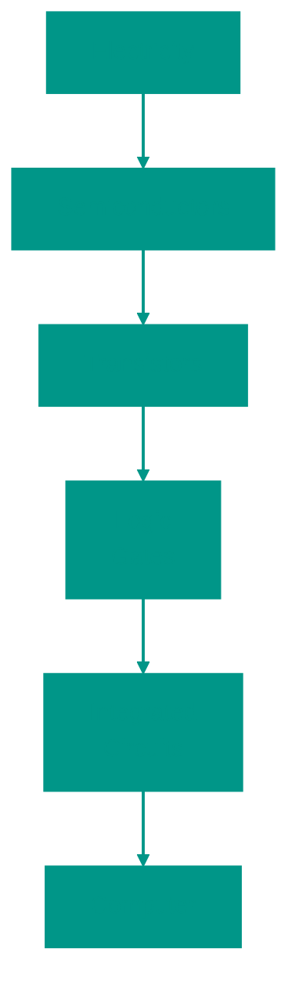
```mermaid
%%{init: { 'theme': 'base', 'themeVariables': { 'lineColor': '#009688', 'primaryColor': '#009688', 'primaryTextColor': '#009688', 'attributeBkg': '#009688', 'attributeTextColor': '#009688', 'signalColor': '#009688', 'actorLineColor': '#009688', 'nodeBorder': '#009688', 'clusterBorder': '#009688', 'textColor': '#009688', 'fontSize': '16px' } } }%%
graph TD
    Electricity[Electricity] --> Semiconductors[Semiconductors]
    Semiconductors --> Transistors[Transistors]
    Transistors --> Logic[Logic<br/>Gates]
    Logic --> IC[Integrated<br/>Circuits]
    IC --> Computer[Computer]


linkStyle default stroke:#009688,stroke-width:2px;


```

---

## 1. 🔌 Electricity and Signals

Electricity is the movement of electrons through a conductor. In computers, it is used to transmit signals.

### Basic Concepts

- **Voltage (V)**: The potential difference, or "pressure," that forces electrons to move (measured in volts).
- **Current (I)**: The flow of electrons (measured in amperes).
- **Resistance (R)**: The opposition to the flow of current (measured in ohms).

> [!NOTE]
> **Ohm's Law**: V = I × R. This fundamental law describes the relationship between voltage, current, and resistance.

### 💧 Water Pipe Analogy

To understand electricity, imagine a plumbing system:

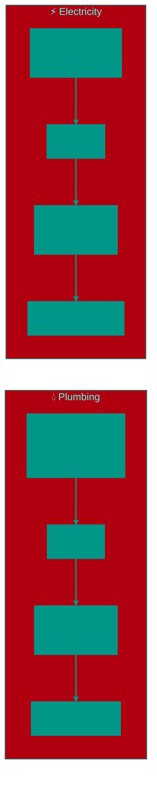
```mermaid
%%{init: { 'theme': 'base', 'themeVariables': { 'lineColor': '#009688', 'primaryColor': '#009688', 'primaryTextColor': '#009688', 'attributeBkg': '#009688', 'attributeTextColor': '#009688', 'signalColor': '#009688', 'actorLineColor': '#009688', 'nodeBorder': '#009688', 'clusterBorder': '#009688', 'textColor': '#009688', 'fontSize': '16px' } } }%%
graph LR
    subgraph Water_System["💧 Plumbing"]
        Tank["Water<br/>Tower<br/>high pressure"] --> Pipe[Pipe] --> Valve["Valve<br/>resistance"] --> Out[Water flows]
    end
    
    subgraph Electric_System["⚡ Electricity"]
        Battery["Battery<br/>high voltage"] --> Wire[Wire] --> Resistor["Resistor<br/>resistance"] --> Current[Current flows]
    end


linkStyle default stroke:#009688,stroke-width:2px;


```

| Plumbing | Electricity | Meaning |
|:---|:---|:---|
| **Water pressure** | **Voltage (V)** | Force "pushing" the flow |
| **Water flow** | **Current (I)** | Amount passing per second |
| **Narrow pipe/valve** | **Resistance (R)** | Obstacle in the path |
| High pressure + narrow pipe | High voltage + high resistance | Medium flow/current |

> [!TIP]
> **Real-world example**: If you partially close a faucet (increase resistance), water flow decreases even if the pressure in the tower stays the same. Similarly, a resistor in an electrical circuit limits current!

### Digital Signals

- Computers use **binary signals**: a high voltage level (typically 5V or 3.3V) represents **1**, while a low level (0V) represents **0**.
- **Analog signals** (continuous) in computers are converted into digital ones using an **ADC** (analog-to-digital converter).

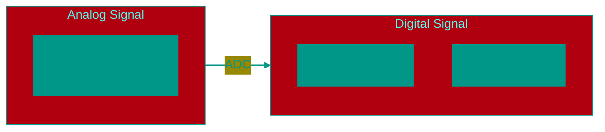
```mermaid
%%{init: { 'theme': 'base', 'themeVariables': { 'lineColor': '#009688', 'primaryColor': '#009688', 'primaryTextColor': '#009688', 'attributeBkg': '#009688', 'attributeTextColor': '#009688', 'signalColor': '#009688', 'actorLineColor': '#009688', 'nodeBorder': '#009688', 'clusterBorder': '#009688', 'textColor': '#009688', 'fontSize': '16px' } } }%%
graph LR
    subgraph Digital_Signal["Digital Signal"]
        High[High: 5V = 1]
        Low[Low: 0V = 0]
    end
    
    subgraph Analog_Signal["Analog Signal"]
        Continuous[Continuous<br/>3.7V, 2.1V, 4.5V...]
    end
    
    Analog_Signal -->|ADC| Digital_Signal


linkStyle default stroke:#009688,stroke-width:2px;


```

> [!TIP]
> **Example**: In a USB connection, a 5V voltage is used to power devices, while data is transmitted through changes in voltage (signals).

---

## 2. 🧪 Semiconductors

Semiconductors are materials that can conduct electricity but not as efficiently as metals. They are crucial to electronics.

### Properties

- The primary material is **silicon** (Si), and sometimes germanium (Ge).
- Conductivity is regulated by adding impurities (**doping**):
  - **n-type**: Adding atoms with extra electrons (e.g., phosphorus).
  - **p-type**: Adding atoms with fewer electrons (e.g., boron).

### 🅿️ Parking Lot Analogy

Imagine a parking lot with spaces for cars:

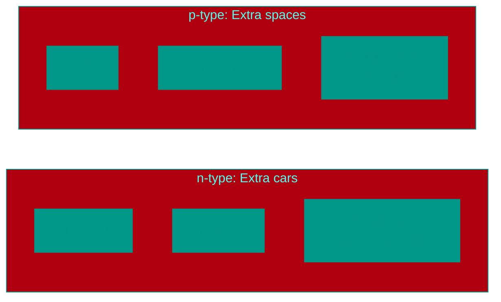
```mermaid
%%{init: { 'theme': 'base', 'themeVariables': { 'lineColor': '#009688', 'primaryColor': '#009688', 'primaryTextColor': '#009688', 'attributeBkg': '#009688', 'attributeTextColor': '#009688', 'signalColor': '#009688', 'actorLineColor': '#009688', 'nodeBorder': '#009688', 'clusterBorder': '#009688', 'textColor': '#009688', 'fontSize': '16px' } } }%%
graph LR
    subgraph N_Type["n-type: Extra cars"]
        Cars1[🚗 🚗 🚗 🚗] 
        Spaces1[🅿️ 🅿️ 🅿️]
        Extra1[+ free cars<br/>= excess electrons]
    end
    
    subgraph P_Type["p-type: Extra spaces"]
        Cars2[🚗 🚗]
        Spaces2[🅿️ 🅿️ 🅿️ 🅿️ 🅿️]
        Extra2[+ free spaces<br/>= holes]
    end


linkStyle default stroke:#009688,stroke-width:2px;


```

- **n-type** = parking lot with **extra cars** (cars can leave → electrons can move)
- **p-type** = parking lot with **extra spaces** (cars can arrive → holes can "move")

> [!NOTE]
> In p-type, it's not actually the "holes" that move, but electrons jump from space to space, creating the effect of moving empty spaces, like in a sliding puzzle game!

### p-n Junction

Connecting n-type and p-type materials creates a **diode**—a device that allows current to flow in only one direction.

```mermaid
%%{init: { 'theme': 'base', 'themeVariables': { 'lineColor': '#009688', 'primaryColor': '#009688', 'primaryTextColor': '#009688', 'attributeBkg': '#009688', 'attributeTextColor': '#009688', 'signalColor': '#009688', 'actorLineColor': '#009688', 'nodeBorder': '#009688', 'clusterBorder': '#009688', 'textColor': '#009688', 'fontSize': '16px' } } }%%
graph LR
    subgraph PN_Junction["p-n Junction"]
        P[p-type<br/>electron<br/>deficiency] --- Junction[Junction] --- N[n-type<br/>electron<br/>excess]
    end
    
    Current[Current →] -->|Passes| P
    P --> N
    N -.->|Blocked| Reverse[← Reverse Current]
    
    style Junction fill:#FFD700


linkStyle default stroke:#009688,stroke-width:2px;


```

> [!NOTE]
> **Application**: Diodes in a computer's power supply convert alternating current (AC) to direct current (DC).

---

## 3. 🔳 Transistors

A **transistor** is a key element of a computer, functioning as either a switch or an amplifier.

### Types of Transistors

- **BJT** (bipolar junction transistor): Controlled by current.
- **MOSFET** (metal-oxide-semiconductor field-effect transistor): Controlled by voltage, used in most modern processors.

### How a MOSFET Works

- It has three terminals: **source**, **drain**, and **gate**.
- The voltage at the gate opens or closes a channel for current between the source and the drain.
- In digital circuits, a transistor is either "on" (**1**) or "off" (**0**).

### 🚰 Water Faucet Analogy

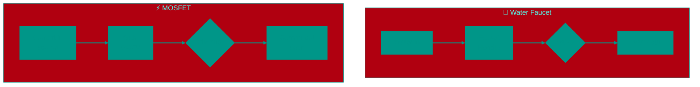
```mermaid
%%{init: { 'theme': 'base', 'themeVariables': { 'lineColor': '#009688', 'primaryColor': '#009688', 'primaryTextColor': '#009688', 'attributeBkg': '#009688', 'attributeTextColor': '#009688', 'signalColor': '#009688', 'actorLineColor': '#009688', 'nodeBorder': '#009688', 'clusterBorder': '#009688', 'textColor': '#009688', 'fontSize': '16px' } } }%%
graph TD
    subgraph Faucet["🚰 Water Faucet"]
        Water_In[Water in] --> Handle["Faucet<br/>Handle<br/>"] --> Valve{Valve} --> Water_Out[Water out]
    end
    
    subgraph MOSFET_Analogy["⚡ MOSFET"]
        Current_In["Current in<br/>source"] --> Gate["Gate<br/>0V/5V"] --> Channel{Channel} --> Current_Out["Current out<br/>drain"]
    end


linkStyle default stroke:#009688,stroke-width:2px;


```

| Water Faucet | MOSFET | Result |
|:---|:---|:---|
| Handle closed | Gate: 0V | Channel closed, water/current does **NOT** flow (**bit 0**) |
| Handle open | Gate: 5V | Channel open, water/current **flows** (**bit 1**) |

> [!IMPORTANT]
> A transistor is like a faucet that can be controlled **electrically**! Apply voltage to the gate — "open the faucet" and let current flow. This allows one signal to control another, creating logic.

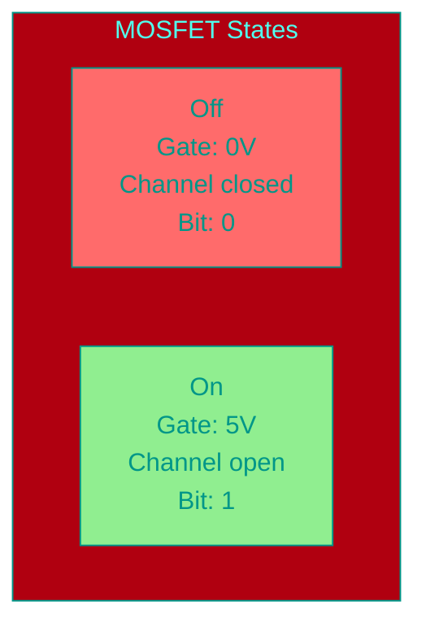
```mermaid
%%{init: { 'theme': 'base', 'themeVariables': { 'lineColor': '#009688', 'primaryColor': '#009688', 'primaryTextColor': '#009688', 'attributeBkg': '#009688', 'attributeTextColor': '#009688', 'signalColor': '#009688', 'actorLineColor': '#009688', 'nodeBorder': '#009688', 'clusterBorder': '#009688', 'textColor': '#009688', 'fontSize': '16px' } } }%%
graph TD
    subgraph MOSFET_States["MOSFET States"]
        direction LR
        Off[Off<br/>Gate: 0V<br/>Channel closed<br/>Bit: 0] 
        On[On<br/>Gate: 5V<br/>Channel open<br/>Bit: 1]
    end
    
    style Off fill:#FF6B6B
    style On fill:#90EE90


linkStyle default stroke:#009688,stroke-width:2px;


```

### Role in Computers

- Transistors form **logic gates** (e.g., AND, OR, NOT).
- A single processor (e.g., Intel Core) contains billions of transistors.

> [!IMPORTANT]
> Within a processor, transistors switch **billions of times per second**, performing calculations. This is the foundation of all modern computers.

---

## 4. 🧩 Logic Gates

Logic gates are combinations of transistors that perform basic logic operations.

### Basic Gates

| Gate | Description | True if... |
|:---|:---|:---|
| **AND** | Logical AND | All inputs are 1 |
| **OR** | Logical OR | At least one input is 1 |
| **NOT** | Logical NOT | Inverts the input (0 → 1, 1 → 0) |
| **NAND** | NOT-AND | Not all inputs are 1 |
| **NOR** | NOT-OR | All inputs are 0 |
| **XOR** | Exclusive OR | Only one input is 1 |

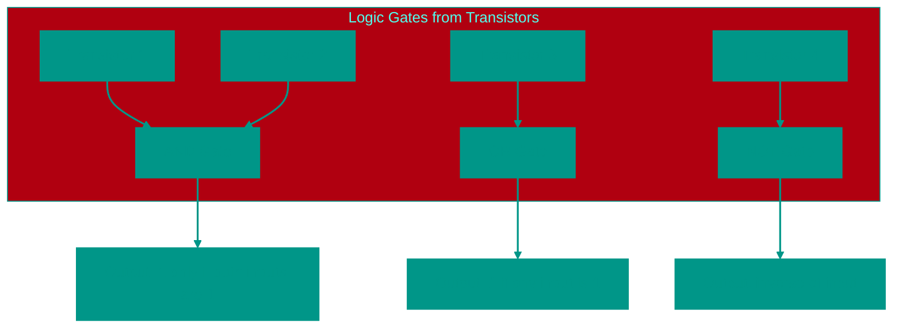
```mermaid
%%{init: { 'theme': 'base', 'themeVariables': { 'lineColor': '#009688', 'primaryColor': '#009688', 'primaryTextColor': '#009688', 'attributeBkg': '#009688', 'attributeTextColor': '#009688', 'signalColor': '#009688', 'actorLineColor': '#009688', 'nodeBorder': '#009688', 'clusterBorder': '#009688', 'textColor': '#009688', 'fontSize': '16px' } } }%%
graph TD
    subgraph Logic_Gates["Logic Gates from Transistors"]
        T1[Transistor 1] --> AND
        T2[Transistor 2] --> AND
        T3[Transistor 3] --> OR
        T4[Transistor 4] --> NOT
    end
    
    AND[AND Gate] --> Output1[Output: 1 only if both inputs are 1]
    OR[OR Gate] --> Output2[Output: 1 if any input is 1]
    NOT[NOT Gate] --> Output3[Output: inverse of input]


linkStyle default stroke:#009688,stroke-width:2px;


```

> [!TIP]
> **Example**: An XOR gate is used in adders to sum binary numbers.

### 🧮 Practical Example: Half Adder

Let's see how logic gates work together to add two bits:

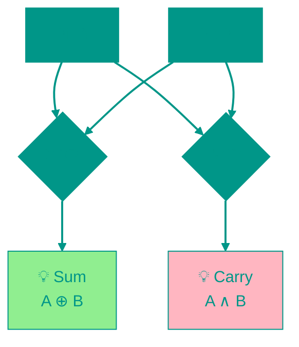
```mermaid
%%{init: { 'theme': 'base', 'themeVariables': { 'lineColor': '#009688', 'primaryColor': '#009688', 'primaryTextColor': '#009688', 'attributeBkg': '#009688', 'attributeTextColor': '#009688', 'signalColor': '#009688', 'actorLineColor': '#009688', 'nodeBorder': '#009688', 'clusterBorder': '#009688', 'textColor': '#009688', 'fontSize': '16px' } } }%%
graph TD
    A[Bit A] --> XOR{XOR}
    B[Bit B] --> XOR
    A --> AND{AND}
    B --> AND
    
    XOR --> Sum[💡 Sum<br/>A ⊕ B]
    AND --> Carry[💡 Carry<br/>A ∧ B]
    
    style Sum fill:#90EE90
    style Carry fill:#FFB6C1


linkStyle default stroke:#009688,stroke-width:2px;


```

**Calculation example: 1 + 1 = ?**

| A | B | Sum (XOR) | Carry (AND) | Binary result | Decimal |
|:-:|:-:|:-----------:|:-------------:|:------------------:|:----------:|
| 0 | 0 | 0 | 0 | **00** | 0 |
| 0 | 1 | 1 | 0 | **01** | 1 |
| 1 | 0 | 1 | 0 | **01** | 1 |
| 1 | 1 | 0 | 1 | **10** | 2 |

> [!NOTE]
> When adding **1 + 1**, we get **sum = 0** and **carry = 1**, which gives binary **10** (decimal 2). This is exactly how addition works in a processor!

---

## 5. 🏗️ Integrated Circuits

An **Integrated Circuit (IC)** is a collection of many transistors and other components on a single silicon chip.

### Types

- **Analog**: Amplifiers, filters.
- **Digital**: Processors, memory.
- **Mixed-signal**: E.g., ADCs.

### Evolution (Moore's Law)

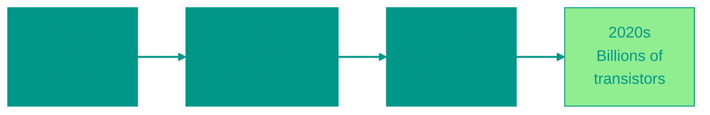
```mermaid
%%{init: { 'theme': 'base', 'themeVariables': { 'lineColor': '#009688', 'primaryColor': '#009688', 'primaryTextColor': '#009688', 'attributeBkg': '#009688', 'attributeTextColor': '#009688', 'signalColor': '#009688', 'actorLineColor': '#009688', 'nodeBorder': '#009688', 'clusterBorder': '#009688', 'textColor': '#009688', 'fontSize': '16px' } } }%%
graph LR
    Y1960[1960s<br/>Tens of<br/>transistors] --> Y1980[1980s<br/>Thousands of<br/>transistors]
    Y1980 --> Y2000[2000s<br/>Millions of<br/>transistors]
    Y2000 --> Y2020[2020s<br/>Billions of<br/>transistors]
    
    style Y2020 fill:#90EE90


linkStyle default stroke:#009688,stroke-width:2px;


```

> [!NOTE]
> **Moore's Law**: The number of transistors on a chip doubles approximately every two years. Although this trend is slowing down, it has defined computer development for decades.

### 🚀 Computing Power Comparison

| Device | Year | Transistors | Frequency | Capability |
|:---|:---:|:---:|:---:|:---|
| **Apollo 11 (computer)** | 1969 | ~4,000 | 2 MHz | Put humans on the Moon |
| **Intel 8086** | 1978 | 29,000 | 5 MHz | First PC |
| **Pentium** | 1993 | 3.1M | 60 MHz | Multimedia computers |
| **iPhone 6** | 2014 | ~2B | 1.4 GHz | In your pocket! |
| **Apple M1** | 2020 | 16B | 3.2 GHz | 8K video editing |
| **iPhone 15 Pro (A17)** | 2023 | ~19B | 3.7 GHz | More powerful than 2010s PC |

> [!IMPORTANT]
> Your modern smartphone contains **millions of times more transistors** than the computer that sent humans to the Moon! This miniaturization is the essence of technological progress.

### Examples

- **Microprocessor**: Contains the ALU, registers, and control units.
- **Memory**: DRAM, SRAM, Flash.

> [!IMPORTANT]
> An Intel Core i9 processor is an integrated circuit with ~10 billion transistors on a chip roughly the size of a fingernail!

---

## 🌍 Practical Real-World Examples

Now let's see how these principles work in real devices you use every day.

### 🔌 USB Cable: Power + Data Transfer

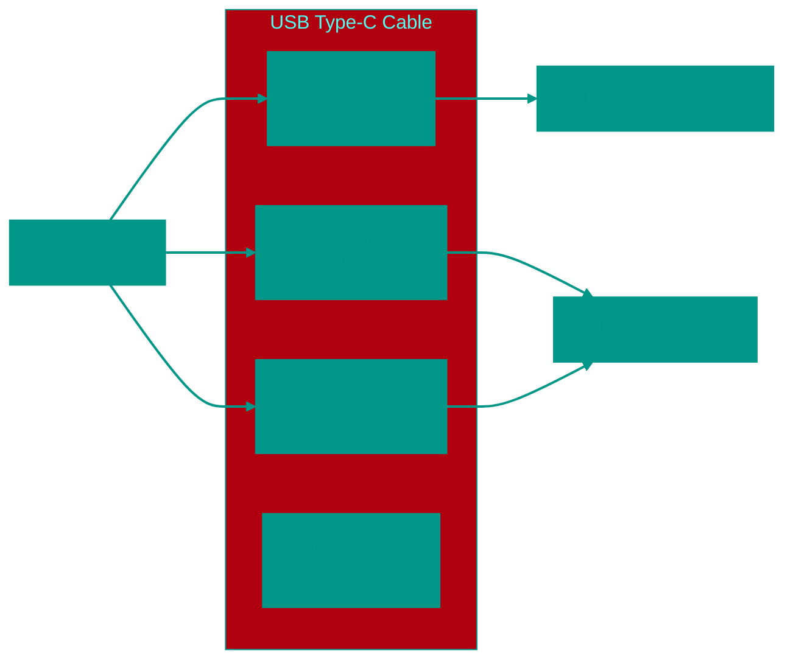
```mermaid
%%{init: { 'theme': 'base', 'themeVariables': { 'lineColor': '#009688', 'primaryColor': '#009688', 'primaryTextColor': '#009688', 'attributeBkg': '#009688', 'attributeTextColor': '#009688', 'signalColor': '#009688', 'actorLineColor': '#009688', 'nodeBorder': '#009688', 'clusterBorder': '#009688', 'textColor': '#009688', 'fontSize': '16px' } } }%%
graph LR
    subgraph USB_Cable["USB Type-C Cable"]
        direction TB
        Power[Power wire<br/>5V DC] 
        Data_Plus[D+ wire<br/>Digital signals]
        Data_Minus[D- wire<br/>Digital signals]
        Ground[Ground wire<br/>0V]
    end
    
    Laptop[💻 Laptop] --> Power --> Phone[📱 Phone: Charging]
    Laptop --> Data_Plus --> Phone_Data[📱 Data transfer]
    Laptop --> Data_Minus --> Phone_Data


linkStyle default stroke:#009688,stroke-width:2px;


```

**What happens inside:**
- **Power wire (5V)**: Constant voltage for battery charging
- **Data wires (D+/D-)**: Transmit **digital signals** (0 = 0V, 1 = 3.3V)
  - Speed: up to 40 Gbps (USB 4.0) = **40 billion 0/1 switches per second**!

> [!TIP]
> **Real-world example**: When you connect your phone to a computer via USB, **two processes** happen simultaneously: charging (constant 5V DC current) and file transfer (rapid 0/1 switches on D+/D- wires).

### 🔋 Phone Charging: From Wall to Battery

```mermaid
%%{init: { 'theme': 'base', 'themeVariables': { 'lineColor': '#009688', 'primaryColor': '#009688', 'primaryTextColor': '#009688', 'attributeBkg': '#009688', 'attributeTextColor': '#009688', 'signalColor': '#009688', 'actorLineColor': '#009688', 'nodeBorder': '#009688', 'clusterBorder': '#009688', 'textColor': '#009688', 'fontSize': '16px' } } }%%
graph LR
    Wall[⚡ Wall outlet<br/>220V AC<br/>alternating] --> Adapter[📦 Adapter] 
    Adapter -->|Diode bridge| Rect[Rectification]
    Rect -->|Capacitor| Smooth[Smoothing]
    Smooth --> DC[5V DC<br/>direct] --> Battery[🔋 Phone battery]


linkStyle default stroke:#009688,stroke-width:2px;


```

**How it works:**

1. **Wall outlet**: Alternating current (AC) 220V, 50 Hz (direction changes 50 times per second)
2. **Adapter** contains:
   - **Transformer**: Steps down 220V → 5V
   - **Diode bridge** (4 diodes): Converts AC → DC (pulsating)
   - **Capacitor**: Smooths pulsations → stable 5V DC
3. **Battery**: Receives direct current for charging

> [!NOTE]
> **p-n junction application**: Diodes in the adapter are exactly the **p-n junctions** we discussed! They allow current to flow in only one direction, converting alternating current to direct current.

### 📺 LED Display: Controlling Millions of Pixels

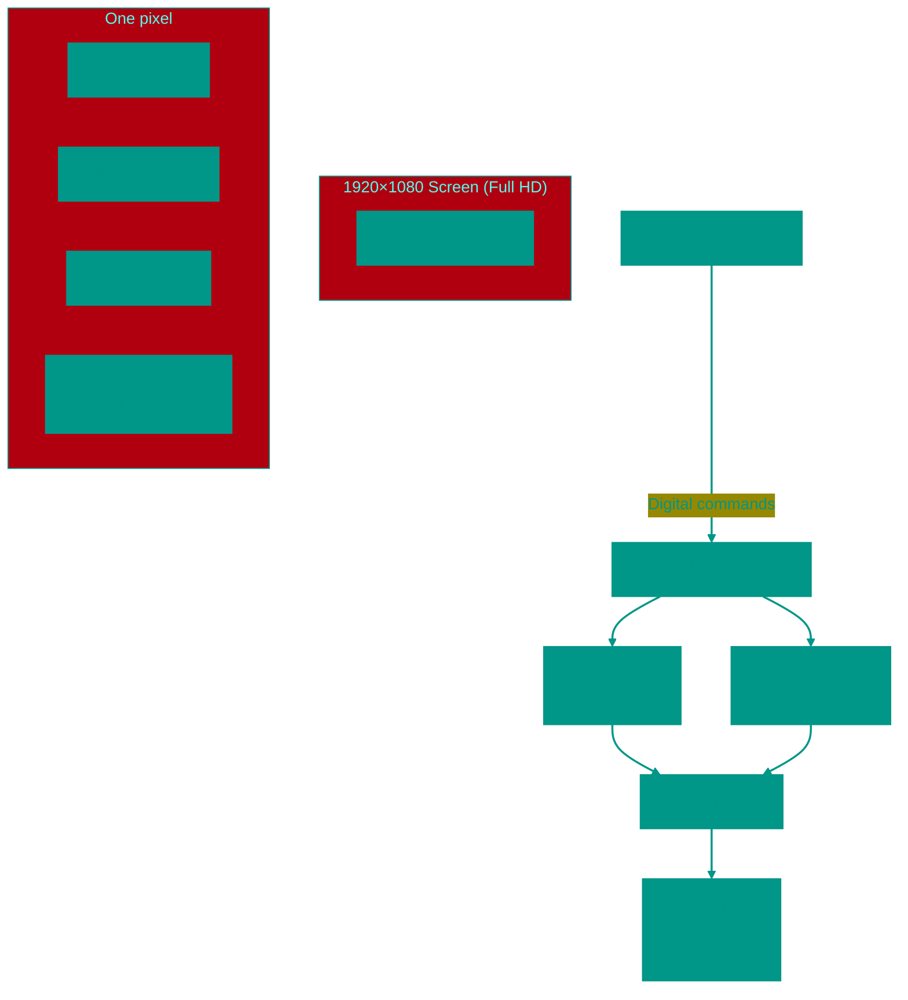
```mermaid
%%{init: { 'theme': 'base', 'themeVariables': { 'lineColor': '#009688', 'primaryColor': '#009688', 'primaryTextColor': '#009688', 'attributeBkg': '#009688', 'attributeTextColor': '#009688', 'signalColor': '#009688', 'actorLineColor': '#009688', 'nodeBorder': '#009688', 'clusterBorder': '#009688', 'textColor': '#009688', 'fontSize': '16px' } } }%%
graph TD
    subgraph Display["1920×1080 Screen (Full HD)"]
        Pixels[2,073,600 pixels] 
    end
    
    GPU[🎮 Graphics card] -->|Digital commands| Controller[🧠 Display controller]
    Controller --> Row[Row driver<br/>Multiplexer]
    Controller --> Column[Column driver<br/>Demultiplexer]
    
    Row --> Matrix[Pixel matrix]
    Column --> Matrix
    
    Matrix --> Pixel[Each pixel:<br/>3 LEDs<br/>RGB]
    
    subgraph Single_Pixel["One pixel"]
        R[🔴 Red LED] 
        G[🟢 Green LED]
        B[🔵 Blue LED]
        Transistors[3 transistors<br/>control brightness]
    end


linkStyle default stroke:#009688,stroke-width:2px;


```

**How one pixel lights up:**

1. **Graphics card** sends command: "Pixel [500, 300] = red (255, 0, 0)"
2. **Controller** via **multiplexer** selects row (300) and column (500)
3. **Transistors** in this pixel:
   - Open **red LED** at full power (255/255)
   - Close **green** and **blue** LEDs (0/255)
4. Light mixes → we see **red color**!

> [!IMPORTANT]
> For a Full HD screen (1920×1080), you need to control **~2 million pixels × 3 LEDs = 6 million LEDs**, each controlled by a transistor! This updates **60 times per second** (60 Hz), creating smooth motion.

**Calculation of operations:**
- 1920 × 1080 = 2,073,600 pixels
- Each pixel = 3 transistors (RGB)
- **Total transistors: ~6.2 million**
- Refresh rate: 60 Hz
- **Switches per second: 372 million!**

> [!TIP]
> **Modern 4K displays** (3840×2160) contain **~25 million transistors** just for controlling LEDs!

### 🎹 Keyboard: From Press to Character on Screen

```mermaid
%%{init: { 'theme': 'base', 'themeVariables': { 'lineColor': '#009688', 'primaryColor': '#009688', 'primaryTextColor': '#009688', 'attributeBkg': '#009688', 'attributeTextColor': '#009688', 'signalColor': '#009688', 'actorLineColor': '#009688', 'nodeBorder': '#009688', 'clusterBorder': '#009688', 'textColor': '#009688', 'fontSize': '16px' } } }%%
graph LR
    Press[👆 Key press] --> Switch[Mechanical<br/>switch]
    Switch -->|Contact closes| Signal[Electrical<br/>signal: 1]
    Signal --> Controller[🧠 Keyboard<br/>controller]
    Controller -->|Scan code| USB[USB cable]
    USB --> OS[💻 Operating<br/>system]
    OS --> Display[📺 Character 'A'<br/>on screen]


linkStyle default stroke:#009688,stroke-width:2px;


```

**Detailed process:**

1. **Press**: Physical contact closes → voltage changes from 0V → 5V (**bit 0 → 1**)
2. **Keyboard controller** (tiny processor!):
   - Scans key matrix (e.g., 6 rows × 18 columns)
   - Detects row #2, column #5 is active
   - Determines: this is key **'A'**
   - Generates **scan code**: `0x1E` (binary: `00011110`)
3. **USB**: Transmits scan code as bit sequence
4. **OS**: Recognizes code → outputs character on screen via graphics card

> [!NOTE]
> From key press to character appearing on screen takes **~10-50 milliseconds** (0.01-0.05 seconds) — this seems instant, but during this time the processor executes **millions of operations**!

---

## 🎯 Key Takeaways

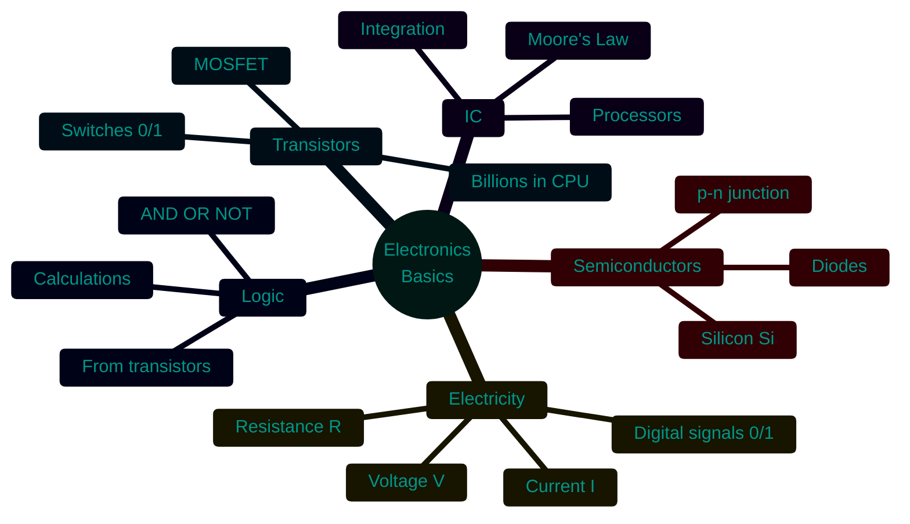
```mermaid
%%{init: { 'theme': 'base', 'themeVariables': { 'lineColor': '#009688', 'primaryColor': '#009688', 'primaryTextColor': '#009688', 'attributeBkg': '#009688', 'attributeTextColor': '#009688', 'signalColor': '#009688', 'actorLineColor': '#009688', 'nodeBorder': '#009688', 'clusterBorder': '#009688', 'textColor': '#009688', 'fontSize': '16px' } } }%%
mindmap
  root((Electronics<br/>Basics))
    Electricity
      Voltage V
      Current I
      Resistance R
      Digital signals 0/1
    Semiconductors
      Silicon Si
      p-n junction
      Diodes
    Transistors
      MOSFET
      Switches 0/1
      Billions in CPU
    Logic
      AND OR NOT
      From transistors
      Calculations
    IC
      Integration
      Moore's Law
      Processors


```

- Electricity carries signals that computers interpret as **0**s and **1**s.
- Semiconductors (silicon) and p-n junctions are the basis of diodes and transistors.
- Transistors are switches used to build logic gates.
- Logic gates form integrated circuits, such as processors.
- All of this constitutes the physical foundation for a computer's operation.

<!-- QUIZ_START 
[
    {
        "question": "Which material is the primary basis for modern semiconductors?",
        "options": ["Copper", "Silicon", "Gold", "Germanium"],
        "correctIndex": 1
    },
    {
        "question": "What role does a transistor play in digital logic?",
        "options": ["Stores energy", "Amplifies sound", "Functions as a switch (0/1)", "Converts AC to DC"],
        "correctIndex": 2
    },
    {
        "question": "Which physical property of semiconductors is used to control current in a transistor?",
        "options": ["The presence of a p-n junction", "Magnetic field", "Light emission", "Radioactivity"],
        "correctIndex": 0
    }
]
QUIZ_END -->
