# ⚡ Electronics Basics and Physics

## 📑 Table of Contents
1. [Electricity and Signals](#electricity-and-signals)
2. [Semiconductors](#semiconductors)
3. [Transistors](#transistors)
4. [Logic Gates](#logic-gates)
5. [Integrated Circuits](#integrated-circuits)

---

Electronics is at the heart of how computers operate. Computers use electrical signals to process and transmit data. This section explains how electricity, semiconductors, and transistors form the foundation of digital systems.

---

## 1. 🔌 Electricity and Signals

Electricity is the movement of electrons through a conductor. In computers, it is used to transmit signals.

### Basic Concepts

- **Voltage (V)**: The potential difference, or "pressure," that forces electrons to move (measured in volts).
- **Current (I)**: The flow of electrons (measured in amperes).
- **Resistance (R)**: The opposition to the flow of current (measured in ohms).

> [!NOTE]
> **Ohm's Law**: V = I × R. This fundamental law describes the relationship between voltage, current, and resistance.

### Digital Signals

- Computers use **binary signals**: a high voltage level (typically 5V or 3.3V) represents **1**, while a low level (0V) represents **0**.
- **Analog signals** (continuous) in computers are converted into digital ones using an **ADC** (analog-to-digital converter).

> [!TIP]
> **Example**: In a USB connection, a 5V voltage is used to power devices, while data is transmitted through changes in voltage (signals).

---

## 2. 🧪 Semiconductors

Semiconductors are materials that can conduct electricity but not as efficiently as metals. They are crucial to electronics.

### Properties

- The primary material is **silicon** (Si), and sometimes germanium (Ge).
- Conductivity is regulated by adding impurities (**doping**):
  - **n-type**: Adding atoms with extra electrons (e.g., phosphorus).
  - **p-type**: Adding atoms with fewer electrons (e.g., boron).

### p-n Junction

Connecting n-type and p-type materials creates a **diode**—a device that allows current to flow in only one direction.

```mermaid
graph LR
    subgraph PN_Junction["p-n Junction"]
        P[p-type<br/>electron<br/>deficiency] --- Junction[Junction] --- N[n-type<br/>electron<br/>excess]
    end
    
    Current[Current →] -->|Passes| P
    P --> N
    N -.->|Blocked| Reverse[← Reverse Current]
    
    style Junction fill:#FFD700
```

> [!NOTE]
> **Application**: Diodes in a computer's power supply convert alternating current (AC) to direct current (DC).

---

## 3. 🔳 Transistors

A **transistor** is a key element of a computer, functioning as either a switch or an amplifier.

### Types of Transistors

- **BJT** (bipolar junction transistor): Controlled by current.
- **MOSFET** (metal-oxide-semiconductor field-effect transistor): Controlled by voltage, used in most modern processors.

### How a MOSFET Works

- It has three terminals: **source**, **drain**, and **gate**.
- The voltage at the gate opens or closes a channel for current between the source and the drain.
- In digital circuits, a transistor is either "on" (**1**) or "off" (**0**).

### Role in Computers

- Transistors form **logic gates** (e.g., AND, OR, NOT).
- A single processor (e.g., Intel Core) contains billions of transistors.

> [!IMPORTANT]
> Within a processor, transistors switch **billions of times per second**, performing calculations. This is the foundation of all modern computers.

---

## 4. 🧩 Logic Gates

Logic gates are combinations of transistors that perform basic logic operations.

### Basic Gates

| Gate | Description | True if... |
|:---|:---|:---|
| **AND** | Logical AND | All inputs are 1 |
| **OR** | Logical OR | At least one input is 1 |
| **NOT** | Logical NOT | Inverts the input (0 → 1, 1 → 0) |
| **NAND** | NOT-AND | Not all inputs are 1 |
| **NOR** | NOT-OR | All inputs are 0 |
| **XOR** | Exclusive OR | Only one input is 1 |

> [!TIP]
> **Example**: An XOR gate is used in adders to sum binary numbers.

---

## 5. 🏗️ Integrated Circuits

An **Integrated Circuit (IC)** is a collection of many transistors and other components on a single silicon chip.

### Types

- **Analog**: Amplifiers, filters.
- **Digital**: Processors, memory.
- **Mixed-signal**: E.g., ADCs.

### Evolution (Moore's Law)

> [!NOTE]
> **Moore's Law**: The number of transistors on a chip doubles approximately every two years. Although this trend is slowing down, it has defined computer development for decades.

### Examples

- **Microprocessor**: Contains the ALU, registers, and control units.
- **Memory**: DRAM, SRAM, Flash.

> [!IMPORTANT]
> An Intel Core i9 processor is an integrated circuit with ~10 billion transistors on a chip roughly the size of a fingernail!

---

## 🎯 Key Takeaways

- Electricity carries signals that computers interpret as **0**s and **1**s.
- Semiconductors (silicon) and p-n junctions are the basis of diodes and transistors.
- Transistors are switches used to build logic gates.
- Logic gates form integrated circuits, such as processors.
- All of this constitutes the physical foundation for a computer's operation.
