# 🧠 Digital Logic and Boolean Algebra


## 📑 Table of Contents
1. [Boolean Algebra](#boolean-algebra)
2. [Combinational Logic](#combinational-logic)
3. [Sequential Logic](#sequential-logic)
4. [Finite State Machines](#finite-state-machines)

---

Digital logic is the foundation of computer operation, allowing binary signals (**0** and **1**) to be processed using logical operations. Boolean algebra provides the mathematical framework for the design and analysis of digital circuits.

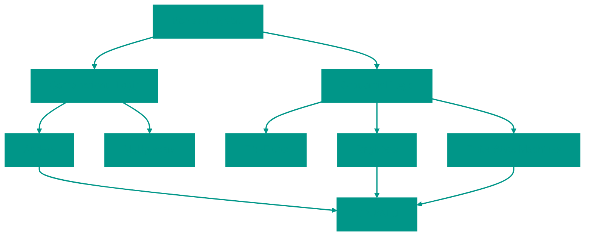
```mermaid
%%{init: { 'theme': 'base', 'themeVariables': { 'lineColor': '#009688', 'primaryColor': '#009688', 'primaryTextColor': '#009688', 'attributeBkg': '#009688', 'attributeTextColor': '#009688', 'signalColor': '#009688', 'actorLineColor': '#009688', 'nodeBorder': '#009688', 'clusterBorder': '#009688', 'textColor': '#009688', 'fontSize': '16px' } } }%%
graph TD
    Boolean[Boolean Algebra] --> Combinational[Combinational Logic]
    Boolean --> Sequential[Sequential Logic]
    
    Combinational --> Adders[Adders]
    Combinational --> MUX[Multiplexers]
    
    Sequential --> Flip[Flip-Flops]
    Sequential --> Registers[Registers]
    Sequential --> FSM[Finite State Machines]
    
    Adders --> CPU[CPU/ALU]
    Registers --> CPU
    FSM --> CPU


linkStyle default stroke:#009688,stroke-width:2px;


```

---


## 1. 📐 Boolean Algebra

Boolean algebra is a branch of mathematics that deals with logical values (**TRUE/1** and **FALSE/0**) and operations performed on them.


### Basic Operations ⚡

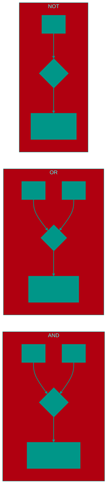
```mermaid
%%{init: { 'theme': 'base', 'themeVariables': { 'lineColor': '#009688', 'primaryColor': '#009688', 'primaryTextColor': '#009688', 'attributeBkg': '#009688', 'attributeTextColor': '#009688', 'signalColor': '#009688', 'actorLineColor': '#009688', 'nodeBorder': '#009688', 'clusterBorder': '#009688', 'textColor': '#009688', 'fontSize': '16px' } } }%%
graph LR
    subgraph AND_Gate["AND"]
        A1[A] --> AND{AND}
        B1[B] --> AND
        AND --> Out1[1 only if<br/>A=1 AND B=1]
    end
    
    subgraph OR_Gate["OR"]
        A2[A] --> OR{OR}
        B2[B] --> OR
        OR --> Out2[1 if<br/>A=1 OR B=1]
    end
    
    subgraph NOT_Gate["NOT"]
        A3[A] --> NOT{NOT}
        NOT --> Out3[Inversion<br/>0→1, 1→0]
    end


linkStyle default stroke:#009688,stroke-width:2px;


```

| Operation | Notation | Description | Result is 1 if... |
|:---|:---:|:---|:---|
| **AND** | A ∧ B | Logical AND | Both A and B are 1 |
| **OR** | A ∨ B | Logical OR | At least one of A or B is 1 |
| **NOT** | ¬A | Inversion | A = 0 |
| **NAND** | ¬(A ∧ B) | Negated AND | Not all inputs are 1 |
| **NOR** | ¬(A ∨ B) | Negated OR | All inputs are 0 |
| **XOR** | A ⊕ B | Exclusive OR | Exactly one input is 1 |


### 🧑‍🤝‍🧑 Real-World Analogies

**Imagine decision-making in everyday life:**


```mermaid
%%{init: { 'theme': 'base', 'themeVariables': { 'lineColor': '#009688', 'primaryColor': '#009688', 'primaryTextColor': '#009688', 'attributeBkg': '#009688', 'attributeTextColor': '#009688', 'signalColor': '#009688', 'actorLineColor': '#009688', 'nodeBorder': '#009688', 'clusterBorder': '#009688', 'textColor': '#009688', 'fontSize': '16px' } } }%%
graph TD
    subgraph AND_Example["AND: Go to beach?"]
        Sunny[☀️ Sunny?] --> Decision1{AND}
        Weekend[🗓️ Weekend?] --> Decision1
        Decision1 -->|Both YES| Go[✅ Let's go!]
        Decision1 -->|At least one NO| Stay1[❌ Stay home]
    end
    
    subgraph OR_Example["OR: Watch a movie?"]
        Netflix[📺 Have Netflix?] --> Decision2{OR}
        Cinema[🎬 Cinema tickets?] --> Decision2
        Decision2 -->|At least one YES| Watch[✅ Watch it!]
        Decision2 -->|Both NO| Skip[❌ Don't watch]
    end
    
    subgraph NOT_Example["NOT: Take umbrella?"]
        Rain[🌧️ Raining?] --> Decision3{NOT}
        Decision3 -->|NO rain| NoUmbrella[✅ NO umbrella needed]
        Decision3 -->|YES rain| TakeUmbrella[❌ Must take umbrella]
    end


linkStyle default stroke:#009688,stroke-width:2px;


```

| Logic Gate | Real-World Situation | Example |
|:---|:---|:---|
| **AND** | ALL conditions must be met | "I'll go outside IF sunny **AND** weekend" |
| **OR** | At least ONE condition suffices | "I'll go to work by car OR metro" |
| **NOT** | Inversion (opposite) | "IF **NOT** cold, won't wear jacket" |
| **XOR** | Only ONE, not both | "For dinner pizza **OR** sushi (not both)" |

> [!TIP]
> **Voting as XOR**: Imagine an election with two candidates. You vote **either** for A **or** for B, but not for both simultaneously. If both votes at once — that's an error!


### Boolean Laws 📚

| Law | Example |
|:---|:---|
| **Commutative** | A ∧ B = B ∧ A, A ∨ B = B ∨ A |
| **Associative** | (A ∧ B) ∧ C = A ∧ (B ∧ C) |
| **Distributive** | A ∧ (B ∨ C) = (A ∧ B) ∨ (A ∧ C) |
| **De Morgan's** | ¬(A ∧ B) = ¬A ∨ ¬B, ¬(A ∨ B) = ¬A ∧ ¬B |
| **Idempotent** | A ∧ A = A, A ∨ A = A |

> [!TIP]
> **Application**: Simplifying logical expressions to optimize circuits and design digital devices (e.g., processors).

> [!NOTE]
> **Simplification Example**: Let's simplify A ∧ (A ∨ B).
> 
> Using the distributive law: A ∧ (A ∨ B) = (A ∧ A) ∨ (A ∧ B) = A ∨ (A ∧ B)
> 
> Then: A ∨ (A ∧ B) = A (Absorption Law)

---


## 2. 🧩 Combinational Logic

Combinational logic refers to circuits where the output depends **only on the current inputs**, without regard to previous states.


### Core Elements


#### Adder

Adds binary numbers.

- **Half Adder**: Adds two bits, producing a sum and a carry.
- **Full Adder**: Adds two bits while accounting for an input carry.

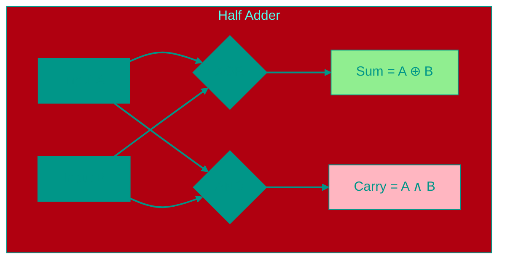
```mermaid
%%{init: { 'theme': 'base', 'themeVariables': { 'lineColor': '#009688', 'primaryColor': '#009688', 'primaryTextColor': '#009688', 'attributeBkg': '#009688', 'attributeTextColor': '#009688', 'signalColor': '#009688', 'actorLineColor': '#009688', 'nodeBorder': '#009688', 'clusterBorder': '#009688', 'textColor': '#009688', 'fontSize': '16px' } } }%%
graph TD
    subgraph Half_Adder["Half Adder"]
        A[Input A] --> XOR1{XOR}
        B[Input B] --> XOR1
        A --> AND1{AND}
        B --> AND1
        XOR1 --> Sum[Sum = A ⊕ B]
        AND1 --> Carry[Carry = A ∧ B]
    end
    
    style Sum fill:#90EE90
    style Carry fill:#FFB6C1


linkStyle default stroke:#009688,stroke-width:2px;


```

**Half Adder Truth Table**:

| A | B | Sum (A ⊕ B) | Carry (A ∧ B) |
|:---:|:---:|:---:|:---:|
| 0 | 0 | 0 | 0 |
| 0 | 1 | 1 | 0 |
| 1 | 0 | 1 | 0 |
| 1 | 1 | 0 | 1 |


#### Multiplexer (MUX)

Selects one of several input signals based on a control signal.

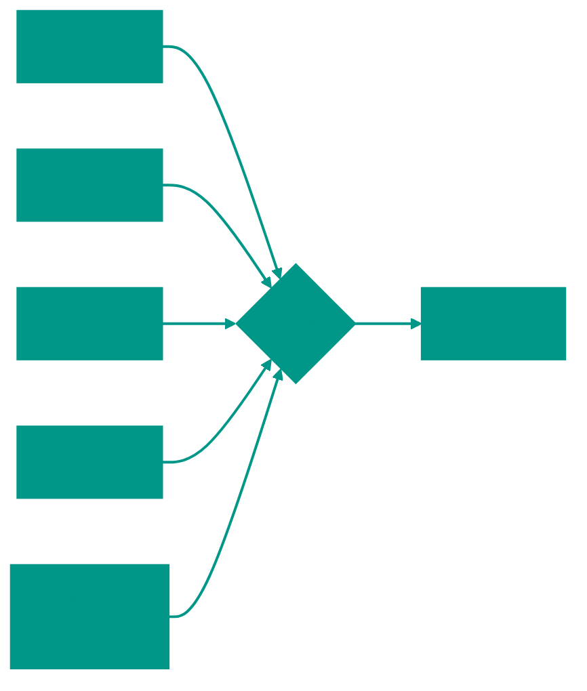
```mermaid
%%{init: { 'theme': 'base', 'themeVariables': { 'lineColor': '#009688', 'primaryColor': '#009688', 'primaryTextColor': '#009688', 'attributeBkg': '#009688', 'attributeTextColor': '#009688', 'signalColor': '#009688', 'actorLineColor': '#009688', 'nodeBorder': '#009688', 'clusterBorder': '#009688', 'textColor': '#009688', 'fontSize': '16px' } } }%%
graph LR
    I0[Input 0] --> MUX{MUX}
    I1[Input 1] --> MUX
    I2[Input 2] --> MUX
    I3[Input 3] --> MUX
    Sel[Selector<br/>2 bits] --> MUX
    MUX --> Out[Output]


linkStyle default stroke:#009688,stroke-width:2px;


```


#### Demultiplexer (DEMUX)

Directs a single input signal to one of several outputs.


#### Decoder / Encoder

- **Decoder**: Converts binary code into a signal on one of its outputs (e.g., `00` → output 0, `01` → output 1).
- **Encoder**: The inverse of a decoder; converts a signal into binary code.

> [!IMPORTANT]
> In a processor, adders are used in the **ALU** (Arithmetic Logic Unit) to perform addition, subtraction, and other arithmetic operations.


#### 🧮 Practical Example: Calculator

**How does a calculator add 25 + 17?**

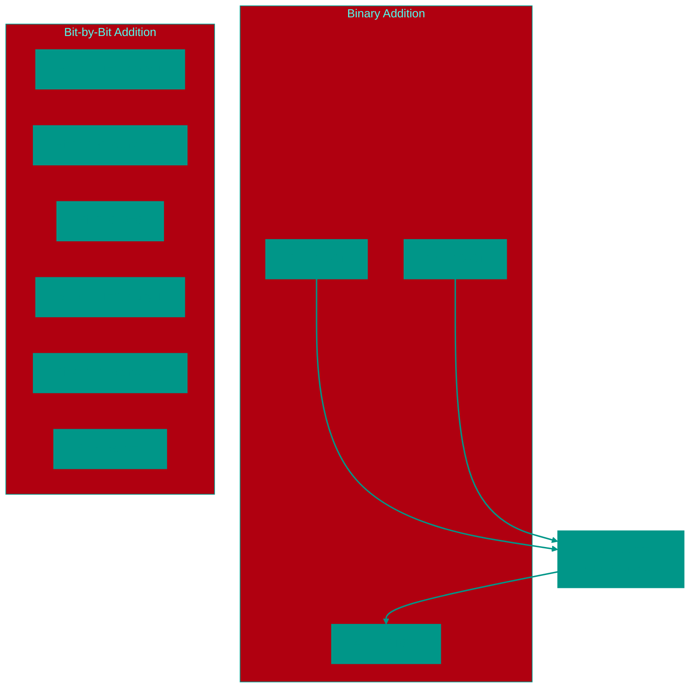
```mermaid
%%{init: { 'theme': 'base', 'themeVariables': { 'lineColor': '#009688', 'primaryColor': '#009688', 'primaryTextColor': '#009688', 'attributeBkg': '#009688', 'attributeTextColor': '#009688', 'signalColor': '#009688', 'actorLineColor': '#009688', 'nodeBorder': '#009688', 'clusterBorder': '#009688', 'textColor': '#009688', 'fontSize': '16px' } } }%%
graph TD
    subgraph Binary_Add["Binary Addition"]
        Num1[25 = 11001] 
        Num2[17 = 10001]
        Result[42 = 101010]
    end
    
    Num1 --> Adder["Full Adders<br/>5 units for 5 bits"]
    Num2 --> Adder
    Adder --> Result
    
    subgraph Bit_by_Bit["Bit-by-Bit Addition"]
        B0["Bit 0: 1+1=0, carry 1"]
        B1["Bit 1: 0+0+carry(1)=1"]
        B2["Bit 2: 0+0=0"]
        B3["Bit 3: 1+1=0, carry 1"]
        B4["Bit 4: 1+1+carry(1)=1"]
        B5["Bit 5: carry=1"]
    end


linkStyle default stroke:#009688,stroke-width:2px;


```

**Detailed calculation:**
```
  11001  (25)
+ 10001  (17)
-------
 101010  (42)
```

- Bit 0: `1 + 1 = 10` → sum=0, carry=1
- Bit 1: `0 + 0 + carry(1) = 01` → sum=1, carry=0
- Bit 2: `0 + 0 = 00` → sum=0, carry=0
- Bit 3: `1 + 1 = 10` → sum=0, carry=1
- Bit 4: `1 + 1 + carry(1) = 11` → sum=1, carry=1
- Bit 5: carry(1) → sum=1

**Result: 101010₂ = 42₁₀** ✅

> [!NOTE]
> A processor uses a chain of **full adders** (typically 32 or 64 for modern processors), each adding one bit with carry. This all happens in **nanoseconds**!

---


## 3. ⏳ Sequential Logic

Sequential logic refers to circuits where the output depends on **current inputs AND previous states** (memory).


### Core Elements


#### Flip-Flops

Store **1 bit** of information.

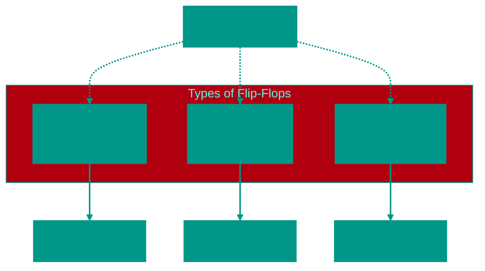
```mermaid
%%{init: { 'theme': 'base', 'themeVariables': { 'lineColor': '#009688', 'primaryColor': '#009688', 'primaryTextColor': '#009688', 'attributeBkg': '#009688', 'attributeTextColor': '#009688', 'signalColor': '#009688', 'actorLineColor': '#009688', 'nodeBorder': '#009688', 'clusterBorder': '#009688', 'textColor': '#009688', 'fontSize': '16px' } } }%%
graph TD
    subgraph Flip_Flops["Types of Flip-Flops"]
        SR[SR Flip-Flop<br/>Set/Reset]
        D[D Flip-Flop<br/>Data]
        JK[JK Flip-Flop<br/>Universal]
    end
    
    CLK[Clock Signal] -.-> SR
    CLK -.-> D
    CLK -.-> JK
    
    SR --> State1[State: 0 or 1]
    D --> State2[State: 0 or 1]
    JK --> State3[State: 0 or 1]


linkStyle default stroke:#009688,stroke-width:2px;


```

**Common Types**:

- **SR Flip-Flop**: Sets (S) or resets (R) the stored value.
- **D Flip-Flop**: Stores the input value on a synchronization signal (clock signal).
- **JK Flip-Flop**: A versatile flip-flop that can change state based on complex conditions.


#### Register

A collection of flip-flops used to store multiple bits (e.g., a 32-bit register).

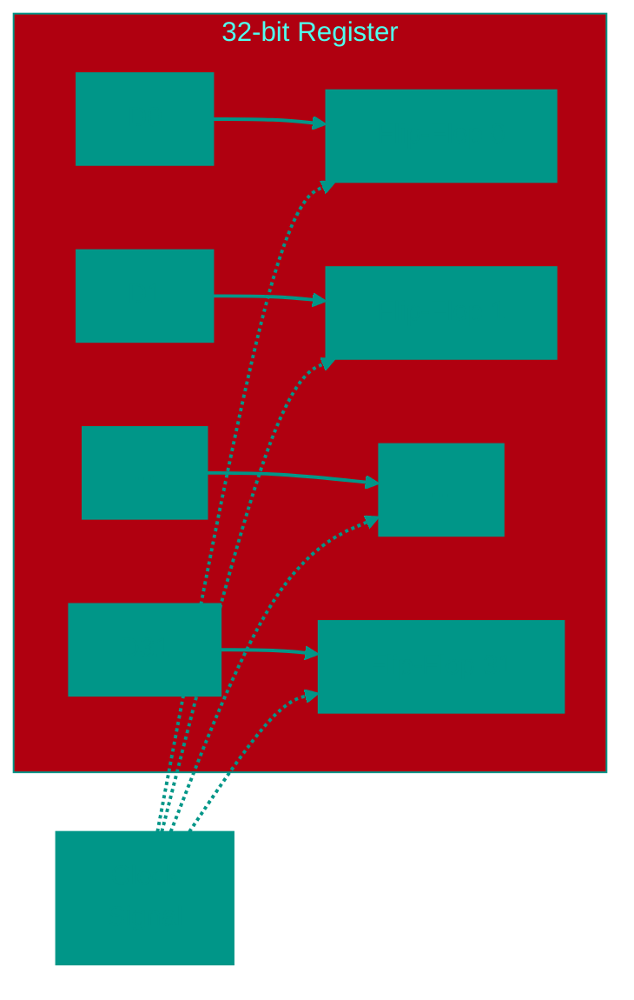
```mermaid
%%{init: { 'theme': 'base', 'themeVariables': { 'lineColor': '#009688', 'primaryColor': '#009688', 'primaryTextColor': '#009688', 'attributeBkg': '#009688', 'attributeTextColor': '#009688', 'signalColor': '#009688', 'actorLineColor': '#009688', 'nodeBorder': '#009688', 'clusterBorder': '#009688', 'textColor': '#009688', 'fontSize': '16px' } } }%%
graph LR
    subgraph Register_32bit["32-bit Register"]
        D0[D0] --> T0[Flip-Flop 0]
        D1[D1] --> T1[Flip-Flop 1]
        D2[...] --> T2[...]
        D31[D31] --> T31[Flip-Flop 31]
    end
    
    CLK[Clock<br/>Signal] -.-> T0
    CLK -.-> T1
    CLK -.-> T2
    CLK -.-> T31


linkStyle default stroke:#009688,stroke-width:2px;


```


#### Counter

Sequentially increments a value (e.g., from `000` to `111` in binary).


### Clock Signal ⏱️

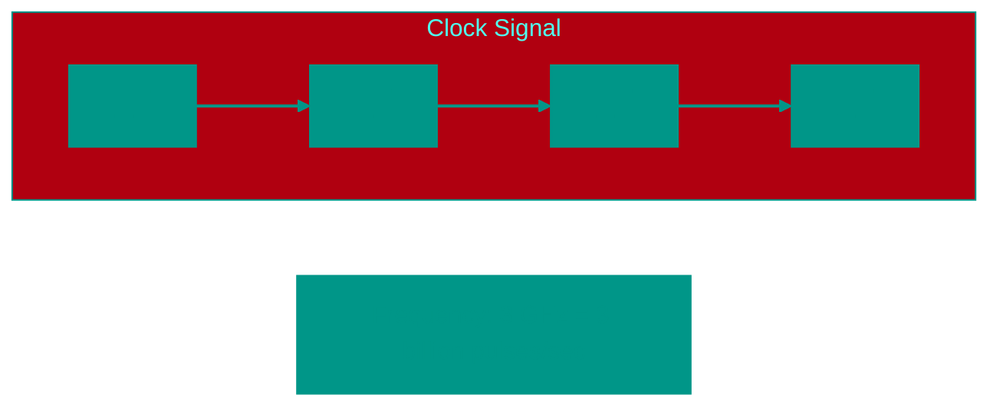
```mermaid
%%{init: { 'theme': 'base', 'themeVariables': { 'lineColor': '#009688', 'primaryColor': '#009688', 'primaryTextColor': '#009688', 'attributeBkg': '#009688', 'attributeTextColor': '#009688', 'signalColor': '#009688', 'actorLineColor': '#009688', 'nodeBorder': '#009688', 'clusterBorder': '#009688', 'textColor': '#009688', 'fontSize': '16px' } } }%%
graph LR
    subgraph Clock_Signal["Clock Signal"]
        direction LR
        High1[▁▔] --> High2[▁▔] --> High3[▁▔] --> High4[▁▔]
    end
    
    Freq[Frequency: 3 GHz = 3 billion pulses/sec]


linkStyle default stroke:#009688,stroke-width:2px;


```

- Synchronizes circuit operation.
- The clock frequency determines how often states are updated.

> [!NOTE]
> Processor registers store intermediate calculation results, such as variable values or memory addresses.


#### 🎮 Practical Example: Game Score Counter

**Imagine a video game score counter (0-15 points):**

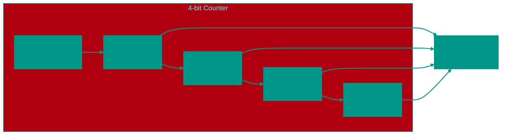
```mermaid
%%{init: { 'theme': 'base', 'themeVariables': { 'lineColor': '#009688', 'primaryColor': '#009688', 'primaryTextColor': '#009688', 'attributeBkg': '#009688', 'attributeTextColor': '#009688', 'signalColor': '#009688', 'actorLineColor': '#009688', 'nodeBorder': '#009688', 'clusterBorder': '#009688', 'textColor': '#009688', 'fontSize': '16px' } } }%%
graph LR
    subgraph Counter_4bit["4-bit Counter"]
        Clock[⏱️ Event:<br/>collected coin] --> T0[Flip-Flop 0<br/>bit 2⁰]
        T0 --> T1[Flip-Flop 1<br/>bit 2¹]
        T1 --> T2[Flip-Flop 2<br/>bit 2²]
        T2 --> T3[Flip-Flop 3<br/>bit 2³]
    end
    
    T0 --> Display[📺 Display:<br/>shows score]
    T1 --> Display
    T2 --> Display
    T3 --> Display


linkStyle default stroke:#009688,stroke-width:2px;


```

**Event sequence:**

| Event | Bit 3 | Bit 2 | Bit 1 | Bit 0 | Binary | Score |
|:---|:---:|:---:|:---:|:---:|:---:|:---:|
| Game start | 0 | 0 | 0 | 0 | `0000` | 0 |
| 🪙 Coin #1 | 0 | 0 | 0 | 1 | `0001` | 1 |
| 🪙 Coin #2 | 0 | 0 | 1 | 0 | `0010` | 2 |
| 🪙 Coin #3 | 0 | 0 | 1 | 1 | `0011` | 3 |
| ... | ... | ... | ... | ... | ... | ... |
| 🪙 Coin #15 | 1 | 1 | 1 | 1 | `1111` | 15 |
| 🪙 Coin #16 | 0 | 0 | 0 | 0 | `0000` | 0 (overflow!) |

**How it works:**
1. Each **flip-flop** stores one bit (0 or 1)
2. On event (collected coin) **clock signal** toggles flip-flops
3. Bits form a **binary number** displayed on screen
4. Upon reaching maximum (15) counter resets to 0

> [!TIP]
> Real games use **32-bit registers** for scoring (can store up to 4,294,967,295), so score overflow is virtually impossible!

---


## 4. 🤖 Finite State Machines

A **Finite State Machine (FSM)** is a model describing the behavior of a system with a limited number of states.


### Components 🧱

- **States**: E.g., "on", "off".
- **Transitions**: Conditions under which the system changes state (e.g., "button pressed").
- **Inputs**: Signals that trigger transitions.
- **Outputs**: Results that depend on the state or inputs.


### Visualization: Traffic Light

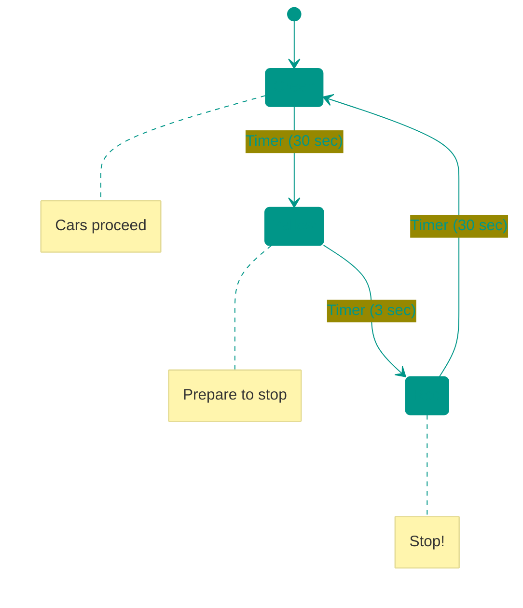
```mermaid
%%{init: { 'theme': 'base', 'themeVariables': { 'lineColor': '#009688', 'primaryColor': '#009688', 'primaryTextColor': '#009688', 'attributeBkg': '#009688', 'attributeTextColor': '#009688', 'signalColor': '#009688', 'actorLineColor': '#009688', 'nodeBorder': '#009688', 'clusterBorder': '#009688', 'textColor': '#009688', 'fontSize': '16px' } } }%%
stateDiagram-v2
    [*] --> Green
    Green --> Yellow : Timer (30 sec)
    Yellow --> Red : Timer (3 sec)
    Red --> Green : Timer (30 sec)
    
    note right of Green
        Cars proceed
    end note
    note right of Yellow
        Prepare to stop
    end note
    note right of Red
        Stop!
    end note


```


### Types 🎨

| Type | Description | Output Depends On |
|:---|:---|:---|
| **Moore Machine** | Output depends exclusively on the current state | State only |
| **Mealy Machine** | Output depends on both current state and inputs | State + inputs |


### Applications 🚀

- Process management in CPUs.
- Communication protocols (e.g., USB, TCP/IP).
- Game logic.
- Device control.

> [!TIP]
> **Example**: A processor uses FSMs to manage the **instruction pipeline** (Fetch → Decode → Execute → Write Back).

---


## 🌍 Practical Real-World Examples

Now let's see how digital logic works in devices you use every day.


### ⌨️ How a Keyboard Button Works

**From physical press to digital signal:**

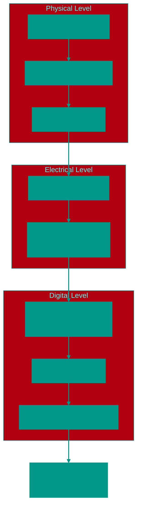
```mermaid
%%{init: { 'theme': 'base', 'themeVariables': { 'lineColor': '#009688', 'primaryColor': '#009688', 'primaryTextColor': '#009688', 'attributeBkg': '#009688', 'attributeTextColor': '#009688', 'signalColor': '#009688', 'actorLineColor': '#009688', 'nodeBorder': '#009688', 'clusterBorder': '#009688', 'textColor': '#009688', 'fontSize': '16px' } } }%%
graph TD
    subgraph Physical["Physical Level"]
        Press[👆 Finger presses] --> Spring[Spring compresses]
        Spring --> Contact[Contacts close]
    end
    
    subgraph Electrical["Electrical Level"]
        Contact --> Voltage[Voltage 0V → 5V]
        Voltage --> Bounce[⚡ Contact bounce<br/>0-1-0-1-0-1-1-1]
    end
    
    subgraph Digital["Digital Level"]
        Bounce --> Debounce[🧠 Debounce circuit<br/>Schmitt trigger]
        Debounce --> Clean[Clean signal: 1]
        Clean --> Register[📝 Register stores state]
    end
    
    Register --> Scan[Controller scans<br/>key matrix]


linkStyle default stroke:#009688,stroke-width:2px;


```

**Detailed process:**

1. **Physical press**:
   - Finger presses key → spring compresses
   - Metal contacts touch

2. **Electrical signal**:
   - Before press: resistor "pulls up" line to 5V (logic **1**)
   - After press: contact grounds to 0V (logic **0**)
   - Or vice versa, depending on circuit (active low/high)

3. **Bounce problem**:
   ```
   Ideal signal:     _____|‾‾‾‾‾‾‾‾‾
   Real signal:      _____|‾|_|‾|_|‾‾‾  (contacts "bounce")
   ```
   - Physical contact **"bounces"** for ~1-10 ms
   - Creates false 0→1→0→1 transitions

4. **Solution — debounce circuit**:
   - **Schmitt trigger**: Has two switching thresholds (e.g., 1.5V and 3.5V)
     - Transition 0→1: only when voltage > 3.5V
     - Transition 1→0: only when voltage < 1.5V
     - **Hysteresis** prevents false triggers
   - Or **RC filter + trigger**: Capacitor smooths spikes
   - Or **software debounce**: Controller ignores changes faster than 20 ms

5. **State storage**:
   - **D flip-flop** captures stable signal on clock pulse
   - Flip-flop output = "key pressed" (1) or "released" (0)

6. **Matrix scanning**:
   - Keyboard controller scans matrix (e.g., 6 rows × 18 columns)
   - Determines pressed key coordinates
   - Generates scan code and sends via USB

**Debounce logic circuit (SR flip-flop):**

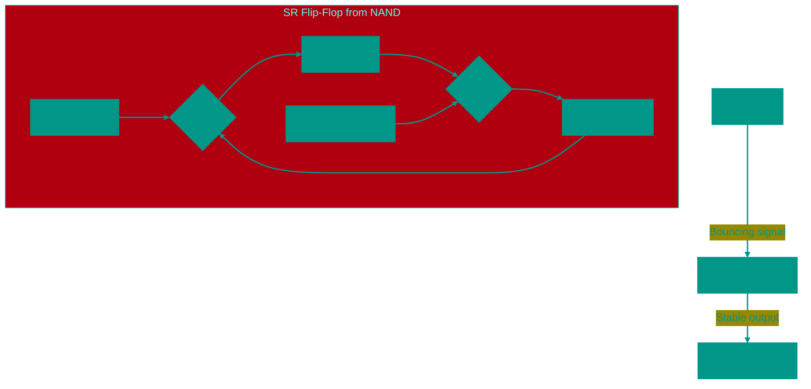
```mermaid
%%{init: { 'theme': 'base', 'themeVariables': { 'lineColor': '#009688', 'primaryColor': '#009688', 'primaryTextColor': '#009688', 'attributeBkg': '#009688', 'attributeTextColor': '#009688', 'signalColor': '#009688', 'actorLineColor': '#009688', 'nodeBorder': '#009688', 'clusterBorder': '#009688', 'textColor': '#009688', 'fontSize': '16px' } } }%%
graph TD
    Button[Button] -->|Bouncing signal| SR[SR Flip-Flop]
    SR -->|Stable output| Output[Clean signal]
    
    subgraph SR_Logic["SR Flip-Flop from NAND"]
        S[Set: press] --> NAND1{NAND}
        NAND1 --> Q[Q: state]
        Q --> NAND2{NAND}
        R[Reset: release] --> NAND2
        NAND2 --> Q_inv[Q': inverse]
        Q_inv --> NAND1
    end


linkStyle default stroke:#009688,stroke-width:2px;


```

> [!IMPORTANT]
> Without debounce circuitry, one key press could register as **multiple presses**! Try holding a key — the character repeats, this is **auto-repeat**, implemented in software by the OS, not bounce.


### 🔌 USB Protocol: State Machine in Action

**USB connection is managed by a finite state machine:**

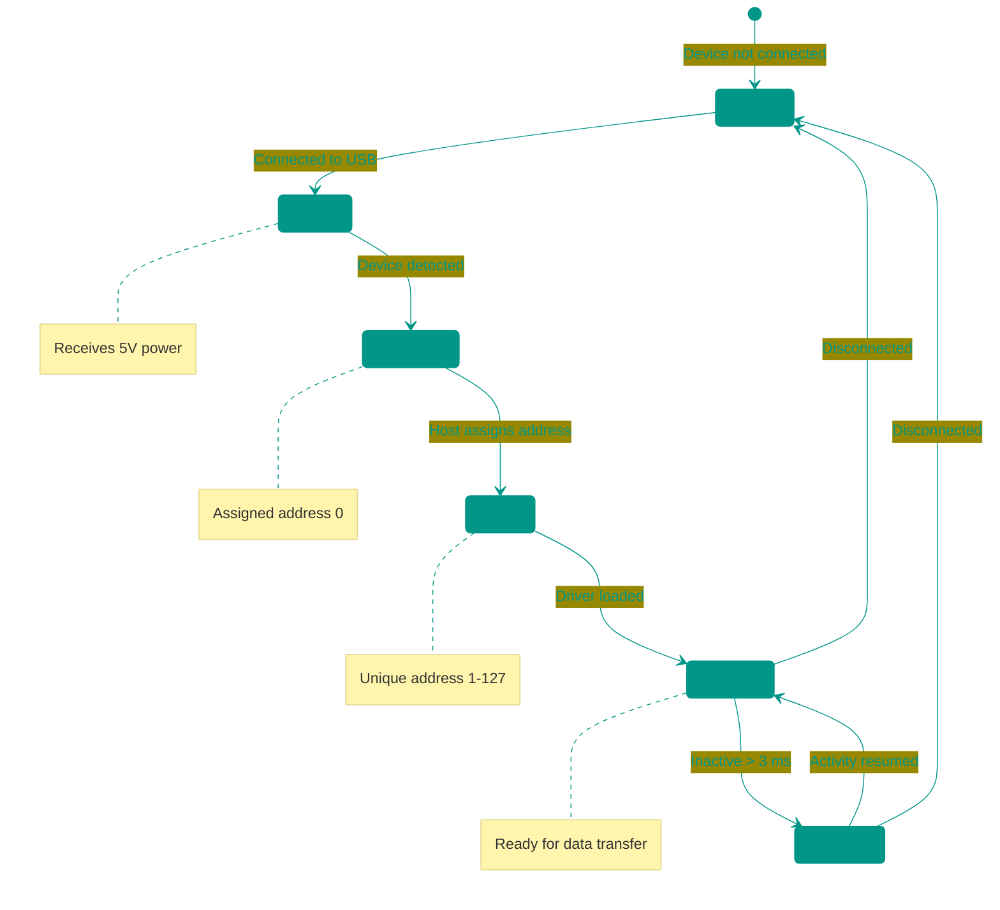
```mermaid
%%{init: { 'theme': 'base', 'themeVariables': { 'lineColor': '#009688', 'primaryColor': '#009688', 'primaryTextColor': '#009688', 'attributeBkg': '#009688', 'attributeTextColor': '#009688', 'signalColor': '#009688', 'actorLineColor': '#009688', 'nodeBorder': '#009688', 'clusterBorder': '#009688', 'textColor': '#009688', 'fontSize': '16px' } } }%%
stateDiagram-v2
    [*] --> Detached: Device not connected
    
    Detached --> Powered: Connected to USB
    note right of Powered
        Receives 5V power
    end note
    
    Powered --> DefaultState: Device detected
    note right of DefaultState
        Assigned address 0
    end note
    
    DefaultState --> Address: Host assigns address
    note right of Address
        Unique address 1-127
    end note
    
    Address --> Configured: Driver loaded
    note right of Configured
        Ready for data transfer
    end note
    
    Configured --> Suspended: Inactive > 3 ms
    Suspended --> Configured: Activity resumed
    
    Configured --> Detached: Disconnected
    Suspended --> Detached: Disconnected


```

**Detailed flash drive connection process:**

1. **State: Detached**
   - USB port monitors D+/D- lines (both low)

2. **Transition → Powered**
   - You insert flash drive → D+ line pulls up to 3.3V (via 1.5kΩ resistor)
   - Host detects **voltage change** → begins supplying 5V on power line

3. **Transition → Default**
   - Host sends **reset signal** (SE0: D+ and D- = 0V for 10 ms)
   - Device gets temporary address **0**
   - Host requests **device descriptor** (what are you? storage, keyboard, mouse?)

4. **Transition → Address**
   - Host assigns unique address (e.g., **3**)
   - Device responds with acknowledgment (**ACK**)

5. **Transition → Configured**
   - OS loads driver (for flash drive: mass storage driver)
   - Device ready: appears as drive **E:**

6. **Transition → Suspended**
   - If inactive > 3 ms → power saving mode
   - Consumption drops to 2.5 mA

7. **Transition → Detached**
   - You remove flash drive → D+ line drops to 0V
   - Host detects disconnection

**Data packets (simplified):**

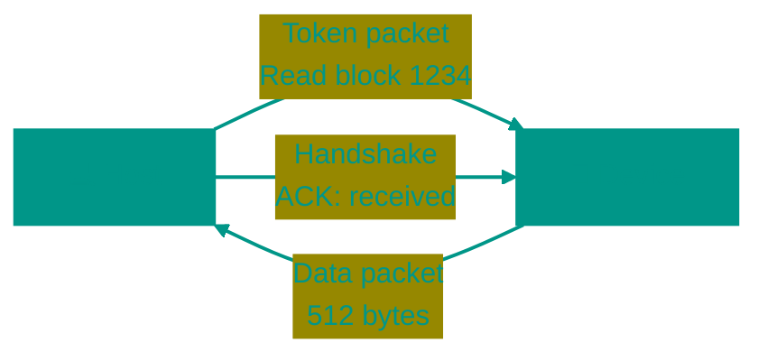
```mermaid
%%{init: { 'theme': 'base', 'themeVariables': { 'lineColor': '#009688', 'primaryColor': '#009688', 'primaryTextColor': '#009688', 'attributeBkg': '#009688', 'attributeTextColor': '#009688', 'signalColor': '#009688', 'actorLineColor': '#009688', 'nodeBorder': '#009688', 'clusterBorder': '#009688', 'textColor': '#009688', 'fontSize': '16px' } } }%%
graph LR
    Host["💻 Host"] -->|"Token packet<br/>Read block 1234"| Device["📱 Device"]
    Device -->|"Data packet<br/>512 bytes"| Host
    Host -->|"Handshake<br/>ACK: received"| Device


linkStyle default stroke:#009688,stroke-width:2px;


```

- **Token**: Command from host ("read", "write")
- **Data**: Data to/from device
- **Handshake**: Acknowledgment (ACK) or error (NAK)

> [!NOTE]
> Each **transition** in the USB state machine is triggered by **events** (connection, request, timeout). The USB controller in your computer is a hardware **finite state machine**, implemented with transistors and flip-flops!


### 🚦 Smart Traffic Light with Sensors

**Extended example: traffic light reacts to traffic**

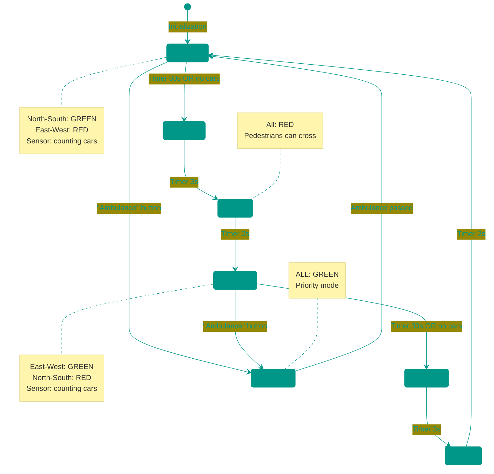
```mermaid
%%{init: { 'theme': 'base', 'themeVariables': { 'lineColor': '#009688', 'primaryColor': '#009688', 'primaryTextColor': '#009688', 'attributeBkg': '#009688', 'attributeTextColor': '#009688', 'signalColor': '#009688', 'actorLineColor': '#009688', 'nodeBorder': '#009688', 'clusterBorder': '#009688', 'textColor': '#009688', 'fontSize': '16px' } } }%%
stateDiagram-v2
    [*] --> Green_NS: Initialization
    
    Green_NS --> Yellow_NS: Timer 30s OR no cars
    note right of Green_NS
        North-South: GREEN
        East-West: RED
        Sensor: counting cars
    end note
    
    Yellow_NS --> Red_NS: Timer 3s
    
    Red_NS --> Green_EW: Timer 2s
    note left of Red_NS
        All: RED
        Pedestrians can cross
    end note
    
    Green_EW --> Yellow_EW: Timer 30s OR no cars
    note right of Green_EW
        East-West: GREEN
        North-South: RED
        Sensor: counting cars
    end note
    
    Yellow_EW --> Red_EW: Timer 3s
    
    Red_EW --> Green_NS: Timer 2s
    
    Green_NS --> Emergency: "Ambulance" button
    Green_EW --> Emergency: "Ambulance" button
    Emergency --> Green_NS: Ambulance passed
    
    note left of Emergency
        ALL: GREEN
        Priority mode
    end note


```

**Inputs (what affects transitions):**
- ⏱️ **Timers**: 30 s (green), 3 s (yellow), 2 s (red)
- 🚗 **Traffic sensors**: Induction loops in asphalt count cars
- 🚶 **Pedestrian button**: Crossing request
- 🚨 **Ambulance button**: Emergency mode

**Outputs (what the machine does):**
- 🚦 LED control (red/yellow/green on 4 directions)
- 📊 Traffic data sent to server

**Adaptive behavior logic:**

```python
# Pseudocode logic
if green_timer > 30 seconds:
    switch_to_yellow()
elif sensor_shows_no_cars() and green_timer > 10 seconds:
    switch_to_yellow()  # Early switch
elif ambulance_button_pressed():
    switch_to_emergency_mode()
```

> [!IMPORTANT]
> Modern **smart traffic lights** use **complex finite state machines** with dozens of states, considering:
> - Time of day (night — flashing yellow)
> - Traffic density (adaptive timing)
> - Public transport priority
> - Synchronization with neighboring intersections ("green wave")

---


## 🎯 Key Takeaways

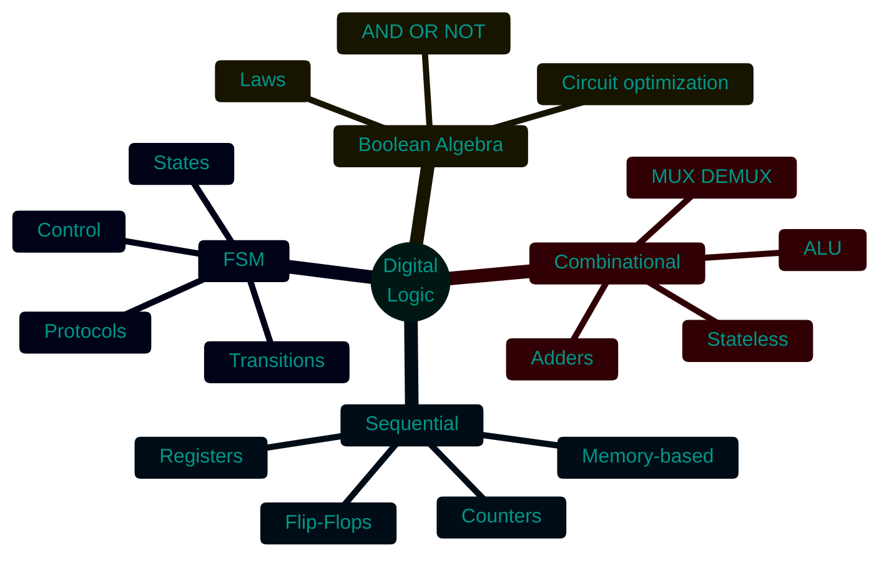
```mermaid
%%{init: { 'theme': 'base', 'themeVariables': { 'lineColor': '#009688', 'primaryColor': '#009688', 'primaryTextColor': '#009688', 'attributeBkg': '#009688', 'attributeTextColor': '#009688', 'signalColor': '#009688', 'actorLineColor': '#009688', 'nodeBorder': '#009688', 'clusterBorder': '#009688', 'textColor': '#009688', 'fontSize': '16px' } } }%%
mindmap
  root((Digital<br/>Logic))
    Boolean Algebra
      AND OR NOT
      Laws
      Circuit optimization
    Combinational
      Stateless
      Adders
      MUX DEMUX
      ALU
    Sequential
      Memory-based
      Flip-Flops
      Registers
      Counters
    FSM
      States
      Transitions
      Control
      Protocols


```

- **Boolean Algebra** is the mathematical foundation for logical operations.
- **Combinational Logic** creates circuits that depend solely on inputs (adders, multiplexers).
- **Sequential Logic** adds memory via flip-flops and registers, synchronized by a clock signal.
- **Finite State Machines** model system behavior through states (processors, protocols, devices).
- These concepts are the bedrock for designing processors and other digital systems.

<!-- QUIZ_START 
[
    {
        "question": "Which logic gate outputs '1' only if ALL its inputs are '1'?",
        "options": ["OR", "NAND", "XOR", "AND"],
        "correctIndex": 3
    },
    {
        "question": "What differentiates sequential logic from combinational logic?",
        "options": ["Higher speed", "Presence of memory (dependence on previous states)", "Using only 0 and 1", "Fewer transistors"],
        "correctIndex": 1
    },
    {
        "question": "Which hardware unit of the processor is responsible for performing arithmetic and logic operations?",
        "options": ["Registers", "Control Unit (CU)", "Arithmetic Logic Unit (ALU)", "Cache memory"],
        "correctIndex": 2
    }
]
QUIZ_END -->
