# 🧠 Digital Logic and Boolean Algebra

## 📑 Table of Contents
1. [Boolean Algebra](#boolean-algebra)
2. [Combinational Logic](#combinational-logic)
3. [Sequential Logic](#sequential-logic)
4. [Finite State Machines](#finite-state-machines)

---

Digital logic is the foundation of computer operation, allowing binary signals (**0** and **1**) to be processed using logical operations. Boolean algebra provides the mathematical framework for the design and analysis of digital circuits.

---

## 1. 📐 Boolean Algebra

Boolean algebra is a branch of mathematics that deals with logical values (**TRUE/1** and **FALSE/0**) and operations performed on them.

### Basic Operations ⚡

```mermaid
graph LR
    subgraph AND_Gate["AND"]
        A1[A] --> AND{AND}
        B1[B] --> AND
        AND --> Out1[1 only if<br/>A=1 AND B=1]
    end
    
    subgraph OR_Gate["OR"]
        A2[A] --> OR{OR}
        B2[B] --> OR
        OR --> Out2[1 if<br/>A=1 OR B=1]
    end
    
    subgraph NOT_Gate["NOT"]
        A3[A] --> NOT{NOT}
        NOT --> Out3[Inversion<br/>0→1, 1→0]
    end
```

| Operation | Notation | Description | Result is 1 if... |
|:---|:---:|:---|:---|
| **AND** | A ∧ B | Logical AND | Both A and B are 1 |
| **OR** | A ∨ B | Logical OR | At least one of A or B is 1 |
| **NOT** | ¬A | Inversion | A = 0 |
| **NAND** | ¬(A ∧ B) | Negated AND | Not all inputs are 1 |
| **NOR** | ¬(A ∨ B) | Negated OR | All inputs are 0 |
| **XOR** | A ⊕ B | Exclusive OR | Exactly one input is 1 |

### Boolean Laws 📚

| Law | Example |
|:---|:---|
| **Commutative** | A ∧ B = B ∧ A, A ∨ B = B ∨ A |
| **Associative** | (A ∧ B) ∧ C = A ∧ (B ∧ C) |
| **Distributive** | A ∧ (B ∨ C) = (A ∧ B) ∨ (A ∧ C) |
| **De Morgan's** | ¬(A ∧ B) = ¬A ∨ ¬B, ¬(A ∨ B) = ¬A ∧ ¬B |
| **Idempotent** | A ∧ A = A, A ∨ A = A |

> [!TIP]
> **Application**: Simplifying logical expressions to optimize circuits and design digital devices (e.g., processors).

> [!NOTE]
> **Simplification Example**: Let's simplify A ∧ (A ∨ B).
> 
> Using the distributive law: A ∧ (A ∨ B) = (A ∧ A) ∨ (A ∧ B) = A ∨ (A ∧ B)
> 
> Then: A ∨ (A ∧ B) = A (Absorption Law)

---

## 2. 🧩 Combinational Logic

Combinational logic refers to circuits where the output depends **only on the current inputs**, without regard to previous states.

### Core Elements

#### Adder

Adds binary numbers.

- **Half Adder**: Adds two bits, producing a sum and a carry.
- **Full Adder**: Adds two bits while accounting for an input carry.

```mermaid
graph TD
    subgraph Half_Adder["Half Adder"]
        A[Input A] --> XOR1{XOR}
        B[Input B] --> XOR1
        A --> AND1{AND}
        B --> AND1
        XOR1 --> Sum[Sum = A ⊕ B]
        AND1 --> Carry[Carry = A ∧ B]
    end
    
    style Sum fill:#90EE90
    style Carry fill:#FFB6C1
```

**Half Adder Truth Table**:

| A | B | Sum (A ⊕ B) | Carry (A ∧ B) |
|:---:|:---:|:---:|:---:|
| 0 | 0 | 0 | 0 |
| 0 | 1 | 1 | 0 |
| 1 | 0 | 1 | 0 |
| 1 | 1 | 0 | 1 |

#### Multiplexer (MUX)

Selects one of several input signals based on a control signal.

#### Demultiplexer (DEMUX)

Directs a single input signal to one of several outputs.

#### Decoder / Encoder

- **Decoder**: Converts binary code into a signal on one of its outputs (e.g., `00` → output 0, `01` → output 1).
- **Encoder**: The inverse of a decoder; converts a signal into binary code.

> [!IMPORTANT]
> In a processor, adders are used in the **ALU** (Arithmetic Logic Unit) to perform addition, subtraction, and other arithmetic operations.

---

## 3. ⏳ Sequential Logic

Sequential logic refers to circuits where the output depends on **current inputs AND previous states** (memory).

### Core Elements

#### Flip-Flops

Store **1 bit** of information.

**Common Types**:

- **SR Flip-Flop**: Sets (S) or resets (R) the stored value.
- **D Flip-Flop**: Stores the input value on a synchronization signal (clock signal).
- **JK Flip-Flop**: A versatile flip-flop that can change state based on complex conditions.

#### Register

A collection of flip-flops used to store multiple bits (e.g., a 32-bit register).

#### Counter

Sequentially increments a value (e.g., from `000` to `111` in binary).

### Clock Signal ⏱️

```mermaid
graph LR
    subgraph Clock_Signal["Clock Signal"]
        direction LR
        High1[▁▔] --> High2[▁▔] --> High3[▁▔] --> High4[▁▔]
    end
    
    Freq[Frequency: 3 GHz = 3 billion pulses/sec]
```

- Synchronizes circuit operation.
- The clock frequency determines how often states are updated.

> [!NOTE]
> Processor registers store intermediate calculation results, such as variable values or memory addresses.

---

## 4. 🤖 Finite State Machines

A **Finite State Machine (FSM)** is a model describing the behavior of a system with a limited number of states.

### Components 🧱

- **States**: E.g., "on", "off".
- **Transitions**: Conditions under which the system changes state (e.g., "button pressed").
- **Inputs**: Signals that trigger transitions.
- **Outputs**: Results that depend on the state or inputs.

### Visualization: Traffic Light

### Types 🎨

| Type | Description | Output Depends On |
|:---|:---|:---|
| **Moore Machine** | Output depends exclusively on the current state | State only |
| **Mealy Machine** | Output depends on both current state and inputs | State + inputs |

### Applications 🚀

- Process management in CPUs.
- Communication protocols (e.g., USB, TCP/IP).
- Game logic.
- Device control.

> [!TIP]
> **Example**: A processor uses FSMs to manage the **instruction pipeline** (Fetch → Decode → Execute → Write Back).

---

## 🎯 Key Takeaways

- **Boolean Algebra** is the mathematical foundation for logical operations.
- **Combinational Logic** creates circuits that depend solely on inputs (adders, multiplexers).
- **Sequential Logic** adds memory via flip-flops and registers, synchronized by a clock signal.
- **Finite State Machines** model system behavior through states (processors, protocols, devices).
- These concepts are the bedrock for designing processors and other digital systems.
