# 🔢 Bits, Bytes, and Numeral Systems

## 📑 Table of Contents
1. [Numeral Systems](#numeral-systems)
2. [Bits and Bytes](#bits-and-bytes)
3. [Data Encoding](#data-encoding)
4. [Bitwise Operations](#bitwise-operations)

---

Computers work with data represented as **bits** (binary digits) and **bytes**. This section explains how data is encoded, stored, and processed using various numeral systems.


---

## 1. 📂 Numeral Systems

A numeral system is a way of representing numbers using symbols (digits) and their positions.

### Common Systems 🏛️

| System | Base | Digits | Example | Decimal Equivalent |
|:---|:---:|:---|:---:|:---:|
| **Binary** | 2 | 0, 1 | 1010 | 10 |
| **Octal** | 8 | 0-7 | 12 | 10 |
| **Decimal** | 10 | 0-9 | 10 | 10 |
| **Hexadecimal** | 16 | 0-9, A-F | A | 10 |

### Conversion Between Systems 🔄

#### From Binary to Decimal

```
1010₂ = 1×2³ + 0×2² + 1×2¹ + 0×2⁰
     = 8 + 0 + 2 + 0
     = 10₁₀
```



```mermaid
graph LR
    B[1010₂] --> B3[1×2³=8]
    B --> B2[0×2²=0]
    B --> B1[1×2¹=2]
    B --> B0[0×2⁰=0]
    
    B3 --> Sum[8+0+2+0]
    B2 --> Sum
    B1 --> Sum
    B0 --> Sum
    Sum --> Result[10₁₀]
```

#### From Decimal to Binary

Divide by 2 and record the remainders in reverse order:

```
10 ÷ 2 = 5 remainder 0
 5 ÷ 2 = 2 remainder 1
 2 ÷ 2 = 1 remainder 0
 1 ÷ 2 = 0 remainder 1

Read bottom-up: 1010₂
```

#### Binary ↔ Hexadecimal

Group by 4 bits (nibbles):

```
1010 1110₂ = AE₁₆
└─┬─┘ └─┬─┘
  A     E
```

> [!TIP]
> **Example**: The number 42 in different systems:
> - Decimal: `42`
> - Binary: `101010`
> - Hexadecimal: `2A`

---

## 2. 💾 Bits and Bytes

Bits and bytes are the fundamental units of information in a computer.

### Bit

- **The smallest unit of information**: either 0 or 1.
- Corresponds to an electrical signal (e.g., 0V = 0, 5V = 1).

### Byte

- **8 bits**. Example: `10110011`.
- Can represent **256 unique values** (2⁸, from `00000000` to `11111111`).


### Larger Units 📦

| Unit | Size | In Bytes | Example |
|:---|:---|:---:|:---|
| **Kilobyte (KB)** | 1024 bytes | 2¹⁰ | A plain text document |
| **Megabyte (MB)** | 1024 KB | 2²⁰ | An MP3 song (~3-5 MB) |
| **Gigabyte (GB)** | 1024 MB | 2³⁰ | An HD video (~1-4 GB) |
| **Terabyte (TB)** | 1024 GB | 2⁴⁰ | A hard drive |
| **Petabyte (PB)** | 1024 TB | 2⁵⁰ | A data center |

> [!NOTE]
> The character `A` in ASCII takes up **1 byte** (`01000001` = 65 in decimal).

---

### Number Encoding 🔢

#### Integers

**Unsigned**:
```
1010₂ = 10₁₀
```

**Signed (Two's Complement)**:
- The first bit is the sign bit (0 = positive, 1 = negative).
- To get a negative number: invert the bits and add 1.

```
Example (4 bits):
 2₁₀ = 0010₂
-2₁₀ = 1110₂ (invert: 1101, add 1: 1110)
```

#### Floating-Point Numbers (IEEE 754) 🌊

Computers store fractional numbers (e.g., `3.14`, `0.005`) in **scientific notation** format, similar to an engineering calculator.

**1. Analogy: Scientific Notation**
In standard math, we can write very large or very small numbers like this:
- `123000` = `1.23 × 10⁵`
- `0.0045` = `4.5 × 10⁻³`
Here we have:
1. **Sign**: Plus or minus.
2. **Mantissa** (1.23): The "body" of the number, its precision.
3. **Exponent** (5): The "scale", how much to shift the decimal point.

**2. How Computers Do It (32-bit)**
The `float` standard (32-bit) does the same thing, but in binary:
`Number = (-1)^S × 1.M × 2^(E-127)`

| Part | Bits | Description | Analogy |
|:---|:---|:---|:---|
| **Sign (S)** | 1 | `0` = positive, `1` = negative | Plus/Minus |
| **Exponent (E)** | 8 | Decimal shift (scale) | Power of $10^x$ |
| **Mantissa (M)** | 23 | Fractional part (precision) | Digits `1.23` |

**3. Example: The Number 9.75**
1. Convert to binary: `9` = `1001`, `0.75` = `0.11` -> `1001.11`
2. Normalize (shift decimal so only one '1' remains):
   `1.00111 × 2³` (shifted 3 spots left).
3. **Store it**:
   - **Sign**: `0` (positive).
   - **Exponent**: `3 + 127 = 130` (binary `10000010`).
   - **Mantissa**: `00111...` (drop leading 1, write the tail).

> [!IMPORTANT]
> **Precision Problem**: The mantissa only holds 23 bits. Numbers like `0.1` are infinite fractions in binary (like `1/3` = `0.333...` in decimal).
> That's why `0.1 + 0.2` in a computer might become `0.30000000000000004`!

### Text and Multimedia 🎭

Detailed information about how text (UTF-8), images (RGB/YUV), sound, and video are encoded can be found in a separate section:
- [Data Encoding and Multimedia](./4.Data_Encoding_and_Multimedia.md)

---

---

## 4. ⚡ Bitwise Operations and Masks

Detailed information about bit manipulations, logical bitwise operations, and masks can be found in a separate section:
- [Bitwise Operations and Masks](./3.Bitwise_Operations_and_Masks.md)

---

---

## 🎯 Key Takeaways


- **Numeral Systems** (binary, hexadecimal) are the basis of data representation in a computer.
- **Bits** (0/1) and **bytes** (8 bits) are the smallest units of information.
- Data is encoded in binary form: text (ASCII, Unicode), numbers (integers, floating-point), images, and sound.
- **Bitwise operations** (AND, OR, XOR, shifts) are used for low-level data manipulation.
- Understanding bits and bytes is essential for working with memory, processors, and optimizing software.
