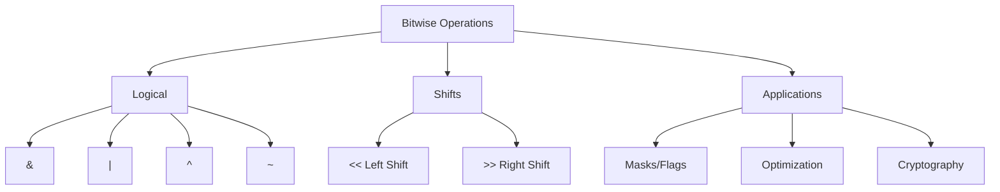
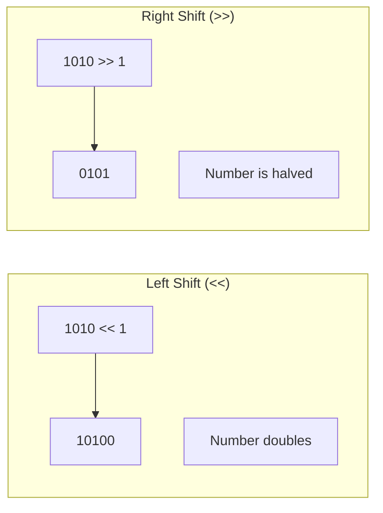
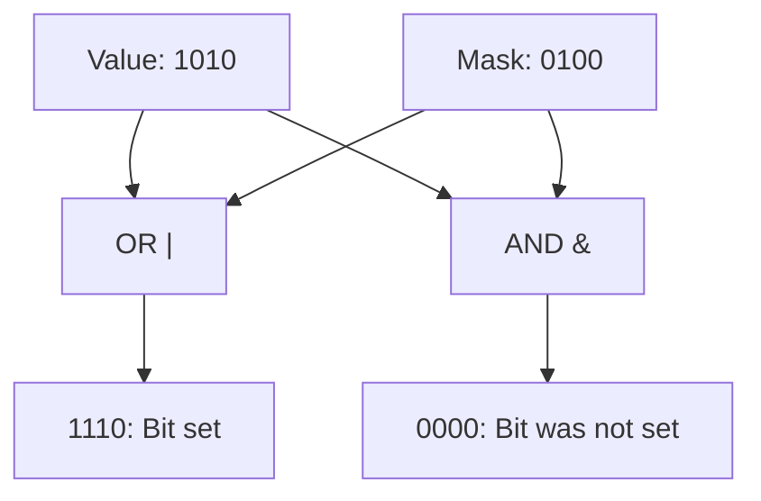
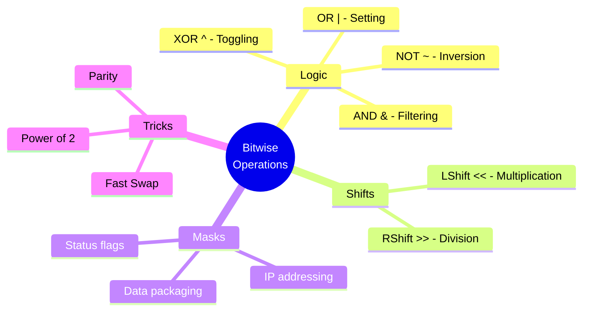

# ⚡ Bitwise Operations and Masks

## 📑 Table of Contents
1. [What are Bitwise Operations?](#what-are-bitwise-operations)
2. [Basic Operations](#basic-operations)
3. [Why are They Useful?](#why-are-they-useful)
4. [Bitmasks](#bitmasks)
5. [Advanced Techniques](#advanced-techniques)

---

Bitwise operations allow you to manipulate data at the lowest level—individual bits. They are the foundation of optimization, hardware interaction, and network protocols.



---

## 1. 🧩 What are Bitwise Operations?

Unlike standard arithmetic operations that work with numbers as a whole, bitwise operations process each bit of a number individually or shift the entire sequence of bits.

- **Operands**: Typically integers (int, uint, byte).
- **Principle**: The number is converted to binary, and the operation is applied to the corresponding pairs of bits.

> [!NOTE]
> Bitwise operations are executed by the processor in a single clock cycle, making them incredibly fast.

---

## 2. 🛠 Basic Operations

### Bitwise Logical Operations

| Operation | Symbol | Description | Example (A=10, B=12) | Result |
|:---|:---:|:---|:---|:---|
| **AND** | `&` | 1 if both bits are 1 | `1010 & 1100` | `1000` (8) |
| **OR** | `|` | 1 if at least one bit is 1 | `1010 | 1100` | `1110` (14) |
| **XOR** | `^` | 1 if bits are different | `1010 ^ 1100` | `0110` (6) |
| **NOT** | `~` | Inverts all bits (0→1, 1→0) | `~1010` (8-bit) | `11110101` |

### Bitwise Shifts



- **`<< n`**: Shifts bits to the left by `n` positions. Zeros are appended to the right. This is equivalent to multiplying by $2^n$.
- **`>> n`**: Shifts bits to the right. The sign bit is preserved (arithmetic shift) or zeros are appended (logical shift). This is equivalent to integer division by $2^n$.

---

## 3. 🚀 Why are They Useful?

1. **Compact Data Storage**: You can store 8 boolean flags (true/false) in one byte instead of 8 separate `bool` variables.
2. **Hardware Interaction**: Controlling processor registers and I/O ports.
3. **Network Protocols**: Reading packet headers (e.g., IP, TCP) where data is tightly packed.
4. **Optimization**: Replacing expensive operations (multiplication, division, modulo) with fast bitwise ones.
5. **Graphics and Cryptography**: Manipulating pixel colors (RGB) and encryption algorithms (e.g., AES, DES).

---

## 4. 👺 Bitmasks

A **bitmask** is a number used to isolate, set, or clear specific bits in another number.

### Core Techniques

#### 1. Checking a Bit (Is bit set?)
Use `&` with a mask where the target bit is 1.
```go
mask := 1 << 3 // Check the 3rd bit (00001000)
isSet := (value & mask) != 0
```

#### 2. Setting a Bit (Set bit)
Use `|` (OR)—this bit becomes 1, while others remain unchanged.
```go
value = value | (1 << 3) 
```

#### 3. Clearing a Bit (Clear bit)
Use `&` with an inverted mask.
```go
value = value & ^(1 << 3) // In Go, ^ is the bitwise NOT for constants
```

#### 4. Toggling a Bit (Toggle bit)
Use `^` (XOR).
```go
value = value ^ (1 << 3)
```



---

## 5. 💡 Advanced Techniques

### Parity Check
Instead of `n % 2 == 0`, use:
```go
if n & 1 == 0 {
    // Even
}
```

### Power of Two Check
Powers of two have exactly one bit set (e.g., 8 = `1000`).
```go
if n > 0 && (n & (n - 1)) == 0 {
    // Power of two!
}
```

### XOR Swap (Values exchange without a temp variable)
```go
a = a ^ b
b = a ^ b
a = a ^ b
```

> [!WARNING]
> The XOR Swap is mostly a clever trick. In modern code, it's usually better to use a standard temporary variable, as compilers can optimize it more effectively.

---

## 🎯 Conclusion



Bitwise operations are a powerful tool. While less common in everyday web development, they are indispensable for writing drivers, high-performance systems, game engines, and any task where every byte and every processor cycle counts.
