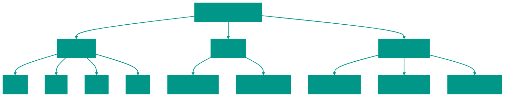
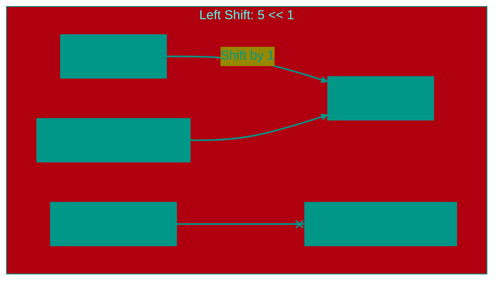
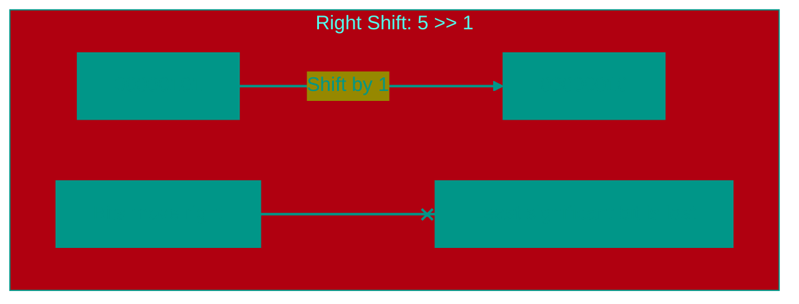
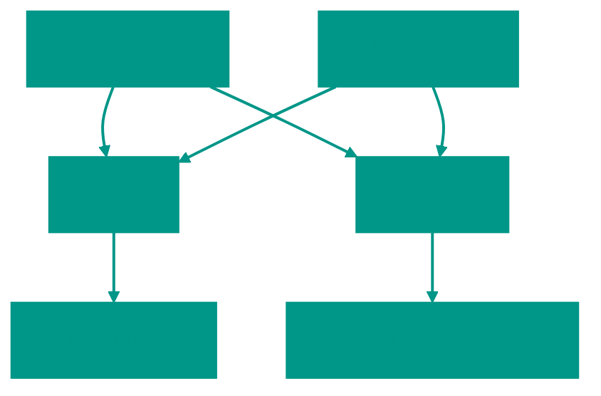
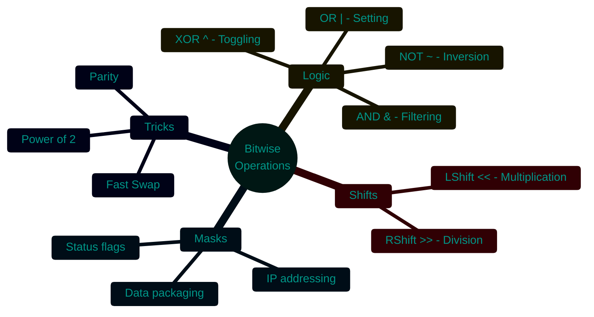

# ⚡ Bitwise Operations and Masks


## 📑 Table of Contents
1. [What are Bitwise Operations?](#what-are-bitwise-operations)
2. [Basic Operations](#basic-operations)
3. [Why are They Useful?](#why-are-they-useful)
4. [Bitmasks](#bitmasks)
5. [Advanced Techniques](#advanced-techniques)

---

Bitwise operations allow you to manipulate data at the lowest level—individual bits. They are the foundation of optimization, hardware interaction, and network protocols.


```mermaid
%%{init: { 'theme': 'base', 'themeVariables': { 'lineColor': '#009688', 'primaryColor': '#009688', 'primaryTextColor': '#009688', 'attributeBkg': '#009688', 'attributeTextColor': '#009688', 'signalColor': '#009688', 'actorLineColor': '#009688', 'nodeBorder': '#009688', 'clusterBorder': '#009688', 'textColor': '#009688', 'fontSize': '16px' } } }%%
graph TD
    Bitwise[Bitwise Operations] --> Logic[Logical]
    Bitwise --> Shifts[Shifts]
    
    Logic --> AND["&"]
    Logic --> OR["|"]
    Logic --> XOR["^"]
    Logic --> NOT["~"]
    
    Shifts --> Left[<< Left Shift]
    Shifts --> Right[>> Right Shift]
    
    Bitwise --> UseCases[Applications]
    UseCases --> Masks[Masks/Flags]
    UseCases --> Perf[Optimization]
    UseCases --> Crypto[Cryptography]


linkStyle default stroke:#009688,stroke-width:2px;


```

---


## 1. 🧩 What are Bitwise Operations?

Unlike standard arithmetic operations that work with numbers as a whole, bitwise operations process each bit of a number individually or shift the entire sequence of bits.

- **Operands**: Typically integers (int, uint, byte).
- **Principle**: The number is converted to binary, and the operation is applied to the corresponding pairs of bits.

> [!NOTE]
> Bitwise operations are executed by the processor in a single clock cycle, making them incredibly fast.

---


## 2. 🛠 Basic Operations


### Bitwise Logical Operations

| Operation | Symbol | Description | Example (A=10, B=12) | Result |
|:---|:---:|:---|:---|:---|
| **AND** | `&` | 1 if both bits are 1 | `1010 & 1100` | `1000` (8) |
| **OR** | `|` | 1 if at least one bit is 1 | `1010 | 1100` | `1110` (14) |
| **XOR** | `^` | 1 if bits are different | `1010 ^ 1100` | `0110` (6) |
| **NOT** | `~` | Inverts all bits (0→1, 1→0) | `~1010` (8-bit) | `11110101` |


### Bitwise Shifts

Shifts move bits left or right through "cells". Imagine a number as a row of boxes, each holding either a 0 or a 1.


#### Left Shift (`<< n`)
Bits are shifted to the left, "falling out" from the leftmost position. Empty spaces on the right are filled with zeros.


```mermaid
%%{init: { 'theme': 'base', 'themeVariables': { 'lineColor': '#009688', 'primaryColor': '#009688', 'primaryTextColor': '#009688', 'attributeBkg': '#009688', 'attributeTextColor': '#009688', 'signalColor': '#009688', 'actorLineColor': '#009688', 'nodeBorder': '#009688', 'clusterBorder': '#009688', 'textColor': '#009688', 'fontSize': '16px' } } }%%
graph LR
    subgraph LeftShift["Left Shift: 5 << 1"]
        direction LR
        In[00000101] -- "Shift by 1" --> Out[00001010]
        Note1["Bits move left"] --x Note2["Leftmost bit is lost"]
        Note3["0 enters from right"] --> Out
    end


linkStyle default stroke:#009688,stroke-width:2px;


```

**Schematic:**
`[0] [0] [0] [0] [0] [1] [0] [1]` (Value 5)
` << 1`
`[0] [0] [0] [0] [1] [0] [1] [0]` (Becomes 10)

- **Result**: Multiplies the number by $2^n$.
- **Danger**: If a `1` is pushed beyond the available bit range, data is lost.


#### Right Shift (`>> n`)
Bits are shifted to the right. Bits that "fall out" from the right are discarded.


```mermaid
%%{init: { 'theme': 'base', 'themeVariables': { 'lineColor': '#009688', 'primaryColor': '#009688', 'primaryTextColor': '#009688', 'attributeBkg': '#009688', 'attributeTextColor': '#009688', 'signalColor': '#009688', 'actorLineColor': '#009688', 'nodeBorder': '#009688', 'clusterBorder': '#009688', 'textColor': '#009688', 'fontSize': '16px' } } }%%
graph LR
    subgraph RightShift["Right Shift: 5 >> 1"]
        direction LR
        In[00000101] -- "Shift by 1" --> Out[00000010]
        Note4["Bits move right"] --x Note5["Least significant bit is lost"]
    end


linkStyle default stroke:#009688,stroke-width:2px;


```

**Schematic:**
`[0] [0] [0] [0] [0] [1] [0] [1]` (Value 5)
` >> 1`
`[0] [0] [0] [0] [0] [0] [1] [0]` (Becomes 2)

- **Result**: Integer division by $2^n$.

---


### ⚠️ Critical Note: The Sign Bit and Negative Numbers

In signed data types (`int8`, `int32`, etc.), the very first bit (the leftmost one) is the **sign bit**:
- `0` — Positive number.
- `1` — Negative number.

**What can go wrong during a left shift?**
If you have a positive number and shift its bits leftward until a `1` lands in the sign bit position, the number will suddenly **become negative**.

> [!CAUTION]
> **Example on 8 bits:**
> The number `64` in binary is: `01000000`.
> Let's shift it left by 1: `64 << 1`.
> The result is: `10000000`.
> To the computer, this is no longer `128`, but `-128` (using the two's complement system).
> This is a form of **overflow**.

---

---


## 3. 🚀 Why are They Useful?

1. **Compact Data Storage**: You can store 8 boolean flags (true/false) in one byte instead of 8 separate `bool` variables.
2. **Hardware Interaction**: Controlling processor registers and I/O ports.
3. **Network Protocols**: Reading packet headers (e.g., IP, TCP) where data is tightly packed.
4. **Optimization**: Replacing expensive operations (multiplication, division, modulo) with fast bitwise ones.
5. **Graphics and Cryptography**: Manipulating pixel colors (RGB) and encryption algorithms (e.g., AES, DES).

---


## 4. 👺 Bitmasks

A **bitmask** is a number used to isolate, set, or clear specific bits in another number.


### Core Techniques


#### 1. Checking a Bit (Is bit set?)
Use `&` with a mask where the target bit is 1.
```go
mask := 1 << 3 // Check the 3rd bit (00001000)
isSet := (value & mask) != 0
```


#### 2. Setting a Bit (Set bit)
Use `|` (OR)—this bit becomes 1, while others remain unchanged.
```go
value = value | (1 << 3) 
```


#### 3. Clearing a Bit (Clear bit)
Use `&` with an inverted mask.
```go
value = value & ^(1 << 3) // In Go, ^ is the bitwise NOT for constants
```


#### 4. Toggling a Bit (Toggle bit)
Use `^` (XOR).
```go
value = value ^ (1 << 3)
```


```mermaid
%%{init: { 'theme': 'base', 'themeVariables': { 'lineColor': '#009688', 'primaryColor': '#009688', 'primaryTextColor': '#009688', 'attributeBkg': '#009688', 'attributeTextColor': '#009688', 'signalColor': '#009688', 'actorLineColor': '#009688', 'nodeBorder': '#009688', 'clusterBorder': '#009688', 'textColor': '#009688', 'fontSize': '16px' } } }%%
graph TD
    Value[Value: 1010]
    Mask[Mask: 0100]
    
    Value --> OR_OP["OR |"]
    Mask --> OR_OP
    OR_OP --> ResultOR[1110: Bit set]
    
    Value --> AND[AND &]
    Mask --> AND
    AND --> ResultAND[0000: Bit was not set]


linkStyle default stroke:#009688,stroke-width:2px;


```

---


## 5. 💡 Advanced Techniques


### Parity Check
Instead of `n % 2 == 0`, use:
```go
if n & 1 == 0 {
    // Even
}
```


### Power of Two Check
Powers of two have exactly one bit set (e.g., 8 = `1000`).
```go
if n > 0 && (n & (n - 1)) == 0 {
    // Power of two!
}
```


### XOR Swap (Values exchange without a temp variable)
```go
a = a ^ b
b = a ^ b
a = a ^ b
```

> [!WARNING]
> The XOR Swap is mostly a clever trick. In modern code, it's usually better to use a standard temporary variable, as compilers can optimize it more effectively.

---


## 🎯 Conclusion


```mermaid
%%{init: { 'theme': 'base', 'themeVariables': { 'lineColor': '#009688', 'primaryColor': '#009688', 'primaryTextColor': '#009688', 'attributeBkg': '#009688', 'attributeTextColor': '#009688', 'signalColor': '#009688', 'actorLineColor': '#009688', 'nodeBorder': '#009688', 'clusterBorder': '#009688', 'textColor': '#009688', 'fontSize': '16px' } } }%%
mindmap
  root((Bitwise<br/>Operations))
    Logic
      AND & - Filtering
      OR | - Setting
      XOR ^ - Toggling
      NOT ~ - Inversion
    Shifts
      LShift << - Multiplication
      RShift >> - Division
    Masks
      Status flags
      Data packaging
      IP addressing
    Tricks
      Power of 2
      Parity
      Fast Swap


```

Bitwise operations are a powerful tool. While less common in everyday web development, they are indispensable for writing drivers, high-performance systems, game engines, and any task where every byte and every processor cycle counts.

<!-- QUIZ_START 
[
    {
        "question": "Which bitwise operation inverts all bits of a number (0 to 1, and 1 to 0)?",
        "options": ["AND (&)", "OR (|)", "XOR (^)", "NOT (~)"],
        "correctIndex": 3
    },
    {
        "question": "What is the decimal result of the operation '5 << 1' (left shift by 1)?",
        "options": ["2", "5", "10", "20"],
        "correctIndex": 2
    },
    {
        "question": "Which operation is most effective for checking if a specific bit is set using a mask?",
        "options": ["AND (&)", "OR (|)", "XOR (^)", "NOT (~)"],
        "correctIndex": 0
    }
]
QUIZ_END -->
