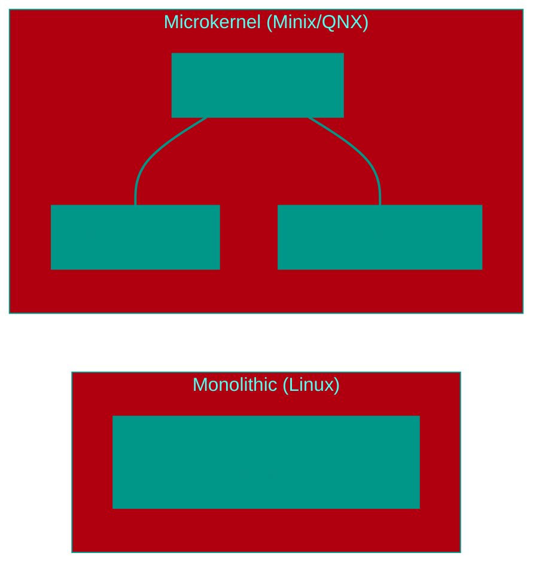
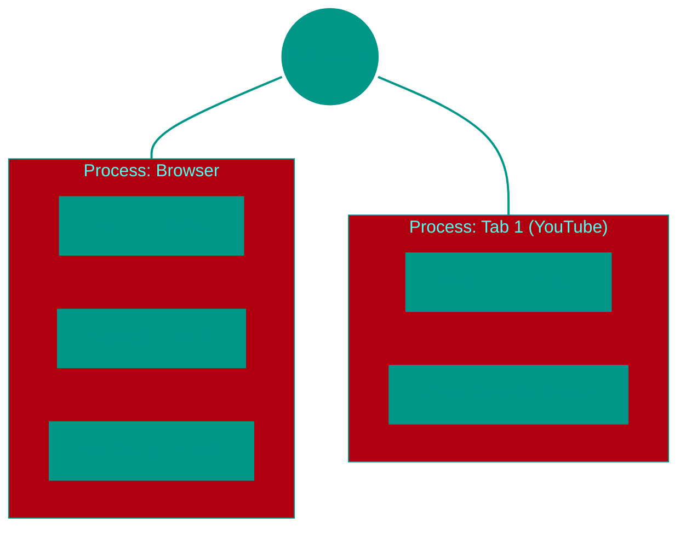
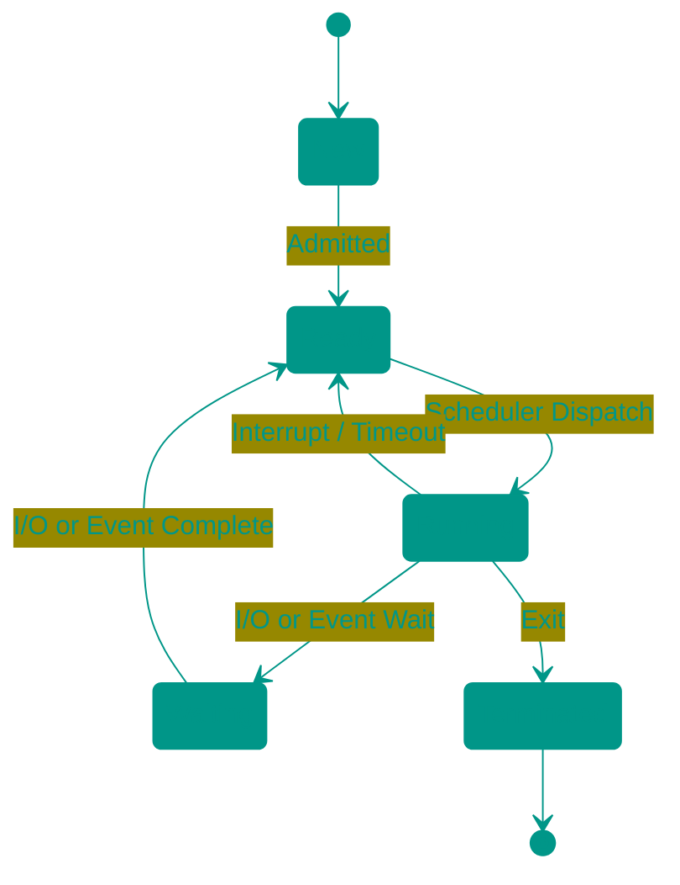
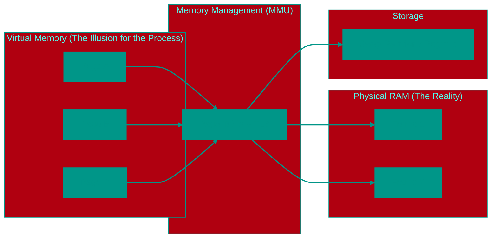

# 💻 Operating Systems (OS)

## 📑 Table of Contents
1. [Role and Functions of an OS](#role-and-functions-of-an-os)
2. [OS Kernel](#os-kernel)
3. [Processes and Threads](#processes-and-threads)
4. [Virtual Memory](#virtual-memory)
5. [File Systems](#file-systems)
6. [Key Takeaways](#key-takeaways)

---

An operating system is the primary manager of a computer. It ensures that programs can interact with hardware without interfering with one another.

---

## 1. 🛠️ Functions of an OS

- **Abstraction**: A programmer doesn't need to know the specifics of writing bytes to various SSD models; they simply call a high-level function like `file.Write()`.
- **Arbitration**: If two programs attempt to print a document simultaneously, the OS manages the queue.
- **Isolation**: If a single browser tab crashes, it should not bring down the entire system.

---

## 2. 🧠 Operating System Kernel

The kernel is the core code that remains in memory at all times and maintains complete control over the hardware.

### Types of Kernels:
- **Monolithic** (e.g., Linux): All drivers and core functions reside within a single, large binary. This is very fast, but a bug in one driver can potentially crash the entire kernel.
- **Microkernel** (e.g., L4, parts of macOS/Darwin): The kernel contains only the most essential services. Drivers run as isolated user programs. This is highly reliable but can be slower due to frequent context switching.

---

## 3. 🧵 Processes and Threads

### Process vs Thread

Think of a **Factory**:
- **Process** is the factory building itself. It has its own address, its own resources (electricity, water), and walls that isolate it from neighboring factories.
- **Thread** is a worker inside that factory. All workers are in the same building, sharing the same resources, but each is performing a specific task.

| Feature | Process 🏢 | Thread 🧵 |
|:---|:---|:---|
| **Isolation** | High (one crash doesn't affect others) | Low (an error in one thread can kill the entire process) |
| **Memory** | Dedicated, private space | Shared among all threads in the process |
| **Resources** | "Heavy" (expensive to create and switch) | "Light" (fast to create and switch) |

### Real-world Examples

#### 1. Modern Web Browser (Chrome)
Modern browsers use a **multi-process** architecture:
- **Main Process**: Manages the window shell and UI buttons.
- **Tab Processes**: Each open tab is a separate process. If the website in Tab #1 crashes, Tab #2 stays alive because the OS isolates them.
- **Inside a Tab (Threads)**: One thread handles rendering text, another downloads images, and another executes JavaScript. They share the tab's memory.

#### 2. Text Editor (VS Code / Microsoft Word)
- **Process**: The running application itself.
- **Thread 1 (UI)**: Ensures characters appear on the screen as you type.
- **Thread 2 (Autosave)**: Periodically saves your text to disk in the background.
- **Thread 3 (Spellcheck)**: Highlights errors in red without interrupting your typing.

### Process States:

---

## 4. 🏔️ Virtual Memory

A process "sees" an enormous amount of memory (e.g., 128 TB on a 64-bit system), even if the physical RAM is much smaller (e.g., 16 GB).

### Virtual Address Space

A process never interacts with the actual Physical RAM directly. Instead, it uses **Virtual Memory**—an abstract layer that provides each program with the image of its own clean, nearly infinite memory space.

- **Virtual Memory**: A memory "map" for a process. it isolates programs from one another.
- **Physical Memory**: The real RAM chips where data is physically stored.

#### Paging

For efficient management, memory is divided into blocks of equal size called **pages**. The standard page size is **4 KB**. This is considered the "sweet spot": smaller pages would make address tables impossibly large, while larger pages would lead to excessive wasted space.

1. **Page Table**: This is a registry of mappings. When a program accesses a virtual address, the OS uses this table to find exactly where the corresponding bytes are located in physical RAM.
2. **MMU (Memory Management Unit)**: A dedicated hardware component within the CPU that handles the real-time translation of virtual addresses to physical ones. It is the "engine" that powers virtual memory.
3. **TLB (Hardware Cache)**: To avoid searching the table for every request, the MMU caches recent routes in a special buffer known as the TLB (Translation Lookaside Buffer), making address translation near-instantaneous.
4. **Isolation**: Because addresses are "virtual" and translated under OS control via the MMU, a process physically cannot "jump" over its allocated boundaries to access another application's data.

#### Swap and Page Faults

When physical RAM becomes full, the operating system uses the disk as a temporary memory extension:

- **Swap**: The OS identifies memory pages that haven't been used for a while and temporarily moves them to slow storage (SSD/HDD), freeing up fast RAM for active tasks.
- **Page Fault**: If a program suddenly requires data that has been swapped to disk, an interrupt occurs. The OS pauses the program for a few milliseconds, fetches the required page back into RAM, and resumes execution.

---

## 5. 📁 File Systems

A file system is a method of organizing data on a storage device. Without it, a disk is just an unstructured collection of sectors.

- **NTFS** (Windows): Feature-rich and reliable, with built-in access controls.
- **ext4** (Linux): High-performance, widely used as the standard for servers.
- **APFS** (macOS): Optimized specifically for SSDs and fast snapshots.

> [!NOTE]
> **Journaling**: Before writing data, the file system records the operation in a journal. If power is lost during a write, the system can use the journal to restore data integrity.

---

## 🎯 Key Takeaways

- An **OS** is the intermediary layer between code and the physical world.
- The **Scheduler** decides which program gets CPU time at any given moment.
- **Virtual Memory** allows the execution of applications that are larger than the available physical RAM.
- The **Kernel** is the heart of the system, operating in a privileged mode (`Ring 0`).

<!-- QUIZ_START 
[
    {
        "question": "What is the main advantage of the Microkernel OS architecture over the Monolithic architecture?",
        "options": ["Higher execution speed", "Simplicity of development", "High reliability (driver errors do not crash the entire kernel)", "Smaller memory footprint"],
        "correctIndex": 2
    },
    {
        "question": "How does a thread differ from a process in modern operating systems?",
        "options": ["A thread is a separate program on the disk", "Threads within the same process share common memory", "Threads are as isolated from each other as processes are", "Processes are created faster than threads"],
        "correctIndex": 1
    },
    {
        "question": "Which hardware unit in the processor is responsible for the instantaneous translation of virtual addresses to physical ones?",
        "options": ["ALU", "CU", "MMU", "FPU"],
        "correctIndex": 2
    }
]
QUIZ_END -->
