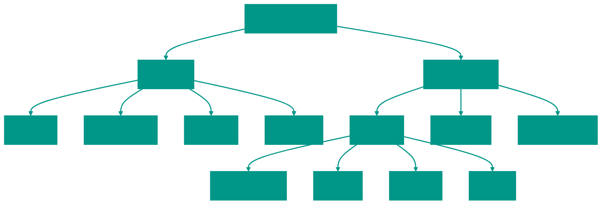

# 📂 Algorithms and Data Structures

This table of contents provides links to detailed materials for each topic.

## 📊 Overview

## 📑 Table of Contents

### 1. 🧱 Data Structures

- [🧵 Strings (String)](data_struct/00_string/String.md)
- [📋 Array](data_struct/01_array/Array.md)
- [🔗 Linked List](data_struct/02_linked_list/LinkedList.md)
- [🥞 Stack](data_struct/03_stack/Stack.md)
- [🚶‍♂️ Queue](data_struct/04_queue/Queue.md)
- [🔑 Hash Map](data_struct/05_hash_table/HashTable.md)
- [🏔️ Heap](data_struct/06_heap/Heap.md)
- [🌳 Binary Search Tree (BST)](data_struct/07_search_tree/bst/Bst.md)
- [🔴⚫ Red-Black Tree](data_struct/07_search_tree/red_black_tree/RedBlackTree.md)
- [🌲 Trie](data_struct/08_trie/Trie.md)
- [🕸️ Graph](data_struct/09_graph/Graph.md)
- [⚡ Caching (Cache)](data_struct/10_cache/Cache.md)
- [🔄 LRU Cache](data_struct/11_LRU/Lru.md)

### 2. ⚙️ Algorithms

#### 🔍 Search
- [🔎 Binary Search](algorithms/searching/binary_search/BinarySearch.md)
- [🔎 Ternary Search](algorithms/searching/ternary/Ternary.md)
- [🔎 Exponential Search](algorithms/searching/exponential_search/ExponentialSearch.md)

#### 📊 Sorting
- [🫧 Bubble Sort](algorithms/sort/bubble_sort/BubbleSort.md)
- [🃏 Insertion Sort](algorithms/sort/insertion_sort/InsertionSort.md)
- [📘 Selection Sort](algorithms/sort/selected_sort/SelectedSort.md)
- [⚡ Quick Sort](algorithms/sort/quick_sort/QuickSort.md)
- [🤝 Merge Sort](algorithms/sort/merge_sort/MergeSort.md)
- [📊 Counting Sort](algorithms/sort/counting_sort/CountingSort.md)

#### 🧠 Methods and Patterns
- [🔙 Backtracking](methods/backtracking/Backtracking.md)
- [💾 Dynamic Programming](methods/dynamic_programming/DynamicProgramming.md)
- [🤑 Greedy Algorithms](methods/greedy_algorithms/GreedyAlgorithms.md)
- [🌀 Recursion](methods/recurse/Recurse.md)
- [🪟 Sliding Window](methods/sliding_window/SlidingWindow.md)
- [👉👈 Two Pointers](methods/two_pointers/TwoPointers.md)

---
> [!NOTE]
> Each link leads to a separate file with detailed theory, Go implementation, and code examples.

<!-- QUIZ_START 
[
    {
        "question": "Which of the following is considered a non-linear data structure according to the overview?",
        "options": ["Array", "Stack", "Binary Search Tree", "Linked List"],
        "correctIndex": 2
    },
    {
        "question": "What is the average time complexity of basic search and sort algorithms (like Binary Search or Quick Sort)?",
        "options": ["O(1)", "O(n)", "O(log n) or O(n log n)", "O(n²)"],
        "correctIndex": 2
    },
    {
        "question": "Which sorting algorithm is described as 'ideal for big data' that doesn't fit into RAM?",
        "options": ["Bubble Sort", "Merge Sort", "Quick Sort", "Insertion Sort"],
        "correctIndex": 1
    }
]
QUIZ_END -->
