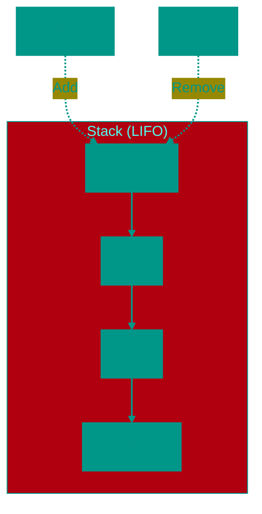

# 🥞 Stack

**Description**: 
A Stack is a disciplined data structure that follows the **LIFO** (Last In, First Out) principle. This means that access is only available to the top-most element, which was the last one added.

- **How it works internally**: A stack can be implemented using either an array or a linked list. In either case, the search and removal operations (**Push** and **Pop**) always occur at the "top" of the stack, ensuring **O(1)** speed.
- **Analogy**: The most classic example is a stack of plates. You place a new plate on top and take the top-most one as well. To reach the bottom plate, you must first remove all the plates resting above it.


### Core Operations
- **Push**: Place an element on the top.
- **Pop**: Remove and return the top-most element.
- **Peek/Top**: Look at the top-most element without removing it.


### Pros and Cons
✅ **Pros**:
1. **High Speed**: All core operations are performed in constant time, O(1).
2. **Simplicity**: Easy to implement and use; it's nearly impossible to make a logic error in access.
3. **Security**: The structure restricts data access, which is useful for certain algorithms (e.g., controlling function call nesting).

❌ **Cons**:
1. **Limited Access**: You cannot look at the middle or bottom of the stack without "destroying" it (removing elements above).
2. **Risk of Overflow (Stack Overflow)**: In some implementations (like the system call stack), size is limited, and excessive recursion depth can cause program failure.

---


### Visualization




### Complexity

| Operation | Time Complexity (O) | Space Complexity (O) |
|:---|:---:|:---:|
| Push | O(1) | O(1) |
| Pop | O(1) | O(1) |
| Peek | O(1) | O(1) |
| Check if empty | O(1) | O(1) |
| Storage | — | O(n) |

> [!TIP]
> All operations are O(1) as they only work with the top. Implemented using an array or a linked list.


### When to Use

✅ For tasks with reverse processing order (undo, expression parsing)  
✅ Simple and efficient structure


## 💻 Implementation
```go
package stack

// Stack implementation on Go...
func (s *Stack) Push(value interface{}) {
    // ...
}
```

```javascript
// Stack Implementation (JS)
class Stack {
  constructor() {
    this.items = [];
  }

  push(element) {
    this.items.push(element);
  }

  pop() {
    if (this.isEmpty()) return null;
    return this.items.pop();
  }

  peek() {
    if (this.isEmpty()) return null;
    return this.items[this.items.length - 1];
  }

  isEmpty() {
    return this.items.length === 0;
  }

  size() {
    return this.items.length;
  }
}
```


## 🚀 Practical Problems
```go
package stack

// Problems on Go...
func IsValidParentheses(s string) bool {
    // ...
}
```

```javascript
// Algorithmic Problems (JS)

// 1. Valid Parentheses
function isValidParentheses(s) {
  const stack = [];
  const map = { ')': '(', '}': '{', ']': '[' };
  for (const char of s) {
    if (char in map) {
      if (stack.pop() !== map[char]) return false;
    } else {
      stack.push(char);
    }
  }
  return stack.length === 0;
}

// 2. Reverse Polish Notation (RPN)
function evalRPN(tokens) {
  const stack = [];
  for (const token of tokens) {
    if (!isNaN(token)) {
      stack.push(Number(token));
    } else {
      const b = stack.pop(), a = stack.pop();
      if (token === '+') stack.push(a + b);
      else if (token === '-') stack.push(a - b);
      else if (token === '*') stack.push(a * b);
      else if (token === '/') stack.push(Math.trunc(a / b));
    }
  }
  return stack.pop();
}

// 3. Daily Temperatures (Monotonic Stack)
function dailyTemperatures(temps) {
  const stack = [], res = new Array(temps.length).fill(0);
  for (let i = 0; i < temps.length; i++) {
    while (stack.length && temps[i] > temps[stack[stack.length - 1]]) {
      const idx = stack.pop();
      res[idx] = i - idx;
    }
    stack.push(i);
  }
  return res;
}
```

<!-- QUIZ_START 
[
    {
        "question": "Which principle describes the operation of a Stack?",
        "options": ["FIFO (First In, First Out)", "LIFO (Last In, First Out)", "Random Access", "Priority Queue"],
        "correctIndex": 1
    },
    {
        "question": "Which operation allows you to look at the top element without removing it?",
        "options": ["Push", "Pop", "Peek (or Top)", "Clear"],
        "correctIndex": 2
    },
    {
        "question": "What is the time complexity of the Push and Pop operations in a well-implemented Stack?",
        "options": ["O(1)", "O(log n)", "O(n)", "O(n log n)"],
        "correctIndex": 0
    }
]
QUIZ_END -->

```

