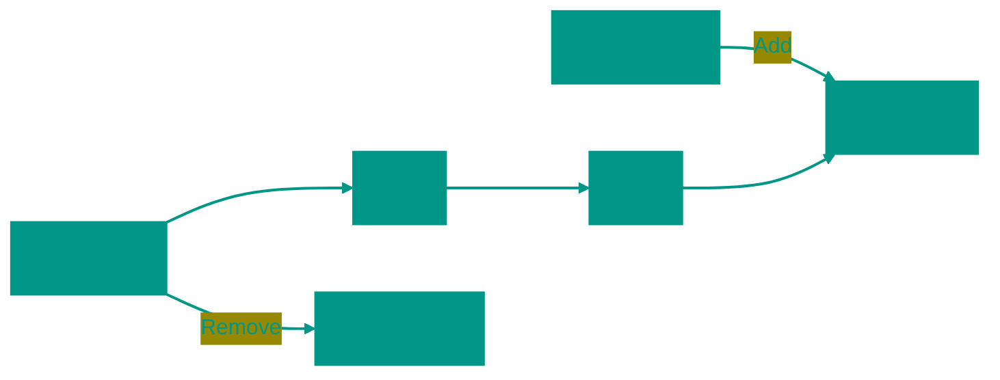

# 🚶‍♂️ Queue

**Description**: 
A Queue is a fundamental data structure operating on the "first in, first out" principle (**FIFO**). It ensures a strict order of data processing, where each new element joins the "tail" and processing begins from the "head".

- **How it works internally**: 
  - *Array-based implementation*: May require shifting elements with every deletion (O(n)) unless a smart pointer approach is used.
  - *Circular Queue (Ring Buffer)*: Avoids shifts by "looping" the array.
  - *Linked List*: A highly efficient implementation for all operations at **O(1)**.
- **Analogy**: A typical line at a grocery store. The person who arrived first is served first and leaves. New customers join at the back of the line.


### Core Operations
- **Enqueue (Push)**: Add an element to the end of the queue.
- **Dequeue (Pop)**: Remove the first element from the front.
- **Front/Peek**: Look at the first element without removing it.


### Pros and Cons
✅ **Pros**:
1. **Fairness**: Guarantees that data is processed in the same order it arrived.
2. **Decoupling**: Ideal for passing data between components operating at different speeds (e.g., a printer and a computer).
3. **Speed**: When implemented correctly, insertion and removal take O(1).

❌ **Cons**:
1. **No Direct Access**: It is impossible to look into the middle of the queue.
2. **Array Implementation Complexity**: A simple array is inefficient for a queue due to the need for shifting elements; more complex circular buffer logic is required.

---


### Visualization




### Complexity

| Operation | Time Complexity (O) | Space Complexity (O) |
|:---|:---:|:---:|
| Enqueue | O(1) | O(1) |
| Dequeue | O(1) | O(1) |
| Peek | O(1) | O(1) |
| Check if empty | O(1) | O(1) |
| Storage | — | O(n) |


### When to Use

✅ For tasks with processing order (job processing, BFS)  
✅ Circular buffer is efficient for fixed size


## 💻 Implementation
```go
package queue

// Queue implementation on Go...
func (q *LinkedListQueue) Enqueue(value interface{}) {
    // ...
}
```

```javascript
// Queue Implementation (JS - Using Array)
class Queue {
  constructor() {
    this.items = [];
    this.head = 0;
  }

  enqueue(element) {
    this.items.push(element);
  }

  dequeue() {
    if (this.isEmpty()) return null;
    const item = this.items[this.head];
    this.head++;
    
    // Optional: Reset head if queue becomes very empty
    if (this.head > 1000) {
      this.items = this.items.slice(this.head);
      this.head = 0;
    }
    return item;
  }

  peek() {
    return this.items[this.head];
  }

  isEmpty() {
    return this.items.length - this.head === 0;
  }

  get size() {
    return this.items.length - this.head;
  }
}
```


## 🚀 Practical Problems
```go
package queue

// Problems on Go...
func BFS(graph map[int][]int, start int) []int {
    // ...
}
```

```javascript
// Algorithmic Problems (JS)

// 1. BFS (Breadth-First Search)
function bfs(graph, start) {
  const visited = new Set([start]);
  const queue = [start];
  const result = [];

  while (queue.length) {
    const node = queue.shift();
    result.push(node);
    for (const neighbor of graph[node] || []) {
      if (!visited.has(neighbor)) {
        visited.add(neighbor);
        queue.push(neighbor);
      }
    }
  }
  return result;
}

// 2. Recent Counter (Fixed length sliding window)
class RecentCounter {
  constructor() {
    this.q = [];
  }
  ping(t) {
    this.q.push(t);
    while (this.q[0] < t - 3000) this.q.shift();
    return this.q.length;
  }
}

// 3. Number of Islands (BFS approach)
function numIslands(grid) {
  if (!grid.length) return 0;
  let count = 0;
  const rows = grid.length, cols = grid[0].length;
  
  for (let r = 0; r < rows; r++) {
    for (let c = 0; c < cols; c++) {
      if (grid[r][c] === '1') {
        count++;
        const q = [[r, c]];
        grid[r][c] = '0'; // Mark as visited
        while (q.length) {
          const [currR, currC] = q.shift();
          [[0,1],[1,0],[0,-1],[-1,0]].forEach(([dr, dc]) => {
            const nr = currR + dr, nc = currC + dc;
            if (nr >= 0 && nr < rows && nc >= 0 && nc < cols && grid[nr][nc] === '1') {
              grid[nr][nc] = '0';
              q.push([nr, nc]);
            }
          });
        }
      }
    }
  }
  return count;
}
```

<!-- QUIZ_START 
[
    {
        "question": "Which principle describes the operation of a Queue?",
        "options": ["LIFO (Last In, First Out)", "FIFO (First In, First Out)", "FILO (First In, Last Out)", "Random Access"],
        "correctIndex": 1
    },
    {
        "question": "What is the purpose of a 'Circular Queue' (Ring Buffer)?",
        "options": ["To encrypt the data in a circle", "To avoid the need for shifting elements when dequeuing in an array-based implementation", "To allow multiple people to read at once", "To sort elements automatically"],
        "correctIndex": 1
    },
    {
        "question": "In the bank queue simulation example, which data structure is most appropriate to maintain the order of arrival?",
        "options": ["Stack", "Binary Search Tree", "Queue", "Hash Table"],
        "correctIndex": 2
    }
]
QUIZ_END -->

```

