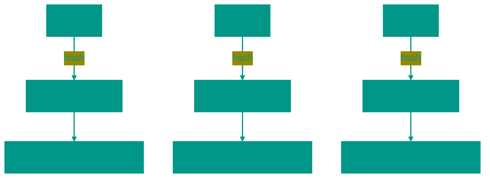

# 🔑 Hash Map

**Description**: 
A Hash Table (or Hash Map) is an extremely powerful data structure that implements an associative array (key-value pairs). It allows you to find data almost instantaneously, regardless of whether there are a million entries or a billion.

- **How it works internally**: The magic relies on a **hash function**. It takes a key (e.g., a person's name) and transforms it into a number — an index in an underlying array (bucket).
  - *Collisions*: Occasionally, two different keys produce the same hash. Good hash tables resolve this through "chaining" (linked lists within a bucket) or "open addressing" (searching for the next available slot).
- **Analogy**: Imagine a vast library where books are organized not alphabetically, but by a special code. You say the book's title, and the librarian instantly calculates the shelf number and goes straight to it, without browsing any other books.


### Pros and Cons
✅ **Pros**:
1. **Incredible Speed**: Search, insertion, and deletion take **O(1)** on average.
2. **Versatility**: Keys can be strings, numbers, or even complex objects.
3. **Search Efficiency**: Ideal for tasks requiring frequent element checks or value retrieval by ID.

❌ **Cons**:
1. **Bad for Ordered Data**: In a hash table, elements are stored "chaotically." If you need output in alphabetical order, you'll have to sort the data separately.
2. **Memory Overhead**: To minimize collisions, the table needs plenty of empty space (typically maintained at ~70% load).
3. **Hash Function Dependency**: If the hash function is poor, all data might end up in a single bucket, causing speed to drop to O(n).

---


### Visualization




### Complexity

| Operation | Time Complexity (O) | Space Complexity (O) |
|:---|:---:|:---:|
| Insertion | O(1) average, O(n) worst | O(1) |
| Search | O(1) average, O(n) worst | O(1) |
| Deletion | O(1) average, O(n) worst | O(1) |
| Key Check | O(1) average, O(n) worst | O(1) |
| Storage | — | O(n) |

> [!IMPORTANT]
> **O(1) average**: A good hash function minimizes collisions. **O(n) worst**: When many collisions occur (e.g., all keys end up in the same bucket).


### When to Use

✅ Fast access by key  
✅ Suitable for dictionaries, caches, frequency counting  
❌ Avoid poor hash functions


## 💻 Implementation

```go
package hash_table

import (
	"fmt"
)

// Entry represents a key-value pair in a bucket
type Entry struct {
	Key   string
	Value interface{}
	Next  *Entry // For separate chaining
}

// HashTable implements a hash map with separate chaining
type HashTable struct {
	size    int
	buckets []*Entry
}

// New creates a new hash table with a specific size
func New(size int) *HashTable {
	return &HashTable{
		size:    size,
		buckets: make([]*Entry, size),
	}
}

// hash is the internal hash function
func (ht *HashTable) hash(key string) int {
	h := 0
	for _, char := range key {
		h = (31*h + int(char)) % ht.size
	}
	return h
}

// Set adds or updates a key-value pair
func (ht *HashTable) Set(key string, value interface{}) {
	index := ht.hash(key)
	
	if ht.buckets[index] == nil {
		ht.buckets[index] = &Entry{Key: key, Value: value}
		return
	}

	current := ht.buckets[index]
	for {
		if current.Key == key {
			current.Value = value // Update
			return
		}
		if current.Next == nil {
			break
		}
		current = current.Next
	}
	// Append to chain
	current.Next = &Entry{Key: key, Value: value}
}

// Get retrieves a value by key
func (ht *HashTable) Get(key string) (interface{}, bool) {
	index := ht.hash(key)
	current := ht.buckets[index]

	for current != nil {
		if current.Key == key {
			return current.Value, true
		}
		current = current.Next
	}
	return nil, false
}

// Delete removes a key and its value
func (ht *HashTable) Delete(key string) {
	index := ht.hash(key)
	current := ht.buckets[index]

	if current == nil {
		return
	}

	if current.Key == key {
		ht.buckets[index] = current.Next
		return
	}

	for current.Next != nil {
		if current.Next.Key == key {
			current.Next = current.Next.Next
			return
		}
		current = current.Next
	}
}

func main() {
	ht := New(10)
	ht.Set("user1", "Boris")
	ht.Set("user2", "Ilyas")

	if val, ok := ht.Get("user1"); ok {
		fmt.Printf("Found: %v\n", val)
	}
}
```

```javascript
/**
 * HashTable - implementation using collision resolution (chaining).
 */
class HashTable {
  constructor(size = 53) {
    this.buckets = new Array(size);
  }

  /**
   * Simple hash function for strings
   */
  _hash(key) {
    let hash = 0;
    const WEIRD_PRIME = 31;
    for (let i = 0; i < Math.min(key.length, 100); i++) {
      let char = key[i];
      let value = char.charCodeAt(0) - 96;
      hash = (hash * WEIRD_PRIME + value) % this.buckets.length;
    }
    return Math.abs(hash);
  }

  /**
   * Set a key-value pair
   */
  set(key, value) {
    let index = this._hash(key);
    if (!this.buckets[index]) {
      this.buckets[index] = [];
    }
    
    // Check if key already exists
    for (let i = 0; i < this.buckets[index].length; i++) {
        if (this.buckets[index][i][0] === key) {
            this.buckets[index][i][1] = value;
            return;
        }
    }
    
    this.buckets[index].push([key, value]);
  }

  /**
   * Get a value by key
   */
  get(key) {
    let index = this._hash(key);
    if (this.buckets[index]) {
      for (let i = 0; i < this.buckets[index].length; i++) {
        if (this.buckets[index][i][0] === key) {
          return this.buckets[index][i][1];
        }
      }
    }
    return undefined;
  }

  /**
   * Delete a key-value pair
   */
  delete(key) {
    let index = this._hash(key);
    if (this.buckets[index]) {
      this.buckets[index] = this.buckets[index].filter(kv => kv[0] !== key);
    }
  }

  /**
   * Get all keys
   */
  keys() {
    let keysArr = [];
    for (let i = 0; i < this.buckets.length; i++) {
      if (this.buckets[i]) {
        for (let j = 0; j < this.buckets[i].length; j++) {
          keysArr.push(this.buckets[i][j][0]);
        }
      }
    }
    return keysArr;
  }
}

// Usage example
const ht = new HashTable();
ht.set("hello", "world");
ht.set("ping", "pong");
console.log(ht.get("hello")); // "world"
```


## 🚀 Practical Problems
```go
package hash_table

import "fmt"

// Examples on Go...
func Example() {
    // ...
}
```

```javascript
// Algorithmic Problems (JS)

// 1. Extra Letter
function extraLetter(a, b) {
  const counts = {};
  for (const c of b) counts[c] = (counts[c] || 0) + 1;
  for (const c of a) counts[c]--;
  for (const c in counts) if (counts[c] > 0) return c;
}

// 2. Two Sum
function twoSum(nums, target) {
  const map = new Map();
  for (let i = 0; i < nums.length; i++) {
    const diff = target - nums[i];
    if (map.has(diff)) return [map.get(diff), i];
    map.set(nums[i], i);
  }
}

// 3. Group Anagrams
function groupAnagrams(strs) {
  const map = {};
  for (const s of strs) {
    const key = [...s].sort().join('');
    if (!map[key]) map[key] = [];
    map[key].push(s);
  }
  return Object.values(map);
}

// 4. Contains Duplicate
function containsDuplicate(nums) {
  return new Set(nums).size !== nums.length;
}
```

// Problem 6: Intersection of Two Arrays
// Find elements that are present in both arrays
//
// Example: [1, 2, 2, 1], [2, 2] => [2]
// Time complexity: O(n + m), space complexity: O(min(n, m))
func Intersection(nums1, nums2 []int) []int {
	set1 := make(map[int]bool)
	for _, num := range nums1 {
		set1[num] = true
	}

	set2 := make(map[int]bool)
	for _, num := range nums2 {
		if set1[num] {
			set2[num] = true
		}
	}

	result := make([]int, 0, len(set2))
	for num := range set2 {
		result = append(result, num)
	}

	return result
}

// Problem 7: First Non-Repeating Character
// Find the first character that appears only once in a string
//
// Example: "leetcode" => 'l', "loveleetcode" => 'v'
// Time complexity: O(n), space complexity: O(k), where k is the number of unique characters
func FirstUniqueChar(s string) int {
	charCount := make(map[rune]int)

	// Count the frequency of each character
	for _, char := range s {
		charCount[char]++
	}

	// Find the first character with a frequency of 1
	for i, char := range s {
		if charCount[char] == 1 {
			return i
		}
	}

	return -1 // No unique character
}

// Problem 8: Palindrome Permutation check
// Check if string characters can be rearranged to form a palindrome
//
// Example: "aab" => true ("aba"), "carerac" => true ("racecar")
// Time complexity: O(n), space complexity: O(k), where k is the number of unique characters
func CanPermutePalindrome(s string) bool {
	charCount := make(map[rune]int)

	// Count the frequency of each character
	for _, char := range s {
		charCount[char]++
	}

	// Count the number of characters with an odd frequency
	oddCount := 0
	for _, count := range charCount {
		if count%2 == 1 {
			oddCount++
		}
	}

	// A palindrome is possible if no more than one character has an odd frequency
	return oddCount <= 1
}

// Problem 9: Contains Duplicate II
// Given an integer array nums and an integer k. Return true if there are two distinct indices i and j in the array such that nums[i] == nums[j] and abs(i - j) <= k.
func ContainsNearbyDuplicate(nums []int, k int) bool {
	indexMap := make(map[int]int)

	for i, num := range nums {
		if prevIndex, exists := indexMap[num]; exists {
			if i-prevIndex <= k {
				return true
			}
		}
		// Update the last seen index for this number
		indexMap[num] = i
	}

	return false
}

// Problem 10: Valid Sudoku
// Determine if a 9x9 Sudoku board is valid. Only filled cells need to be validated.
func IsValidSudoku(board [][]byte) bool {
	rows := make([]map[byte]bool, 9)
	cols := make([]map[byte]bool, 9)
	boxes := make([]map[byte]bool, 9)

	// Initialize maps
	for i := 0; i < 9; i++ {
		rows[i] = make(map[byte]bool)
		cols[i] = make(map[byte]bool)
		boxes[i] = make(map[byte]bool)
	}

	for i := 0; i < 9; i++ {
		for j := 0; j < 9; j++ {
			cell := board[i][j]
			if cell == '.' {
				continue
			}

			// Row check
			if rows[i][cell] {
				return false
			}
			rows[i][cell] = true

			// Column check
			if cols[j][cell] {
				return false
			}
			cols[j][cell] = true

			// 3x3 square check
			boxIndex := (i/3)*3 + j/3
			if boxes[boxIndex][cell] {
				return false
			}
			boxes[boxIndex][cell] = true
		}
	}

	return true
}

// Problem 11: Group Shifted Strings
// We can shift a string right to get a new string.
// For example, "abc" -> "bcd". A string is grouped with others that can be shifted to form each other.
func GroupShiftedStrings(strings []string) [][]string {
	groups := make(map[string][]string)

	for _, s := range strings {
		// Create a key based on relative shifts from the first character
		key := ""
		if len(s) > 0 {
			base := rune(s[0])

			for _, c := range s {
				// Calculate the relative shift, handling the 26-character cycle
				shift := (c - base + 26) % 26
				key += string(shift) + ","
			}
		}

		groups[key] = append(groups[key], s)
	}

	result := make([][]string, 0, len(groups))
	for _, group := range groups {
		result = append(result, group)
	}

	return result
}

```

