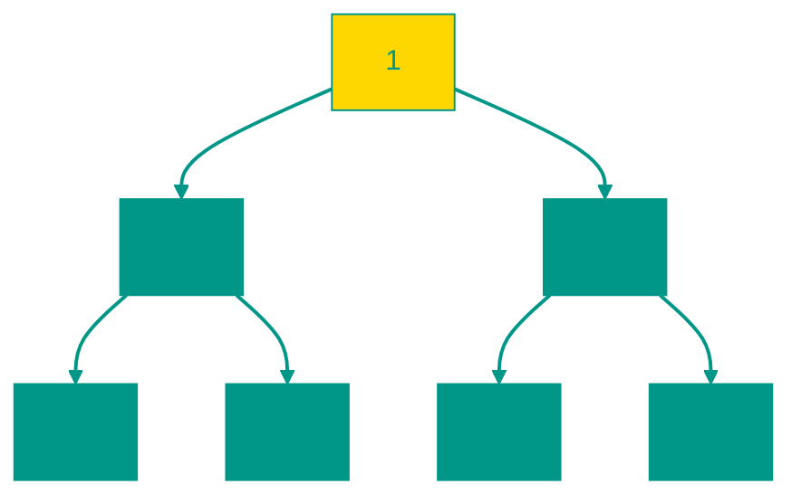

# 🏔️ Heap

**Description**: 
A Heap is a specialized binary tree that maintains a perfect order for rapid access to the "extreme" element (the smallest or the largest). Unlike a standard search tree, a heap always aims to be "dense" and fully packed.

- **How it works internally**: A heap is typically stored as a plain array, which saves memory. Child indices are calculated using simple formulas (2i+1 and 2i+2). The cardinal rule is: the parent is always "more important" (greater or smaller) than its children. During insertion, a new element "bubbles up" to its correct position, and during removal, it "sifts down." This ensures a speed of **O(log n)**.
- **Analogy**: Imagine an emergency room triage (Priority Queue). At the top of the heap is always the most critical patient who needs immediate help. Once they are attended to, the heap rearranges itself so that the next most urgent case is at the top.


### Types of Heaps
- **Max-Heap**: The root is always the maximum element.
- **Min-Heap**: The root is always the minimum element.


### Pros and Cons
✅ **Pros**:
1. **Instant Peak Access**: You can view the maximum/minimum element in **O(1)**.
2. **Efficient Sorting**: HeapSort is based on this structure and consistently provides O(n log n) performance.
3. **Memory Efficiency**: There is no need to store pointers to children (unlike standard trees); everything is calculated via array indices.

❌ **Cons**:
1. **Slow Search**: You only know who the "top" element is; finding a specific number in the middle of a heap requires a full scan (O(n)).
2. **Single Criterion**: A heap is only effective for working with extremes (min/max).

---


### Min-Heap Visualization




### Complexity

| Operation | Time Complexity (O) | Space Complexity (O) |
|:---|:---:|:---:|
| Insertion | O(log n) | O(1) |
| Extraction | O(log n) | O(1) |
| Peak Viewing | O(1) | O(1) |
| Heap Building | O(n) | O(1) |
| Storage | — | O(n) |


### When to Use

✅ Priority queues  
✅ Algorithms like Dijkstra's or heap sort


## 💻 Implementation
```go
package heap

// IntHeap implementation on Go...
func (h *IntHeap) Push(x interface{}) {
    // ...
}
```

```javascript
// Min-Heap Implementation (JS)
class MinHeap {
  constructor() {
    this.heap = [];
  }

  push(val) {
    this.heap.push(val);
    this.bubbleUp();
  }

  pop() {
    if (this.size() === 0) return null;
    const min = this.heap[0];
    const last = this.heap.pop();
    if (this.size() > 0) {
      this.heap[0] = last;
      this.bubbleDown();
    }
    return min;
  }

  bubbleUp() {
    let idx = this.heap.length - 1;
    while (idx > 0) {
      let parentIdx = Math.floor((idx - 1) / 2);
      if (this.heap[idx] >= this.heap[parentIdx]) break;
      [this.heap[idx], this.heap[parentIdx]] = [this.heap[parentIdx], this.heap[idx]];
      idx = parentIdx;
    }
  }

  bubbleDown() {
    let idx = 0;
    while (true) {
      let left = idx * 2 + 1, right = idx * 2 + 2, small = idx;
      if (left < this.heap.length && this.heap[left] < this.heap[small]) small = left;
      if (right < this.heap.length && this.heap[right] < this.heap[small]) small = right;
      if (small === idx) break;
      [this.heap[idx], this.heap[small]] = [this.heap[small], this.heap[idx]];
      idx = small;
    }
  }

  size() { return this.heap.length; }
}
```


## 🚀 Practical Problems
```go
package heap

// Problems on Go...
func FindKthLargest(nums []int, k int) int {
    // ...
}
```

```javascript
// Algorithmic Problems (JS)

// 1. K-th Largest Element
function findKthLargest(nums, k) {
  const heap = new MinHeap(); // Using the class above
  for (const n of nums) {
    heap.push(n);
    if (heap.size() > k) heap.pop();
  }
  return heap.heap[0];
}
```

<!-- QUIZ_START 
[
    {
        "question": "What is the primary use case for a Heap data structure?",
        "options": ["Searching for random elements in O(1)", "Efficiently accessing the 'extreme' element (min or max) in a collection", "Storing data in alphabetical order", "Implementing a simple array"],
        "correctIndex": 1
    },
    {
        "question": "How is a Heap typically stored to be memory-efficient?",
        "options": ["As a doubly linked list", "As a balanced binary tree with pointers", "As a plain array where child positions are calculated by index", "As a hash table"],
        "correctIndex": 2
    },
    {
        "question": "What is the time complexity of extracting the root element from a Heap of size 'n'?",
        "options": ["O(1)", "O(log n)", "O(n)", "O(n log n)"],
        "correctIndex": 1
    }
]
QUIZ_END -->

```

