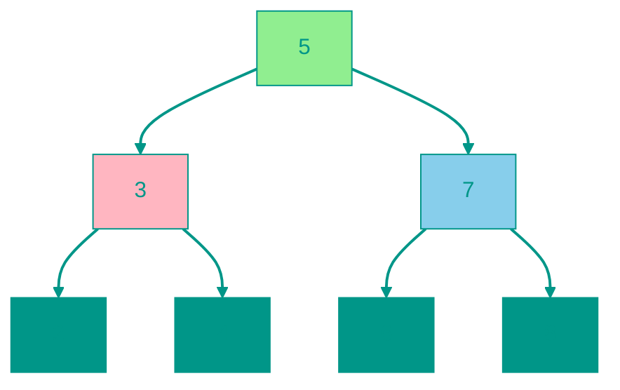

# 🔍 Binary Search Tree (BST)

**Description**: 
A Binary Search Tree (BST) is a hierarchical data structure that combines the flexibility of a linked list with the speed of binary search. It is built on a simple rule: for every node, everything to the left is smaller, and everything to the right is larger.

- **How it works internally**: Each node has up to two children. Thanks to the "smaller left, larger right" rule, searching for an element becomes a series of decisions: "which way to turn?". This allows cutting off half of the tree at each step, resulting in **O(log n)** average search speed.
- **Analogy**: Imagine a guessing game: "I'm thinking of a number between 1 and 100." You say 50, and I say "higher." Now you don't need to check numbers 1 through 50. A search tree is essentially a "frozen" version of this process.


### Pros and Cons
✅ **Pros**:
1. **Fast Dynamic Search**: Faster than a list for searching and more flexible than an array for insertion.
2. **Always Sorted**: Traversing the tree in a specific way (In-order) yields elements in strict ascending order.
3. **Range Efficiency**: Easily find all elements within a range (e.g., between 10 and 50).

❌ **Cons**:
1. **Risk of Unbalancing**: If data is inserted in order (1, 2, 3, 4...), the tree turns into a long "stick" (a list), and speed drops to O(n). Balanced trees (like AVL or Red-Black trees) are used to solve this.
2. **Deletion Complexity**: Removing a node from the middle is a non-trivial task that requires restructuring part of the tree.

---


### Visualization




### Complexity

| Operation | Time Complexity (O) | Space Complexity (O) |
|:---|:---:|:---:|
| Insertion | O(h) average O(log n), worst O(n) | O(h) |
| Search | O(h) average O(log n), worst O(n) | O(h) |
| Deletion | O(h) average O(log n), worst O(n) | O(h) |
| Traversal | O(n) | O(h) |
| Storage | — | O(n) |

> [!WARNING]
> **h** — height. In balanced cases O(log n), in degenerate cases (linear list) — O(n).


## 💻 Implementation

```go
package bst

import (
	"fmt"
)

// Node represents a single node in the BST
type Node struct {
	Value int
	Left  *Node
	Right *Node
}

// BST represents the binary search tree
type BST struct {
	Root *Node
}

// NewBST creates an empty BST
func NewBST() *BST {
	return &BST{}
}

// Insert adds a value to the tree
func (bst *BST) Insert(value int) {
	if bst.Root == nil {
		bst.Root = &Node{Value: value}
		return
	}
	bst.insertNode(bst.Root, value)
}

func (bst *BST) insertNode(node *Node, value int) {
	if value < node.Value {
		if node.Left == nil {
			node.Left = &Node{Value: value}
		} else {
			bst.insertNode(node.Left, value)
		}
	} else {
		if node.Right == nil {
			node.Right = &Node{Value: value}
		} else {
			bst.insertNode(node.Right, value)
		}
	}
}

// Search checks if a value exists in the tree
func (bst *BST) Search(value int) bool {
	return bst.searchNode(bst.Root, value)
}

func (bst *BST) searchNode(node *Node, value int) bool {
	if node == nil {
		return false
	}
	if value == node.Value {
		return true
	}
	if value < node.Value {
		return bst.searchNode(node.Left, value)
	}
	return bst.searchNode(node.Right, value)
}

// Delete removes a value from the tree
func (bst *BST) Delete(value int) {
	bst.Root = bst.deleteNode(bst.Root, value)
}

func (bst *BST) deleteNode(node *Node, value int) *Node {
	if node == nil {
		return nil
	}

	if value < node.Value {
		node.Left = bst.deleteNode(node.Left, value)
	} else if value > node.Value {
		node.Right = bst.deleteNode(node.Right, value)
	} else {
		// Case 1: No child or 1 child
		if node.Left == nil {
			return node.Right
		} else if node.Right == nil {
			return node.Left
		}

		// Case 2: Two children - find inorder successor
		minNode := bst.minValue(node.Right)
		node.Value = minNode.Value
		node.Right = bst.deleteNode(node.Right, minNode.Value)
	}
	return node
}

func (bst *BST) minValue(node *Node) *Node {
	current := node
	for current.Left != nil {
		current = current.Left
	}
	return current
}

// Traversals
func (bst *BST) InOrderTraversal() []int {
	var result []int
	bst.inOrder(bst.Root, &result)
	return result
}

func (bst *BST) inOrder(node *Node, result *[]int) {
	if node != nil {
		bst.inOrder(node.Left, result)
		*result = append(*result, node.Value)
		bst.inOrder(node.Right, result)
	}
}

func (bst *BST) BFS() []int {
	var result []int
	if bst.Root == nil {
		return result
	}

	queue := []*Node{bst.Root}
	for len(queue) > 0 {
		node := queue[0]
		queue = queue[1:]
		result = append(result, node.Value)

		if node.Left != nil {
			queue = append(queue, node.Left)
		}
		if node.Right != nil {
			queue = append(queue, node.Right)
		}
	}
	return result
}
```

```javascript
/**
 * BST Node implementation.
 */
class Node {
  constructor(value) {
    this.value = value;
    this.left = null;
    this.right = null;
  }
}

/**
 * Binary Search Tree implementation with core operations.
 */
class BST {
  constructor() {
    this.root = null;
  }

  insert(value) {
    const newNode = new Node(value);
    if (!this.root) {
      this.root = newNode;
      return;
    }
    this._insertNode(this.root, newNode);
  }

  _insertNode(node, newNode) {
    if (newNode.value < node.value) {
      if (!node.left) node.left = newNode;
      else this._insertNode(node.left, newNode);
    } else {
      if (!node.right) node.right = newNode;
      else this._insertNode(node.right, newNode);
    }
  }

  search(value) {
    return this._searchNode(this.root, value);
  }

  _searchNode(node, value) {
    if (!node) return false;
    if (value === node.value) return true;
    return value < node.value 
      ? this._searchNode(node.left, value) 
      : this._searchNode(node.right, value);
  }

  delete(value) {
    this.root = this._deleteNode(this.root, value);
  }

  _deleteNode(node, value) {
    if (!node) return null;

    if (value < node.value) {
      node.left = this._deleteNode(node.left, value);
    } else if (value > node.value) {
      node.right = this._deleteNode(node.right, value);
    } else {
      // Case 1: No child or 1 child
      if (!node.left) return node.right;
      if (!node.right) return node.left;

      // Case 2: Two children
      const minNode = this._findMin(node.right);
      node.value = minNode.value;
      node.right = this._deleteNode(node.right, minNode.value);
    }
    return node;
  }

  _findMin(node) {
    while (node.left) node = node.left;
    return node;
  }

  inOrder() {
    const result = [];
    this._inOrder(this.root, result);
    return result;
  }

  _inOrder(node, result) {
    if (node) {
      this._inOrder(node.left, result);
      result.push(node.value);
      this._inOrder(node.right, result);
    }
  }

  bfs() {
    const result = [];
    const queue = [];
    if (this.root) queue.push(this.root);

    while (queue.length > 0) {
      const node = queue.shift();
      result.push(node.value);
      if (node.left) queue.push(node.left);
      if (node.right) queue.push(node.right);
    }
    return result;
  }
}
```


## 🚀 Practical Problems
```go
package bst

import "fmt"

// Example demonstrates the use of a binary search tree (BST)
func Example() {
	bst := NewBST()

	// Insert values
	values := []int{5, 3, 8, 2, 4, 7, 9}
	for _, v := range values {
		bst.Insert(v)
	}

	fmt.Println("In-order traversal (sorted):", bst.InOrderTraversal())
	fmt.Println("BFS traversal (level-order):", bst.BFS())
	fmt.Println("Tree height:", bst.Height())
	fmt.Println("Is valid BST:", bst.IsValidBST())

	// Search
	fmt.Println("Search for 4:", bst.Search(4))
	fmt.Println("Search for 10:", bst.Search(10))

	// Delete
	bst.Delete(3)
	fmt.Printf("After deleting 3 (In-order): %v\n", bst.InOrderTraversal())

	// Range sum
	fmt.Printf("Sum in range [4, 9]: %d\n", bst.RangeSum(4, 9))

	// K-th smallest element
	k := 2
	fmt.Printf("%d-th smallest element: %d\n", k, bst.KthSmallest(k))
}

<!-- QUIZ_START 
[
    {
        "question": "What is the defining rule for a Binary Search Tree (BST)?",
        "options": ["Every node must have exactly two children", "For every node, the left child is smaller and the right child is larger", "All elements must be inserted in sorted order", "The tree must always be balanced"],
        "correctIndex": 1
    },
    {
        "question": "What happens to the search speed in a BST if it becomes 'degenerated' (unbalanced)?",
        "options": ["It stays O(log n)", "It speeds up to O(1)", "It drops to O(n), similar to a linked list", "Searching becomes impossible"],
        "correctIndex": 2
    },
    {
        "question": "Which traversal method yields the elements of a BST in ascending sorted order?",
        "options": ["Pre-order", "In-order", "Post-order", "Breadth-First Search (Level-order)"],
        "correctIndex": 1
    }
]
QUIZ_END -->

```

