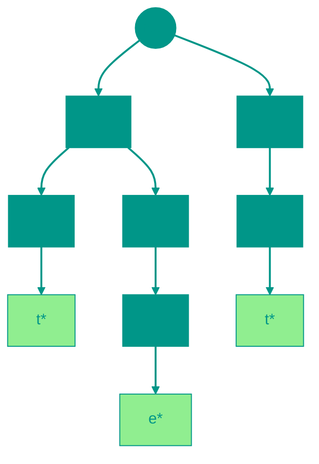

# 🌲 Trie

**Description**: 
A Trie (pronounced "try") is a specialized tree-like data structure designed for the most efficient storage and retrieval of strings. Its key feature is that words sharing the same prefix also share the same nodes in the tree.

- **How it works internally**: Each node represents a single character. The path from the root to a specific node forms a prefix or a complete word. A special marker (`isEnd`) is placed at the end of each valid word. The main advantage: search time is independent of how many millions of words are in the tree; it depends only on the **length of the word itself (O(m))**.
- **Analogy**: Imagine T9 on old phones or autocompletion in a search engine. When you type "prog," the tree already knows all possible continuations: "program," "progress," "prognosis." It doesn't scan the entire dictionary; it simply follows the existing branches.


### Pros and Cons
✅ **Pros**:
1. **Instant Prefix Search**: The best structure for tasks like "find all words starting with 'A'."
2. **Memory Savings via Shared Prefixes**: If you have thousands of words starting with "pre-", that prefix is stored in memory only once.
3. **No Collisions**: Unlike hash tables, there are no issues with keys overlapping or conflicting.

❌ **Cons**:
1. **Memory Overhead**: If words are very different and share few prefixes, the tree can grow significantly larger than a simple list of strings.
2. **Implementation Complexity**: Requires more sophisticated code compared to a standard hash map.

---


### Visualization




### Complexity

| Operation | Time Complexity (O) | Space Complexity (O) |
|:---|:---:|:---:|
| Insertion | O(m) | O(m) |
| Search (word) | O(m) | O(1) |
| Search (prefix) | O(m) | O(1) |
| Deletion | O(m) | O(1) |
| Storage | — | O(ALPHABET_SIZE \times N \times M) |

> [!NOTE]
> **m** — string length. Memory depends on alphabet size and number of strings.


## 💻 Implementation

```go
package trie

import "fmt"

// TrieNode represents a single character in the prefix tree
type TrieNode struct {
	children map[rune]*TrieNode
	isEnd    bool
}

// Trie represents the prefix tree structure
type Trie struct {
	root *TrieNode
}

// New creates an empty Trie
func New() *Trie {
	return &Trie{
		root: &TrieNode{children: make(map[rune]*TrieNode)},
	}
}

// Insert adds a word to the Trie
func (t *Trie) Insert(word string) {
	current := t.root
	for _, char := range word {
		if _, exists := current.children[char]; !exists {
			current.children[char] = &TrieNode{children: make(map[rune]*TrieNode)}
		}
		current = current.children[char]
	}
	current.isEnd = true // Word ends here
}

// Search checks if the word exists in the Trie
func (t *Trie) Search(word string) bool {
	node := t.findNode(word)
	return node != nil && node.isEnd
}

// StartsWith checks if any word in the Trie starts with the given prefix
func (t *Trie) StartsWith(prefix string) bool {
	return t.findNode(prefix) != nil
}

func (t *Trie) findNode(str string) *TrieNode {
	current := t.root
	for _, char := range str {
		if _, exists := current.children[char]; !exists {
			return nil
		}
		current = current.children[char]
	}
	return current
}

// Delete removes a word from the Trie
func (t *Trie) Delete(word string) bool {
	return t.delete(t.root, word, 0)
}

func (t *Trie) delete(current *TrieNode, word string, index int) bool {
	if index == len(word) {
		if !current.isEnd {
			return false
		}
		current.isEnd = false
		return len(current.children) == 0
	}

	char := rune(word[index])
	node, exists := current.children[char]
	if !exists {
		return false
	}

	shouldDeleteChild := t.delete(node, word, index+1)

	if shouldDeleteChild {
		delete(current.children, char)
		return len(current.children) == 0 && !current.isEnd
	}

	return false
}

// GetAllWords returns all words in the Trie
func (t *Trie) GetAllWords() []string {
	var words []string
	t.collectWords(t.root, "", &words)
	return words
}

func (t *Trie) collectWords(node *TrieNode, prefix string, words *[]string) {
	if node.isEnd {
		*words = append(*words, prefix)
	}
	for char, child := range node.children {
		t.collectWords(child, prefix+string(char), words)
	}
}
```

```javascript
/**
 * TrieNode - represents a character node.
 */
class TrieNode {
  constructor() {
    this.children = {};
    this.isEnd = false;
  }
}

/**
 * Trie - Prefix Tree implementation.
 */
class Trie {
  constructor() {
    this.root = new TrieNode();
  }

  /**
   * Insert a word into the tree.
   */
  insert(word) {
    let current = this.root;
    for (const char of word) {
      if (!current.children[char]) {
        current.children[char] = new TrieNode();
      }
      current = current.children[char];
    }
    current.isEnd = true;
  }

  /**
   * Search for a word.
   */
  search(word) {
    const node = this._find(word);
    return node !== null && node.isEnd;
  }

  /**
   * Check if any word starts with the prefix.
   */
  startsWith(prefix) {
    return this._find(prefix) !== null;
  }

  _find(str) {
    let current = this.root;
    for (const char of str) {
      if (!current.children[char]) return null;
      current = current.children[char];
    }
    return current;
  }

  /**
   * Delete a word (recursive).
   */
  delete(word) {
    this._delete(this.root, word, 0);
  }

  _delete(current, word, index) {
    if (index === word.length) {
      if (!current.isEnd) return false;
      current.isEnd = false;
      return Object.keys(current.children).length === 0;
    }

    const char = word[index];
    const node = current.children[char];
    if (!node) return false;

    const shouldDeleteChild = this._delete(node, word, index + 1);

    if (shouldDeleteChild) {
      delete current.children[char];
      return Object.keys(current.children).length === 0 && !current.isEnd;
    }

    return false;
  }

  /**
   * Get all words starting with prefix.
   */
  getWordsWithPrefix(prefix) {
    const node = this._find(prefix);
    const words = [];
    if (node) {
      this._collectWords(node, prefix, words);
    }
    return words;
  }

  _collectWords(node, prefix, words) {
    if (node.isEnd) words.push(prefix);
    for (const char in node.children) {
      this._collectWords(node.children[char], prefix + char, words);
    }
  }
}

// Usage example
const trie = new Trie();
trie.insert("apple");
trie.insert("app");
console.log(trie.getWordsWithPrefix("ap")); // ["apple", "app"]
```


## 🚀 Practical Problems
```go
package trie

import "fmt"

// Example demonstrates the use of a Trie
func Example() {
	// Create a new prefix tree
	trie := NewTrie()

	// Insert words
	words := []string{"apple", "app", "application", "banana"}
	for _, word := range words {
		trie.Insert(word)
	}

	// Check for word existence
	tests := []string{"apple", "app", "appl", "banana", "orange"}
	for _, word := range tests {
		exists := trie.Search(word)
		fmt.Printf("Does word '%s' exist? %t\n", word, exists)
	}

	// Check prefixes
	prefixes := []string{"app", "ban", "ora"}
	for _, prefix := range prefixes {
		startsWith := trie.StartsWith(prefix)
		fmt.Printf("Are there words with prefix '%s'? %t\n", prefix, startsWith)
	}
}

// Task: Longest Word in Dictionary
// Given an array of strings words representing a dictionary.
// Find the longest word in dictionary that can be built one character at a time,
// where each next part must also be a word in the dictionary.
//
// Example: words = ["w","wo","wor","worl","world"] => "world"
// Note: To solve this problem, you can use a Trie where each node stores whether it's an end of some word.
func LongestWord(words []string) string {
	trie := NewTrie()
	for _, word := range words {
		trie.Insert(word)
	}

	longest := ""

	var dfs func(node *TrieNode, currentWord string)
	dfs = func(node *TrieNode, currentWord string) {
		if len(currentWord) > len(longest) || (len(currentWord) == len(longest) && currentWord < longest) {
			longest = currentWord
		}

		for char, child := range node.children {
			// Continue only if current node is the end of a word (i.e., word built one letter at a time)
			if child.isEnd {
				dfs(child, currentWord+string(char))
			}
		}
	}

	// Run DFS from the root. But in current Trie implementation root is not the end of a word.
	// We need to modify the approach as root is empty.
	// Let's traverse the root's children that are words.

	for char, child := range trie.root.children {
		if child.isEnd {
			dfs(child, string(char))
		}
	}

	return longest
}

```go
package trie

// LongestWord implementation on Go...
func LongestWord(words []string) string {
    // ...
}
```

```javascript
// Algorithmic Problems (JS)

// 1. Longest Word in Dictionary (built one char at a time)
function longestWord(words) {
  const trie = new Trie();
  words.forEach(w => trie.insert(w));
  let longest = "";

  function dfs(node, path) {
    if (path.length > longest.length || (path.length === longest.length && path < longest)) {
      longest = path;
    }
    for (const char in node.children) {
      if (node.children[char].isEnd) {
        dfs(node.children[char], path + char);
      }
    }
  }
  dfs(trie.root, "");
  return longest;
}
```

<!-- QUIZ_START 
[
    {
        "question": "What is the main advantage of a Trie (Prefix Tree) over a Hash Table for string storage?",
        "options": ["It uses less CPU to calculate hashes", "It allows shares prefixes in memory and performs very efficient prefix-based searches", "It is much simpler to implement", "It only works with numbers"],
        "correctIndex": 1
    },
    {
        "question": "The time complexity for searching a word in a Trie depends on what?",
        "options": ["The total number of words in the Trie (n)", "The length of the word itself (m)", "The size of the computer's RAM", "The alphabetical order of the words"],
        "correctIndex": 1
    },
    {
        "question": "Which real-world application uses a Trie structure most effectively?",
        "options": ["Matrix multiplication", "Video streaming", "Autocompletion (T9) and dictionary prefix suggests", "Sorting a list of numbers"],
        "correctIndex": 2
    }
]
QUIZ_END -->

```

