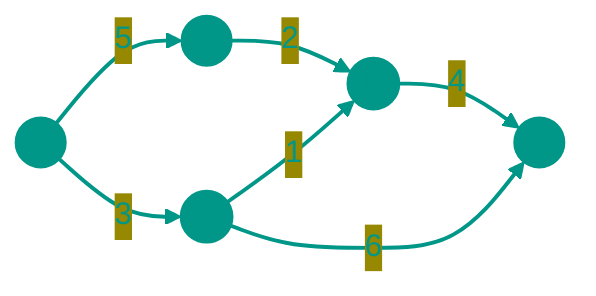

# 🕸️ Graph

**Description**: 
A Graph is the most versatile data structure, capable of describing almost any real-world system. It consists of **vertices** (nodes) and **edges** that connect them. While trees represent strict hierarchies, graphs allow for total freedom of connections.

- **How it works internally**: 
  - *Adjacency List*: Each vertex stores a list of its "friends." This is memory-efficient for sparse graphs (O(V+E)).
  - *Adjacency Matrix*: An "all-vs-all" table where 1 denotes a connection and 0 denotes its absence. Convenient for checking specific connections instantly (O(1)).
- **Analogy**: A perfect example is a social network. Vertices are people, and edges represent their friendships. Or a subway map: stations are vertices, and the tunnels between them are edges.


### Types of Graphs
- **Directed**: Connections work in one direction (like following someone on social media: I follow you, but you might not follow me).
- **Weighted**: Edges have a "cost" or weight (e.g., the distance in kilometers between cities).
- **Connected**: You can reach any vertex from any other vertex.


### Pros and Cons
✅ **Pros**:
1. **Real-world Modeling**: Used to solve problems in navigation, logistics, relationship analysis, and recommendation systems.
2. **Flexibility**: No restrictions on the number of connections or the overall structure.

❌ **Cons**:
1. **Algorithmic Complexity**: Many graph problems (like the traveling salesman problem or finding the shortest path) are computationally expensive.
2. **Memory Consumption**: Storing all connections in a dense graph can take significant space (O(V²)).

---


### Visualization




### Complexity

| Operation | Adjacency List (O) | Adjacency Matrix (O) | Space Complexity |
|:---|:---:|:---:|:---:|
| Add Vertex | O(1) | O(V²) | O(V) / O(V²) |
| Add Edge | O(1) | O(1) | O(1) |
| Check Edge | O(V) | O(1) | O(1) |
| List Neighbors | O(degree) | O(V) | O(1) |
| Storage | — | — | O(V + E) / O(V²) |

> [!TIP]
> **V** — number of vertices, **E** — number of edges. Adjacency list saves memory for sparse graphs. Matrix is convenient for dense graphs.


## 💻 Implementation

```go
package graph

import "fmt"

// Graph represents an adjacency list graph
type Graph struct {
	vertices int
	adjList  map[int][]int
}

// New creates a new graph
func New(vertices int) *Graph {
	return &Graph{
		vertices: vertices,
		adjList:  make(map[int][]int),
	}
}

// AddVertex adds a node to the graph
func (g *Graph) AddVertex(v int) {
	if _, exists := g.adjList[v]; !exists {
		g.adjList[v] = []int{}
	}
}

// AddEdge adds a directed edge from u to v
func (g *Graph) AddEdge(u, v int) {
	g.AddVertex(u)
	g.AddVertex(v)
	g.adjList[u] = append(g.adjList[u], v)
}

// BFS Performs a Breadth-First Search from start node
func (g *Graph) BFS(start int) []int {
	visited := make(map[int]bool)
	queue := []int{start}
	var result []int

	visited[start] = true

	for len(queue) > 0 {
		u := queue[0]
		queue = queue[1:]
		result = append(result, u)

		for _, v := range g.adjList[u] {
			if !visited[v] {
				visited[v] = true
				queue = append(queue, v)
			}
		}
	}
	return result
}

// DFS Performs a Depth-First Search from start node
func (g *Graph) DFS(start int) []int {
	visited := make(map[int]bool)
	var result []int
	g.dfsRecursive(start, visited, &result)
	return result
}

func (g *Graph) dfsRecursive(u int, visited map[int]bool, result *[]int) {
	visited[u] = true
	*result = append(*result, u)

	for _, v := range g.adjList[u] {
		if !visited[v] {
			g.dfsRecursive(v, visited, result)
		}
	}
}

// HasCycle checks if the directed graph contains a cycle
func (g *Graph) HasCycle() bool {
	visited := make(map[int]bool)
	recStack := make(map[int]bool)

	for v := range g.adjList {
		if !visited[v] {
			if g.isCyclic(v, visited, recStack) {
				return true
			}
		}
	}
	return false
}

func (g *Graph) isCyclic(v int, visited, recStack map[int]bool) bool {
	visited[v] = true
	recStack[v] = true

	for _, neighbor := range g.adjList[v] {
		if !visited[neighbor] {
			if g.isCyclic(neighbor, visited, recStack) {
				return true
			}
		} else if recStack[neighbor] {
			return true
		}
	}

	recStack[v] = false
	return false
}

func main() {
	g := New(5)
	g.AddEdge(0, 1)
	g.AddEdge(0, 2)
	g.AddEdge(1, 2)
	g.AddEdge(2, 0)
	g.AddEdge(2, 3)
	g.AddEdge(3, 3)

	fmt.Println("BFS starting from vertex 2:", g.BFS(2))
	fmt.Println("DFS starting from vertex 2:", g.DFS(2))
	fmt.Println("Has Cycle:", g.HasCycle())
}
```

```javascript
/**
 * Graph implementation using an Adjacency List.
 */
class Graph {
  constructor() {
    this.adjList = new Map();
  }

  /**
   * Add a vertex to the graph.
   */
  addVertex(v) {
    if (!this.adjList.has(v)) {
      this.adjList.set(v, []);
    }
  }

  /**
   * Add a directed edge from u to v.
   */
  addEdge(u, v) {
    this.addVertex(u);
    this.addVertex(v);
    this.adjList.get(u).push(v);
  }

  /**
   * Breadth-First Search.
   */
  bfs(start) {
    const visited = new Set();
    const queue = [start];
    const result = [];

    visited.add(start);

    while (queue.length > 0) {
      const u = queue.shift();
      result.push(u);

      const neighbors = this.adjList.get(u) || [];
      for (const v of neighbors) {
        if (!visited.has(v)) {
          visited.add(v);
          queue.push(v);
        }
      }
    }
    return result;
  }

  /**
   * Depth-First Search (Recursive).
   */
  dfs(start) {
    const visited = new Set();
    const result = [];
    this._dfsRecursive(start, visited, result);
    return result;
  }

  _dfsRecursive(u, visited, result) {
    visited.add(u);
    result.push(u);

    const neighbors = this.adjList.get(u) || [];
    for (const v of neighbors) {
      if (!visited.has(v)) {
        this._dfsRecursive(v, visited, result);
      }
    }
  }

  /**
   * Cycle Detection in directed graph.
   */
  hasCycle() {
    const visited = new Set();
    const recStack = new Set();

    for (let node of this.adjList.keys()) {
      if (!visited.has(node)) {
        if (this._isCyclic(node, visited, recStack)) return true;
      }
    }
    return false;
  }

  _isCyclic(v, visited, recStack) {
    visited.add(v);
    recStack.add(v);

    const neighbors = this.adjList.get(v) || [];
    for (let neighbor of neighbors) {
      if (!visited.has(neighbor)) {
        if (this._isCyclic(neighbor, visited, recStack)) return true;
      } else if (recStack.has(neighbor)) {
        return true;
      }
    }

    recStack.delete(v);
    return false;
  }
}

// Usage example
const graph = new Graph();
graph.addEdge(0, 1);
graph.addEdge(0, 2);
graph.addEdge(1, 2);
graph.addEdge(2, 3);

console.log("BFS starting from 0:", graph.bfs(0));
console.log("DFS starting from 0:", graph.dfs(0));
console.log("Has cycle:", graph.hasCycle());
```


## 🚀 Practical Problems
```go
package graph

// Problems on Go...
func ValidPath(n int, edges [][]int, source int, destination int) bool {
    // ...
}
```

```javascript
// Algorithmic Problems (JS)

// 1. Valid Path (BFS)
function validPath(n, edges, source, destination) {
  if (source === destination) return true;
  const adj = Array.from({ length: n }, () => []);
  for (const [u, v] of edges) {
    adj[u].push(v);
    adj[v].push(u);
  }

  const visited = new Set([source]);
  const queue = [source];

  while (queue.length) {
    const node = queue.shift();
    if (node === destination) return true;
    for (const next of adj[node]) {
      if (!visited.has(next)) {
        visited.add(next);
        queue.push(next);
      }
    }
  }
  return false;
}

// 2. Number of Provinces (DFS)
function findCircleNum(isConnected) {
  const n = isConnected.length;
  const visited = new Set();
  let provinces = 0;

  function dfs(i) {
    for (let j = 0; j < n; j++) {
      if (isConnected[i][j] === 1 && !visited.has(j)) {
        visited.add(j);
        dfs(j);
      }
    }
  }

  for (let i = 0; i < n; i++) {
    if (!visited.has(i)) {
      visited.add(i);
      dfs(i);
      provinces++;
    }
  }
  return provinces;
}
```

<!-- QUIZ_START 
[
    {
        "question": "What is the difference between an Adjacency List and an Adjacency Matrix?",
        "options": ["One is for numbers, the other is for strings", "List is memory-efficient for sparse graphs, Matrix is fast for checking specific connections in dense graphs", "Matrix uses recursion, List uses iteration", "List only works for directed graphs"],
        "correctIndex": 1
    },
    {
        "question": "What does a 'weighted' edge in a graph represent?",
        "options": ["The 'cost' or importance of a connection (e.g., distance or time)", "The physical weight of the server", "The number of vertices in the graph", "The color of the node"],
        "correctIndex": 0
    },
    {
        "question": "Which algorithm is commonly used to find if a path exists between two nodes?",
        "options": ["Quick Sort", "BFS (Breadth-First Search) or DFS (Depth-First Search)", "Binary Search", "Greedy Choice"],
        "correctIndex": 1
    }
]
QUIZ_END -->

```

