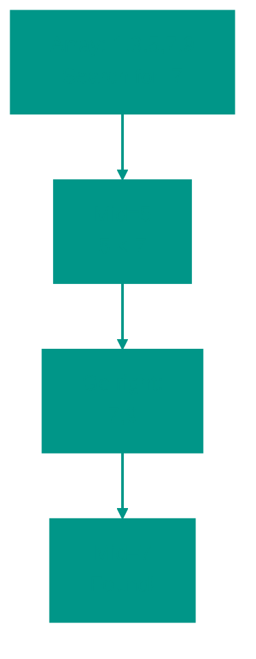

# 🔎 Binary Search

**Description**:
Binary search is one of the most efficient search algorithms, operating on the principle of "divide and conquer." Instead of scanning every element, it cuts the search space exactly in half with each step.

- **How it works internally**: The algorithm only works on **sorted** data. It compares the target value with the middle element of the array:
  - If the values match, the search is complete.
  - If the target is greater than the middle element, the left half is discarded, and the search continues in the right half.
  - If the target is smaller, the right half is discarded.
  This process continues until the element is found or the search range becomes empty. This results in an incredible speed of **O(log n)**.
- **Analogy**: Imagine looking for a word in a physical dictionary. You open it to the middle. If your word starts with "P" and you opened to "M," you won't look at any pages before "M"; you immediately move to the right half. You don't flip through the dictionary one page at a time — that's the core essence of binary search.


### Pros and Cons
✅ **Pros**:
1. **Extreme Speed**: In an array of one million elements, binary search will find the target in a maximum of 20 steps.
2. **Efficiency**: Minimizes memory access compared to linear search.

❌ **Cons**:
1. **Sorting Requirement**: If the data isn't sorted, the algorithm is useless. Since sorting itself takes time, binary search is most beneficial when you sort once and search many times.
2. **Array Specific**: The algorithm requires "random access" to elements (via index), so it performs poorly with standard linked lists.

---

**Visualization**:



**Complexity**:

| Metric | Complexity (O) |
|:---|:---:|
| Time (average/worst) | O(log n) |
| Space | O(1) iterative, O(log n) recursive |

**When to Use**: Sorted data, fast search in large arrays.


## 💻 Implementation

```go
package binary_search

import "fmt"

// BinarySearch implements the iterative binary search algorithm.
// Returns the index of the element if found, otherwise returns -1.
func BinarySearch(arr []int, target int) int {
	left, right := 0, len(arr)-1

	for left <= right {
		// Use this formula to prevent overflow for large indices
		mid := left + (right-left)/2

		if arr[mid] == target {
			return mid
		}
		if arr[mid] < target {
			left = mid + 1
		} else {
			right = mid - 1
		}
	}

	return -1
}

func main() {
	arr := []int{1, 3, 5, 7, 9, 11, 13, 15}
	target := 7
	result := BinarySearch(arr, target)
	fmt.Printf("Element %d found at index: %d\n", target, result)
}
```

```javascript
/**
 * Iterative Binary Search.
 */
function binarySearch(arr, target) {
  let left = 0;
  let right = arr.length - 1;

  while (left <= right) {
    const mid = Math.floor(left + (right - left) / 2);

    if (arr[mid] === target) return mid;
    if (arr[mid] < target) {
      left = mid + 1;
    } else {
      right = mid - 1;
    }
  }

  return -1;
}

/**
 * Example: Find the square root of an integer.
 */
function mySqrt(x) {
  if (x < 2) return x;
  let left = 2, right = Math.floor(x / 2);

  while (left <= right) {
    let mid = Math.floor(left + (right - left) / 2);
    let num = mid * mid;
    if (num === x) return mid;
    if (num > x) right = mid - 1;
    else left = mid + 1;
  }

  return right;
}

// Usage Example
const arr = [1, 2, 3, 4, 5, 6, 7, 8, 9, 10];
console.log(binarySearch(arr, 7)); // 6
console.log(mySqrt(16)); // 4
```


## 🚀 Practical Problems

```go
package binary_search

// Problem 1: Find Peak Element
// A peak element is an element that is strictly greater than its neighbors.
func FindPeakElement(nums []int) int {
	left, right := 0, len(nums)-1
	for left < right {
		mid := left + (right-left)/2
		if nums[mid] > nums[mid+1] {
			right = mid
		} else {
			left = mid + 1
		}
	}
	return left
}

// Problem 2: Search in Rotated Sorted Array
func SearchInRotated(nums []int, target int) int {
	left, right := 0, len(nums)-1
	for left <= right {
		mid := left + (right-left)/2
		if nums[mid] == target {
			return mid
		}

		if nums[left] <= nums[mid] {
			if nums[left] <= target && target < nums[mid] {
				right = mid - 1
			} else {
				left = mid + 1
			}
		} else {
			if nums[mid] < target && target <= nums[right] {
				left = mid + 1
			} else {
				right = mid - 1
			}
		}
	}
	return -1
}
```

```javascript
/**
 * Problem 1: Find Peak Element.
 */
function findPeakElement(nums) {
  let left = 0, right = nums.length - 1;
  while (left < right) {
    const mid = Math.floor(left + (right - left) / 2);
    if (nums[mid] > nums[mid + 1]) {
      right = mid;
    } else {
      left = mid + 1;
    }
  }
  return left;
}

/**
 * Problem 2: Search in Rotated Sorted Array.
 */
function searchInRotated(nums, target) {
  let left = 0, right = nums.length - 1;
  while (left <= right) {
    const mid = Math.floor(left + (right - left) / 2);
    if (nums[mid] === target) return mid;

    // Left part is sorted
    if (nums[left] <= nums[mid]) {
      if (nums[left] <= target && target < nums[mid]) {
        right = mid - 1;
      } else {
        left = mid + 1;
      }
    } else {
      // Right part is sorted
      if (nums[mid] < target && target <= nums[right]) {
        left = mid + 1;
      } else {
        right = mid - 1;
      }
    }
  }
  return -1;
}
```


<!-- QUIZ_START 
[
    {
        "question": "What is the primary requirement for Binary Search to function correctly?",
        "options": ["The data must be stored in a linked list", "The data must be sorted", "The array must contain only positive numbers", "The array size must be a power of two"],
        "correctIndex": 1
    },
    {
        "question": "What is the time complexity of Binary Search?",
        "options": ["O(n)", "O(n log n)", "O(log n)", "O(1)"],
        "correctIndex": 2
    },
    {
        "question": "How does Binary Search reduce the search space in each step?",
        "options": ["It removes one element", "It divides the search space in half", "It searches every third element", "It jumps to a random index"],
        "correctIndex": 1
    }
]
QUIZ_END -->


