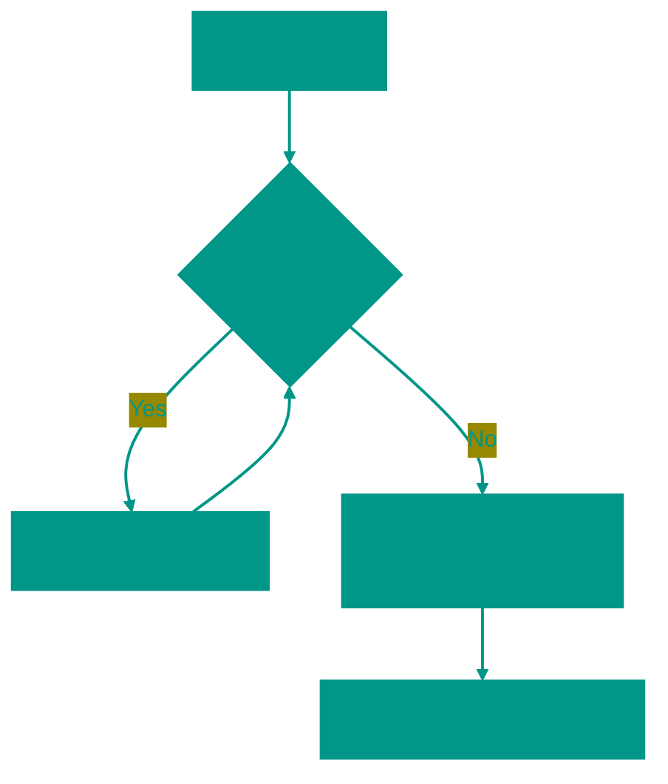

# Exponential Search

**Description**: 
Exponential Search is an algorithm that combines aggressive boundary expansion with the precision of binary search. It is an ideal choice for situations where the exact size of the array is unknown or when the target element is likely located near the beginning.

- **How it works internally**: The algorithm operates in two phases:
  1. *Jumps*: We start at index 1 and continuously double it (1, 2, 4, 8...) until we find an element greater than the target or reach the end of the data. This allows us to exponentially narrow down the search space.
  2. *Binary Search*: Once the range `[2^(k-1), 2^k]` is identified, we perform a standard binary search within those bounds.
- **Analogy**: Imagine you are in a massive building and need to find Apartment #25. Instead of checking every door, you run past doors #1, #2, #4, #8, #16, and #32. Realizing that #32 is already beyond what you need, you go back to door #16 and start looking for your target within the span of 16 to 32.


### Pros and Cons
✅ **Pros**:
1. **Speed for Near Elements**: If the element is near the start of a multi-million-entry array, this search finds it in just a few steps without scanning the entire range.
2. **Handling Infinity**: It's the best option for searching through unbounded data streams or arrays with unknown sizes.

❌ **Cons**:
1. **Strict Requirements**: Like binary search, it requires the data to be strictly sorted.
2. **Redundant Checks**: If the target element is at the very end of the array, the algorithm is slightly less efficient than a standard binary search due to the initial "jumping" phase.

---

**Visualization**:



**Complexity**:

| Metric | Complexity (O) |
|:---|:---:|
| Time | O(log i), where i is the element index |
| Space | O(1) iterative |

**When to use**: 
- When the array is infinite or its size is unknown.
- When the target element is likely near the beginning.

---


## 💻 Implementation

```go
package exponential_search

import (
	"fmt"
	"math"
)

// ExponentialSearch implements the exponential search algorithm.
func ExponentialSearch(arr []int, target int) int {
	if len(arr) == 0 {
		return -1
	}

	if arr[0] == target {
		return 0
	}

	// 1. Find the range
	bound := 1
	for bound < len(arr) && arr[bound] <= target {
		bound *= 2
	}

	// 2. Perform binary search in the identified fragment
	left := bound / 2
	right := int(math.Min(float64(bound), float64(len(arr)-1)))

	return binarySearch(arr, left, right, target)
}

func binarySearch(arr []int, left, right, target int) int {
	for left <= right {
		mid := left + (right-left)/2
		if arr[mid] == target {
			return mid
		}
		if arr[mid] < target {
			left = mid + 1
		} else {
			right = mid - 1
		}
	}
	return -1
}

func main() {
	arr := []int{1, 2, 4, 8, 16, 32, 64, 128}
	target := 32
	result := ExponentialSearch(arr, target)
	fmt.Printf("Element %d found at position: %d\n", target, result)
}
```

```javascript
/**
 * Exponential Search implementation.
 */
function exponentialSearch(arr, target) {
  if (arr.length === 0) return -1;
  if (arr[0] === target) return 0;

  // 1. Double the range until the upper bound is found
  let bound = 1;
  while (bound < arr.length && arr[bound] <= target) {
    bound *= 2;
  }

  // 2. Classic binary search within the identified range
  return binarySearch(
    arr, 
    Math.floor(bound / 2), 
    Math.min(bound, arr.length - 1), 
    target
  );
}

function binarySearch(arr, left, right, target) {
  while (left <= right) {
    const mid = Math.floor(left + (right - left) / 2);
    if (arr[mid] === target) return mid;
    if (arr[mid] < target) {
      left = mid + 1;
    } else {
      right = mid - 1;
    }
  }
  return -1;
}

// Usage Example
const arr = [1, 3, 5, 7, 9, 11, 13, 15, 17, 19];
console.log(exponentialSearch(arr, 13)); // 6
```


## 🚀 Practical Problems
```go
package exponential_search

import "fmt"
import "math"

func Example() {
	// Example 1: Search in a standard array
	arr := []int{1, 2, 3, 4, 5, 6, 7, 8, 9, 10, 12, 15, 20}
	target := 12
	idx := ExponentialSearch(arr, target)
	
	if idx != -1 {
		fmt.Printf("Element %d found at index %d\n", target, idx)
	} else {
		fmt.Printf("Element %d not found\n", target)
	}

// 1. Search in Sorted Array of Unknown Size
type ArrayReader struct {
	arr []int
}

func (r *ArrayReader) Get(index int) int {
	if index >= len(r.arr) {
		return math.MaxInt32
	}
	return r.arr[index]
}

func SearchInInfiniteArray(reader *ArrayReader, target int) int {
	if reader.Get(0) == target {
		return 0
	}

	right := 1
	for reader.Get(right) < target {
		right *= 2
	}

	left := right / 2
	for left <= right {
		mid := left + (right-left)/2
		val := reader.Get(mid)
		if val == target {
			return mid
		}
		if val < target {
			left = mid + 1
		} else {
			right = mid - 1
		}
	}
	return -1
}
```

```javascript
/**
 * Algorithmic Problems (JS)
 */

// 1. Search in Sorted Array of Unknown Size
class ArrayReader {
  constructor(arr) {
    this.arr = arr;
  }
  get(index) {
    if (index >= this.arr.length) return Number.MAX_SAFE_INTEGER;
    return this.arr[index];
  }
}

function searchInInfiniteArray(reader, target) {
  if (reader.get(0) === target) return 0;
  
  let right = 1;
  while (reader.get(right) < target) {
    right *= 2;
  }
  
  let left = right / 2;
  while (left <= right) {
    const mid = Math.floor((left + right) / 2);
    const val = reader.get(mid);
    if (val === target) return mid;
    if (val < target) left = mid + 1;
    else right = mid - 1;
  }
  return -1;
}
```

<!-- QUIZ_START 
[
    {
        "question": "Exponential Search is especially efficient in which scenario?",
        "options": ["When the data is unsorted", "When the target element is near the end of the array", "When the exact size of the array is unknown or the target is near the beginning", "When searching for strings instead of numbers"],
        "correctIndex": 2
    },
    {
        "question": "What are the two phases of Exponential Search?",
        "options": ["Sorting and Binary Search", "Jumping (exponentially doubling range) and Binary Search", "Linear Search and Ternary Search", "Random Access and Sorting"],
        "correctIndex": 1
    },
    {
        "question": "If we start at index 1, what are the next potential jump indices in the jumping phase?",
        "options": ["1, 2, 3, 4...", "1, 10, 100, 1000...", "1, 2, 4, 8, 16...", "1, 3, 9, 27..."],
        "correctIndex": 2
    }
]
QUIZ_END -->

