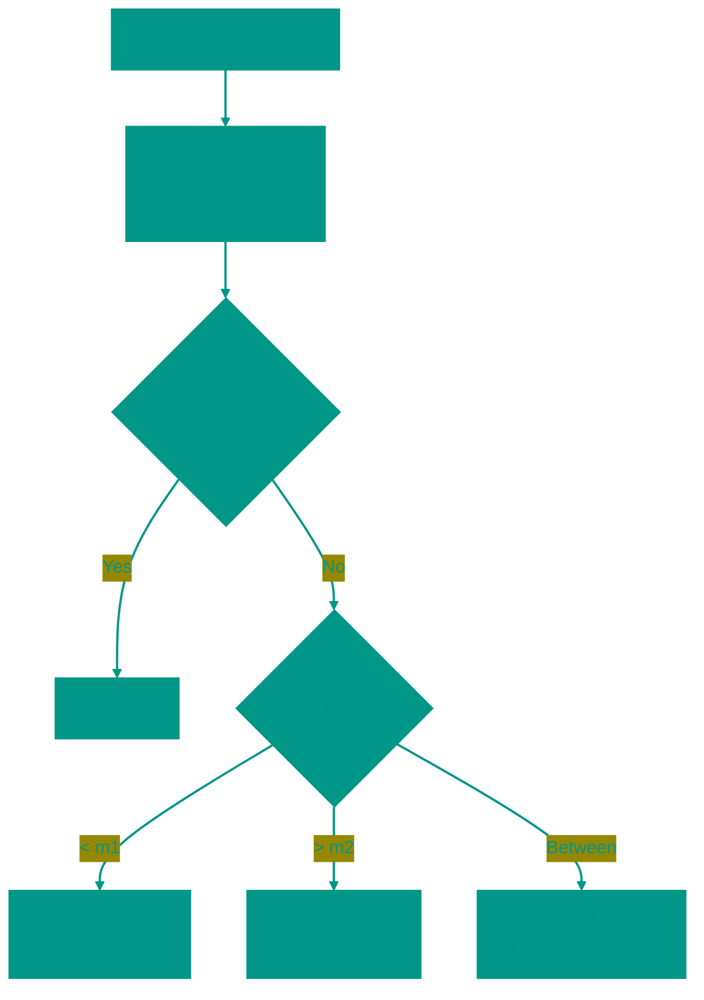

# Ternary Search

**Description**: 
Ternary Search is a "sibling" of binary search that divides the search space into three equal parts rather than two. While it may seem more powerful, in practice, it is more commonly used for finding local maxima or minima of functions (unimodal functions) rather than elements in an array.

- **How it works internally**: The algorithm selects two division points, `m1` (at 1/3 of the range) and `m2` (at 2/3 of the range).
  - In an array: We compare the target with elements at these indices and narrow the search to one of the three segments.
  - In functions: We compare the values `f(m1)` and `f(m2)`. If searching for a peak (maximum) and `f(m1) < f(m2)`, the peak is guaranteed not to be in the first third, so we discard it.
- **Analogy**: Imagine you are searching for the deepest point in a swimming pool. You check the depth at two points (1/3 and 2/3 across the length). If the right point is deeper than the left, you realize the shallow water on the left isn't interesting and focus only on the right portion.


### Pros and Cons
✅ **Pros**:
1. **Finding Extremas**: It is one of the simplest and most reliable ways to find the peak of a unimodal function (one that increases then decreases).
2. **Fewer Iterations**: Theoretically, the number of steps is fewer than in binary search (Log3 vs Log2), though this is offset by more costly steps.

❌ **Cons**:
1. **More Comparisons**: At each step, we perform two comparisons instead of one. Consequently, for standard arrays, binary search usually proves faster than ternary search.
2. **Niche Use**: It is almost never used for array searches, remaining primarily a tool for mathematical computations.

---

**Visualization**:



**Complexity**:

| Metric | Complexity (O) |
|:---|:---:|
| Time | O(log3 n), equivalent to O(log n) |
| Space | O(1) |

**When to use**: 
- Finding the maximum/minimum of a parabolic or unimodal function.
- In rare cases for arrays where comparison cost is very low compared to bounds shifting (almost never).

---


## 💻 Implementation

```go
package ternary

import "fmt"

// TernarySearch implements the ternary search algorithm for finding an element in an array.
func TernarySearch(arr []int, target int) int {
	left, right := 0, len(arr)-1

	for left <= right {
		m1 := left + (right-left)/3
		m2 := right - (right-left)/3

		if arr[m1] == target {
			return m1
		}
		if arr[m2] == target {
			return m2
		}

		if target < arr[m1] {
			right = m1 - 1
		} else if target > arr[m2] {
			left = m2 + 1
		} else {
			left = m1 + 1
			right = m2 - 1
		}
	}

	return -1
}

// TernarySearchPeak finds the peak (maximum) in a unimodal array.
func TernarySearchPeak(arr []int) int {
	left, right := 0, len(arr)-1
	for right-left > 2 {
		m1 := left + (right-left)/3
		m2 := right - (right-left)/3
		if arr[m1] < arr[m2] {
			left = m1
		} else {
			right = m2
		}
	}
	// In a small range, find the maximum by simple comparison
	max := arr[left]
	for i := left + 1; i <= right; i++ {
		if arr[i] > max {
			max = arr[i]
		}
	}
	return max
}

func main() {
	arr := []int{1, 2, 3, 4, 5, 6, 7, 8, 9, 10}
	fmt.Printf("Search for 7: %d\n", TernarySearch(arr, 7))

	mountain := []int{1, 3, 8, 12, 4, 2}
	fmt.Printf("Mountain peak: %d\n", TernarySearchPeak(mountain))
}
```

```javascript
/**
 * Ternary Search for an element in a sorted array.
 */
function ternarySearch(arr, target) {
  let left = 0;
  let right = arr.length - 1;

  while (left <= right) {
    const m1 = left + Math.floor((right - left) / 3);
    const m2 = right - Math.floor((right - left) / 3);

    if (arr[m1] === target) return m1;
    if (arr[m2] === target) return m2;

    if (target < arr[m1]) {
      right = m1 - 1;
    } else if (target > arr[m2]) {
      left = m2 + 1;
    } else {
      left = m1 + 1;
      right = m2 - 1;
    }
  }
  return -1;
}

/**
 * Finding the peak (maximum) in a unimodal array.
 */
function ternarySearchPeak(arr) {
  let left = 0, right = arr.length - 1;
  while (right - left > 2) {
    const m1 = left + Math.floor((right - left) / 3);
    const m2 = right - Math.floor((right - left) / 3);
    if (arr[m1] < arr[m2]) {
      left = m1;
    } else {
      right = m2;
    }
  }
  let max = arr[left];
  for (let i = left + 1; i <= right; i++) {
    if (arr[i] > max) max = arr[i];
  }
  return max;
}

// Usage Examples
const data = [1, 2, 3, 4, 5, 6, 7, 8, 9];
console.log(ternarySearch(data, 5)); // 4
console.log(ternarySearchPeak([1, 5, 10, 8, 3])); // 10
```


## 🚀 Practical Problems
```go
package ternary

import "fmt"

func Example() {
	// Example 1: Search in an array
	data := []int{1, 2, 3, 4, 5, 6, 7, 8, 9, 10}
	target := 7
	result := TernarySearch(data, target)
	fmt.Printf("Element %d found at position %d (Ternary Search)\n", target, result)

// 1. Peak Index in a Mountain Array
func PeakIndexInMountainArray(arr []int) int {
	left, right := 0, len(arr)-1
	for left < right {
		m1 := left + (right-left)/3
		m2 := right - (right-left)/3
		if arr[m1] < arr[m2] {
			left = m1 + 1
		} else {
			right = m2 - 1
		}
	}
	// Post-processing to find the exact peak
	peakIdx := left
	if left > 0 && arr[left-1] > arr[peakIdx] {
		peakIdx = left - 1
	}
	if left < len(arr)-1 && arr[left+1] > arr[peakIdx] {
		peakIdx = left + 1
	}
	return peakIdx
}
```

```javascript
/**
 * Algorithmic Problems (JS)
 */

// 1. Peak Index in a Mountain Array
function peakIndexInMountainArray(arr) {
  let left = 0, right = arr.length - 1;
  while (left < right) {
    const m1 = left + Math.floor((right - left) / 3);
    const m2 = right - Math.floor((right - left) / 3);
    if (arr[m1] < arr[m2]) left = m1 + 1;
    else right = m2 - 1;
  }
  // Search around the convergence point
  let peakIdx = left;
  if (left > 0 && arr[left - 1] > arr[peakIdx]) peakIdx = left - 1;
  if (left < arr.length - 1 && arr[left + 1] > arr[peakIdx]) peakIdx = left + 1;
  return peakIdx;
}
```

<!-- QUIZ_START 
[
    {
        "question": "Into how many parts does Ternary Search divide the search space?",
        "options": ["Two", "Three", "Four", "It depends on the array size"],
        "correctIndex": 1
    },
    {
        "question": "What is a common use case for Ternary Search beyond searching in sorted arrays?",
        "options": ["Sorting strings", "Finding the local maximum or minimum of a unimodal function", "Merging two databases", "Encrypting data"],
        "correctIndex": 1
    },
    {
        "question": "Why is Ternary Search often considered 'niche' compared to Binary Search for standard array searches?",
        "options": ["It is slower on average due to more comparisons per step", "It only works with negative numbers", "It requires specialized hardware", "It uses O(n) additional memory"],
        "correctIndex": 0
    }
]
QUIZ_END -->

