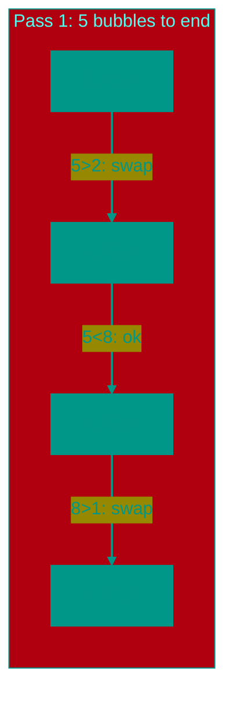

# 🫧 Bubble Sort

**Description**: 
Bubble Sort is the simplest and most intuitive algorithm, often the starting point for learning programming. It gets its name because larger elements "bubble up" to the end of the array, much like air bubbles in water.

- **How it works internally**: The algorithm repeatedly steps through the array, compares adjacent elements, and swaps them if they are in the wrong order. With each full pass, at least one maximum element is guaranteed to settle into its correct final position. The complexity is **O(n²)**.
- **Analogy**: Imagine a line of people of different heights. You walk from the front of the line, and if you see that a person on the left is taller than their neighbor on the right, you ask them to swap places. By the end of your walk, the tallest person will surely be at the very end.


### Pros and Cons
✅ **Pros**:
1. **Simplicity**: The algorithm is extremely easy to understand and implement.
2. **Memory Efficiency**: Requires O(1) additional memory (in-place sorting).
3. **Efficiency on Nearly Sorted Data**: With an added check for swaps, it can finish in O(n) time.

❌ **Cons**:
1. **Slow Performance**: It is one of the slowest sorting algorithms. It's completely unsuitable for large datasets.
2. **Excessive Swaps**: It performs many unnecessary data movements, which is inefficient for the CPU.

---

**Visualization**:



**Complexity**:

| Metric | Complexity (O) |
|:---|:---:|
| Time (Average/Worst) | O(n²) |
| Time (Best) | O(n) (if already sorted) |
| Space | O(1) |

**When to use**: 
- For educational purposes.
- If the array is tiny.
- If the array is already nearly sorted (though Insertion Sort is better here).

---


## 💻 Implementation

```go
package bubble_sort

import "fmt"

// BubbleSort implements an optimized bubble sort algorithm.
func BubbleSort(arr []int) {
	n := len(arr)
	for i := 0; i < n-1; i++ {
		swapped := false
		for j := 0; j < n-i-1; j++ {
			if arr[j] > arr[j+1] {
				arr[j], arr[j+1] = arr[j+1], arr[j]
				swapped = true
			}
		}
		// If no two elements were swapped by inner loop, then break
		if !swapped {
			break
		}
	}
}

func main() {
	arr := []int{64, 34, 25, 12, 22, 11, 90}
	BubbleSort(arr)
	fmt.Printf("Sorted array: %v\n", arr)
}
```

```javascript
/**
 * Optimized Bubble Sort implementation.
 */
function bubbleSort(arr) {
  const n = arr.length;
  for (let i = 0; i < n - 1; i++) {
    let swapped = false;
    for (let j = 0; j < n - i - 1; j++) {
      if (arr[j] > arr[j + 1]) {
        // Swap elements using destructuring assignment
        [arr[j], arr[j + 1]] = [arr[j + 1], arr[j]];
        swapped = true;
      }
    }
    // If no elements were swapped, the array is already sorted
    if (!swapped) break;
  }
  return arr;
}

// Usage Example
const data = [5, 1, 4, 2, 8];
console.log(bubbleSort(data)); // [1, 2, 4, 5, 8]
```


## 🚀 Practical Problems
```go
package bubble_sort

import "fmt"

// Example demonstrates the use of bubble sort with various examples
func Example() {
	// Example 1: Basic bubble sort
	arr1 := []int{64, 34, 25, 12, 22, 11, 90}
	fmt.Printf("Original array: %v\n", arr1)
	BubbleSort(arr1)
	fmt.Printf("Sorted array:   %v\n", arr1)

	// Example 2: Move Zeroes
	arrZeros := []int{0, 1, 0, 3, 12}
	MoveZeroes(arrZeros)
	fmt.Printf("Move Zeroes:    %v\n", arrZeros)
}

// Problem: Move Zeroes
// Given an integer array nums, move all 0's to the end of it while maintaining 
// the relative order of the non-zero elements.
// This must be done in-place.
/*
func MoveZeroes(nums []int) {
    // See implementation below
}
*/

func MoveZeroes(nums []int) {
	insertPos := 0
	for _, num := range nums {
		if num != 0 {
			nums[insertPos] = num
			insertPos++
		}
	}
	for i := insertPos; i < len(nums); i++ {
		nums[i] = 0
	}
}

// Problem: Sort Array By Parity
// Given an array nums, move all the even integers at the beginning of the array followed by all the odd integers.
func SortArrayByParity(nums []int) []int {
	i, j := 0, len(nums)-1
	for i < j {
		if nums[i]%2 > nums[j]%2 {
			nums[i], nums[j] = nums[j], nums[i]
		}
		if nums[i]%2 == 0 { i++ }
		if nums[j]%2 == 1 { j-- }
	}
	return nums
}
```

```javascript
/**
 * Algorithmic Problems (JS)
 */

// 1. Move Zeroes (Optimal Two Pointers)
function moveZeroes(nums) {
  let insertPos = 0;
  for (let num of nums) {
    if (num !== 0) {
      nums[insertPos++] = num;
    }
  }
  while (insertPos < nums.length) {
    nums[insertPos++] = 0;
  }
}

// 2. Sort Array By Parity
function sortArrayByParity(nums) {
  let i = 0, j = nums.length - 1;
  while (i < j) {
    if (nums[i] % 2 > nums[j] % 2) {
      [nums[i], nums[j]] = [nums[j], nums[i]];
    }
    if (nums[i] % 2 === 0) i++;
    if (nums[j] % 2 === 1) j--;
  }
  return nums;
}
```

<!-- QUIZ_START 
[
    {
        "question": "What is the time complexity of Bubble Sort in the worst-case scenario?",
        "options": ["O(n)", "O(log n)", "O(n²)", "O(n log n)"],
        "correctIndex": 2
    },
    {
        "question": "Why is this algorithm named 'Bubble Sort'?",
        "options": ["It uses bubbles of memory to store data", "Larger elements 'bubble up' to the end of the array", "It was invented by someone named Bubble", "It only works on floating point numbers"],
        "correctIndex": 1
    },
    {
        "question": "Under what condition can Bubble Sort achieve O(n) complexity?",
        "options": ["When the data is already sorted and an early-exit check is implemented", "When the data is sorted in reverse", "When the array is very large", "It can never achieve O(n)"],
        "correctIndex": 0
    }
]
QUIZ_END -->

