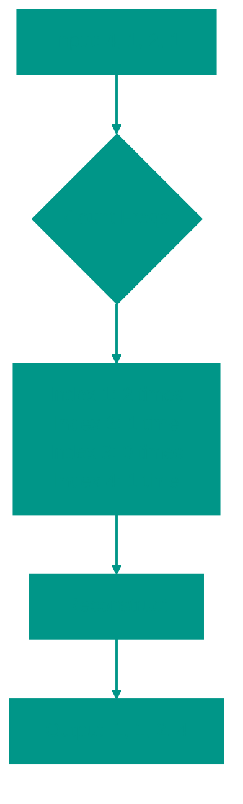

# 📊 Counting Sort

**Description**: 
Counting Sort is a "shortcut" algorithm that bypasses the mathematical speed limits of comparison-based sorting. It doesn't compare elements to each other; instead, it simply counts how many times each value appears.

- **How it works internally**: The algorithm creates an auxiliary array (a "frequency table") where the index corresponds to the element's value, and the value in the cell indicates how many times that number occurred. It then "writes out" the numbers back into the original array in the correct order based on these counts. This results in a phenomenal speed of **O(n + k)**.
- **Analogy**: Imagine you are taking a survey in a classroom: "Who likes apples, pears, or bananas?". Instead of sorting the students alphabetically by their favorite fruit, you just put tally marks in three columns. At the end, you say: "First, the three apple-lovers leave, then the two pear-lovers, and finally the one banana-lover."


### Pros and Cons
✅ **Pros**:
1. **Extreme Speed**: On appropriate data, it runs faster than any comparison-based sort (like Quick Sort or Merge Sort). O(n + k) where k is the range.
2. **Stability**: In its full implementation, it preserves the relative order of identical elements.

❌ **Cons**:
1. **Memory Hungry**: If you have an array with just two numbers—`1` and `1,000,000`—the algorithm will need to create an auxiliary array with a million cells. This is extremely inefficient.
2. **Limited Scope**: It only works with integers (or data that can be mapped to integers) within a predictable range.

---

**Visualization**:



**Complexity**:

| Metric | Complexity (O) |
|:---|:---:|
| Time | O(n + k) |
| Space | O(k) |

**When to Use**: 
- When the range of values (k) is small and comparable to the array size (n).
- For sorting by small keys (e.g., age, days of the month, grades).

---


## 💻 Implementation
```go
package counting_sort

func CountingSort(arr []int) []int {
	if len(arr) == 0 {
		return arr
	}

	min, max := arr[0], arr[0]
	for _, v := range arr {
		if v < min {
			min = v
		}
		if v > max {
			max = v
		}
	}

	// Create the count array
	rangeSize := max - min + 1
	count := make([]int, rangeSize)

	// Count frequencies
	for _, v := range arr {
		count[v-min]++
	}

	// Overwrite the original array (for the simplified version)
	sortedIndex := 0
	for valOffset, frequency := range count {
		val := valOffset + min
		for frequency > 0 {
			arr[sortedIndex] = val
			sortedIndex++
			frequency--
		}
	}

	return arr
}

```

```javascript
// Counting Sort Implementation (JS)
function countingSort(arr) {
  if (arr.length === 0) return arr;
  
  let min = arr[0], max = arr[0];
  arr.forEach(val => {
    if (val < min) min = val;
    if (val > max) max = val;
  });

  const counts = new Array(max - min + 1).fill(0);
  arr.forEach(val => counts[val - min]++);

  let index = 0;
  counts.forEach((freq, offset) => {
    const val = offset + min;
    while (freq > 0) {
      arr[index++] = val;
      freq--;
    }
  });
  return arr;
}
```


## 🚀 Practical Problems
```go
package counting_sort

import "fmt"

func Example() {
	// Example 1: Standard Sort
	arr := []int{4, 2, 2, 8, 3, 3, 1}
	fmt.Printf("Original: %v\n", arr)
	sorted := CountingSort(arr)
	fmt.Printf("Sorted:   %v\n", sorted)

// 1. Sort Colors (Three colors: 0, 1, 2)
func SortColors(nums []int) {
	counts := [3]int{}
	for _, num := range nums {
		counts[num]++
	}
	idx := 0
	for color, count := range counts {
		for i := 0; i < count; i++ {
			nums[idx] = color
			idx++
		}
	}
}

// 2. H-Index (O(N) using Counting Sort principle)
func HIndex(citations []int) int {
	n := len(citations)
	buckets := make([]int, n+1)
	for _, c := range citations {
		if c >= n {
			buckets[n]++
		} else {
			buckets[c]++
		}
	}
	
	count := 0
	for i := n; i >= 0; i-- {
		count += buckets[i]
		if count >= i {
			return i
		}
	}
	return 0
}
```

```javascript
/**
 * Algorithmic Problems (JS)
 */

// 1. Sort Colors (Three colors: 0, 1, 2)
function sortColors(nums) {
  const counts = [0, 0, 0];
  nums.forEach(n => counts[n]++);
  let idx = 0;
  counts.forEach((count, color) => {
    while (count--) nums[idx++] = color;
  });
}

// 2. H-Index (O(N) using Counting Sort principle)
function hIndex(citations) {
  const n = citations.length;
  const buckets = new Array(n + 1).fill(0);
  citations.forEach(c => {
    if (c >= n) buckets[n]++;
    else buckets[c]++;
  });
  
  let count = 0;
  for (let i = n; i >= 0; i--) {
    count += buckets[i];
    if (count >= i) return i;
  }
  return 0;
}
```

<!-- QUIZ_START 
[
    {
        "question": "What is the primary advantage of Counting Sort over comparison-based algorithms?",
        "options": ["It works on any data type", "It has a better worst-case complexity of O(n + k)", "It uses O(1) memory", "It is easier to implement"],
        "correctIndex": 1
    },
    {
        "question": "In what scenario is Counting Sort extremely inefficient?",
        "options": ["When values are small and close together", "When the range of values is very large compared to the number of elements", "When the array is already sorted", "When the array contains duplicates"],
        "correctIndex": 1
    },
    {
        "question": "What auxiliary data structure is used in Counting Sort?",
        "options": ["A linked list", "A frequency table (array) where indices represent values", "A binary search tree", "A stack"],
        "correctIndex": 1
    }
]
QUIZ_END -->

