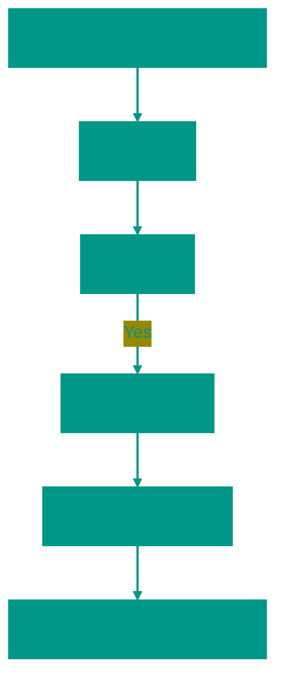

# 🃏 Insertion Sort

**Description**: 
Insertion Sort is an algorithm that feels most natural to humans. This is typically how we arrange a hand of cards or books on a shelf.

- **How it works internally**: We divide the array into two parts: sorted (left) and unsorted (right). In each step, we take the first element from the "chaos" and insert it into the correct position within the "ordered" part by shifting other elements. The complexity is **O(n²)**.
- **Analogy**: Imagine you are playing cards. You pick a new card from the deck and find its place in your hand by comparing it with the cards you already hold until you find the right gap.


### Pros and Cons
✅ **Pros**:
1. **Efficient for Small Data**: For arrays of 10-20 elements, it can often outperform even Quick Sort.
2. **Stability**: Preserves the relative order of identical elements.
3. **Adaptability**: Shows excellent performance (**O(n)**) on data that is already partially sorted.
4. **Online Algorithm**: Can sort data as it is received.

❌ **Cons**:
1. **Poor Scalability**: Like Bubble Sort, it is extremely slow for large amounts of data.
2. **Frequent Shifting**: Requires constant movement of array elements in memory.

---

**Visualization**:



**Complexity**:

| Metric | Complexity (O) |
|:---|:---:|
| Time (Average/Worst) | O(n²) |
| Time (Best) | O(n) (if already sorted) |
| Space | O(1) |

**When to use**: 
- When the number of elements is small (less than 50).
- When the array is already mostly sorted (adding a few new elements).
- When data comes in one by one (Online Sorting).

---


## 💻 Implementation
```go
package insertion_sort

func InsertionSort(arr []int) {
	for i := 1; i < len(arr); i++ {
		j := i

		for j > 0 {
			if arr[j-1] > arr[j] {
				arr[j-1], arr[j] = arr[j], arr[j-1]
			}
			j--
		}
	}
}
```

```javascript
// Insertion Sort Implementation (JS)
function insertionSort(arr) {
  for (let i = 1; i < arr.length; i++) {
    let j = i;

    while (j > 0) {
      if (arr[j-1] > arr[j]) {
        [arr[j-1], arr[j]] = [arr[j], arr[j-1]];
      }
      j--;
    }
  }
}
```
// Insertion Sort for Linked List (Go)
type ListNode struct {
	Val  int
	Next *ListNode
}

func InsertionSortList(head *ListNode) *ListNode {
	if head == nil {
		return nil
	}
	dummy := &ListNode{}
	curr := head
	for curr != nil {
		nextTemp := curr.Next
		prev := dummy
		for prev.Next != nil && prev.Next.Val < curr.Val {
			prev = prev.Next
		}
		curr.Next = prev.Next
		prev.Next = curr
		curr = nextTemp
	}
	return dummy.Next
}
```

```javascript
// Insertion Sort for Linked List (JS)
class ListNode {
  constructor(val = 0, next = null) {
    this.val = val;
    this.next = next;
  }
}

function insertionSortList(head) {
  if (!head) return null;
  const dummy = new ListNode();
  let curr = head;
  
  while (curr) {
    let nextTemp = curr.next;
    let prev = dummy;
    while (prev.next && prev.next.val < curr.val) {
      prev = prev.next;
    }
    curr.next = prev.next;
    prev.next = curr;
    curr = nextTemp;
  }
  return dummy.next;
}
```


## 🚀 Practical Problems
```go
package insertion_sort

import "fmt"

func Example() {
	// Example 1: Sort Array
	arr := []int{12, 11, 13, 5, 6}
	fmt.Printf("Original: %v\n", arr)
	InsertionSort(arr)
	fmt.Printf("Sorted:   %v\n", arr)

	// Example 2: Online Sorting (simulation)
	// Imagine data is coming in a stream. We maintain a sorted state.
	stream := []int{10, 5, 3, 8}
	sortedBuffer := []int{}
	
	for _, val := range stream {
		// Add element to end
		sortedBuffer = append(sortedBuffer, val)
		// Run insertion step for the last element to "sink" it to correct place
		i := len(sortedBuffer) - 1
		for i > 0 && sortedBuffer[i] < sortedBuffer[i-1] {
			sortedBuffer[i], sortedBuffer[i-1] = sortedBuffer[i-1], sortedBuffer[i]
			i--
		}
		fmt.Printf("Received %d -> Buffer: %v\n", val, sortedBuffer)
	}
}

// Problem: Insertion Sort List
// Given the head of a singly linked list, sort the list using insertion sort, and return the sorted list's head.
/*
type ListNode struct {
    Val int
    Next *ListNode
}
func InsertionSortList(head *ListNode) *ListNode {
    // See implementation above
}
*/


<!-- QUIZ_START 
[
    {
        "question": "Which real-world activity is most similar to Insertion Sort?",
        "options": ["Sorting a basket of fruit by looking for the smallest", "Arranging a hand of cards while playing", "Organizing people into two groups based on height", "Counting the number of occurrences of each fruit"],
        "correctIndex": 1
    },
    {
        "question": "How does Insertion Sort divide the array during execution?",
        "options": ["Into two equal halves", "Into sorted (left) and unsorted (right) parts", "Into three segments", "It doesn't divide the array"],
        "correctIndex": 1
    },
    {
        "question": "For which type of data is Insertion Sort particularly efficient?",
        "options": ["Large random datasets", "Data that is already partially sorted", "Data with only two unique values", "Data sorted in reverse order"],
        "correctIndex": 1
    }
]
QUIZ_END -->

