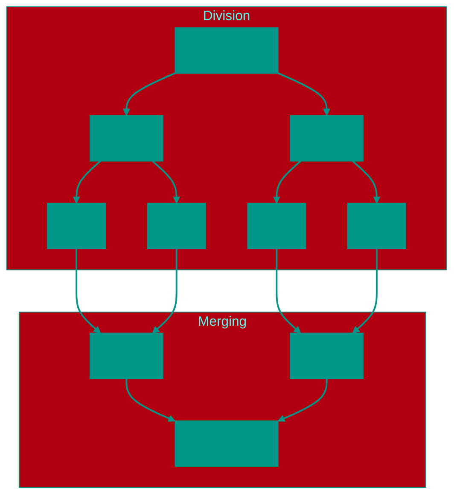

# 🤝 Merge Sort

**Description**: 
Merge Sort is the "perfectionist" among sorting algorithms. It guarantees a stable result and high performance under any conditions, even if the input data is completely scrambled.

- **How it works internally**: The algorithm recursively divides the array in half until each part contains only one element (a single element is always "sorted"). Then, the **merging** process begins: two small sorted lists are combined into one larger sorted list. This continues until the entire array is reassembled. The complexity is always **O(n log n)**.
- **Analogy**: Imagine you have two decks of cards, each already sorted. To combine them into one larger sorted deck, you simply look at the top card of each pile and move the smaller one to a new pile. It's simple and extremely effective.


### Pros and Cons
✅ **Pros**:
1. **Guaranteed Efficiency**: Unlike Quick Sort, this algorithm never slows down to O(n²). Its performance is always predictable.
2. **Stable Sorting**: Identical elements preserve their original relative order.
3. **Ideal for Big Data**: Excellent for sorting files that don't fit into RAM (external sorting).

❌ **Cons**:
1. **Memory Overhead**: The algorithm requires an additional array of the same size for the merging process (O(n) space complexity).
2. **Overhead on Small Data**: Due to the high number of recursive calls and data copying, it can be slower than simpler sorts for very small arrays.

---

**Visualization**:



**Complexity**:

| Metric | Complexity (O) |
|:---|:---:|
| Time (All cases) | O(n log n) |
| Space | O(n) |

**When to Use**: 
- When guaranteed O(n log n) performance is needed.
- External sorting (data larger than RAM).
- Sorting Linked Lists.

---


## 💻 Implementation
```go
package merge_sort

import "fmt"

// MergeSort implements the recursive merge sort algorithm.
func MergeSort(arr []int) []int {
	if len(arr) <= 1 {
		return arr
	}

	// 1. Divide array in half
	mid := len(arr) / 2
	left := MergeSort(arr[:mid])
	right := MergeSort(arr[mid:])

	// 2. Merge sorted halves
	return merge(left, right)
}

// merge combines two sorted slices into one.
func merge(left, right []int) []int {
	result := make([]int, 0, len(left)+len(right))
	i, j := 0, 0

	for i < len(left) && j < len(right) {
		if left[i] <= right[j] {
			result = append(result, left[i])
			i++
		} else {
			result = append(result, right[j])
			j++
		}
	}

	// Append remaining elements
	result = append(result, left[i:]...)
	result = append(result, right[j:]...)

	return result
}

func main() {
	arr := []int{38, 27, 43, 3, 9, 82, 10}
	sorted := MergeSort(arr)
	fmt.Printf("Sorted array: %v\n", sorted)
}
```

```javascript
// Merge Sort Implementation (JS)
function mergeSort(arr) {
  if (arr.length <= 1) return arr;
  
  const mid = Math.floor(arr.length / 2);
  const left = mergeSort(arr.slice(0, mid));
  const right = mergeSort(arr.slice(mid));
  
  return merge(left, right);
}

function merge(left, right) {
  const result = [];
  let i = 0, j = 0;
  
  while (i < left.length && j < right.length) {
    if (left[i] <= right[j]) {
      result.push(left[i]);
      i++;
    } else {
      result.push(right[j]);
      j++;
    }
  }
  
  return [...result, ...left.slice(i), ...right.slice(j)];
}
```


## 🚀 Practical Problems
```go
package merge_sort

import "fmt"

func Example() {
	// Example 1: Standard Sort
	arr := []int{38, 27, 43, 3, 9, 82, 10}
	fmt.Printf("Original: %v\n", arr)

	sorted := MergeSort(arr)
	fmt.Printf("Sorted:   %v\n", sorted)

	// Example 2: Merging sorted arrays
	a := []int{1, 3, 5}
	b := []int{2, 4, 6}
	merged := merge(a, b) // Using helper function
	fmt.Printf("Merged:   %v\n", merged)
}

// Problem: Merge Sorted Array
// You are given two integer arrays nums1 and nums2, sorted in non-decreasing order.
// Merge nums1 and nums2 into a single array sorted in non-decreasing order.
// This is the heart of Merge Sort.
/*
func MergeTwoSortedArrays(nums1, nums2 []int) []int {
	// See merge function implementation above
	return merge(nums1, nums2)
}
*/

// Problem: Sort List
// Given the head of a linked list, return the list after sorting it in ascending order.
// Merge Sort is the preferred algorithm for sorting linked lists because it can be implemented
// with O(1) space (excluding recursion stack) by changing pointers.
/*
type ListNode struct {
    Val int
    Next *ListNode
}
func SortList(head *ListNode) *ListNode {
    // 1. Find middle
    // 2. Recursively sort left and right halves
    // 3. Merge two sorted lists
}
*/


<!-- QUIZ_START 
[
    {
        "question": "What is the space complexity of Merge Sort?",
        "options": ["O(1)", "O(log n)", "O(n)", "O(n²)"],
        "correctIndex": 2
    },
    {
        "question": "What makes Merge Sort predictable compared to Quick Sort?",
        "options": ["It always performs O(n log n) operations regardless of input data", "It is twice as fast as Quick Sort", "It uses less memory", "It only works on small arrays"],
        "correctIndex": 0
    },
    {
        "question": "What is the core principle of the Merge Sort divide-and-conquer strategy?",
        "options": ["Pick a pivot and partition", "Divide the array until single elements remain, then merge them in order", "Find the minimum and move it to the front", "Bubble up the largest element"],
        "correctIndex": 1
    }
]
QUIZ_END -->

