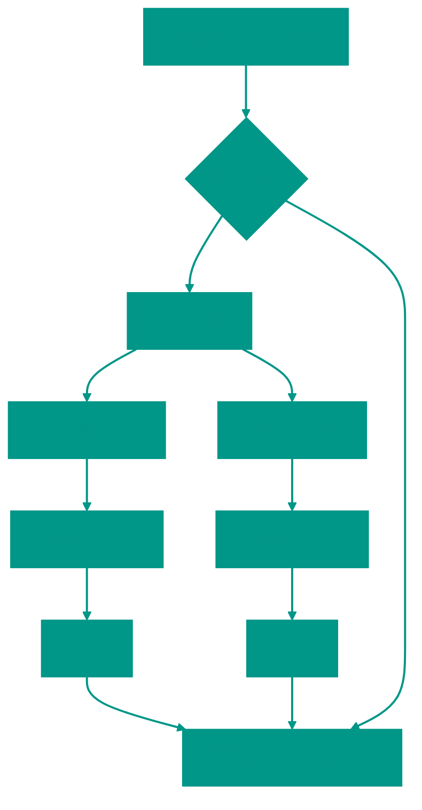

# ⚡ Quick Sort

**Description**: 
Quick Sort is perhaps the most famous and frequently used sorting algorithm in practice. It operates on the "divide and conquer" principle, organizing chaos into perfect order by selecting a "pivot" element.

- **How it works internally**: The algorithm picks one element from the array as a pivot. It then rearranges the other elements so that everything smaller than the pivot is on its left, and everything larger is on its right. This process is then recursively applied to the left and right halves. The average speed is **O(n log n)**, making it a favorite for most tasks.
- **Analogy**: Imagine you're a teacher and need to line up your class by height. You pick one student (Nick) and say: "Everyone shorter than Nick, stand to his left; everyone taller, stand to his right." Now Nick is exactly where he belongs, and you have two smaller groups to repeat the process with.


### Pros and Cons
✅ **Pros**:
1. **High Speed**: On average, it performs faster than most other algorithms with the same O(n log n) complexity (smaller constants).
2. **In-place Sorting**: Does not require significant additional memory in its classical implementation (O(log n) stack).
3. **Cache-friendly**: Works well with CPU caches due to its sequential data access pattern.

❌ **Cons**:
1. **Worst-case Scenario**: In the worst-case (e.g., already sorted array or poor pivot choice), speed can drop to O(n²). Choosing a random element or the median as a pivot helps mitigate this.
2. **Unstable**: It is an "unstable" sort, meaning identical elements might change their relative order.

---

**Visualization**:



**Complexity**:

| Metric | Complexity (O) |
|:---|:---:|
| Time (Average) | O(n log n) |
| Time (Worst) | O(n²) |
| Space | O(log n) (recursion stack) |

**When to Use**: 
- General purpose sorting (standard libraries in C++, Go, Java primitives).
- When speed matters and stability is not required.

---


## 💻 Implementation

```go
package quick_sort

import "fmt"

// medianOfThree selects the median of three numbers and sorts them.
func medianOfThree(arr []int, low, high int) int {
	mid := low + (high-low)/2

	// Compare 3 elements: first, middle, last to select median
	if arr[low] > arr[mid] {
		arr[low], arr[mid] = arr[mid], arr[low]
	}
	if arr[low] > arr[high] {
		arr[low], arr[high] = arr[high], arr[low]
	}
	if arr[mid] > arr[high] {
		arr[mid], arr[high] = arr[high], arr[mid]
	}

	return mid
}

// QuickSort - implementation (not in-place).
func QuickSort(arr []int) []int {
	// Base case, if array length <= 1 it's already sorted
	if len(arr) <= 1 {
		return arr
	}

	// Select pivot element
	pivotIndex := medianOfThree(arr, 0, len(arr)-1)
	pivot := arr[pivotIndex]
	left := []int{}
	right := []int{}

	// partition array into elements less than or greater than pivot
	for i := 0; i < len(arr); i++ {
		if i == pivotIndex {
			continue
		}

		if arr[i] <= pivot {
			left = append(left, arr[i])
		} else {
			right = append(right, arr[i])
		}
	}

	sortedLeft := QuickSort(left)   // sort left part
	sortedRight := QuickSort(right) // sort right part

	// Combine result, left array + pivot + right array
	result := append(sortedLeft, pivot)
	result = append(result, sortedRight...)

	return result
	// Recursively sort left and right parts and combine with pivot
	// return append(append(QuickSort(left), pivot), QuickSort(right)...)
}

func main() {
	arr := []int{10, 7, 8, 9, 1, 5}
	sorted := QuickSort(arr)
	fmt.Printf("Sorted array: %v\n", sorted)
}
```

```javascript
/**
 * Quick Sort - implementation mirroring Go logic (non-in-place).
 */
function medianOfThree(arr, low, high) {
  const mid = Math.floor(low + (high - low) / 2);

  // Compare 3 elements: first, middle, last to select median
  if (arr[low] > arr[mid]) [arr[low], arr[mid]] = [arr[mid], arr[low]];
  if (arr[low] > arr[high]) [arr[low], arr[high]] = [arr[high], arr[low]];
  if (arr[mid] > arr[high]) [arr[mid], arr[high]] = [arr[high], arr[mid]];

  return mid;
}

function quickSort(arr) {
  // Base case, if array length <= 1 it's already sorted
  if (arr.length <= 1) return arr;

  // Select pivot element using medianOfThree
  const pivotIndex = medianOfThree(arr, 0, arr.length - 1);
  const pivot = arr[pivotIndex];
  const left = [];
  const right = [];

  // partition array into elements less than or greater than pivot
  for (let i = 0; i < arr.length; i++) {
    if (i === pivotIndex) {
      continue;
    }

    if (arr[i] <= pivot) {
      left.push(arr[i]);
    } else {
      right.push(arr[i]);
    }
  }

  const sortedLeft = quickSort(left);   // sort left part
  const sortedRight = quickSort(right); // sort right part

  // Combine result, left array + pivot + right array
  const result = [...sortedLeft, pivot, ...sortedRight];
  return result;
}

// Usage Example
const data = [10, 7, 8, 9, 1, 5];
console.log("Sorted array:", quickSort(data));
```


## 🚀 Practical Problems

```go
package quick_sort

import "fmt"

// Problem: K-th Largest Element in an Array
// Given an integer array nums and an integer k, return the k-th largest element in the array.
// Using QuickSelect allows finding it in O(n) on average.
func KthLargest(nums []int, k int) int {
	targetIndex := len(nums) - k
	return quickSelect(nums, 0, len(nums)-1, targetIndex)
}

func quickSelect(nums []int, left, right, k int) int {
	if left == right {
		return nums[left]
	}

	pivotIndex := partitionForSelect(nums, left, right)

	if k == pivotIndex {
		return nums[k]
	} else if k < pivotIndex {
		return quickSelect(nums, left, pivotIndex-1, k)
	} else {
		return quickSelect(nums, pivotIndex+1, right, k)
	}
}

func partitionForSelect(arr []int, low, high int) int {
	pivot := arr[high]
	i := low - 1
	for j := low; j < high; j++ {
		if arr[j] < pivot {
			i++
			arr[i], arr[j] = arr[j], arr[i]
		}
	}
	arr[i+1], arr[high] = arr[high], arr[i+1]
	return i + 1
}

func Example() {
	arr := []int{12, 7, 14, 9, 10, 11}
	fmt.Printf("Original: %v\n", arr)
	sorted := QuickSort(arr)
	fmt.Printf("Sorted: %v\n", sorted)

	nums := []int{3, 2, 1, 5, 6, 4}
	k := 2
	result := KthLargest(nums, k)
	fmt.Printf("%d-th largest element: %d\n", k, result)
}
```

```javascript
/**
 * Problem: K-th Largest Element in an Array
 * Given an integer array nums and an integer k, return the k-th largest element in the array.
 * Using QuickSelect allows finding it in O(n) on average.
 */
function kthLargest(nums, k) {
  const targetIndex = nums.length - k;
  return quickSelect([...nums], 0, nums.length - 1, targetIndex); // use copy of array to avoid modifying original
}

function quickSelect(nums, left, right, k) {
  if (left === right) {
    return nums[left];
  }

  const pivotIndex = partitionForSelect(nums, left, right);

  if (k === pivotIndex) {
    return nums[k];
  } else if (k < pivotIndex) {
    return quickSelect(nums, left, pivotIndex - 1, k);
  } else {
    return quickSelect(nums, pivotIndex + 1, right, k);
  }
}

function partitionForSelect(arr, low, high) {
  const pivot = arr[high];
  let i = low - 1;
  for (let j = low; j < high; j++) {
    if (arr[j] < pivot) {
      i++;
      [arr[i], arr[j]] = [arr[j], arr[i]]; // swap
    }
  }
  [arr[i + 1], arr[high]] = [arr[high], arr[i + 1]]; // swap
  return i + 1;
}
```

<!-- QUIZ_START 
[
    {
        "question": "What is the 'pivot' in Quick Sort?",
        "options": ["The middle element of the array", "An element used to partition the data into 'smaller' and 'larger' groups", "The sum of all elements", "The maximum element"],
        "correctIndex": 1
    },
    {
        "question": "What is the worst-case time complexity of Quick Sort?",
        "options": ["O(log n)", "O(n log n)", "O(n²)", "O(n)"],
        "correctIndex": 2
    },
    {
        "question": "Quick Sort is considered an 'unstable' sort. What does this mean?",
        "options": ["It crashes frequently", "It results in different order depending on the pivot", "Identical elements might change their relative order after sorting", "It cannot sort negative numbers"],
        "correctIndex": 2
    }
]
QUIZ_END -->

