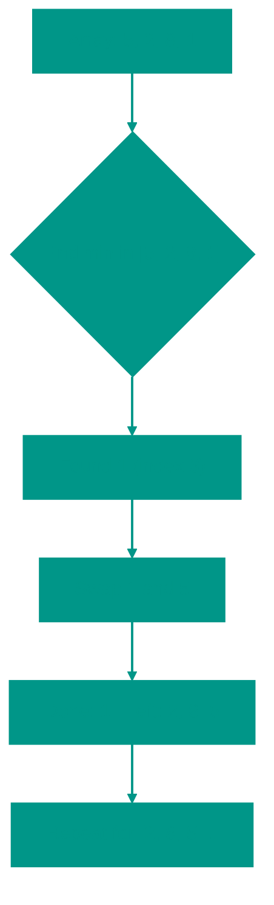

# 📘 Selection Sort

**Description**: 
Selection Sort is another simple algorithm centered on the idea of repeatedly finding the "minimum" element.

- **How it works internally**: The algorithm scans the unsorted part of the array, finds the minimum element, and swaps it with the first element of that part. In the next step, it searches for the minimum in the remaining "tail" and places it in the second position, and so on. The complexity is **O(n²)**.
- **Analogy**: Imagine a basket of fruit of varying sizes. You find the smallest fruit and put it into a new, empty basket. Then you find the smallest among the remaining fruit and place it next.


### Pros and Cons
✅ **Pros**:
1. **Minimal Swaps**: Unlike previous methods, it performs exactly **n** swaps. This is beneficial if writing to memory is an "expensive" operation (e.g., sorting on Flash memory).
2. **Predictability**: The algorithm's runtime doesn't depend on how shuffled the data is—it always performs the same number of comparisons.

❌ **Cons**:
1. **Slow Performance**: It's always O(n²), with no exceptions. It cannot "finish early" even if the array is already mostly sorted.
2. **Unstable**: Identical elements might have their relative order swapped.

---

**Visualization**:



**Complexity**:

| Metric | Complexity (O) |
|:---|:---:|
| Time (All cases) | O(n²) |
| Space | O(1) |

**When to use**: 
- When you need to minimize writes/swaps.
- On small arrays.
- To find the K smallest elements (partial sorting).

---


## 💻 Implementation

```go
package selection_sort

import "fmt"

// SelectionSort implements the classic selection sort algorithm.
func SelectionSort(arr []int) {
	for i := 0; i < len(arr); i++ {
		min := i

		for j := i + 1; j < len(arr); j++ {
			if arr[j] < arr[min] {
				min = j
			}
		}

		arr[i], arr[min] = arr[min], arr[i]
	}
}

// PartialSelectionSort finds the first k smallest elements.
func PartialSelectionSort(arr []int, k int) {
	n := len(arr)
	if k > n {
		k = n
	}

	for i := 0; i < k; i++ {
		minIdx := i
		for j := i + 1; j < n; j++ {
			if arr[j] < arr[minIdx] {
				minIdx = j
			}
		}
		if minIdx != i {
			arr[i], arr[minIdx] = arr[minIdx], arr[i]
		}
	}
}

func main() {
	arr := []int{64, 25, 12, 22, 11}
	SelectionSort(arr)
	fmt.Printf("Sorted array: %v\n", arr)
}
```

```javascript
/**
 * Selection Sort implementation.
 */
function selectionSort(arr) {
  for (let i = 0; i < arr.length; i++) {
    let min = i;

    for (let j = i + 1; j < arr.length; j++) {
      if (arr[j] < arr[min]) {
        min = j;
      }
    }

    if (min !== i) {
      [arr[i], arr[min]] = [arr[min], arr[i]];
    }
  }
  return arr;
}

/**
 * Partial Selection Sort (finds the first k smallest elements).
 */
function partialSelectionSort(arr, k) {
  const n = arr.length;
  const limit = Math.min(k, n);

  for (let i = 0; i < limit; i++) {
    let minIdx = i;
    for (let j = i + 1; j < n; j++) {
      if (arr[j] < arr[minIdx]) {
        minIdx = j;
      }
    }
    if (minIdx !== i) {
      [arr[i], arr[minIdx]] = [arr[minIdx], arr[i]];
    }
  }
  return arr.slice(0, limit);
}

// Usage Example
const data = [64, 25, 12, 22, 11];
console.log(selectionSort(data)); // [11, 12, 22, 25, 64]
```


## 🚀 Practical Problems
```go
package selected_sort

import "fmt"

func Example() {
	// Example 1: Standard Sort
	arr := []int{64, 25, 12, 22, 11}
	fmt.Printf("Original: %v\n", arr)
	SelectedSort(arr)
	fmt.Printf("Sorted:   %v\n", arr)

	// Example 2: Find 3 smallest elements
	arr2 := []int{10, 2, 30, 4, 50, 6}
	k := 3
	PartialSelectionSort(arr2, k)
	fmt.Printf("First %d smallest elements: %v\n", k, arr2[:k])
}

// 1. K-th Smallest Element (Selection Sort approach)
func KthSmallest(arr []int, k int) int {
	// We perform k passes of selection sort
	for i := 0; i < k; i++ {
		minIdx := i
		for j := i + 1; j < len(arr); j++ {
			if arr[j] < arr[minIdx] {
				minIdx = j
			}
		}
		arr[i], arr[minIdx] = arr[minIdx], arr[i]
	}
	// After k iterations, the kth smallest is at index k-1
	return arr[k-1]
}
```

```javascript
// Algorithmic Problems (JS)

// 1. Partial Selection Sort (K-smallest elements)
function partialSort(arr, k) {
  const n = arr.length;
  const limit = Math.min(k, n);
  for (let i = 0; i < limit; i++) {
    let minIdx = i;
    for (let j = i + 1; j < n; j++) {
      if (arr[j] < arr[minIdx]) minIdx = j;
    }
    if (minIdx !== i) {
      [arr[i], arr[minIdx]] = [arr[minIdx], arr[i]];
    }
  }
  return arr.slice(0, limit);
}

// 2. K-th Smallest Element
function kthSmallest(arr, k) {
  for (let i = 0; i < k; i++) {
    let minIdx = i;
    for (let j = i + 1; j < arr.length; j++) {
      if (arr[j] < arr[minIdx]) minIdx = j;
    }
    if (minIdx !== i) {
      [arr[i], arr[minIdx]] = [arr[minIdx], arr[i]];
    }
  }
  return arr[k - 1];
}
```

// Note: In production, QuickSelect (O(n)) or Heap (O(n log k)) is preferred.
// But Selection Sort is O(n*k), which is acceptable for small k.


<!-- QUIZ_START 
[
    {
        "question": "What is the defining characteristic of Selection Sort's swaps?",
        "options": ["It performs O(n²) swaps", "It performs exactly 'n' swaps, which is minimal compared to others", "It never performs any swaps", "It swaps randomly"],
        "correctIndex": 1
    },
    {
        "question": "What is the main drawback of Selection Sort?",
        "options": ["It uses too much memory", "It is unpredictable", "It is always O(n²) and cannot finish early even if the array is sorted", "It only works with integers"],
        "correctIndex": 2
    },
    {
        "question": "How does Selection Sort find the next element to place in the sorted part?",
        "options": ["By picking a random element", "By finding the minimum element in the remaining unsorted part", "By comparing elements pairwise and swapping if needed", "By counting occurrences"],
        "correctIndex": 1
    }
]
QUIZ_END -->

