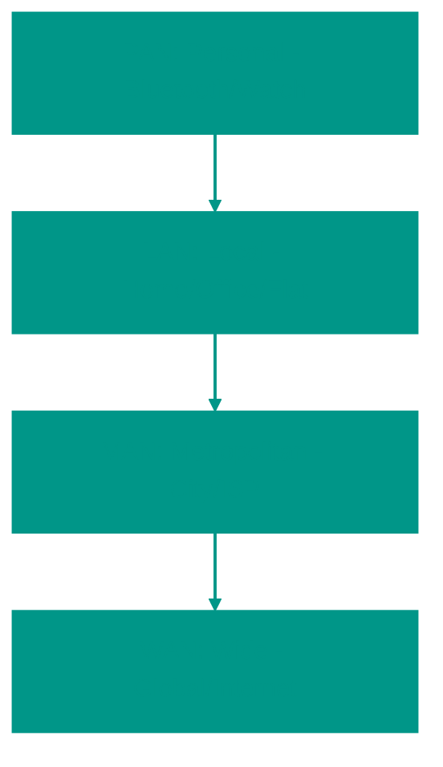

# 🌐 Computer Networking Basics

## 📑 Table of Contents
1. [What is a Network?](#what-is-a-network-and-why-is-it-needed)
2. [Network Classifications (LAN, WAN, MAN)](#types-of-networks)
3. [Network Devices](#network-devices)
4. [Communication Channels](#communication-channels)
5. [Protocols](#understanding-protocols-and-their-role)

---

A **Computer Network** is more than just a collection of wires; it is a complex system of "agreements" (protocols) that allow devices to exchange data. If a computer is the brain, then the network is the nervous system.

---

## 1. 📦 Anatomy of Transfer: The Packet as a Unit of Meaning

Data doesn't travel across wires as a single whole (a 10 GB movie won't fit in one go). It is broken down into small chunks called **packets**.

Imagine you're sending a disassembled cabinet to a friend in several boxes:
- **Box Contents**: The actual part (Data/Payload).
- **Box Label**: From, To, Box number (Header).

> [!TIP]
> **Encapsulation** is the process where data is "wrapped" in layers of headers (L7 -> L4 -> L3 -> L2). It's like a letter placed in an envelope, the envelope in a box, and the box in a container.

---

## 2. 📏 Network Types: From a Room to the Planet

```mermaid
%%{init: { 'theme': 'base', 'themeVariables': { 'lineColor': '#009688', 'primaryColor': '#009688', 'primaryTextColor': '#009688', 'attributeBkg': '#009688', 'attributeTextColor': '#009688', 'signalColor': '#009688', 'actorLineColor': '#009688', 'nodeBorder': '#009688', 'clusterBorder': '#009688', 'textColor': '#009688', 'fontSize': '16px' } } }%%
graph TD
    PAN[PAN: Personal - Bluetooth/Watch]
    LAN[LAN: Local - Home/Office/Flat]
    MAN[MAN: Metropolitan - City/ISP]
    WAN[WAN: Wide - Global/Internet]
    
    PAN --> LAN
    LAN --> MAN
    MAN --> WAN


linkStyle default stroke:#009688,stroke-width:2px;


```

- **LAN (Local)**: Your "sandbox." You are the master: you set the Wi-Fi password, you plug in the cables. Speeds are massive (1-10 Gbps), and latencies are nearly zero.
- **WAN (Wide)**: This is the Internet. You don't control the packet's path. A packet might fly across three oceans before reaching a server in the next city.

---

## 3. 🚦 How It Works in Reality

When you type `google.com`, magic happens:

1. **Request**: Your browser forms a packet: "Hey Google, give me the home page!"
2. **Journey**: The router looks at the IP address and says, "Okay, Google is that way, fly to the ISP." The packet jumps from one router to another (**Hops**).
3. **Processing**: Google's server receives the packet, "unwraps" it, and understands what you want.
4. **Response**: The server sends you packets containing the website's data.

---

## 🛠️ Network "Hardware"

| Device | Role | Analogy |
|:---|:---|:---|
| **Switch** | Connects devices within a single room. | A power strip that knows EXACTLY who is plugged into which outlet. |
| **Router** | Connects your home to the world. | A post office that decides which city to send a letter to. |
| **Cable (Twisted Pair)** | Physically transmits signals. | A highway where bits travel. |

---

## 📜 Protocols — The Rules of the Game

Without protocols, the network would descend into chaos.
- **IP (Internet Protocol)**: Finds the house address.
- **TCP (Transmission Control Protocol)**: Checks that all the cabinet boxes arrived and aren't broken.
- **HTTP**: Negotiates how the text and images should be displayed on the site.

---

## 🎯 Key Takeaways

- Data is always divided into **packets**.
- Networks operate on a **Request-Response** principle.
- A **Protocol** is the law. Break the protocol, and the packet flies into nowhere.

---

## 🎯 Key Takeaways

- Networks are built from physical **devices** (routers, switches) and transmission **channels** (cables, radio waves).
- **LAN** is your internal "fortress," while **WAN** connects you to the outside world.
- **Protocols** are the essential rules that guarantee different devices can understand each other.

<!-- QUIZ_START 
[
    {
        "question": "What type of network typically covers a home or office and is characterized by high speeds and low latency?",
        "options": ["WAN", "LAN", "PAN", "MAN"],
        "correctIndex": 1
    },
    {
        "question": "Which network device is responsible for connecting different networks and determining the best path for data packets?",
        "options": ["Switch", "Access Point (AP)", "Router", "Hub"],
        "correctIndex": 2
    },
    {
        "question": "Which protocol in the TCP/IP suite is responsible for reliable data delivery with confirmation of receipt?",
        "options": ["IP", "HTTP", "UDP", "TCP"],
        "correctIndex": 3
    }
]
QUIZ_END -->
