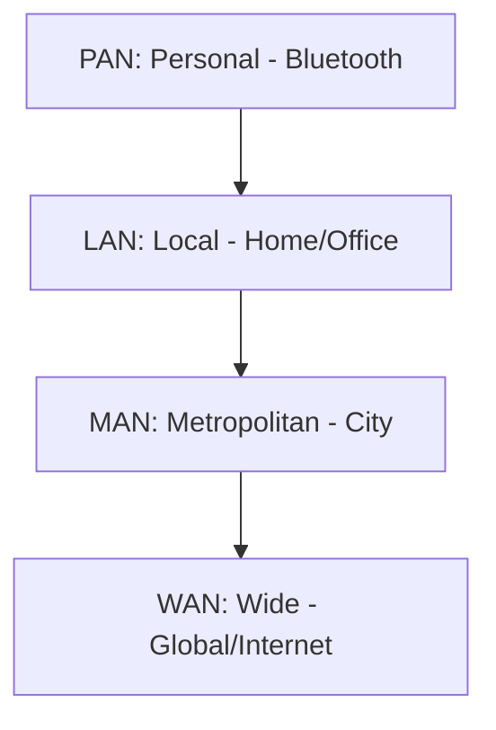
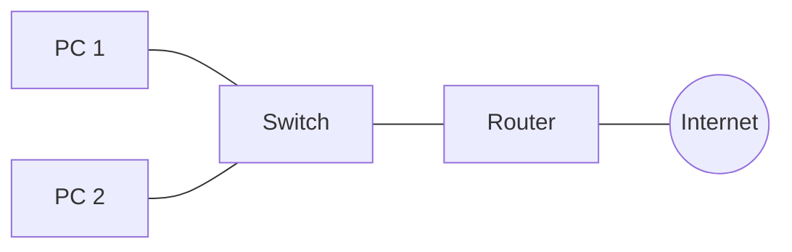

# 🌐 Computer Networking Basics

## 📑 Table of Contents
1. [What is a Network?](#what-is-a-network-and-why-is-it-needed)
2. [Network Classifications (LAN, WAN, MAN)](#types-of-networks)
3. [Network Devices](#network-devices)
4. [Communication Channels](#communication-channels)
5. [Protocols](#understanding-protocols-and-their-role)

---

A **Computer Network** is a logical and physical system that Allows devices to "talk" to one another, sharing files, resources, and information.

---

## 1. 📏 Network Types by Scale

- **LAN (Local Area Network)**: Your home network or office Wi-Fi. Characterized by high speeds and low latency within a limited geographical area.
- **WAN (Wide Area Network)**: A global network connecting cities and countries. The **INTERNET** is the largest and most well-known WAN.

---

## 2. 🛠️ Essential Devices

| Device | Role | OSI Layer |
|:---|:---|:---:|
| **Router** | Connects different networks and determines the best path for data packets. | L3 (Network) |
| **Switch** | Connects multiple devices within a single local network (LAN). | L2 (Data Link) |
| **Access Point (AP)** | Provides wireless (Wi-Fi) connectivity to the network. | L1/L2 |

---

## 3. 🛣️ Communication Channels

### Wired:
- **Twisted Pair (Ethernet)**: Standard copper cabling. Cost-effective and widely used for office/home LANs.
- **Fiber Optics**: Uses light pulses through glass strands. Offers incredible speed over long distances and is immune to electromagnetic interference.

### Wireless:
- **Wi-Fi**: Convenient and mobile, though signal speed degrades with distance and physical obstacles (walls).
- **4G/5G**: Mobile cellular networks providing high-speed internet on the move.

---

## 4. 📜 Protocols — The Language of Machines

Protocols are sets of formal rules for data exchange. If one device speaks "Chinese" and the other "Spanish," no communication will occur without a shared protocol.

> [!NOTE]
> The fundamental suite of protocols powering the modern digital world is **TCP/IP**.

- **IP (Internet Protocol)**: Determines **WHERE** to send data (addressing).
- **TCP (Transmission Control Protocol)**: Manages **HOW** to send data (ensuring reliability and delivery confirmation).
- **HTTP/HTTPS**: Determines **WHAT** to send (the actual website content).

---

## 🎯 Key Takeaways

- Networks are built from physical **devices** (routers, switches) and transmission **channels** (cables, radio waves).
- **LAN** is your internal "fortress," while **WAN** connects you to the outside world.
- **Protocols** are the essential rules that guarantee different devices can understand each other.
