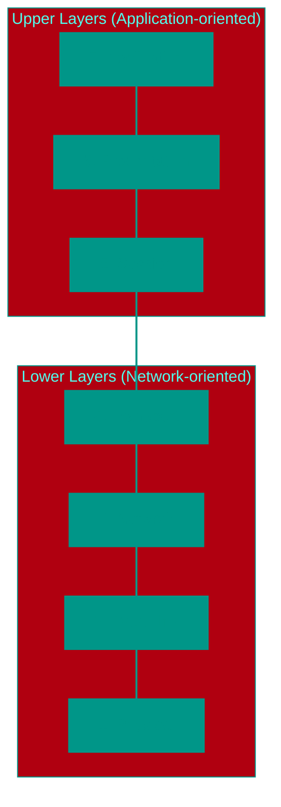

# 🏗️ The OSI Model (Open Systems Interconnection)

## 📑 Table of Contents
1. [What is OSI?](#overview-of-the-7-layers)
2. [Deep Dive into the 7 Layers](#functional-roles-and-technologies)
3. [Data Flow: Encapsulation and Decapsulation](#encapsulation-and-decapsulation)
4. [Multi-Layer Analysis and Diagnostics](#diagnostics)

---

The **OSI Model** is a conceptual framework that standardizes the functions of a computing system into seven logical layers. This modular approach facilitates the development of interoperable network protocols and hardware by providing the industry with a common language and structural reference.

---

## 1. 🪜 The Seven Layers of OSI: Interaction Architecture

```mermaid
%%{init: { 'theme': 'base', 'themeVariables': { 'lineColor': '#009688', 'primaryColor': '#009688', 'primaryTextColor': '#009688', 'attributeBkg': '#009688', 'attributeTextColor': '#009688', 'signalColor': '#009688', 'actorLineColor': '#009688', 'nodeBorder': '#009688', 'clusterBorder': '#009688', 'textColor': '#009688', 'fontSize': '16px' } } }%%
graph TD
    subgraph Upper ["Upper Layers (Application-oriented)"]
    L7[7. Application]
    L6[6. Presentation]
    L5[5. Session]
    end
    
    subgraph Lower ["Lower Layers (Network-oriented)"]
    L4[4. Transport]
    L3[3. Network]
    L2[2. Data Link]
    L1[1. Physical]
    end
    
    L7 --- L6 --- L5 --- L4 --- L3 --- L2 --- L1


linkStyle default stroke:#009688,stroke-width:2px;


```

---

## 2. 🔍 Functional Roles and PDUs (Protocol Data Units)

Each layer operates with a specific unit of exchange known as a **PDU**.

| Layer | PDU | Functional Role | Examples |
|:---|:---|:---|:---|
| **7. Application** | Data | Direct interface for end-user applications. | HTTP, DNS, FTP, SMTP |
| **6. Presentation** | Data | Data formatting, encryption, and compression. | JSON, XML, TLS, ASCII |
| **5. Session** | Data | Managing communication sessions (start, stop, restart). | RPC, NetBIOS, PAP |
| **4. Transport** | **Segment/Datagram** | End-to-end communication and error recovery. | TCP, UDP |
| **3. Network** | **Packet** | Logical addressing and path determination. | IP (IPv4/IPv6), ICMP, BGP |
| **2. Data Link** | **Frame** | Physical addressing and access control. | Ethernet, Wi-Fi (802.11) |
| **1. Physical** | **Bits** | Transmission of raw bit streams over physical media. | Fiber, Twisted Pair, Coaxial |

---

## 📦 Encapsulation and Decapsulation

Data transmission through the OSI stack relies on a hierarchical embedding process:
1. **Encapsulation**: As data descends from L7 to L1, each layer wraps the payload from the layer above with its own Header (containing control metadata for the corresponding layer at the destination).
2. **Decapsulation**: Upon receipt, data ascends from L1 to L7. Each layer processes its respective header, performs the required actions, and passes the remaining payload to the next higher layer.

---

## 🛠️ Multi-Layer Analysis and Diagnostics

Understanding the OSI model is essential for systematically identifying and resolving technical issues:

- **Application Layer (L7)**: Troubleshooting application-specific errors and payloads (e.g., using `curl`, log analysis).
- **Transport Layer (L4)**: Verifying service availability via specific ports and connection states (e.g., `telnet`, `nc`, `nmap`).
- **Network Layer (L3)**: Diagnosing routing issues and node reachability via IP addresses (e.g., `ping`, `traceroute`, `mtr`).
- **Data Link Layer (L2)**: Monitoring interface statistics and MAC address resolution.

---

## 🎯 Key Takeaways

- The OSI model modularizes network communication, enabling different systems to communicate effectively.
- **Lower Layers (1-4)** are primarily concerned with data transport, while **Upper Layers (5-7)** focus on data presentation and application logic.
- Systematic debugging requires verifying the integrity of lower layers before addressing issues at the application level.

<!-- QUIZ_START 
[
    {
        "question": "At which OSI layer do routers operate (routing and IP addressing)?",
        "options": ["L2 (Data Link)", "L3 (Network)", "L4 (Transport)", "L7 (Application)"],
        "correctIndex": 1
    },
    {
        "question": "What is the process called when each OSI layer adds its own header to data as it is sent down the stack?",
        "options": ["Decapsulation", "Segmentation", "Encapsulation", "Fragmentation"],
        "correctIndex": 2
    },
    {
        "question": "To which OSI layer does the HTTP protocol belong?",
        "options": ["Presentation Layer", "Session Layer", "Transport Layer", "Application Layer"],
        "correctIndex": 3
    }
]
QUIZ_END -->

