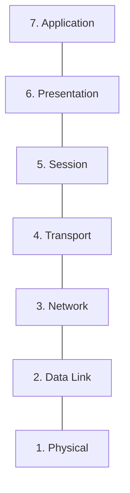
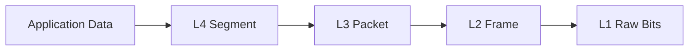

# 🏗️ The OSI Model (Open Systems Interconnection)

## 📑 Table of Contents
1. [What is OSI?](#overview-of-the-7-layers)
2. [Deep Dive into the 7 Layers](#task-of-each-layer-and-examples)
3. [How Data Flows Through the Layers](#encapsulation-and-decapsulation)
4. [OSI for Developers](#why-backend-developers-need-to-understand-osi)

---

The OSI model is a theoretical framework. It explains the journey data takes from raw bits in a physical cable to a rendered web page in your browser.

---

## 1. 🪜 The Seven Layers of OSI

> [!TIP]
> To remember the order from bottom to top, use the mnemonic: **Please Do Not Throw Sausage Pizza Away** (Physical, Data Link, Network, Transport, Session, Presentation, Application).

---

## 2. 🔍 Layer Breakdown

| Layer | Responsibility | Examples |
|:---|:---|:---|
| **7. Application** | Human-computer interaction; network services. | HTTP, FTP, SMTP, DNS |
| **6. Presentation** | Data formatting, encryption, and translation. | JSON, SSL/TLS, JPEG |
| **5. Session** | Managing connections and synchronization. | NetBIOS, RPC |
| **4. Transport** | Reliable (or fast) data delivery. | TCP, UDP |
| **3. Network** | Logical addressing and routing. | IP, ICMP, Routers |
| **2. Data Link** | Physical addressing (MAC); local transfers. | Ethernet, MAC, Switches |
| **1. Physical** | Raw bitstream over physical media. | Fiber, Wi-Fi, Cables |

---

## 3. 📦 Encapsulation and Decapsulation

As data travels down the stack, each layer "wraps" the data with its own header information. This is called **Encapsulation**. When the recipient receives the data, it "unwraps" it layer by layer (**Decapsulation**).

---

## 4. 💻 Why It Matters for Backend Developers

- **Debugging**: "Pings are succeeding (L3), but the API is unreachable (L7)." The model helps you isolate exactly where a failure is occurring.
- **Cloud Infrastructure**: Security Groups and Load Balancers (ALB vs. NLB) operate at different OSI layers. Choosing the wrong one can lead to performance or security issues.
- **Architectural Decisions**: Choosing between gRPC and REST involves weighing the overhead of Layer 7 against the performance optimizations available at Layer 4.

> [!IMPORTANT]
> A common interview question: "At which layer does a Load Balancer operate?"
> **Answer**: Most modern web balancers (like Nginx) operate at **L7** (Application), but high-performance network balancers can operate at **L4** (Transport).

---

## 🎯 Key Takeaways

- OSI is a **blueprint**, not a literal protocol implementation.
- Layers 1-3 deal with **hardware and routing**.
- Layers 4-7 focus on **software logic and application data**.
- **Encapsulation** is the "Matryoshka doll" principle of network communication.
