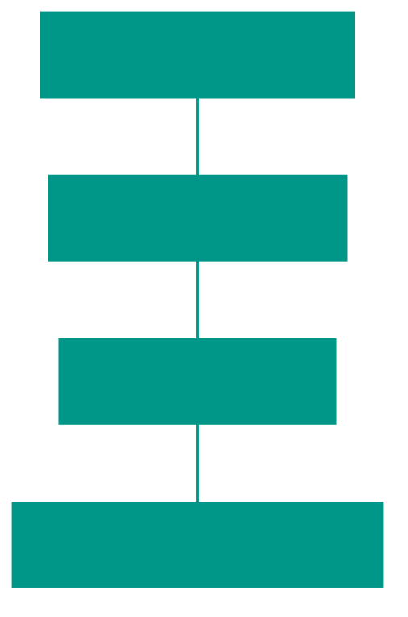

# 🛠️ The TCP/IP Model

## 📑 Table of Contents
1. [Why TCP/IP?](#the-practical-standard)
2. [The Four Layers of the Model](#four-layer-structure)
3. [Comparison with OSI](#tcp-ip-vs-osi)
4. [The Journey of a Packet](#data-flow-scenario)

---

If OSI is an academic theory, then **TCP/IP** is a rugged practice. This model (sometimes called the "Department of Defense model") was born before OSI and became the standard simply because it worked.

---

## 1. 🪜 The Four Layers of TCP/IP: The Reality of the Internet

The TCP/IP model combines OSI layers, focusing on what a programmer actually needs to know.

| Layer | What's happening? | Key Players |
|:---|:---|:---|
| **1. Application** | Your application logic. | HTTP/3, gRPC, DNS, SSH, MQTT |
| **2. Transport** | Data delivery between processes (Ports). | TCP, UDP, QUIC |
| **3. Internet** | Packet delivery between hosts (IP). | IPv4, IPv6, ICMP, IPsec |
| **4. Network Access** | Physical medium and Frames. | Ethernet, Wi-Fi 6, 5G, ARP |

---

## ⚖️ Why Did TCP/IP Defeat OSI?

| Feature | OSI Model | TCP/IP Model |
|:---|:---|:---|
| **Status** | Academic reference. | Industry standard. |
| **Approach** | Theory first, code later. | Working code first, description later. |
| **Complexity** | Redundant (7 layers). | Minimalist and efficient (4-5 layers). |

---

## 🏛️ Core Concepts

### 1. The "End-to-End" Principle
This is the "philosophy" of the Internet. Only the edges should be smart (your PC and the server). The network itself should be as simple as possible—just "shoveling packets." If a packet is lost, it's the edges' problem (TCP), not the network's.

### 2. The "Hourglass" Principle
IP (Internet Layer) is the "neck" of the hourglass. Above it can be hundreds of protocols (HTTP, FTP, Voice), and below it can be hundreds of physical media (Copper, Fiber, Satellite), but they all converge at one point — the **IP** protocol.

### 3. Encapsulation: The Packet's Journey
As a packet "descends" the stack, it gains metadata:
- **Layer 4**: Adds ports (from where/to where in the system).
- **Layer 3**: Adds IPs (from where/to where in the world).
- **Layer 2**: Adds MAC (the next hop in the local network).

---

## 🚀 The Modern Era: QUIC and HTTP/3
For decades, TCP was the only king of reliability. Today, **QUIC** (from Google) is taking over. It runs on top of UDP but handles all TCP functions and even TLS (encryption), making the web significantly faster.

---

## 🎯 Key Takeaways

- **TCP/IP** is what your next microservice is written on.
- The **Internet Layer** (IP) does not guarantee delivery; that is the job of the **Transport Layer** (TCP).
- The entire internet relies on one agreement: everyone uses **IP**.

<!-- QUIZ_START 
[
    {
        "question": "How many layers does the classic practical TCP/IP model contain?",
        "options": ["7", "5", "4", "3"],
        "correctIndex": 2
    },
    {
        "question": "Which of the following protocols operates at the Internet layer and is responsible for addressing?",
        "options": ["TCP", "IP", "UDP", "Ethernet"],
        "correctIndex": 1
    },
    {
        "question": "What is the main difference between the UDP and TCP protocols?",
        "options": ["UDP guarantees delivery", "UDP is slower but more reliable", "UDP is focused on speed and does not use a 'handshake'", "UDP operates at the application layer"],
        "correctIndex": 2
    }
]
QUIZ_END -->
