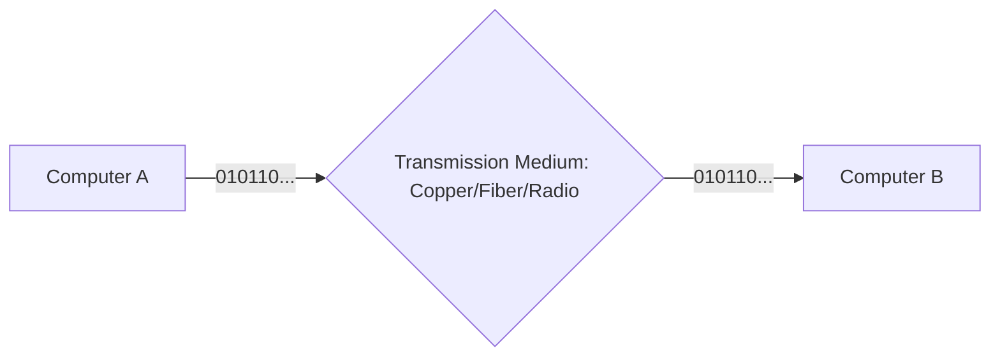
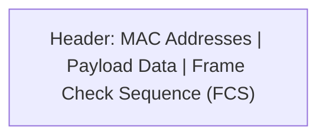
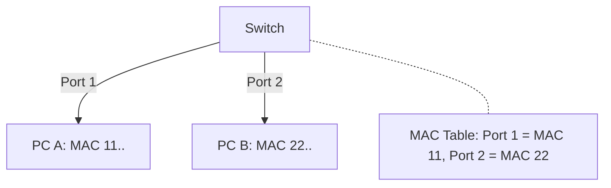

# 🔌 OSI L1 & L2: Physical and Data Link Layers

## 📑 Table of Contents
1. [Physical Layer (L1): Bits and Signals](#physical-signals)
2. [Data Link Layer (L2): Frames and MAC addresses](#data-link-frames)
3. [Switching](#switching-and-collisions)
4. [The Ethernet Frame](#ethernet-frame-structure)

---

These two layers form the absolute "foundation" of a network. They are responsible for ensuring that a raw electrical impulse, light beam, or radio wave is transformed into a structured, understandable data format.

---

## 1. ⚡ L1: Physical Layer

At this layer, there are no names, addresses, or logic—only volts, hertz, and bits.

- **Transmission Media**:
  - **Copper (Twisted Pair)**: Cost-effective and widely used, but susceptible to electromagnetic interference and signal degradation over long distances.
  - **Fiber Optics**: Uses light pulses. It is expensive but offers extreme speeds over long distances and is completely immune to electrical interference.
  - **Radio (Wi-Fi/Cellular)**: High convenience, but the medium is "shared"—multiple devices must coordinate to broadcast without colliding.

---

## 2. 🧱 L2: Data Link Layer

At this stage, raw bits are grouped into logical packets called **Frames**. The primary identifier here is the **MAC Address**.

> [!IMPORTANT]
> **MAC Address**: A unique hardware identifier "burned" into the network interface card (NIC) at the factory. It allows devices to identify each other within the same local network (LAN).

---

## 3. 🧠 The Switch: The Intelligent Heart of the LAN

Unlike older "Hubs" (which mindlessly broadcast data to every port), a **Switch** maintains a MAC table to learn which device is connected to which physical port.

- **CSMA/CD**: A carrier-sense mechanism that ensures two devices don't attempt to "speak" at the exact same time on a shared medium, preventing data collisions.

---

## 4. 💻 Why This Matters for Backend Developers

1. **VLANs**: Understanding how one physical switch can be partitioned into multiple isolated logical networks is crucial for cloud infrastructure security.
2. **MTU (Maximum Transmission Unit)**: The largest possible frame size (typically 1500 bytes). Sending data larger than the MTU results in fragmentation, which increases overhead and latency.
3. **ARP (Address Resolution Protocol)**: The process of translating a high-level IP address into a low-level MAC address so that data can actually be delivered locally.

---

## 🎯 Key Takeaways

- **L1 (Physical)** manages the raw cables and electrical signals.
- **L2 (Data Link)** handles the logic of communication between "neighbors" inside the same local network.
- **MAC Address** is for local identification; **IP Address** is for global identification.
