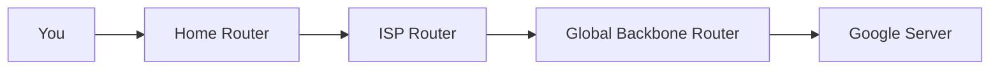

# 📍 OSI L3: The Network Layer

## 📑 Table of Contents
1. [IP Protocol (v4 and v6)](#internet-protocol-versions-ipv4-vs-ipv6)
2. [Packet Routing](#how-packets-find-their-path)
3. [NAT: Living with IP Scarcity](#network-address-translation-nat)
4. [Router vs. Switch](#the-role-of-routers)

---

The Network Layer is essentially the "post office" of the internet. Its primary task is to deliver a packet from Point A (e.g., New York) to Point B (e.g., Tokyo), regardless of how many intermediate networks sit between them.

---

## 1. 📬 The IP Protocol — Our Global Address

While a MAC address identifies a specific piece of hardware (like a person's name), an IP address identifies its current location on the network (like a mailing address).

### IPv4 vs. IPv6
- **IPv4**: The traditional `192.168.1.1` format. The world has nearly run out of these addresses (there are only ~4.3 billion).
- **IPv6**: A massive hexadecimal format such as `2001:0db8:85a3...`. It provides more than enough addresses for every single grain of sand on Earth.

> [!NOTE]
> **NAT (Network Address Translation)**: A technique used to allow an entire private network (like your home or office) to connect to the internet using just one single public IP address.

---

## 2. 🗺️ How Routing Works

A single packet doesn't know the entire path to its destination. Instead, it "hops" from one router to the next.

- **TTL (Time To Live)**: A safety mechanism. Each packet has a TTL value that decreases after every "hop." If it reaches zero, the packet is discarded. This prevents packets from circling the internet forever in an infinite loop.

---

## 3. 🚦 The Router

A **Router** is a specialized computer that reads IP headers and forwards packets in the correct direction based on its routing table.

| Device | Layer | Address Type | Scope |
|:---|:---:|:---:|:---|
| **Switch** | L2 | MAC | Local Network (LAN) |
| **Router** | L3 | IP | Global Interconnected Networks |

---

## 4. 🛠️ Practical Knowledge for Backend Developers

1. **Traceroute**: A diagnostic tool that shows the path routers take to reach a server. Use it to find where high latency—or "lag"—is being introduced.
2. **VPC & Subnets**: In modern cloud environments (AWS/GCP), you configure **Route Tables** to define which services are public-facing and which remain isolated in private subnets.
3. **Public vs. Private IPs**: For security, critical infrastructure like databases should never be assigned a public IP address.

---

## 🎯 Key Takeaways

- **L3** unifies different physical technologies (Ethernet, Wi-Fi, 5G) into one global network.
- **Routing** is the dynamic process of choosing the next step for a data packet.
- **NAT** is the essential glue that hides local networks behind a single public-facing identity.
