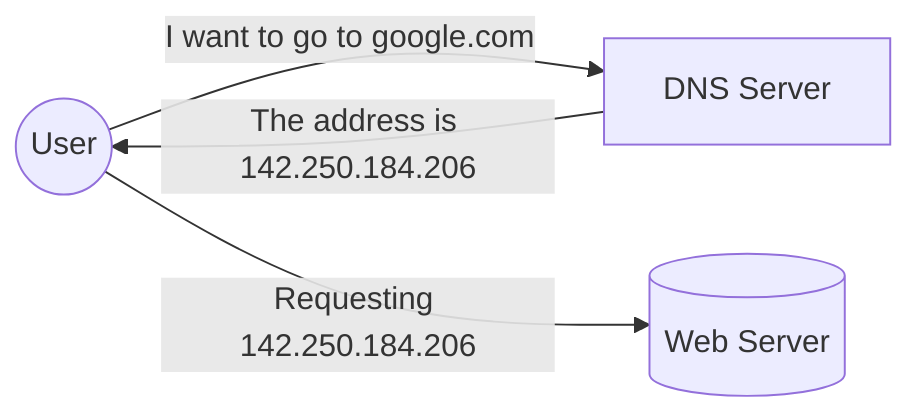
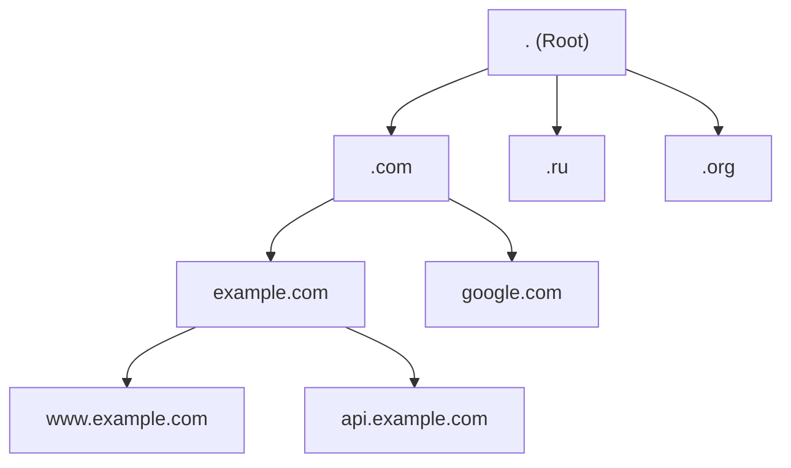
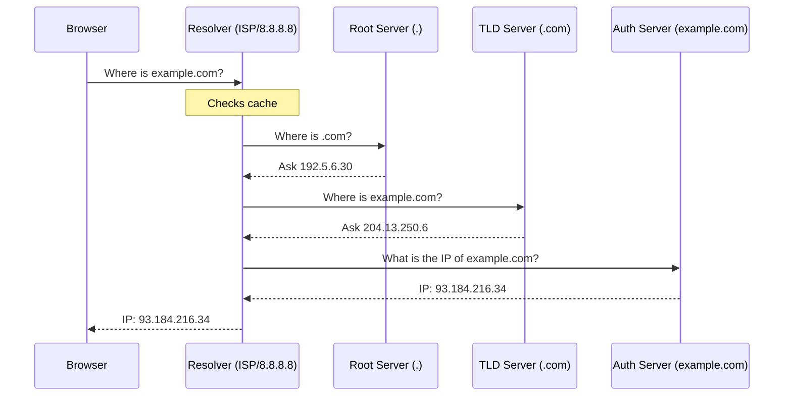

# 📞 Domain Name System (DNS)

## 📑 Table of Contents
1. [What is DNS and Why is it Needed?](#what-is-dns-and-why-is-it-needed)
2. [DNS Hierarchy](#dns-hierarchy)
3. [The Name Resolution Process](#the-name-resolution-process)
4. [Record Types and Configuration](#dns-configuration)
5. [Security (DNSSEC, DoH, DoT)](#dns-security)

---

**DNS (Domain Name System)** is the "phone book" of the internet. It translates human-readable names (e.g., `google.com`) into IP addresses that computers understand.

---

## 1. ❓ What is DNS and Why is it Needed?

- **Convenience**: It's easier for humans to remember words rather than numbers.
- **Flexibility**: You can change your server (IP) while keeping the same domain name.
- **Distributed Nature**: There is no single "central" server; the database is distributed worldwide.

> [!NOTE]
> DNS primarily operates over the **UDP** protocol on port **53** for speed. If a response is too large, it falls back to **TCP 53**.

---

## 2. 🌳 DNS Hierarchy

DNS is a hierarchical tree-like structure that is read **from right to left**.

1. **Root (.)**: Root servers. They know where to look for TLDs.
2. **TLD (Top-Level Domain)**: Examples include `.com`, `.ru`, `.net`.
3. **Second-Level Domain**: `example.com`.
4. **Subdomain**: `api.example.com`.

---

## 3. 🔍 The Name Resolution Process

When you enter a URL, a chain of queries occurs:

### Caching and TTL
- **TTL (Time To Live)**: The duration (in seconds) that a resolver can store a response in its cache.
- **Purpose**: To reduce network load and speed up future requests.

> [!TIP]
> If you plan to change a server's IP, lower the TTL (e.g., to 300 seconds) a day before the move, so users receive the new address faster.

---

## 4. ⚙️ DNS Configuration: Record Types

| Record | Description | Example |
|:---|:---|:---|
| **A** | Hostname -> IPv4 | `example.com -> 1.2.3.4` |
| **AAAA** | Hostname -> IPv6 | `example.com -> 2a00:1450...` |
| **CNAME** | Canonical Name (Alias) | `www -> example.com` |
| **MX** | Mail Exchange | `mail.example.com` |
| **TXT** | Text Records | Used for verification (SPF, DKIM) |
| **NS** | Nameserver | `ns1.cloudflare.com` |

---

## 5. 🛡️ DNS Security

### DNSSEC
Adds digital signatures to DNS records. It ensures that the IP address received hasn't been tampered with by an attacker along the way.

### Privacy and Leaks:
Standard DNS queries are sent in plain text. Anyone (ISPs, public Wi-Fi admins) can see which sites you visit.
1. **DoH (DNS over HTTPS)**: Queries are hidden inside standard HTTPS traffic.
2. **DoT (DNS over TLS)**: A dedicated encrypted channel for DNS.

> [!IMPORTANT]
> For a backend developer, DNS isn't just about websites; it's also vital for service discovery (e.g., how microservices find each other in Kubernetes).

---

## 🎯 Key Takeaways

- DNS translates domain names into IP addresses.
- The hierarchy is: `Root -> TLD -> SLD -> Subdomain`.
- Recursive resolvers handle the multi-step lookup process on our behalf.
- **TTL** determines how quickly DNS changes propagate across the internet.
- **DNSSEC** protects against DNS spoofing.
