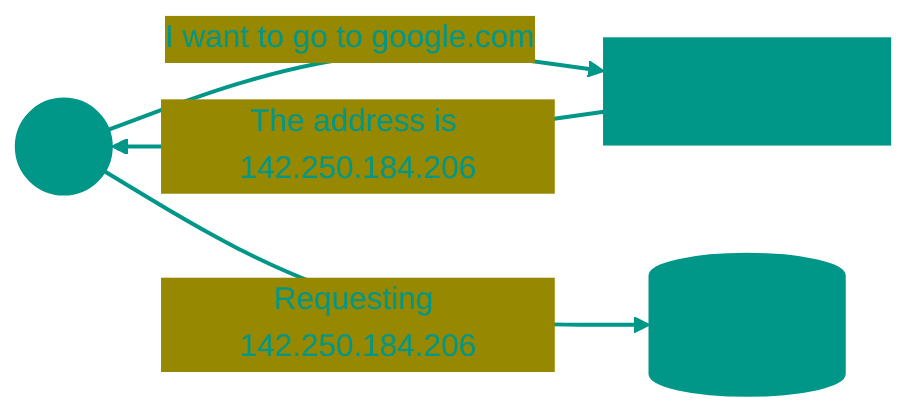
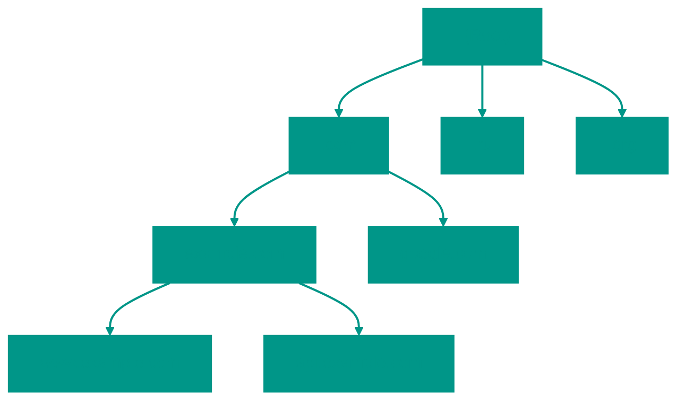

# 📞 Domain Name System (DNS)


## 📑 Table of Contents
1. [What is DNS and Why is it Needed?](#what-is-dns-and-why-is-it-needed)
2. [DNS Hierarchy](#dns-hierarchy)
3. [The Name Resolution Process](#the-name-resolution-process)
4. [Record Types and Configuration](#dns-configuration)
5. [Security (DNSSEC, DoH, DoT)](#dns-security)

---

**DNS (Domain Name System)** is the "phone book" of the internet. It translates human-readable names (e.g., `google.com`) into IP addresses that computers understand.



---


## 1. ❓ What is DNS and Why is it Needed?

- **Convenience**: It's easier for humans to remember words rather than numbers.
- **Flexibility**: You can change your server (IP) while keeping the same domain name.
- **Distributed Nature**: There is no single "central" server; the database is distributed worldwide.

> [!NOTE]
> DNS primarily operates over the **UDP** protocol on port **53** for speed. If a response is too large, it falls back to **TCP 53**.

---


## 2. 🔍 How is an Address Actually Found?

Name resolution is not a single query, but a full investigation.


### Recursion vs. Iteration
- **Recursive Query**: You ask your ISP or Google (8.8.8.8): "Find the IP for `example.com` and don't come back without an answer!" The resolver takes on all the work.
- **Iterative Query**: The resolver asks the Root server: "Where is `example.com`?". It replies: "I don't know, but I know who is responsible for `.com`. Ask them." This repeats until the final answer is found.


### Root Servers
There are only 13 (logical addresses), labeled A through M. Through **Anycast**, these 13 addresses are served by hundreds of servers globally, so your request never has to travel across an ocean.

---


## 🌳 DNS Hierarchy

DNS is a hierarchical tree-like structure that is read **from right to left**.



1. **Root (.)**: Root servers. They know where to look for TLDs.
2. **TLD (Top-Level Domain)**: Examples include `.com`, `.ru`, `.net`.
3. **Second-Level Domain**: `example.com`.
4. **Subdomain**: `api.example.com`.

---


## 3. 🔍 The Name Resolution Process

When you enter a URL, a chain of queries occurs:

```mermaid
%%{init: { 'theme': 'base', 'themeVariables': { 'lineColor': '#009688', 'primaryColor': '#009688', 'primaryTextColor': '#009688', 'attributeBkg': '#009688', 'attributeTextColor': '#009688', 'signalColor': '#009688', 'actorLineColor': '#009688', 'nodeBorder': '#009688', 'clusterBorder': '#009688', 'textColor': '#009688', 'fontSize': '16px' } } }%%
sequenceDiagram
    participant User as Browser
    participant Resolver as Resolver (ISP/8.8.8.8)
    participant Root as Root Server (.)
    participant TLD as TLD Server (.com)
    participant Auth as Auth Server (example.com)

    User->>Where is example.com?
    Note over Resolver: Checks cache
    Resolver->>Root: Where is .com?
    Root-->>Resolver: Ask 192.5.6.30
    Resolver->>TLD: Where is example.com?
    TLD-->>Resolver: Ask 204.13.250.6
    Resolver->>Auth: What is the IP of example.com?
    Auth-->>Resolver: IP: 93.184.216.34
    Resolver-->>User: IP: 93.184.216.34


```


### Caching and TTL
- **TTL (Time To Live)**: The duration (in seconds) that a resolver can store a response in its cache.
- **Purpose**: To reduce network load and speed up future requests.

> [!TIP]
> If you plan to change a server's IP, lower the TTL (e.g., to 300 seconds) a day before the move, so users receive the new address faster.

---


## 4. ⚙️ DNS Configuration: What Can You Put in DNS?

It's important to know more than just the `A` record:

| Record | Description | Example |
|:---|:---|:---|
| **A** | Hostname -> IPv4 | `example.com -> 1.2.3.4` |
| **AAAA** | Hostname -> IPv6 | `example.com -> 2a00:1450...` |
| **CNAME** | A link to another name. | `shop.com -> stores.shopify.com` |
| **ALIAS** | CNAME for the domain root. | `example.com -> lb.aws.com` |
| **MX** | Where to send email. | `mail.example.com` |
| **TXT** | Text data (SPF, DKIM). | `v=spf1 include:_spf...` |
| **PTR** | Reverse DNS: IP -> Name. | `1.2.3.4 -> mail.example.com` |
| **NS** | Nameserver for the zone. | `ns1.cloudflare.com` |

---


## 5. 🛡️ DNS Security


### DNSSEC
Adds digital signatures to DNS records. It ensures that the IP address received hasn't been tampered with by an attacker along the way.


### Privacy and Leaks:
Standard DNS queries are sent in plain text. Anyone (ISPs, public Wi-Fi admins) can see which sites you visit.
1. **DoH (DNS over HTTPS)**: Queries are hidden inside standard HTTPS traffic. Now your ISP doesn't know which sites you visit.
2. **DoT (DNS over TLS)**: A dedicated encrypted channel for DNS.

> [!IMPORTANT]
> DNS isn't just about websites; it's also vital for service discovery (e.g., how microservices find each other in Kubernetes).

---


## 🎯 Key Takeaways

- DNS translates domain names into IP addresses.
- The hierarchy is: `Root -> TLD -> SLD -> Subdomain`.
- Recursive resolvers handle the multi-step lookup process on our behalf.
- **TTL** determines how quickly DNS changes propagate across the internet.
- **DNSSEC** protects against DNS spoofing.

<!-- QUIZ_START 
[
    {
        "question": "Over which network protocol and on which port do DNS servers typically receive standard queries to ensure maximum speed?",
        "options": ["TCP 80", "UDP 53", "HTTPS 443", "TCP 53"],
        "correctIndex": 1
    },
    {
        "question": "What does the TTL (Time To Live) parameter in a DNS record setting determine?",
        "options": ["The time after which the site will stop working", "The duration for which a resolver can store the response in its cache", "The maximum number of hops for a packet", "The page loading speed"],
        "correctIndex": 1
    },
    {
        "question": "Which technology adds a digital signature to DNS responses to guarantee they hasn't been tampered with by an attacker?",
        "options": ["HTTPS", "DoH", "DNSSEC", "TTL"],
        "correctIndex": 2
    }
]
QUIZ_END -->
