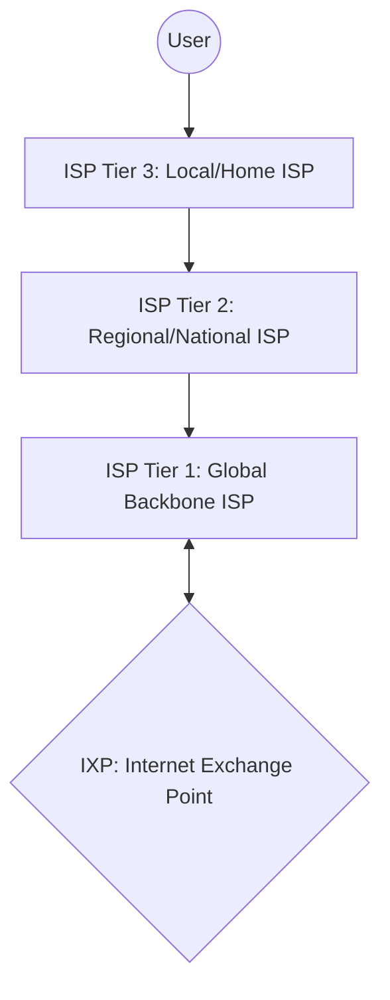
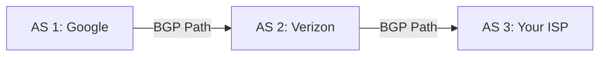
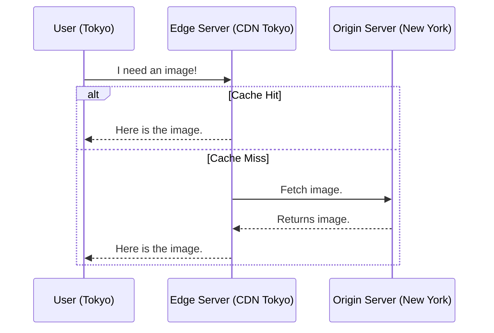

# 🌐 The Internet and Its Infrastructure

## 📑 Table of Contents
1. ["Network of Networks" Architecture](#internet-architecture)
2. [ISP Hierarchy (Tiers)](#internet-providers-and-exchange-points)
3. [BGP — The Glue of the Internet](#bgp-border-gateway-protocol)
4. [CDN (Content Delivery Network)](#cdn-content-delivery-networks)

---

The internet is not a single entity; it is a collection of millions of independent networks that have agreed to work together.

---

## 1. 🏗️ Provider Hierarchy

- **Tier 1**: The "Kings of the Internet" (e.g., AT&T, Level 3). They own the massive subsea cables spanning oceans and peer with each other without paying for transit.
- **Tier 2**: Larger regional networks that pay Tier 1 providers for global reach but also peer directly with each other.
- **Tier 3**: Local providers who sell residential and business internet. They pay Tier 2 or Tier 1 providers for access.

> [!NOTE]
> **IXP (Internet Exchange Point)**: Specialized facilities where different ISPs connect their networks directly to exchange traffic, reducing latency and costs.

---

## 2. 🗺️ BGP — Border Gateway Protocol

BGP is the "GPS" of the internet. It calculates and decides which path (through which countries and networks) your data packets should take to reach their destination.

> [!WARNING]
> **BGP Hijacking**: If an Autonomous System (AS) maliciously or accidentally "advertises" an incorrect, more efficient route to a destination (like Google), it can intercept or disrupt traffic for entire countries.

---

## 3. ☁️ Cloud Networking (VPC)

Inside the cloud (e.g., AWS, GCP), you build your own private virtual infrastructure.

- **VPC (Virtual Private Cloud)**: Your isolated virtual network "sandbox" in the cloud.
- **Subnet**: Segments of a VPC. For example, a "Public Subnet" for web servers and a "Private Subnet" for databases to enhance security.

---

## 4. 🚀 CDN — Content Delivery Networks

Why download an image from across the globe when you can get it from a server in your own city?

### Popular CDN Providers:
1. **Cloudflare**: Market leader for security and performance.
2. **Akamai**: One of the oldest and largest enterprise CDN providers.
3. **AWS CloudFront**: Native CDN integration for the Amazon ecosystem.

---

## 🎯 Key Takeaways

- The stability and reach of the internet depend on **BGP**.
- **Tier 1** providers form the global backbone foundation.
- **CDNs** are essential for making websites fast and accessible globally.
- **VPC** is the core component for secure cloud infrastructure.
