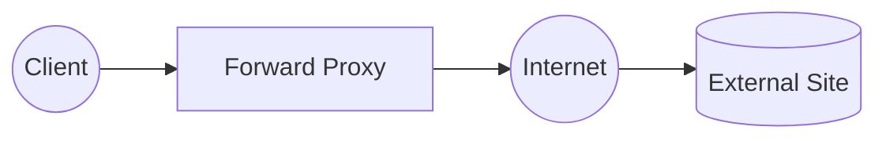
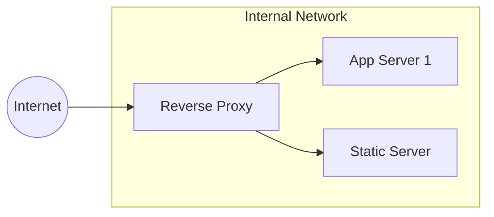
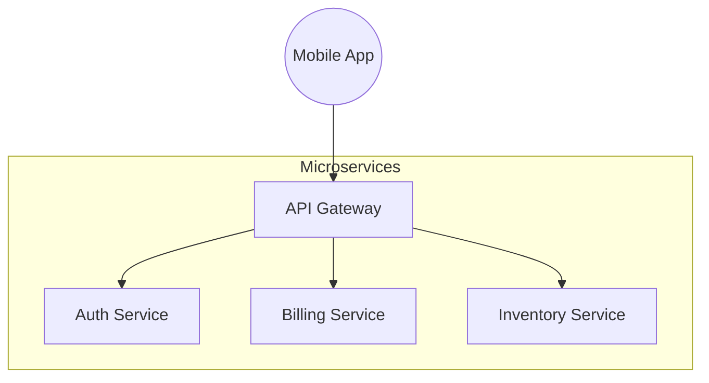
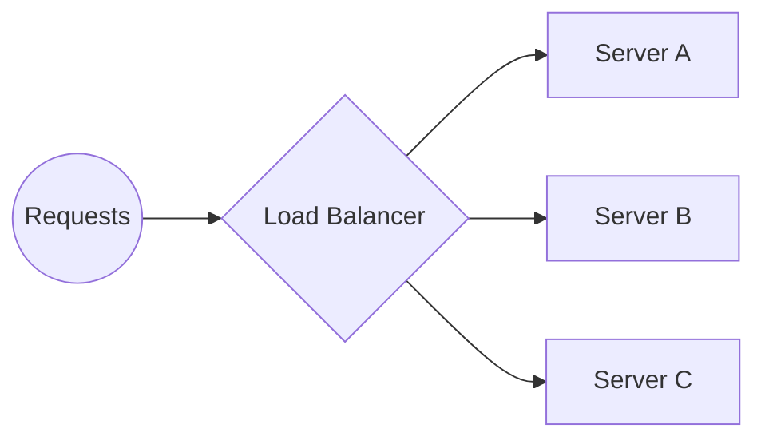

# 🛡️ Proxies, Gateways, and Load Balancers

## 📑 Table of Contents
1. [Forward Proxy (Standard Proxy)](#forward-proxy-proxy)
2. [Reverse Proxy](#reverse-proxy)
3. [API Gateway](#api-gateway)
4. [Load Balancer](#load-balancer)
5. [Comparison and Selection](#technology-comparison)

---

In modern web development, requests rarely hit the application server directly. They pass through layers of intermediaries, each serving a specific purpose.

---

## 1. ⏩ Forward Proxy (Proxy)

A server that sits **in front of the client**. It protects and represents the client's interests to the internet.



- **IP Hiding**: The website sees the proxy's IP address instead of yours.
- **Filtering**: Restricting access to certain sites (e.g., social media in an office environment).
- **Caching**: If 100 people want to download the same file, the proxy downloads it once and serves it to everyone.

> [!NOTE]
> Example: A Proxy(Private Network) is essentially an advanced version of a Forward Proxy.

---

## 2. ↩️ Reverse Proxy

A server that sits **in front of your backend servers**. It protects the servers from the public internet.



### Why is it used?
- **SSL Termination**: The proxy handles the computationally expensive HTTPS decryption/encryption, passing standard HTTP to the backend.
- **Compression (Gzip)**: Reduces response sizes before they transit the internet.
- **Routing**: Directs `/api` requests to a Go server and `/static` requests to an Nginx server serving images.

> [!TIP]
> **Nginx** is the most popular Reverse Proxy in the world.

---

## 3. 🚪 API Gateway

An "advanced" Reverse Proxy designed specifically for API management.



### Gateway Functions:
- **Authentication**: Validates JWT tokens before the request ever reaches the microservice.
- **Rate Limiting**: "No more than 100 requests per minute from a single user."
- **Aggregation**: A single request to the gateway can be fan-out to three different microservices, with the gateway aggregating their results into one JSON response.

---

## 4. ⚖️ Load Balancer

Distributes incoming traffic across multiple identical servers to ensure no single server is overwhelmed.



### Balancing Algorithms:
- **Round Robin**: Sequential distribution (Server 1, then 2, then 3, then 1...).
- **Least Connections**: Sends traffic to the server with the lowest active load.
- **IP Hash**: Maps a client to a specific server so their session remains uninterrupted.

> [!IMPORTANT]
> **Health Checks**: The load balancer continuously "pings" the servers. If Server B fails, the balancer stops routing traffic to it automatically.

---

## 5. 📊 Technology Comparison

| Technology | Works For | Primary Goal |
|:---|:---:|:---|
| **Forward Proxy** | The Client | Anonymity, access control |
| **Reverse Proxy** | The Server | Protection, SSL, static file serving |
| **API Gateway** | The System | API security, entry logic |
| **Load Balancer** | Availability | Scalability, reliability |

### Example in Go (Round-Robin Load Balancing):
```go
var current uint32
backends := []string{"http://s1.test", "http://s2.test"}

func getNextBackend() string {
    // Atomically increment and wrap around
    idx := atomic.AddUint32(&current, 1) % uint32(len(backends))
    return backends[idx]
}
```

---

## 🎯 Key Takeaways

- **Proxy** is an intermediary.
- **Reverse Proxy** keeps your internal infrastructure hidden and secure.
- **API Gateway** serves as a "smart" entrance for microservices.
- **Load Balancer** allows your system to handle millions of users by enabling you to scale horizontally.
