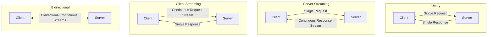
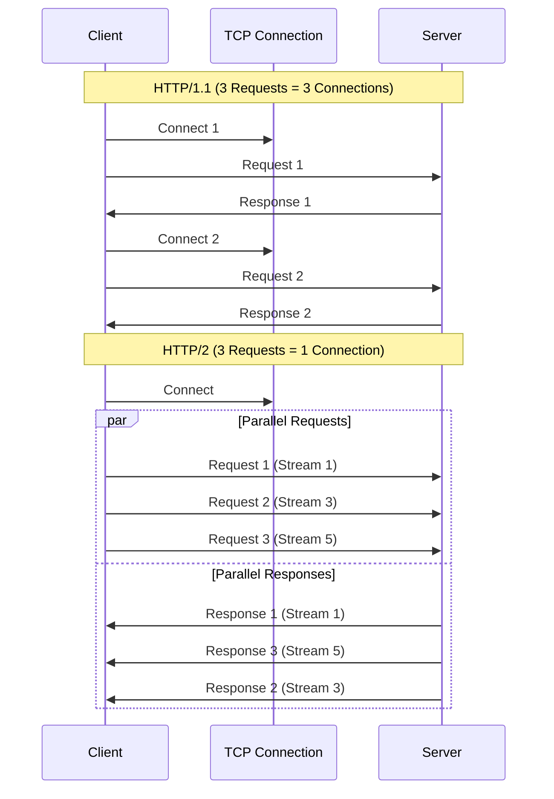

# 🚀 gRPC: High-Performance RPC by Google

## 📑 Table of Contents
1. [Why gRPC?](#why-grpc)
2. [Protocol Buffers (protobuf)](#protocol-buffers)
3. [Communication Patterns](#communication-patterns)
4. [HTTP/2: The Engine of gRPC](#http2)
5. [Comparison with REST](#comparison-with-rest)
6. [Code Generation and Workflow](#code-generation)
7. [Metadata and Interceptors](#metadata-and-interceptors)
8. [Error Handling](#error-handling)
9. [Load Balancing](#load-balancing)
10. [Security and Authentication](#security-and-authentication)
11. [Practical Examples in Go](#practical-examples-in-go)
12. [Performance Optimization](#performance-optimization)

---

## ❓ Why gRPC?

**gRPC (Google Remote Procedure Call)** is a high-performance, open-source RPC framework that allows a client application to directly call methods on a server application located on a different machine as if it were a local object.

### Key Advantages:

- **Performance**: Binary format + HTTP/2 makes it up to 7x faster than REST.
- **Strict Typing**: Errors are caught at compile time, not runtime.
- **Code Generation**: Automatically creates client and server stubs for many languages.
- **Bi-directional Streaming**: Native support for real-time data flows.
- **Language Agnostic**: Use the same `.proto` file to generate code for Go, Java, Python, C++, etc.

> [!NOTE]
> Unlike REST, which is **resource-oriented** (nouns like `/users`), gRPC is **service-oriented** (verbs like `GetUser()`).

---

## 🛠️ Protocol Buffers (protobuf)

gRPC uses **Protobuf** as its Interface Definition Language (IDL) and data serialization format.

### Protobuf vs JSON: A Detailed Comparison

| Feature | JSON | Protobuf |
|:---|:---|:---|
| **Format** | Text-based | Binary |
| **Size** | ~100% | ~25-30% of JSON |
| **Parsing Speed** | Slow | 3-10x faster |
| **Typing** | Weak/Dynamic | Strict |
| **Readability** | High | Low (requires tools) |
| **Backward Compatibility** | Difficult | Built-in |
| **Schema** | Optional | Mandatory |

> [!IMPORTANT]
> **Why is Protobuf so compact?**
> - In JSON, every key is repeated for every object: `{"name": "John", "age": 30}` → 26 bytes.
> - In Protobuf, keys are replaced by numeric tags: `\x0A\x04John\x10\x1E` → 8 bytes.

### Advanced .proto File Example

```protobuf
syntax = "proto3";

package user;

option go_package = "github.com/myapp/proto/user";

// Importing types from other files
import "google/protobuf/timestamp.proto";
import "common/pagination.proto";

// Service describes available RPC methods
service UserService {
  // Unary RPC
  rpc GetUser (UserRequest) returns (UserResponse);
  
  // Server Streaming RPC
  rpc ListUsers (ListUsersRequest) returns (stream UserResponse);
  
  // Client Streaming RPC
  rpc UploadUserPhotos (stream PhotoChunk) returns (UploadResponse);
  
  // Bidirectional Streaming RPC
  rpc Chat (stream ChatMessage) returns (stream ChatMessage);
}

// A message defines a data structure
message UserRequest {
  string user_id = 1;  // Tag 1 (immutable for compatibility)
  
  // optional — field may be absent (proto3)
  optional string fields_mask = 2;
}

message UserResponse {
  string id = 1;
  string username = 2;
  string email = 3;
  
  // Enum within a message
  enum Status {
    UNKNOWN = 0;  // Must always start with 0
    ACTIVE = 1;
    SUSPENDED = 2;
    DELETED = 3;
  }
  Status status = 4;
  
  // Nested messages
  Address address = 5;
  
  // Repeated means an array/slice
  repeated string tags = 6;
  
  // Maps are supported
  map<string, string> metadata = 7;
  
  // Using standard library timestamps
  google.protobuf.Timestamp created_at = 8;
}

message Address {
  string city = 1;
  string street = 2;
  int32 zip_code = 3;
}

message ListUsersRequest {
  common.Pagination pagination = 1;
  string filter = 2;
}
```

### Rules for Backward Compatibility

> [!WARNING]
> **NEVER do the following:**
> - Change the tag number of an existing field.
> - Change the data type of an existing field (e.g., string to int32).
> - Remove `required` fields (in proto2).
>
> **You SHOULD feel free to:**
> - Add new fields (old clients will simply ignore them).
> - Delete optional fields (mark them as `reserved` to prevent future tag reuse).
> - Rename fields (logic is based on tags, not names).

---

## 🔄 Communication Patterns

gRPC supports four distinct data transfer patterns:

### 1. Unary RPC

**Scenario**: Standard request-response (similar to REST).

```proto
rpc GetUser (UserRequest) returns (UserResponse);
```

**Go Client Example:**
```go
ctx := context.Background()
resp, err := client.GetUser(ctx, &pb.UserRequest{UserId: "123"})
if err != nil {
    log.Fatalf("Error detected: %v", err)
}
fmt.Println("Username:", resp.Username)
```

---

### 2. Server Streaming RPC

**Scenario**: Downloading large amounts of data in chunks or real-time log monitoring.

```proto
rpc ListUsers (ListUsersRequest) returns (stream UserResponse);
```

**Go Server Example:**
```go
func (s *server) ListUsers(req *pb.ListUsersRequest, stream pb.UserService_ListUsersServer) error {
    users := fetchUsersFromDB()
    
    for _, user := range users {
        if err := stream.Send(&pb.UserResponse{
            Id: user.ID,
            Username: user.Name,
        }); err != nil {
            return err
        }
        // Data can be sent incrementally
        time.Sleep(100 * time.Millisecond)
    }
    return nil
}
```

**Go Client Example:**
```go
stream, err := client.ListUsers(ctx, &pb.ListUsersRequest{})
if err != nil {
    log.Fatal(err)
}

for {
    user, err := stream.Recv()
    if err == io.EOF {
        break  // End of stream reached
    }
    if err != nil {
        log.Fatal(err)
    }
    fmt.Println("Received User:", user.Username)
}
```

---

### 3. Client Streaming RPC

**Scenario**: Periodic log uploads, large file uploads in chunks, or batch metric reporting.

```proto
rpc UploadUserPhotos (stream PhotoChunk) returns (UploadResponse);
```

**Go Client Example:**
```go
stream, err := client.UploadUserPhotos(ctx)
if err != nil {
    log.Fatal(err)
}

file, _ := os.Open("photo.jpg")
buffer := make([]byte, 64*1024)  // 64KB chunks

for {
    n, err := file.Read(buffer)
    if err == io.EOF {
        break
    }
    
    stream.Send(&pb.PhotoChunk{
        Data: buffer[:n],
    })
}

resp, err := stream.CloseAndRecv()
fmt.Println("Upload successful:", resp.Success)
```

---

### 4. Bidirectional Streaming RPC

**Scenario**: Chat applications, online gaming, or collaborative editing.

```proto
rpc Chat (stream ChatMessage) returns (stream ChatMessage);
```

**Go Server (Echo Chat):**
```go
func (s *server) Chat(stream pb.UserService_ChatServer) error {
    for {
        msg, err := stream.Recv()
        if err == io.EOF {
            return nil
        }
        if err != nil {
            return err
        }
        
        // Process message and echo back
        response := &pb.ChatMessage{
            User: "Bot",
            Text: "Echoing: " + msg.Text,
        }
        
        if err := stream.Send(response); err != nil {
            return err
        }
    }
}
```



---

## ⚡ HTTP/2: The Engine of gRPC

gRPC operates exclusively over **HTTP/2**. This provides several critical features:

### Core HTTP/2 Features

1. **Multiplexing**
   - Allows multiple requests over a **single** TCP connection.
   - Eliminates Head-of-Line Blocking inherent in HTTP/1.1.
   - Saves time and resources by reusing connections.

2. **Header Compression (HPACK)**
   - In HTTP/1.1, headers could often be larger than the payload.
   - HPACK compresses repetitive headers.
   - Saves roughly 80% on header size overhead.

3. **Server Push**
   - The server can proactively push data to the client before it's requested.
   - Rarely used directly in gRPC but available at the protocol level.

4. **Binary Framing**
   - Data is split into smaller binary frames.
   - Highly efficient processing by the OS kernel and hardware.



---

## ⚖️ Detailed Comparison: gRPC vs. REST

| Feature | REST | gRPC | Winner |
|:---|:---|:---|:---:|
| **Protocol** | HTTP/1.1 (usually) | HTTP/2 (mandatory) | gRPC |
| **Payload Format** | JSON, XML | Protobuf (Binary) | gRPC |
| **Speed** | Baseline | 5-10x faster | gRPC |
| **Payload Size** | 100% | 20-30% of REST | gRPC |
| **Typing** | Weak/Dynamic (JS, JSON) | Strict/Static (.proto) | gRPC |
| **Streaming** | No (requires WebSocket) | 4 native patterns | gRPC |
| **Browser Support** | Native/Excellent | Requires gRPC-Web proxy | REST |
| **Caching** | HTTP Cache (excellent) | Challenging | REST |
| **Readability** | cURL, Postman | Requires specialized tools | REST |
| **Documentation** | Swagger, OpenAPI | .proto files (Self-doc) | Tie |
| **Code Generation** | Optional | Mandatory/Built-in | gRPC |
| **Load Balancing** | Complex L7 balancing | Native client-side balancing | gRPC |
| **Deadlines/Timeouts** | Manual implementation | Built-in functionality | gRPC |
| **Error Handling** | Generic HTTP codes | Rich codes + custom details | gRPC |

### When to choose which?

| Scenario | Recommendation | Rationale |
|:---|:---:|:---|
| **Microservices (Internal)** | 🟢 gRPC | Speed, efficiency, strict typing. |
| **Public Public Web API** | 🟡 REST | Ease of use, browser support, caching. |
| **Mobile Apps** | 🟢 gRPC | Better battery life and data conservation. |
| **IoT Devices** | 🟢 gRPC | Low overhead, compact binary format. |
| **Real-time (Chat, Games)** | 🟢 gRPC | Native bidirectional streaming. |
| **Standard CRUD ops** | 🟡 REST | Simplified development, broad tools. |
| **Large File Uploads** | 🟢 gRPC | Efficient client streaming. |
| **Legacy Integration** | 🟡 REST | Universal client compatibility. |

---

## 🔧 Code Generation and Workflow

### Tool Installation (Go)

```bash
# Protocol Buffers Compiler
brew install protobuf

# Go Plugins for protoc
go install google.golang.org/protobuf/cmd/protoc-gen-go@latest
go install google.golang.org/grpc/cmd/protoc-gen-go-grpc@latest
```

### Project Structure

```
project/
├── proto/
│   └── user/
│       └── user.proto          # API Schema
├── internal/
│   └── generated/
│       └── user/
│           ├── user.pb.go      # Generated Types
│           └── user_grpc.pb.go # Generated Client/Server Stubs
├── cmd/
│   ├── server/
│   │   └── main.go
│   └── client/
│   │   └── main.go
└── Makefile
```

### Generation Makefile

```makefile
.PHONY: proto
proto:
	protoc --go_out=./internal/generated \
	       --go_opt=paths=source_relative \
	       --go-grpc_out=./internal/generated \
	       --go-grpc_opt=paths=source_relative \
	       proto/user/*.proto
```

---

## 🏷️ Metadata and Interceptors

### Metadata (Similar to HTTP Headers)

**Sending Metadata from the Client:**
```go
md := metadata.Pairs(
    "authorization", "Bearer secret-token-123",
    "request-id", uuid.New().String(),
)
ctx := metadata.NewOutgoingContext(context.Background(), md)

resp, err := client.GetUser(ctx, &pb.UserRequest{UserId: "123"})
```

**Reading Metadata on the Server:**
```go
func (s *server) GetUser(ctx context.Context, req *pb.UserRequest) (*pb.UserResponse, error) {
    md, ok := metadata.FromIncomingContext(ctx)
    if !ok {
        return nil, status.Error(codes.Unauthenticated, "Metadata missing")
    }
    
    token := md.Get("authorization")
    if len(token) == 0 {
        return nil, status.Error(codes.Unauthenticated, "Token missing")
    }
    
    // Perform token validation...
    return &pb.UserResponse{...}, nil
}
```

### Interceptors (Middleware)

**Unary Server Interceptor (Logging Example):**
```go
func loggingInterceptor(
    ctx context.Context,
    req interface{},
    info *grpc.UnaryServerInfo,
    handler grpc.UnaryHandler,
) (interface{}, error) {
    start := time.Now()
    
    // Call the actual RPC handler
    resp, err := handler(ctx, req)
    
    log.Printf("Method: %s | Duration: %v | Error: %v",
        info.FullMethod,
        time.Since(start),
        err,
    )
    
    return resp, err
}

// Registration
grpcServer := grpc.NewServer(
    grpc.UnaryInterceptor(loggingInterceptor),
)
```

**Stream Interceptor Example:**
```go
func streamLoggingInterceptor(
    srv interface{},
    ss grpc.ServerStream,
    info *grpc.StreamServerInfo,
    handler grpc.StreamHandler,
) error {
    log.Printf("Began stream: %s", info.FullMethod)
    err := handler(srv, ss)
    log.Printf("Finished stream: %s | Error: %v", info.FullMethod, err)
    return err
}
```

---

## ❌ Error Handling

gRPC utilizes **Status Codes** specifically (not standard HTTP codes).

### Essential Status Codes

```go
import "google.golang.org/grpc/codes"

codes.OK              // Success
codes.Canceled        // Client canceled the request
codes.InvalidArgument // Invalid data provided
codes.NotFound        // Desired resource not found
codes.AlreadyExists   // Conflict (resource exists)
codes.PermissionDenied // Lacks necessary permissions
codes.Unauthenticated // Missing or invalid auth
codes.ResourceExhausted // Rate limited / Out of quota
codes.Internal        // Generic server error
codes.Unavailable     // Service currently offline
codes.DeadlineExceeded // Request timed out
```

### Returning Errors with Detailed Context

```go
import (
    "google.golang.org/grpc/status"
    "google.golang.org/genproto/googleapis/rpc/errdetails"
)

func (s *server) GetUser(ctx context.Context, req *pb.UserRequest) (*pb.UserResponse, error) {
    if req.UserId == "" {
        st := status.New(codes.InvalidArgument, "user_id field is required")
        
        // Attaching specific error details
        v := &errdetails.BadRequest_FieldViolation{
            Field:       "user_id",
            Description: "Field cannot be empty or null",
        }
        br := &errdetails.BadRequest{}
        br.FieldViolations = append(br.FieldViolations, v)
        
        st, _ = st.WithDetails(br)
        return nil, st.Err()
    }
}
```

**Handling Detailed Errors on the Client:**
```go
resp, err := client.GetUser(ctx, req)
if err != nil {
    st := status.Convert(err)
    
    fmt.Println("Status Code:", st.Code())
    fmt.Println("Error Message:", st.Message())
    
    for _, detail := range st.Details() {
        switch t := detail.(type) {
        case *errdetails.BadRequest:
            for _, violation := range t.FieldViolations {
                fmt.Printf("Violation -> Field: %s | Error: %s\n", violation.Field, violation.Description)
            }
        }
    }
}
```

---

## ⚖️ Load Balancing

gRPC natively supports **Client-Side Load Balancing**.

### Balancing Strategies

```go
import "google.golang.org/grpc/balancer/roundrobin"

// Round Robin configuration
conn, err := grpc.Dial(
    "dns:///myservice.example.com",  // Resolver for multiple A-records
    grpc.WithDefaultServiceConfig(`{"loadBalancingPolicy":"round_robin"}`),
    grpc.WithInsecure(),
)

// Pick First (Default Behavior)
conn, err := grpc.Dial(
    "myservice:50051",
    grpc.WithInsecure(),
)
```

### Service Discovery with Kubernetes

```yaml
apiVersion: v1
kind: Service
metadata:
  name: user-service
spec:
  clusterIP: None  # Define as a Headless service
  selector:
    app: user-app
  ports:
  - port: 50051
```

```go
// From the Go Client
conn, err := grpc.Dial(
    "dns:///user-service.default.svc.cluster.local:50051",
    grpc.WithDefaultServiceConfig(`{"loadBalancingPolicy":"round_robin"}`),
)
```

---

## 🔒 Security and Authentication

### 1. Transport Layer Security (TLS)

**Secure Server Setup:**
```go
creds, err := credentials.NewServerTLSFromFile("server.crt", "server.key")
if err != nil {
    log.Fatal(err)
}

grpcServer := grpc.NewServer(grpc.Creds(creds))
```

**Secure Client Setup:**
```go
creds, err := credentials.NewClientTLSFromFile("ca.crt", "myservice.com")
conn, err := grpc.Dial("myservice.com:443", grpc.WithTransportCredentials(creds))
```

### 2. Token-Based Authentication

**Client Attaching a Token:**
```go
type tokenAuth struct {
    token string
}

func (t tokenAuth) GetRequestMetadata(ctx context.Context, uri ...string) (map[string]string, error) {
    return map[string]string{
        "authorization": "Bearer " + t.token,
    }, nil
}

func (t tokenAuth) RequireTransportSecurity() bool {
    return true  // Metadata must only be sent over TLS
}

conn, err := grpc.Dial(
    "myservice.com:443",
    grpc.WithPerRPCCredentials(tokenAuth{token: "my-jwt-token"}),
)
```

**Server Token Validation:**
```go
func authInterceptor(ctx context.Context, req interface{}, info *grpc.UnaryServerInfo, handler grpc.UnaryHandler) (interface{}, error) {
    md, ok := metadata.FromIncomingContext(ctx)
    if !ok {
        return nil, status.Error(codes.Unauthenticated, "Missing metadata")
    }
    
    authHeader := md.Get("authorization")
    if len(authHeader) == 0 {
        return nil, status.Error(codes.Unauthenticated, "Token header missing")
    }
    
    token := strings.TrimPrefix(authHeader[0], "Bearer ")
    
    // JWT Logic Validation
    claims, err := validateJWT(token)
    if err != nil {
        return nil, status.Error(codes.Unauthenticated, "Invalid session token")
    }
    
    // Persist user context for the handler
    ctx = context.WithValue(ctx, "authenticated_user", claims)
    
    return handler(ctx, req)
}
```

### 3. Mutual TLS (mTLS)

**Enforcing Client-Side Certificate Verification:**
```go
cert, err := tls.LoadX509KeyPair("server.crt", "server.key")
certPool := x509.NewCertPool()
ca, _ := os.ReadFile("ca.crt")
certPool.AppendCertsFromPEM(ca)

creds := credentials.NewTLS(&tls.Config{
    Certificates: []tls.Certificate{cert},
    ClientAuth:   tls.RequireAndVerifyClientCert,
    ClientCAs:    certPool,
})

grpcServer := grpc.NewServer(grpc.Creds(creds))
```

---

## 💻 Practical Go Implementation

### Complete Server Example

```go
package main

import (
    "context"
    "log"
    "net"
    
    pb "myapp/internal/generated/user"
    "google.golang.org/grpc"
    "google.golang.org/grpc/codes"
    "google.golang.org/grpc/status"
)

type userServer struct {
    pb.UnimplementedUserServiceServer
}

func (s *userServer) GetUser(ctx context.Context, req *pb.UserRequest) (*pb.UserResponse, error) {
    // Respect the request deadline
    if ctx.Err() == context.DeadlineExceeded {
        return nil, status.Error(codes.DeadlineExceeded, "Request timeout reached")
    }
    
    // Validation Logic
    if req.UserId == "" {
        return nil, status.Error(codes.InvalidArgument, "user_id is mandatory")
    }
    
    // Simulated DB lookup
    user := &pb.UserResponse{
        Id:       req.UserId,
        Username: "jane_smith",
        Email:    "jane@example.com",
        Status:   pb.UserResponse_ACTIVE,
    }
    
    return user, nil
}

func main() {
    lis, err := net.Listen("tcp", ":50051")
    if err != nil {
        log.Fatalf("Network listener setup failed: %v", err)
    }
    
    grpcServer := grpc.NewServer(
        grpc.UnaryInterceptor(loggingInterceptor),
    )
    
    pb.RegisterUserServiceServer(grpcServer, &userServer{})
    
    log.Println("gRPC Server serving on localhost:50051")
    if err := grpcServer.Serve(lis); err != nil {
        log.Fatalf("Server loop failure: %v", err)
    }
}
```

### Complete Client Example

```go
package main

import (
    "context"
    "log"
    "time"
    
    pb "myapp/internal/generated/user"
    "google.golang.org/grpc"
    "google.golang.org/grpc/credentials/insecure"
)

func main() {
    conn, err := grpc.Dial(
        "localhost:50051",
        grpc.WithTransportCredentials(insecure.NewCredentials()),
        grpc.WithBlock(),  // Wait until established
    )
    if err != nil {
        log.Fatalf("Unable to connect: %v", err)
    }
    defer conn.Close()
    
    client := pb.NewUserServiceClient(conn)
    
    // Setting an RPC timeout
    ctx, cancel := context.WithTimeout(context.Background(), 5*time.Second)
    defer cancel()
    
    resp, err := client.GetUser(ctx, &pb.UserRequest{
        UserId: "456",
    })
    
    if err != nil {
        log.Fatalf("RPC Call Error: %v", err)
    }
    
    log.Printf("Fetched User: %s (%s)", resp.Username, resp.Email)
}
```

---

## ⚡ Performance Optimization Tips

### 1. Connection Pooling
Reusing a persistent connection across multiple goroutines is much more efficient than recreating it.

### 2. Request Batching
Instead of making $N$ individual RPC calls, design your schema to handle multiple items in a single message (e.g., `GetUsers` instead of calling `GetUser` $N$ times).

### 3. Compression
Enable Gzip compression for large payloads to save network throughput.

### 4. Protobuf Schema Design
Use appropriate data types. For identifier fields, `int64` is generally more compact than `string`.

### 5. Keep-Alive Parameters
Configure Keep-Alive parameters to ensure that long-lived connections (especially those behind load balancers or firewalls) are not silently dropped.

---

## 🎯 Real-World Case Studies

- **Kubernetes**: All internal K8s components communicate via gRPC, leveraging streaming for "watch" operations.
- **Netflix**: Moved their microservice inter-communication to gRPC, processing billions of requests and reducing latency by 50%.
- **Uber**: Uses bidirectional streaming for real-time driver tracking and coordinates their entire logistics fleet via gRPC.

> [!TIP]
> **The Golden Rule:**
> - **Internal Systems** (Microservices) → gRPC (for performance and typing).
> - **Public External APIs** (Web/Mobile) → REST or gRPC-Web (for compatibility).
> - **Real-Time Data Flows** → gRPC Streaming.
