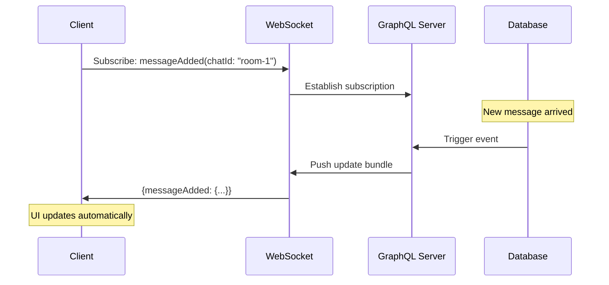
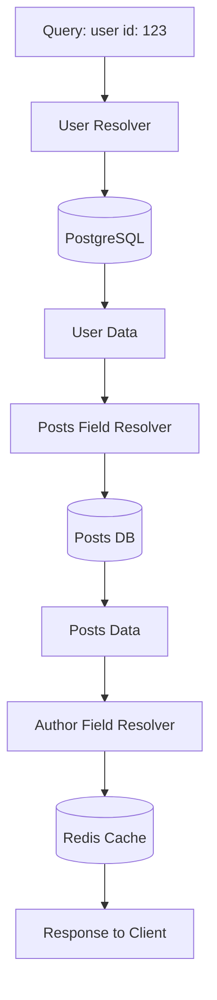
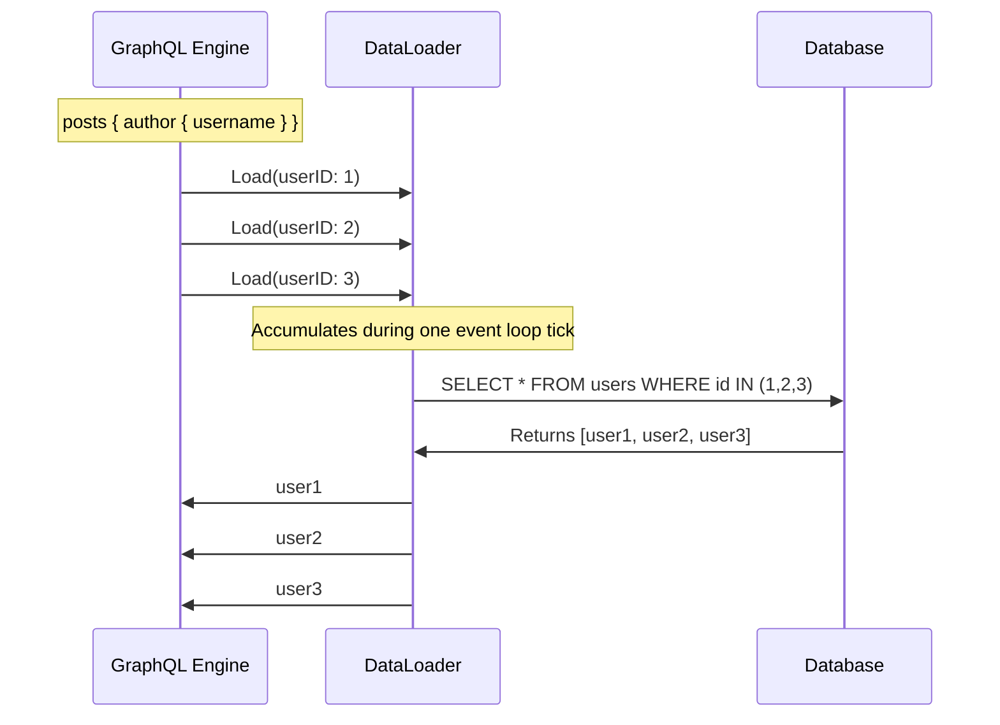

# 🕸️ GraphQL: Next-Generation Query Language

## 📑 Table of Contents
1. [GraphQL Philosophy](#philosophy)
2. [Strict Schema Definition](#schema)
3. [Operations: Query, Mutation, Subscription](#operations)
4. [Resolvers](#resolvers)
5. [The N+1 Problem and DataLoader](#n1-problem-and-dataloader)
6. [REST Problems Solved by GraphQL](#problems-with-rest)
7. [Pagination](#pagination)
8. [Error Handling](#error-handling)
9. [Security](#security)
10. [Caching Strategies](#caching)
11. [Implementation in Go with gqlgen](#go-implementation)
12. [When NOT to Use GraphQL](#drawbacks)

---

## 🧭 Philosophy

**GraphQL** is neither a database nor a direct replacement for REST. It is a **query language** and a runtime layer situated between the client and your data sources. Its core principle is: **"The client requests exactly what it needs, and nothing more."**

### Key Differences from REST:

| Feature | REST | GraphQL |
|:---|:---|:---|
| **Endpoints** | Multiple (`/users`, `/posts`) | Single (`/graphql`) |
| **Response Structure** | Defined by the Server | Defined by the Client |
| **Overfetching** | Common Issue | Eliminated |
| **Underfetching** | Requires Multiple Requests | Single Request |
| **Versioning** | `/v1/`, `/v2/` | Not Needed (via deprecation) |

> [!NOTE]
> In REST, the server dictates the shape of the data returned. In GraphQL, the **client** defines the structure of the response.

---

## 📜 Schema

All data in GraphQL is strictly typed. The schema serves as the formal contract between the client and the server.

### Base Types

```graphql
# Object Types
type User {
  id: ID!           # ! means the field is non-nullable
  username: String!
  email: String
  age: Int
  rating: Float
  isActive: Boolean!
}

# Enums
enum UserRole {
  ADMIN
  MODERATOR
  USER
}

# Relationships
type Post {
  id: ID!
  title: String!
  content: String!
  author: User!        # One-to-one
  comments: [Comment!]! # One-to-many
}

type Comment {
  id: ID!
  text: String!
  post: Post!
  author: User!
}

# Input types for mutations
input CreateUserInput {
  username: String!
  email: String!
  password: String!
}

# Interfaces
interface Node {
  id: ID!
  createdAt: String!
}

type User implements Node {
  id: ID!
  createdAt: String!
  username: String!
}

# Union types
union SearchResult = User | Post | Comment

# Custom scalars
scalar DateTime
scalar JSON
```

---

## 🔧 Operations: Query, Mutation, Subscription

### 1. Query (Reading Data)

```graphql
type Query {
  # Fetch a single user
  user(id: ID!): User
  
  # Fetch a list
  users(
    limit: Int = 10
    offset: Int = 0
    filter: UserFilter
  ): [User!]!
  
  # Search functionality
  search(query: String!): [SearchResult!]!
  
  # Context-based current user
  me: User
}

input UserFilter {
  role: UserRole
  isActive: Boolean
  minAge: Int
}
```

**Client Request Example:**

```graphql
# Explicitly specifying required fields
query GetUserProfile {
  user(id: "123") {
    id
    username
    email
    posts {
      id
      title
      comments {
        id
        text
      }
    }
  }
}
```

**Aliases and Fragments:**

```graphql
query {
  # Aliases allow multiple queries of the same type in one request
  admin: user(id: "1") {
    ...UserFields
  }
  
  currentUser: user(id: "123") {
    ...UserFields
  }
}

# Fragments for reusability
fragment UserFields on User {
  id
  username
  email
  posts {
    title
  }
}
```

---

### 2. Mutation (Modifying Data)

```graphql
type Mutation {
  # Create
  createUser(input: CreateUserInput!): User!
  
  # Update
  updateUser(id: ID!, input: UpdateUserInput!): User!
  
  # Delete
  deleteUser(id: ID!): Boolean!
  
  # Domain-specific logic
  publishPost(id: ID!): Post!
}

input UpdateUserInput {
  username: String
  email: String
  # Fields are optional for partial updates
}
```

**Mutation Example:**

```graphql
mutation CreateNewUser {
  createUser(input: {
    username: "john_doe"
    email: "john@example.com"
    password: "secure_password"
  }) {
    id
    username
    createdAt
  }
}
```

---

### 3. Subscription (Real-time Updates)

Used for WebSocket-based persistent connections to receive push notifications.

```graphql
type Subscription {
  # New message added to a chat
  messageAdded(chatId: ID!): Message!
  
  # User profile changed
  userUpdated(userId: ID!): User!
  
  # Real-time online user count
  onlineCount: Int!
}
```

**Subscription Usage:**

```graphql
subscription OnMessageAdded {
  messageAdded(chatId: "room-1") {
    id
    text
    author {
      username
    }
    createdAt
  }
}
```



---

## ⚙️ Resolvers

A resolver is a back-end function that knows **how to fetch the specific data** for a field in the schema.

### Resolver Structure

```go
type Resolver struct {
    db *sql.DB
    cache *redis.Client
    userService *UserService
}

// Query resolver
func (r *Resolver) User(ctx context.Context, id string) (*model.User, error) {
    // Logic to retrieve user from a data source
    return r.userService.GetByID(ctx, id)
}

// Field resolver (for nested/computed fields)
func (r *UserResolver) Posts(ctx context.Context, user *model.User) ([]*model.Post, error) {
    return r.db.GetPostsByUserID(ctx, user.ID)
}
```



> [!NOTE]
> **Key Power**: Resolvers can aggregate data from entirely different sources:
> - User Info → PostgreSQL
> - Post History → MongoDB
> - Profile Image → S3 Bucket
> - Comments → External Microservice
>
> To the client, this appears as one seamless, unified request.

---

## 🔥 The N+1 Problem and DataLoader

### The N+1 Explanation

This is the most common performance bottleneck in GraphQL.

**Query:**
```graphql
query {
  posts {         # 1 Query to DB → Returns 10 posts
    title
    author {      # 10 separate DB Queries (one for each post!)
      username
    }
  }
}
```

**Naive Implementation:**
```go
func (r *PostResolver) Author(ctx context.Context, post *model.Post) (*model.User, error) {
    // ❌ Called 10 times sequentially!
    return r.db.GetUserByID(ctx, post.AuthorID)
}
```

Result: **1 + 10 = 11 database calls** instead of just **2**.

---

### The Solution: DataLoader

DataLoader batches individual requests into a single collaborative call.

**Installation:**
```bash
go get github.com/graph-gophers/dataloader
```

**Implementation Strategy:**
```go
type Loaders struct {
    UserLoader *dataloader.Loader
}

func NewLoaders(db *sql.DB) *Loaders {
    userBatchFn := func(ctx context.Context, keys dataloader.Keys) []*dataloader.Result {
        // Collect all IDs from the keys
        ids := make([]string, len(keys))
        for i, key := range keys {
            ids[i] = key.String()
        }
        
        // 🚀 ONE batch query instead of N!
        users, err := db.GetUsersByIDs(ctx, ids)
        
        // Map results for quick lookup
        userMap := make(map[string]*User)
        for _, user := range users {
            userMap[user.ID] = user
        }
        
        // Match results back to the original keys order
        results := make([]*dataloader.Result, len(keys))
        for i, key := range keys {
            user, ok := userMap[key.String()]
            if ok {
                results[i] = &dataloader.Result{Data: user}
            } else {
                results[i] = &dataloader.Result{Error: fmt.Errorf("user not found")}
            }
        }
        
        return results
    }
    
    return &Loaders{
        UserLoader: dataloader.NewBatchedLoader(userBatchFn),
    }
}

// Resolver usage
func (r *PostResolver) Author(ctx context.Context, post *model.Post) (*model.User, error) {
    loaders := ctx.Value("loaders").(*Loaders)
    
    thunk := loaders.UserLoader.Load(ctx, dataloader.StringKey(post.AuthorID))
    result, err := thunk()
    if err != nil {
        return nil, err
    }
    
    return result.(*model.User), nil
}
```

**Outcome**: All 10 requests are coalesced into **one single batch operation**!



---

## 🚀 REST Problems Solved by GraphQL

### 1. Overfetching (Data Bloat)

**REST:**
```bash
GET /users/123
# Returns the FULL user object even if you only need the name
{
  "id": 123,
  "username": "john",
  "email": "john@example.com",
  "bio": "Extremely long text...",
  "location": "...",
  "avatar_url": "...",
  # + 50 other fields that slow down the network
}
```

**GraphQL:**
```graphql
query {
  user(id: 123) {
    username  # Requests ONLY the username
  }
}
```

### 2. Underfetching (The Waterfall Problem)

**REST** (Requires 3 sequential requests):
```bash
GET /users/123           # Step 1: Profile
GET /users/123/posts     # Step 2: Posts
GET /users/123/followers # Step 3: Followers
```

**GraphQL** (One request):
```graphql
query {
  user(id: 123) {
    username
    posts { title }
    followers { username }
  }
}
```

---

## 📄 Pagination

### 1. Offset-Based
Simple but unreliable. If data is added or removed during paging, users might see duplicates or skip items.

### 2. Cursor-Based (Recommended)
Uses a unique "pointer" (cursor) to the last item seen. It is much more stable for real-time and large datasets.

### 3. Relay Connection Specification (Industry Standard)
Standardizes how paginated data is structured, including `edges`, `node`, and `pageInfo`.

---

## 🔒 Security

### 1. Depth Limiting
Prevents malicious actors from crashing the server with infinitely nested queries.

### 2. Query Cost Analysis
Assigns a "cost" to each field. If a query's total cost exceeds a specific threshold (e.g., requesting 1,000 deep comments), the server rejects it.

---

## 💻 Go Implementation with gqlgen

[gqlgen](https://github.com/99designs/gqlgen) is the leading schema-first library for building GraphQL servers in Go. It generates all the boilerplate, leaving you to focus on the logic in your resolvers.

### Project Structure (Typical)

- `graph/schema.graphqls`: Your strict API definition.
- `graph/generated.go`: Auto-generated code handling the GraphQL protocol.
- `graph/resolver.go`: Where you write your custom data-fetching logic.

---

## 🎯 Best Practices

> [!IMPORTANT]
> **Golden Rules**:
> 1. **Batching**: Always use **DataLoader** to prevent N+1 performance issues.
> 2. **Protection**: Limit query **depth** and **complexity**.
> 3. **Paging**: Prefer **cursor-based pagination** for stability.
> 4. **Schema**: Avoid returning `null` where possible by using `!` (Non-Null) types.
