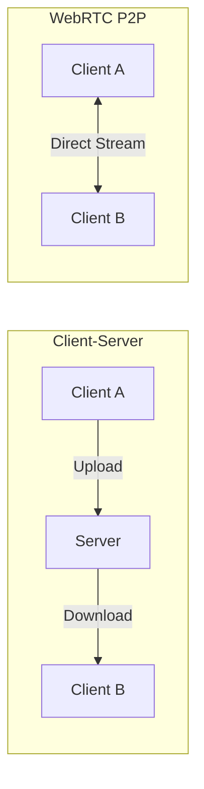
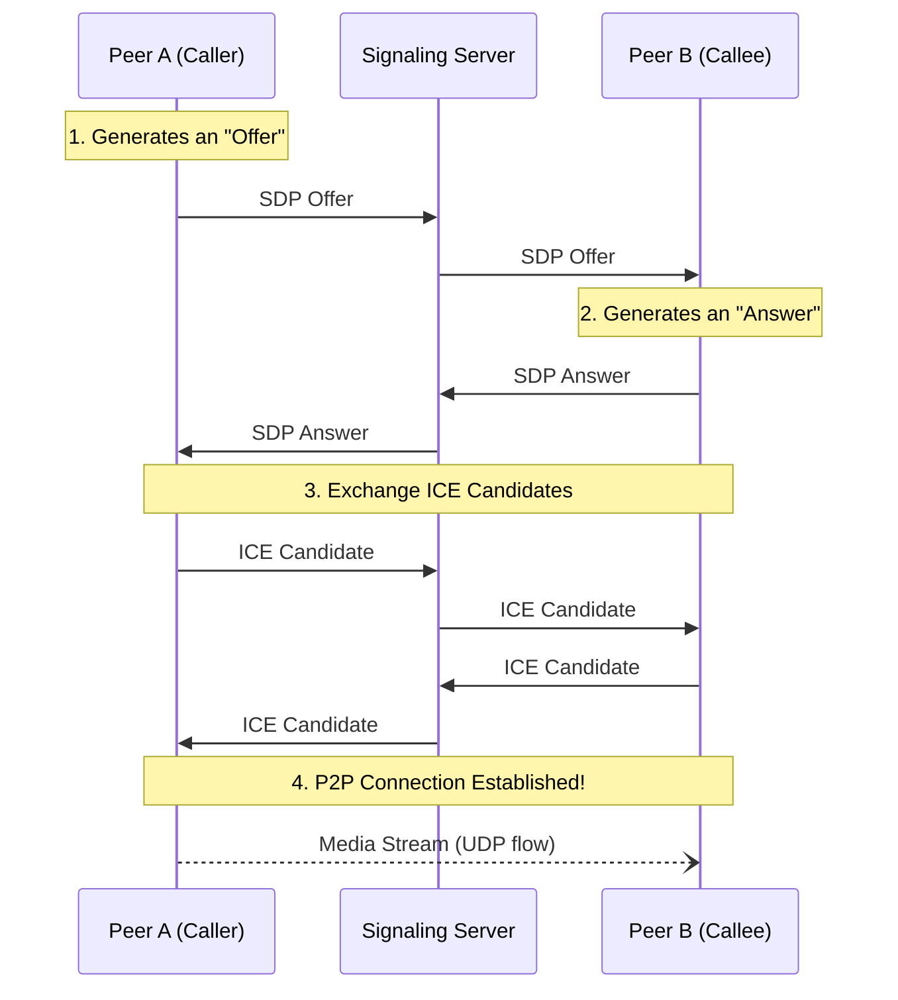
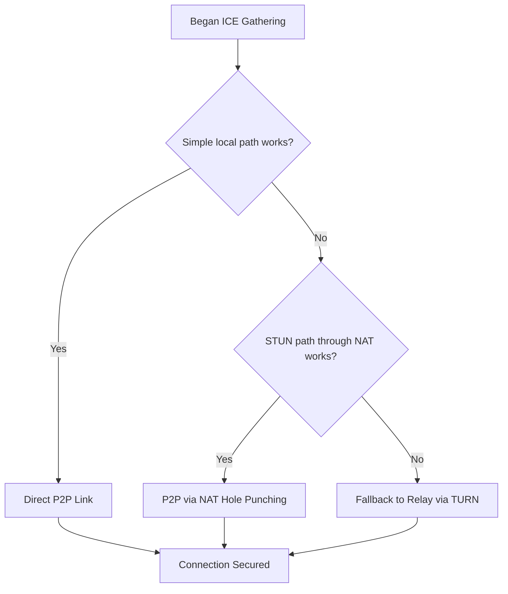

# 📞 WebRTC: Real-Time Communication

## 📑 Table of Contents
1. [What is WebRTC?](#what-is-webrtc)
2. [Peer-to-Peer (P2P) Architecture](#peer-to-peer-p2p)
3. [The Connection Process (Signaling)](#signaling)
4. [SDP (Session Description Protocol)](#sdp-session-description-protocol)
5. [ICE: Finding the Connection Path](#ice-finding-the-connection-path)
6. [STUN and TURN Servers](#stun-and-turn)
7. [PeerConnection API](#peerconnection-api)
8. [DataChannel: P2P Data Transfer](#datachannel-p2p-data-transfer)
9. [MediaStream and Codecs](#mediastream-and-codecs)
10. [Connection States](#connection-states)
11. [Practical Implementation Example](#practical-example)

---

## ❓ What is WebRTC?

**WebRTC (Web Real-Time Communication)** is a suite of open-source standards and technologies that enable browsers and mobile applications to exchange **audio, video, and arbitrary data directly (peer-to-peer)** without requiring a server to relay the media. 🎥💬

### Core Components:

- **getUserMedia**: Provides access to the device's camera and microphone.
- **RTCPeerConnection**: Manages the lifecycle of a P2P connection.
- **RTCDataChannel**: Transfers non-media data directly between peers.

### Common Use Cases:

- Video conferencing (e.g., Google Meet, Discord web).
- Browser-based multiplayer gaming.
- Telemedicine consultations.
- Peer-to-peer screensharing and remote desktop access.

> [!NOTE]
> WebRTC runs **natively** in the browser without plugins! It is supported by all modern browsers (Chrome, Firefox, Safari, Edge).

---

## 🤝 Peer-to-Peer (P2P)

In traditional client-server architecture, data flows through a central node:
```
Client A → Server → Client B
```

In WebRTC, data flows **directly** between the participants:
```
Client A ⟷ Client B
```

### Advantages of P2P:

✅ **Low Latency**: Eliminates the delay introduced by a relaying server.  
✅ **Scalability**: The server isn't burdened with high-bandwidth media traffic.  
✅ **Privacy**: Media data remains "on the edge" (end-to-end encrypted) and doesn't pass through a provider's server.

### Challenges:

❌ **NAT Traversal**: Requires STUN/TURN servers to bypass firewalls.  
❌ **Complexity**: Needs a separate "signaling" server to coordinate the initial connection.  
❌ **Variable Quality**: Connection speed depends entirely on the upload/download capacity of both peers.



---

## 🗺️ The Connection Process (Signaling)

While **media** is P2P, the peers still need a **signaling server** to exchange metadata (SDP, ICE candidates) before they can connect.

> [!IMPORTANT]
> **Signaling is NOT standardized** in WebRTC! You are free to implementation it using WebSockets, HTTP long polling, Socket.IO, or any other protocol.



---

## 📋 SDP (Session Description Protocol)

**SDP** is a text-based format describing the technical parameters of the session:
- Supported codecs (VP8, H.264, Opus).
- Candidate IP addresses and ports.
- Media types (audio, video, data).
- Encryption parameters (DTLS, SRTP fingerprints).

### The Offer/Answer Pattern:

1. **Peer A** creates an **Offer** (their supported features) and sets it as the "Local Description."
2. **Peer A** sends the Offer to **Peer B** via the signaling server.
3. **Peer B** receives the Offer, sets it as the "Remote Description," generates an **Answer**, and sends it back.
4. Once both have set their Local and Remote descriptions, they are "ready" to find a network path.

---

## 🧊 ICE: Finding the Connection Path

**ICE (Interactive Connectivity Establishment)** is the protocol used to discover the best possible network path between two peers.

### Types of ICE Candidates:

1. **Host Candidate**: Local LAN IP (e.g., `192.168.1.5`). Only works for peers on the same network.
2. **Server Reflexive Candidate (STUN)**: Public-facing IP (e.g., `203.0.113.5`). Discovered via a STUN server; works for most home NAT environments.
3. **Relay Candidate (TURN)**: A server-provided IP. Media is relayed via the TURN server when a direct P2P link is blocked.



---

## 🧱 STUN and TURN Servers

### STUN (Session Traversal Utilities for NAT)
Helps a client discover its own **public IP address** and port. STUN is lightweight and used strictly for path discovery—once the path is found, the STUN server is no longer involved.

### TURN (Traversal Using Relays around NAT)
Used as a last resort when a direct P2P connection is impossible (e.g., behind a symmetric NAT or a strict corporate firewall). Data is sent through the TURN server, which acts as a proxy.

> [!WARNING]
> **TURN is resource-intensive!** Since it relays all media traffic, it requires significant bandwidth. Roughly 10-20% of WebRTC calls require a TURN server to succeed.

---

## 📡 DataChannel: P2P Data Transfer

`RTCDataChannel` allows peers to send arbitrary binary or text data directly to each other with customizable reliability (similar to choosing between TCP-like delivery or UDP-like speed).

**Ideal for:**
- Fast-paced game state synchronization.
- P2P file sharing.
- Low-latency chat and collaboration tools.

---

## 🎬 MediaStream and Codecs

### Core Audio/Video Codecs:
- **Audio**: **Opus** (Industry standard, optimized for human voice and low latency).
- **Video**: **VP8 / VP9** (Google's open codecs) or **H.264** (Hardware-accelerated standard).

---

## 💻 Practical Implementation Example

A basic WebRTC setup involves getting a local media stream, initializing `RTCPeerConnection`, handling ICE candidate callbacks, and using your signaling mechanism to swap SDP descriptions.

> [!IMPORTANT]
> **HTTPS is Mandatory**: Browsers only allow `getUserMedia` and WebRTC features in secure contexts (HTTPS or localhost).

---

## 🎯 Best Practices

1. **Adaptive Bitrate**: Monitor network conditions using `getStats()` and dynamically adjust video quality.
2. **Turn on TURN**: Don't rely solely on STUN; ensure a TURN server is configured for users behind strict firewalls.
3. **Handle Reconnection**: Peer-to-peer links can be fragile. Implement logic to restart ICE gathering if a connection drops.
4. **Compression**: WebRTC uses **UDP**. If a few frames are lost, the protocol skips them rather than slowing down the entire stream to wait for a retransmission—this preserves "Live" performance. ⚡
