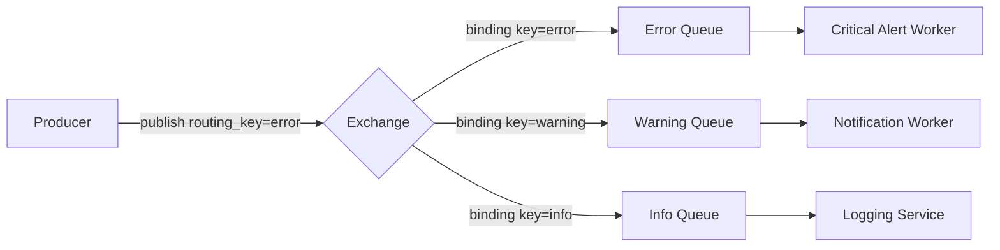
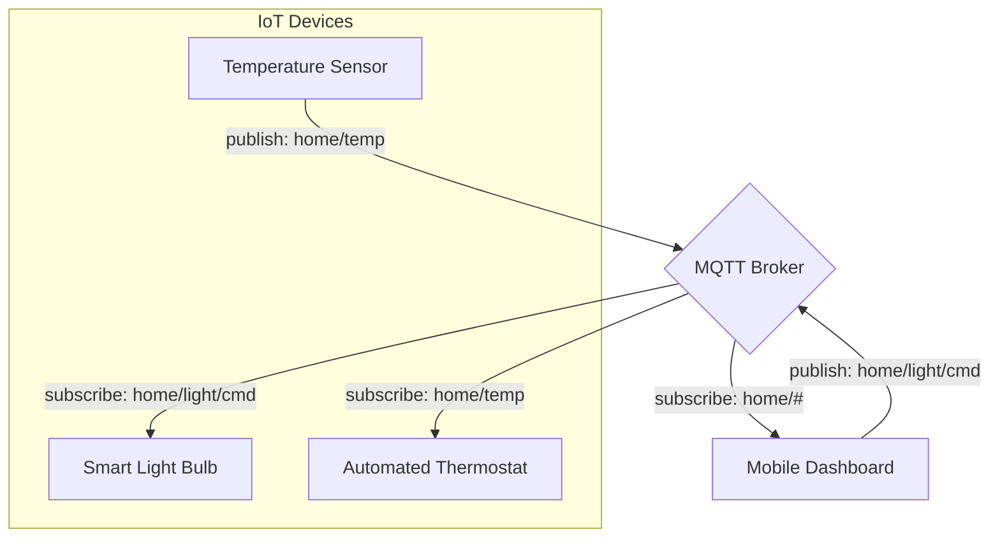

# 📬 Message Queuing Protocols: AMQP and MQTT

## 📑 Table of Contents
1. [Why Use Message Queues?](#why-use-queues)
2. [AMQP: The Heavy Hitter (RabbitMQ)](#amqp)
3. [AMQP Exchange Types](#amqp-exchange-types)
4. [MQTT: Architecture for the IoT world](#mqtt)
5. [MQTT Quality of Service (QoS) Levels](#mqtt-qos-levels)
6. [Side-by-Side Comparison](#comparison)
7. [Go Programming Examples](#go-examples)

---

## ❓ Why Use Message Queues?

Imagine you need to send a welcome email when a user registers. If you do this directly in your main application code, the user must wait for the email server to respond before their registration is finalized.

**The Problem with the Synchronous Approach:**
```go
func RegisterUser(user User) error {
    db.Save(user)
    
    // The user hangs for 2-3 seconds while this runs!
    email.Send(user.Email, "Welcome aboard!")
    
    return nil
}
```

**The Queue-Based Solution:** 📥
```go
func RegisterUser(user User) error {
    db.Save(user)
    
    // Instantly offload the task to a background queue
    queue.Publish("send-email", user.Email)
    
    // Respond to the client immediately
    return nil
}

// A separate worker process handles the heavy lifting
func EmailWorker() {
    for task := range queue.Consume("send-email") {
        email.Send(task.Email, "Welcome!")
        task.Ack() // Acknowledge completion
    }
}
```

### Key Benefits of Queues:

✅ **Asynchronicity**: Faster response times for end users.  
✅ **Resilience**: If a worker crashes, the task remains in the queue for another worker to pick up.  
✅ **Scalability**: Simply add more worker instances to handle increased load.  
✅ **Buffering**: Absorbs sudden traffic spikes without crashing the main application.

---

## 🐰 AMQP (Advanced Message Queuing Protocol)

AMQP is the bedrock protocol for **RabbitMQ**. It is designed for robustness, complex routing, and enterprise-grade reliability. 🛡️

### Core Concepts:

- **Producer**: The application that creates and sends messages.
- **Exchange**: The "post office" that routes messages to specific queues based on rules.
- **Queue**: A buffer that stores messages until they are consumed.
- **Consumer**: The application that receives and processes messages.
- **Routing Key**: A virtual address tag used by the exchange to decide where a message goes.
- **Binding**: The link established between an exchange and a queue.



### Delivery Guarantees:

**Message Acknowledgment (Ack)**:
- **Manual Ack (Recommended)**: The worker explicitly tells the broker when it has finished processing. If the worker fails, the broker requeues the message.

**Publisher Confirms**:
- Ensures that the producer receives a "received" confirmation from the broker, preventing data loss during the initial upload.

---

## 🔀 AMQP Exchange Types

The Exchange type determines exactly **how** messages are routed to queues.

1. **Direct Exchange**: Routes messages based on an exact match between the routing key and the binding key.
2. **Fanout Exchange**: Broadcasts the message to **all** bound queues, ignoring routing keys entirely.
3. **Topic Exchange**: Routes based on wildcard patterns (e.g., `user.*.error` or `logs.#`).
4. **Headers Exchange**: Routes based on message header attributes rather than the routing key.

---

## 📡 MQTT (Message Queuing Telemetry Transport)

A lightweight, binary protocol designed for restricted devices (low power, limited CPU) and unreliable networks. It is the gold standard for **IoT** (Smart Homes, Industrial Sensors). 💡

### Core Architecture:

- **Broker**: The central server hub (e.g., Mosquitto, EMQX).
- **Topic**: A hierarchical string address, such as `home/livingroom/temperature`.
- **Publisher/Subscriber**: Clients that either push data to a topic or listen for updates on one.



---

## 🎯 MQTT Quality of Service (QoS) Levels

QoS governs the reliability of message delivery between a client and the broker.

| Level | Name | Description | Use Case |
|:---:|:---|:---|:---|
| **0** | At Most Once | Fire and forget. No confirmation needed. | Real-time sensor data (e.g., temperature). |
| **1** | At Least Once | Confirmed via PUBACK. May result in duplicates. | Important status updates or alerts. |
| **2** | Exactly Once | Guaranteed one-time delivery via a 4-way handshake. | Billing transactions or critical state changes. |

---

## 📊 Summary Comparison

| Metric | AMQP (RabbitMQ) | MQTT |
| :--- | :--- | :--- |
| **Complexity** | High (Robust, feature-rich) | Low (Simple, streamlined) |
| **Overhead** | Moderate (Text-based headers) | Extremely Low (2-byte fixed header) |
| **Resources** | Requires significant server RAM | Runs on microcontrollers |
| **Routing** | Complex Exchanges & Bindings | Simple Topic Trees/Wildcards |
| **Primary Use** | Backend microservices, financial apps | IoT, mobile apps, telemetry |

---

## 🎯 Final Verdict: Which One Should You Choose?

- Building an enterprise-grade order processing system or microservice backbone? **Use AMQP (RabbitMQ)** for its routing power and reliability.
- Building a GPS tracker for a dog, a home automation system, or a massive IoT network? **Use MQTT** for its minimal overhead and efficiency. 🐾💡
