# 🛡️ Network Security

## 📑 Contents
1. [Encryption: SSL and TLS](#encryption-tls-and-ssl)
2. [Proxy(Private Network) and Tunneling](#virtual-private-network-vpn)
3. [Common Attacks (DDoS, MITM)](#network-attacks)
4. [Backend Security Checklist](#how-a-backend-developer-can-protect-the-application)

---

Security is not a final goal, but a process. In networking, we fight for three things (CIA Triad):
1. **Confidentiality** — no unauthorized party read the data.
2. **Integrity** — no one changed the data in transit.
3. **Availability** — the service works despite attacks.

---

## 1. 🔐 Encryption: TLS/SSL

**TLS (Transport Layer Security)** is the protocol that makes the internet secure. HTTPS is simply HTTP inside a TLS "pipe."

### TLS Handshake:


> [!IMPORTANT]
> **SSL is dead**. Use only **TLS 1.2** or **1.3**. Old versions (SSL 2.0/3.0) are vulnerable and were cracked long ago.

---

## 2. 🛡️ Proxy(Private Network) (Virtual Private Network)

Creates an encrypted tunnel through the "dirty" public internet.

```mermaid
graph LR
    Home[Home / Cafe] -- Encrypted Tunnel --> PPN[Proxy(Private Network) Server]
    PPN -- Regular Internet --> Web[(Web Resources)]
    PPN -- Internal Network --> Corp[(Corporate Data)]
```

- **WireGuard**: Most modern and fast protocol.
- **Open Proxy(Private Network)**: A classic, reliable but heavy protocol.

---

## 3. ⚔️ Common Attacks

### MITM (Man-In-The-Middle)
An attacker interjects between you and the server.
> [!TIP]
> **Defense**: Always use HTTPS and verify certificate validity. HSTS (server header) forces the browser to use only a secure connection.

### DDoS (Distributed Denial of Service)
A crowd attack: millions of requests overwhelm the server.
- **L3/L4 DDoS**: Exhaust bandwidth (packet flooding).
- **L7 DDoS**: Mimic human behavior by requesting heavy site pages.

```mermaid
graph TD
    Attacker[Attacker] --> Botnet[Botnet: 100k devices]
    Botnet --> Target[(Your Server)]
    Target --> Down[Server Down ❌]
```



---

## 4. 📝 Backend Security Checklist

- [ ] **HTTPS Everywhere**: Even for internal APIs.
- [ ] **Rate Limiting**: Limit the number of requests from a single IP (protection against brute force and small DDoS).
- [ ] **WAF (Web Application Firewall)**: A filter in front of the server (Cloudflare, AWS WAF).
- [ ] **Hide Version**: Do not write `Server: nginx/1.14.1` in headers. This is a clue for a hacker on which vulnerabilities to look for.
- [ ] **Secure Sockets**: Use the latest versions of TLS libraries.

---

## 🎯 Key Takeaways

- **TLS** encrypts traffic and verifies the server's identity.
- **Certificates** are the foundation of trust on the web.
- **Security** should be multilayered: from firewall to application code.
- Never trust external networks — encrypt everything.
