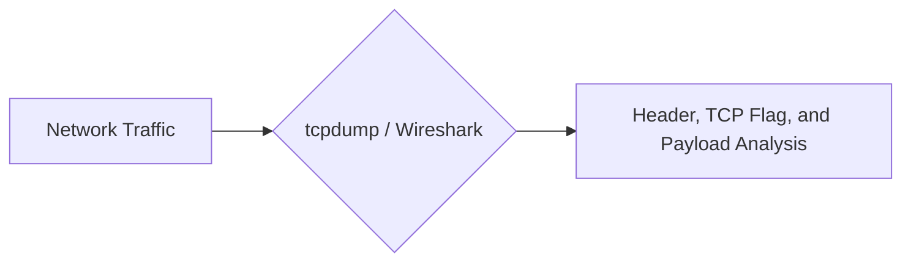
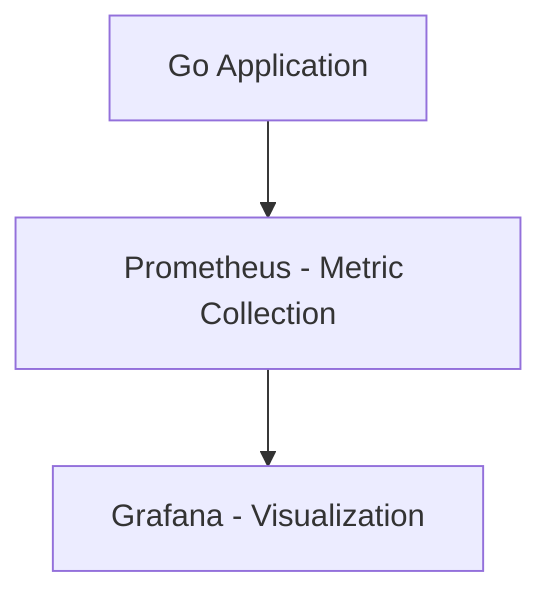

# 🔍 Network Monitoring and Debugging

## 📑 Table of Contents
1. [Core CLI Tools](#core-cli-tools)
2. [Packet Analysis (Wireshark/tcpdump)](#packet-analysis)
3. [Metrics and Logging](#metrics-and-observability)
4. [Debugging Checklist](#debugging-checklist)

---

When "everything is slow" or "the site won't load," you need to be able to look deeper than just the application code.

---

## 1. 🛠️ Core CLI Tools

### Ping (ICMP)
Verifies basic reachability: "Are you alive?"
```bash
ping 8.8.8.8
```
> [!NOTE]
> If a ping succeeds but the website still won't load, the issue is likely above Layer 3 (e.g., a TLS failure or an application-level bug).

### Traceroute
Maps the "hops" (intermediate routers) a packet takes to reach its destination. This helps identify where lag is introduced: your local network, your ISP, or a major backbone provider.

### Dig / Nslookup
Used to query DNS servers and see exactly what information (IP addresses, records) is associated with your domain.

---

## 2. 🛡️ Heavy Artillery: Traffic Analysis



- **tcpdump**: A fast, command-line utility. Perfect for monitoring remote servers.
  Example: `tcpdump -i eth0 port 80 -X` (displays packets in HEX/ASCII).
- **Wireshark**: A powerful graphical analyzer. It allows you to visualize TCP handshakes and complex protocol exchanges in granular detail.

---

## 3. 📈 Metrics (Observability)

A backend developer should monitor three critical KPIs:
1. **Latency**: How long does it take to get a response?
2. **Error Rate**: What percentage of requests result in 5xx errors?
3. **Throughput**: How many requests per second (RPS) can the system handle? (Traffic volume).



---

## 4. 📝 Checklist: Why isn't it working?

1. **DNS**: Does the name resolve? (`dig`)
2. **Connectivity**: Is the IP reachable? (`ping`)
3. **Port**: Is the specific service port open? (`telnet` or `nc`)
4. **Firewall**: Is traffic being blocked by `iptables`, a cloud Security Group, or a local firewall?
5. **TLS**: Is the certificate valid and not expired?
6. **Application**: What do the application logs themselves say?

---

## 🎯 Key Takeaways

- Start simple and move toward complexity (**Ping -> Telnet -> tcpdump**).
- **Prometheus + Grafana** is the industry standard for monitoring network and application state.
- Don't guess—verify by looking at the actual logs and traffic flows.
