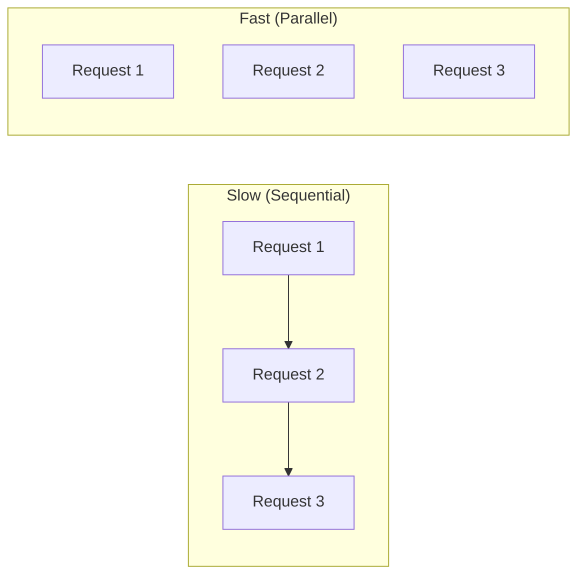
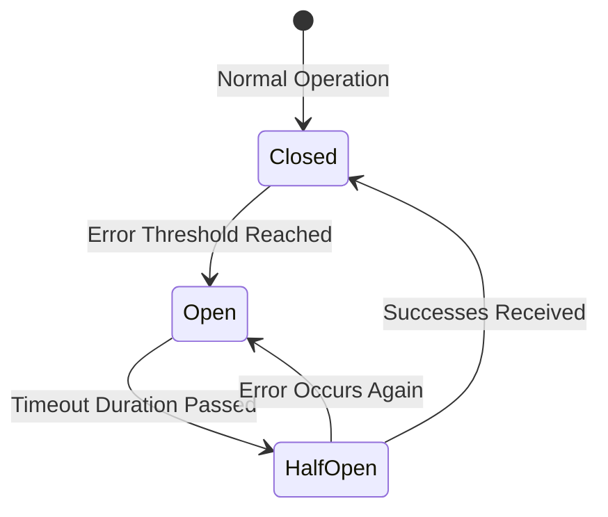

# 💻 Networking: Practical Application for Backend Developers

## 📑 Table of Contents
1. [How Networks Impact Architecture](#how-networks-impact-application-architecture)
2. [Microservices and Service Discovery](#microservices-and-discovery)
3. [Reliability Patterns (Circuit Breaker, Retries)](#reliability-and-fault-tolerance)
4. [Optimization (Compression, HTTP/2, gRPC)](#network-optimization)

---

A backend developer operates in a world of distributed systems. Even a simple query to a database or Redis is, at its core, a network call.

---

## 1. ⏳ Network Constraints

In an ideal world, the network is perfect, instantaneous, and reliable. In reality:
- **Latency**: The silent killer of performance. Making 100 sequential requests each taking 10ms results in a full 1-second wait for the user.
- **Packet Loss**: Leads to timeouts and slow TCP retransmissions, drastically reducing effective bandwidth.

### Mitigation Strategies:
- **Batching**: Instead of making 10 individual requests for 10 IDs, make one single request that encompasses all 10 IDs.
- **Parallelism**: Execute independent network calls concurrently to minimize total wait time.

---

## 2. 🧱 Microservices and Communication

Microservices transform internal function calls into external network calls.

| Strategy | Protocol | Pros |
|:---|:---:|:---|
| **REST** | HTTP/1.1 / JSON | Simple, ubiquitous, and human-readable. |
| **gRPC** | HTTP/2 / Protobuf | Extremely fast, strict typing, and efficient binary format. |
| **Messaging** | Kafka / RabbitMQ | Asynchronous, reliable, and decoupled (deferred processing). |

---

## 3. 🛡️ Reliability Patterns

The network **will** eventually fail. The key is how gracefully your code handles that failure.

### Retries
If a request fails, try sending it again.
> [!CAUTION]
> **Exponential Backoff**: You must increase the delay between consecutive retry attempts (e.g., 1s, 2s, 4s...). Failing to do so can create a "thundering herd" effect that keeps a struggling server down.

### Circuit Breaker
If Service B fails to respond five times in a row, the "circuit flips." The system stops sending requests to Service B for 1 minute to allow it time to recover, returning a fallback or error immediately instead.

---

## 4. 🚀 Network-Level Optimization

- **Keep-Alive**: Do not close the TCP connection after every request. Establishing a new TLS handshake is an expensive operation. reuse existing connections.
- **Compression**: Use Gzip or Brotli algorithms to compress JSON payloads and reduce data transfer.
- **HTTP/2**: Multiplexing allows the system to send several requests over a single connection simultaneously without blocking.

---

## 🎯 Key Takeaways

- A network call is approximately 1,000 times slower than a memory function call.
- Use **Retries** strategically with backoff and jitter to avoid overwhelming your infrastructure.
- **gRPC** is the industry standard for performant internal microservice communication.
- **Keep-Alive** and connection pooling are your best friends for conserving resources.
