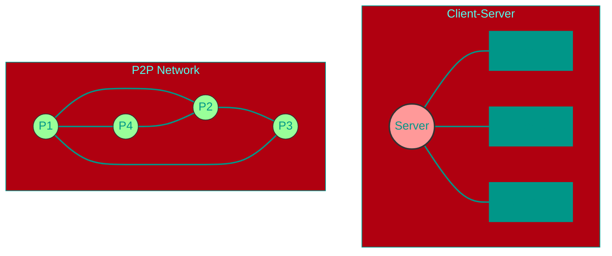
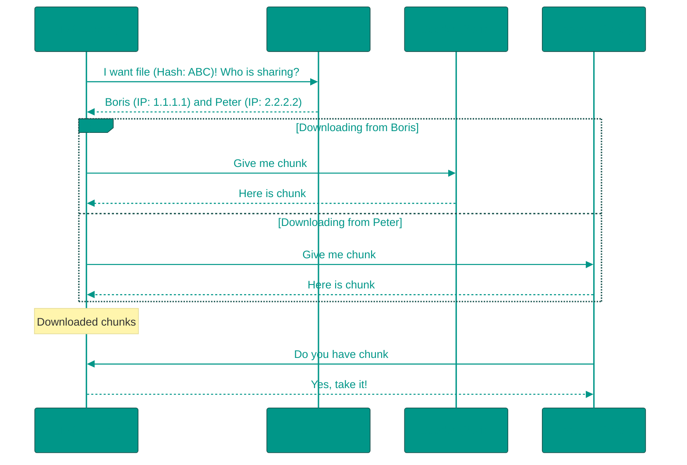

# 16. 🕸️ P2P and Torrents (BitTorrent)

## 📑 Contents
1. [Architecture: P2P vs Client-Server](#architecture-p2p-vs-client-server)
2. [BitTorrent Protocol](#bittorrent-protocol)
3. [Who is Who? (Terminology)](#who-is-who-terminology)
4. [How it Works? (.torrent and Magnet)](#how-it-works-torrent-and-magnet)
5. [Pros and Cons](#pros-and-cons)

---

## 1. 🏗️ Architecture: P2P vs Client-Server

To understand torrents, you first need to understand how the regular internet works.

### 🏢 Classic Model (Client-Server)
When you download a file from a website, you (Client) request the file from one powerful computer (Server).
*   **Analogy:** You go to a library (Server) and ask for a book. If there is a queue or the library is closed, you get nothing. If 1000 people come for the same book, the librarian will go crazy.

### 🕸️ Peer-to-Peer Network (P2P)
In a **"Peer-to-Peer"** network, there is no central server. Every computer is both a client and a server at the same time.
*   **Analogy:** You walk into a classroom and shout, "Who has the homework?".
    *   Boris gives you page 1.
    *   Ilyas gives you page 2.
    *   Peter gives you page 3.
    *   While you are copying page 1, you are already letting Nick take a photo of it.
    Everyone shares with everyone. The more people there are, the faster everyone gets the homework.

---

## 2. 🌀 BitTorrent Protocol
**BitTorrent** is the most popular protocol for file sharing in P2P networks.
Calculated feature: **The file is broken into thousands of small pieces (chunks)**.

You don't download the file entirely from one person. You download chunk #54 from Boris, chunk #102 from Ilyas, and chunk #1 from Peter. As soon as you verify chunk #54, you immediately start uploading it to others.

---

## 3. 🦜 Who is Who? (Terminology)

The torrent world has its own slang. Let's break it down.

### 🟢 Peer
Any participant in the network involved in the distribution. Both those downloading and those uploading are peers ("equals").

### 👑 Seeder
A person who has **the entire file (100%)**.
*   **Task:** Only upload.
*   **Analogy:** A person who has already fully copied the notes and gives them to others.
*   *The more seeders, the faster the download speed.*

### 🩸 Leecher
A person who is **downloading the file** (has < 100%). At the same time, they are also uploading the chunks they have already downloaded.
*   **Negative meaning:** Someone who downloads and immediately leaves (does not stay to upload), i.e., "sucks blood" and runs away.

### 🐝 Swarm
The collection of all peers (seeders + leechers) sharing a specific file.

### 📡 Tracker
A special server that **introduces** peers to each other.
*   You tell the tracker: "I want to download *Linux.iso*".
*   The tracker replies: "Boris (IP: 1.2.3.4) and Peter (IP: 5.6.7.8) have it. Go to them."
*   *The tracker itself does not store files, it only stores lists of IP addresses.*

---

## 4. 🧲 How it Works? (.torrent and Magnet)

### 📄 .torrent File
This is the "passport" of the distribution. It does not contain the content (movie or game) itself.
**Inside:**
1.  Tracker URL (matchmaker server address).
2.  File name, size.
3.  **Hash sums** of all chunks (to verify that the downloaded piece is not corrupted or a virus).

### 🧲 Magnet Link
This is a modern replacement for .torrent files. It allows downloading **without a central tracker** (using **DHT** technology).
The link contains only the unique fingerprint (Hash) of the file.
*   Your client shouts into the network (DHT): "Who knows where to find the file with hash `abc123xyz`?".
*   Neighbors answer: "I don't know, but I know a guy who knows."
*   Thus, the required peer is found through the chain.

### 🔄 Download Process

---

## 5. ⚖️ Pros and Cons

### ✅ Pros
1.  **Resilience:** You cannot "turn off" the file by closing one server. As long as at least one person has the file, it is available.
2.  **Speed:** The more popular the file, the faster it downloads (more uploaders).
3.  **Bandwidth Offloading:** The content author does not pay for huge traffic; users distribute it to each other themselves.

### ❌ Cons
1.  **People Dependency:** If the file is old and no one is seeding it (no seeders), you won't download it (Dead Torrent).
2.  **Security:** Your IP address is visible to all participants in the "swarm".
3.  **Upload Bandwidth:** Torrent actively uses your upload bandwidth, which may slow down other applications.

---

## 6. 🚀 Summary
BitTorrent is a brilliant load distribution technology. Instead of standing in line at one water tap, everyone who fills a bucket lets their neighbor take a sip.

*   **P2P** — everyone is equal.
*   **Seeder** — the hero who shares.
*   **Leecher** — the one who is currently taking (or a greedy person).
*   **Tracker/DHT** — the address book.

<!-- QUIZ_START 
[
    {
        "question": "What is a 'Seeder' in BitTorrent terminology?",
        "options": [
            "A server that manages network speed",
            "A user who has 100% of the file and only uploads it",
            "A user who only downloads the file",
            "Malware inside a torrent"
        ],
        "correctIndex": 1
    },
    {
        "question": "What is the main difference between a P2P network and the Client-Server model?",
        "options": [
            "P2P only works via Bluetooth",
            "In P2P, there is no central server; all participants (peers) are equal and exchange data directly",
            "Client-Server is faster because there are many servers",
            "P2P uses only paid protocols"
        ],
        "correctIndex": 1
    },
    {
        "question": "What is the purpose of a Tracker?",
        "options": [
            "To store all files",
            "To spy on users",
            "To coordinate peers by providing them with each other's IP addresses",
            "To glue file chunks back together"
        ],
        "correctIndex": 2
    }
]
QUIZ_END -->
