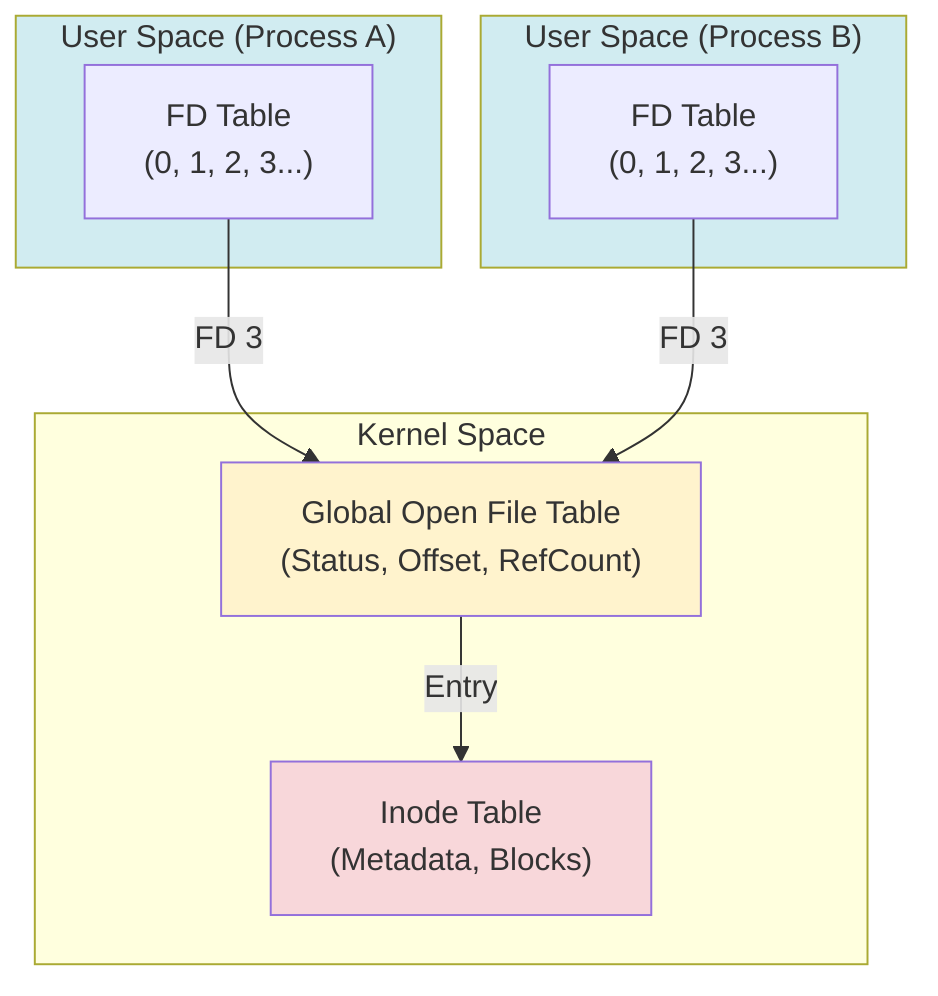

# 📂 File System & Descriptors

In Linux, everything is built around a single unifying principle: the ability to interact with any resource as a sequence of bytes.

---

## 1. 📄 Core Philosophy: Everything is a File

In Linux, nearly every resource is represented as a file:
- **Text documents and binary files.**
- **Directories** (these are files that contain a list of other file names).
- **Devices** (keyboards, disks — e.g., `/dev/sda`).
- **Sockets and Pipes** (mechanisms for inter-process communication).

---

## 2. 🏷 Inode (Index Node)

An **Inode** is effectively a "passport" for a file within the file system.
- It stores: file type, permissions, owner, size, timestamps, and pointers to the physical data blocks on the disk.
- **It does NOT store**: The file name (which is stored within the parent directory file).
- When you open `/home/user/test.txt`, the system searches the `user` directory for the name `test.txt` to find its corresponding Inode number, which it then uses to access the actual data.

---

## 3. 🔍 File Descriptor (FD) 🛠️

While an Inode describes a file on the disk, a **File Descriptor** represents an open file in a process's memory.

An **FD** is a non-negative integer (0, 1, 2, 3...) assigned by the kernel to a program. For the process, this is a "handle" used to perform system calls such as `read`, `write`, and `close`.

### 🚩 Standard Descriptors (Present in every process):
| FD | Name | Purpose | Default |
|:---:|:---|:---|:---|
| **0** | `stdin` | Standard Input | Keyboard |
| **1** | `stdout` | Standard Output | Terminal (Screen) |
| **2** | `stderr` | Standard Error | Terminal (Screen) |

---

## 4. 🏗 Architecture: Three Layers of Abstraction 🔬

Linux uses a three-tier scheme to manage open files efficiently and allow processes to share them.

### 1️⃣ Process Descriptor Table (FD Table)
Every process has its own array within its `task_struct`. The index of this array is the FD value. Each entry in this table points to an entry in the next table.

### 2️⃣ System-wide Open File Table (Open File Description)
This table is shared across the entire OS. Each entry stores:
- **Current Offset**: The position for the next read/write operation.
- **Status Flags**: How the file was opened (e.g., `O_RDONLY`, `O_APPEND`).
- **Reference Count**: The total number of descriptors across all processes pointing to this entry.

### 3️⃣ Inode Table
Stores information about the physical object itself: permissions, size, and where the data blocks reside on the disk.

---

## 5. 🔄 Inheritance and Duplication (Fork & Dup)

Understanding these abstraction layers explains how processes "communicate" via files.

### 🧬 Fork: Shared Offsets
When a `fork()` is called, the child process receives a **copy** of the parent's descriptor table. However, both descriptors (parent and child) point to the **same entry** in the Global File Table.
- **Result**: If one process reads 10 bytes, the offset for the other process also moves. They share the same "position" in the file.

### 🖇 Dup: Two FDs — One File
The `dup2(fd1, fd2)` system call forces the `fd2` entry in the process's table to point to the same Global File Table entry as `fd1`.
- This is the foundation for **I/O redirection**: this is how bash replaces `stdout` (FD 1) with a literal file.

---

## 6. 🚦 Limits and Monitoring 🕹️

The number of open files is restricted by kernel resources.

### Viewing Limits:
- `ulimit -n` — The "Soft Limit" for the current session. A user can increase this up to the hard limit.
- `ulimit -Hn` — The "Hard Limit." Only root can increase this value.

### System Exploration:
- `/proc/[PID]/fd/` — A directory containing symbolic links to all files currently opened by a specific process.
- `lsof -p [PID]` — Lists all files opened by a process (**L**ist **S**ize **O**pen **F**iles).
- `cat /proc/sys/fs/file-max` — The maximum number of files that can be opened system-wide.

---

## 📚 Summary: The Library Analogy (Advanced)
1. **FD** is your "claim ticket" in a specific process's cloakroom.
2. **Open File Table** is the information about *how* you are reading a book (which page you are on, whether you intend to write in it).
3. **Inode** is the physical book itself in the library's storage.

> [!NOTE]
> Sockets follow the same pattern, but instead of an Inode at the end of the chain, there is a network buffer. For more, see the [**Networking and Sockets**](5.networking.md) section.

---

## 📚 Analogy: The Library
Imagine that the **Kernel** is a library.
1.  You (the Process) request a book (open a file).
2.  The librarian gives you a **token number** (FD = 3).
3.  You say: "Read 10 pages from book number 3 for me."
4.  The librarian remembers you stopped at page 50 (this is the **offset** in the Global File Table).
5.  If your friend opens the same book, they get their **own** token, and their progress won't interfere with yours.

---

## 🛠 Useful Commands 🕹️
- `ls -l /proc/self/fd` — View the descriptors of the current process.
- `lsof` — (List open files) Display all open files across the entire system.
- `ulimit -n` — Check the limit on the number of open descriptors (typically 1024).
