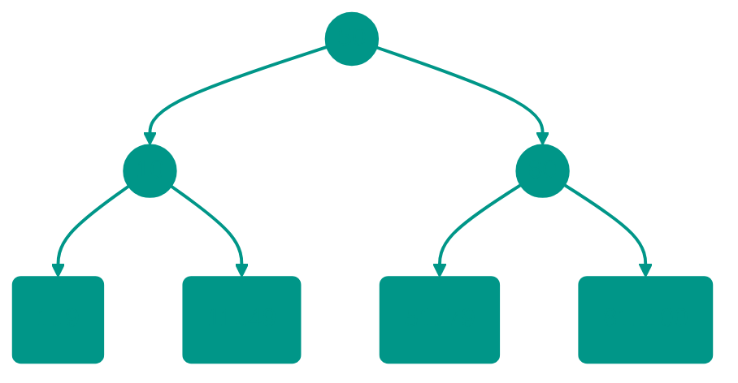
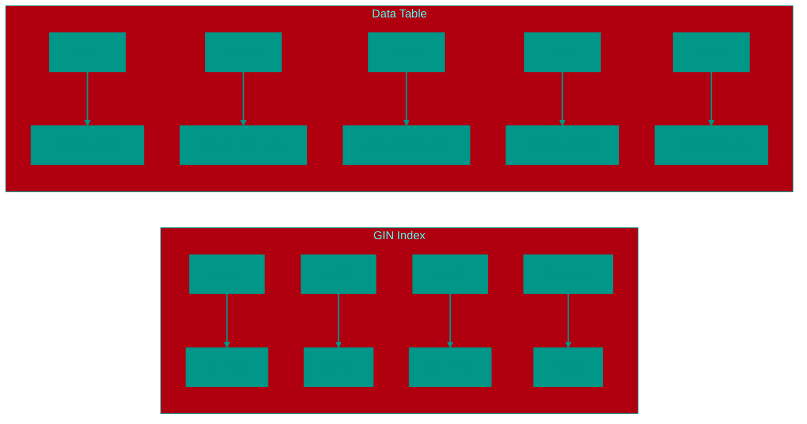
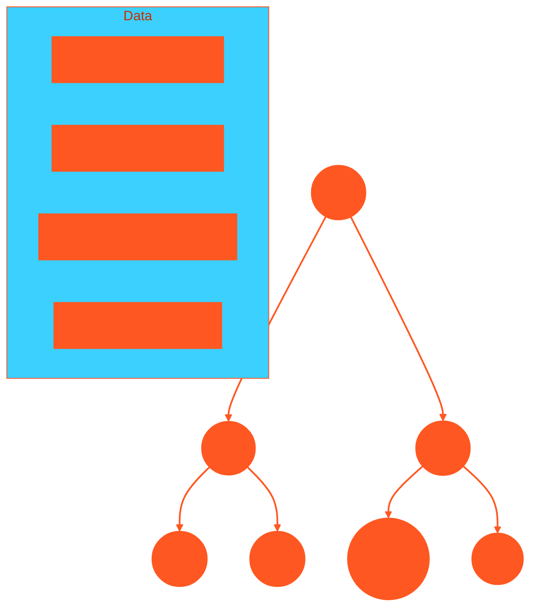

# 🔎 4. Indexes

## 📑 Table of Contents
1. [What is an Index?](#what-is-an-index)
2. [How Does it Work?](#how-does-it-work)
3. [Index Types](#index-types)
4. [Trade-off: Read vs. Write](#trade-off-read-vs-write)
5. [Selectivity](#selectivity)
6. [Composite Indexes](#composite-indexes)

---

## 1. 🤔 What is an Index?

An **index** is a specialized data structure that helps a database find specific rows much faster than it could by scanning through the entire table sequentially (Full Table Scan).

> [!NOTE]
> **Analogy**: A library's card catalog.
> *   Without an index (Full Scan): To find a book by *Tolstoy*, you would have to walk past every shelf and examine every single book until you find it.
> *   With an index: You go to the drawer labeled "T," find the "Tolstoy" card, which gives you the exact shelf and position of the book.

---

## 2. ⚙️ How Does it Work?

Imagine a `Users` table with 1,000,000 rows.
Query: `SELECT * FROM Users WHERE email = 'boris@x.com'`

### Without an Index
The DBMS reads the first row and checks the email, then the second, and so on, potentially up to the 1,000,000th row.
Complexity: **O(N)**. This is slow!

### With an Index
The DBMS navigates the index structure (usually a tree), makes a few efficient "jumps," and immediately retrieves the physical address of the required row on the disk.
Complexity: **O(log N)**. This is nearly instantaneous!

---

## 3. 🌳 Index Types

### B-Tree (Balanced Tree)
The most popular and default type of index (`CREATE INDEX`).
It is ideal for:
*   Exact matches (`=`)
*   Range searches (`>`, `<`, `BETWEEN`)
*   Sorting (`ORDER BY`)

*Since the data in a B-Tree is sorted, searching it is extremely efficient.*

### Hash Index
Functions like a standard hash table.
It is **only** suitable for exact equality matches (`=`).
*   It cannot perform range searches (e.g., `> 50`).
*   In PostgreSQL, it is rarely used compared to B-Trees.

### GIN / GiST (PostgreSQL Specifics)
Specialized for complex or unstructured data types:

#### GIN (Generalized Inverted Index)
*   **Purpose**: Used for full-text search (similar to how Google works) and for `JSONB` data (searching for keys within JSON).
*   **How it Works**: A GIN index creates an "inverted index" where each data element (word, JSON key) corresponds to a list of rows containing that element. This enables efficient retrieval of rows containing specific words or JSON keys.

*   **Use Cases**:
    *   Full-text search: `SELECT * FROM articles WHERE to_tsvector('english', content) @@ to_tsquery('english', 'database & performance');`
    *   JSONB queries: `SELECT * FROM products WHERE properties @> '{"color": "red"}';`
*   **Advantages**: Excellent performance for content-based searches in documents or JSON objects.
*   **Disadvantages**: May be slower for inserts/updates since it requires updating the inverted index structure.

#### GiST (Generalized Search Tree)
*   **Purpose**: Used for geometric data (e.g., finding all cafes within a 1km radius), arrays, hierarchical structures.
*   **How it Works**: GiST provides a generalized tree structure that can be adapted for various data types. It uses a "consistency predicate" concept to determine which tree nodes need to be visited during a search.

*   **Use Cases**:
    *   Geometric queries: `SELECT * FROM cafes WHERE ST_DWithin(location, ST_Point(37.6173, 55.7558), 1000);` (find cafes within 1km of a point)
    *   Array queries: `SELECT * FROM posts WHERE tags && ARRAY['database', 'postgresql'];` (find posts with at least one of the specified tags)
    *   Hierarchical structures: searching in trees and graphs
*   **Advantages**: Flexibility - can be used for a wide variety of data types and relationships between them.
*   **Disadvantages**: More complex implementation and potentially slower insert operations compared to B-tree.

> [!NOTE]
> **GIN Analogy**: Imagine an index at the end of a book listing all terms and the pages where they appear. This allows you to quickly find all pages containing a specific word.
> 
> **GiST Analogy**: Picture a city map where districts are grouped by characteristics (business district, residential area, etc.), allowing you to quickly locate objects within a specific area.

---

---

## 4. ⚖️ Trade-off: Read vs. Write

If indexes are so powerful, why not add them to every single column?

1.  **Slower Writes (INSERT / UPDATE / DELETE)**:
    *   Whenever you add a new row to a table, the DBMS must also update **ALL** associated indexes. If you have 10 indexes, a single insert becomes 11 write operations.
2.  **Storage Overhead**:
    *   Indexes take up disk space. In some cases, the index files can be larger than the tables they represent.

> [!TIP]
> Create indexes only on fields that are frequently used in **searches** (`WHERE`), **sorting** (`ORDER BY`), or **joining tables** (`JOIN`). Avoid over-indexing columns that aren't necessary for performance.

---

## 5. 🎯 Selectivity

**Selectivity** measures how effectively an index can "filter out" irrelevant rows.
*   **High Selectivity**: There are many unique values (e.g., Email, UUID, Passport Number). The index will return only 1-2 rows. **This is excellent!**
*   **Low Selectivity**: There are few unique values (e.g., Gender: M/F, Status: Active/Inactive). The index might return 50% of the table. **This is poor!**

> [!WARNING]
> If an index returns **more than 10-20%** of a table, the Query Planner will likely **ignore the index** and perform a Full Table Scan because performing Random I/O (jumping across the disk for each row) is more expensive than Sequential I/O (reading everything in order).
>
> **Example**: Do not create an index on an `is_active` (boolean) column if 90% of your users are active; it won't help performance.

---

## 6. 🎹 Composite Indexes

An index can be built across multiple columns simultaneously: `CREATE INDEX ON users (last_name, first_name, age);`

Two strict rules apply to composite indexes:

### 1. The "Leftmost Prefix" Rule
A composite index `(A, B, C)` functions like a sorted telephone book: first by last name, then by first name, then by age.

*   `WHERE A=1` — ✅ The index works.
*   `WHERE A=1 AND B=2` — ✅ The index works.
*   `WHERE B=2` — ❌ **The index DOES NOT work!** (You cannot search a phone book for everyone named "Boris" without knowing their last name first).

### 2. The Range Stop Rule
As soon as a range condition (`>`, `<`, `BETWEEN`) appears in your query, the index stops being used for any **subsequent** columns in the composite key.

For an index on `(age, balance)`:
*   `WHERE age = 25 AND balance = 100` — ✅ Performs an exact, fast search.
*   `WHERE age > 25 AND balance = 100` — ⚠️ The index is used only for `age > 25`. Within those results, the `balance` is not sorted, so the database must manually scan all rows that matched the age criteria.

> [!TIP]
> In a composite index, always place columns used for **exact matches** (`=`) at the **beginning**, and columns used for **ranges** (`>`) at the **end**.

<!-- QUIZ_START 
[
    {
        "question": "What is the algorithmic complexity of a search using a B-Tree index?",
        "options": ["O(N)", "O(1)", "O(log N)", "O(N log N)"],
        "correctIndex": 2
    },
    {
        "question": "What is index 'Selectivity'?",
        "options": ["Index creation speed", "A measure of how well an index filters rows (ratio of unique values to total rows)", "The number of columns in the index", "The index's disk size"],
        "correctIndex": 1
    },
    {
        "question": "Will a composite index (A, B, C) work if the query condition is only WHERE B = 5?",
        "options": ["Yes, fully", "Yes, but partially", "No, due to the leftmost prefix rule", "Only if the database is NoSQL"],
        "correctIndex": 2
    }
]
QUIZ_END -->
