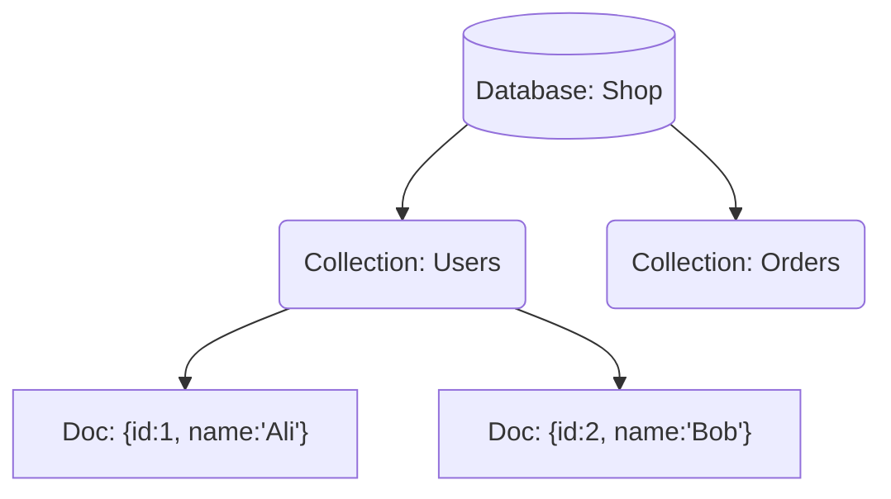
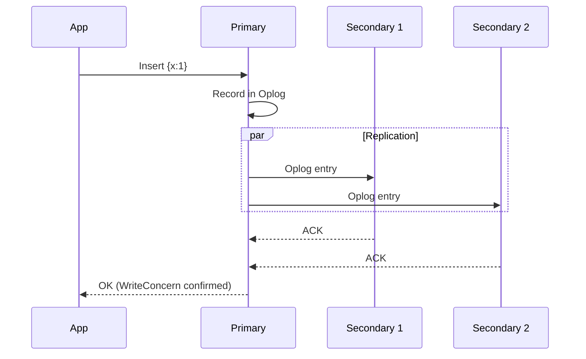
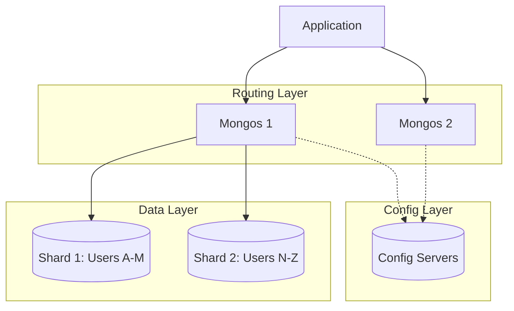

# 🍃 1. MongoDB: Document-Oriented Database

## 📑 Table of Contents
1. [Core Concepts](#core-concepts)
2. [Data Structure (BSON)](#data-structure-bson)
3. [Architecture: Replica Set](#architecture-replica-set)
4. [Scalability: Sharding](#scalability-sharding)
5. [SQL vs. MongoDB (Cheat Sheet)](#sql-vs-mongodb-cheat-sheet)

---

## 1. 🧱 Core Concepts

If you are transitioning from the world of SQL, here is a helpful translator for common database terms:

| SQL (RDBMS) | MongoDB | Description |
| :--- | :--- | :--- |
| **Database** | **Database** | A containers for grouping metadata (e.g., collections). |
| **Table** | **Collection** | A group of associated documents. Unlike SQL, schemas are non-fixed. |
| **Row** | **Document** | A single data record stored in a JSON-like format. |
| **Column** | **Field** | A specific key-value pair within a document. |
| **Index** | **Index** | Similar to SQL, MongoDB uses B-Tree indexes for fast retrieval. |
| **JOIN** | **$lookup** | Performs an operation similar to a JOIN (though it is expensive and best avoided). |

### Hierarchy


---

## 2. 📄 Data Structure (BSON)

MongoDB stores data in **BSON** (Binary JSON) rather than plain JSON text.
BSON supports data types that JSON does not: `Date`, `ObjectId`, `NumberLong` (int64), and binary data.

**Example Document:**
```json
{
  "_id": ObjectId("507f1f77bcf86cd799439011"), // Unique Primary Key (auto-generated)
  "username": "coder123",
  "active": true,
  "balance": 100.50,
  "roles": ["admin", "editor"], // Native support for arrays
  "profile": {                  // Nested objects (Embedded documents)
    "age": 25,
    "city": "Moscow"
  },
  "created_at": ISODate("2023-10-01T10:00:00Z")
}
```

> [!TIP]
> **Data Modeling**:
> In SQL, you would typically create separate tables for `Roles` and `Profiles`.
> In MongoDB, data that is accessed together is usually **stored together** in a single document. This reduces the need for expensive JOINs and makes reads much faster.

---

## 3. 🛡️ Architecture: Replica Set

MongoDB ensures high availability through a feature called a **Replica Set**.
A standard Replica Set consist of at least three nodes.

### How it Works:
1.  **Primary**: The primary node handles all **Write** operations and most Read operations by default.
2.  **Secondary**: Secondary nodes replicate the data from the Primary. They can optionally handle Read requests.
3.  **Election**: If the Primary node fails, the Secondary nodes hold an election and automatically designate a new Primary.



**If the Primary Node Fails:**
1.  S1 and S2 detect that the Primary is unresponsive (Heartbeat lost).
2.  They trigger an internal election process.
3.  The most up-to-date Secondary (e.g., S1) becomes the new Primary.
4.  The application automatically reconnects to the newly elected Primary.

---

## 4. 🌐 Scalability: Sharding

When a dataset exceeds the storage capacity of a single server, MongoDB uses **Sharding** to distribute the collection across multiple servers.

### Cluster Components:
1.  **mongos (Router)**: The application communicates only with this lightweight process. It knows the distribution of data and routes requests to the appropriate shard.
2.  **Config Servers**: These servers store the cluster's metadata (e.g., "keys A-K are located on Shard 1").
3.  **Shards**: The actual data stores, each of which is typically its own Replica Set.



> [!IMPORTANT]
> **Shard Key**: Selecting the correct sharding key is critical.
> - A poor choice (such as a monotonically increasing `date` for log data) can result in all new writes being directed to a **single** shard (creating a "Hotspot"), effectively neutralizing the benefits of horizontal scaling.

---

## 5. 🆚 SQL vs. MongoDB Cheat Sheet

| Task | SQL | MongoDB |
| :--- | :--- | :--- |
| **Create Record** | `INSERT INTO users (name, age) VALUES ('Ali', 20)` | `db.users.insertOne({name: 'Ali', age: 20})` |
| **Select All** | `SELECT * FROM users` | `db.users.find()` |
| **Filter by Condition** | `SELECT * FROM users WHERE age > 18` | `db.users.find({age: {$gt: 18}})` |
| **Update Record** | `UPDATE users SET age = 21 WHERE name = 'Ali'` | `db.users.updateOne({name: 'Ali'}, {$set: {age: 21}})` |
| **Delete Record** | `DELETE FROM users WHERE age < 10` | `db.users.deleteMany({age: {$lt: 10}})` |
