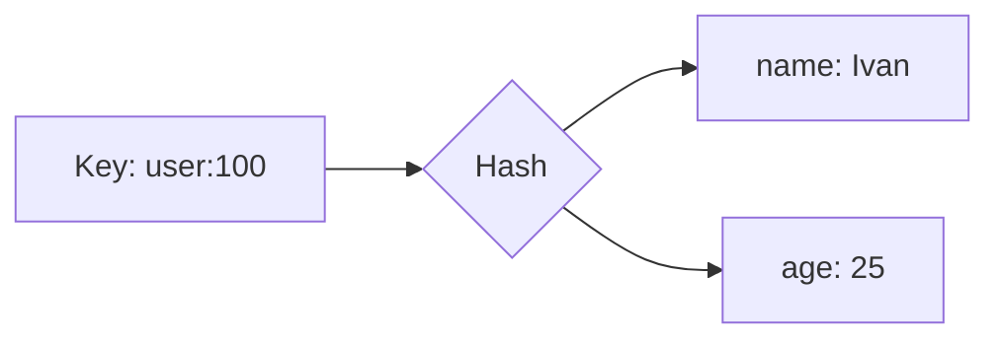

# 🍒 Redis (REmote DIctionary Server)

## 📑 Table of Contents
1. [What is it? (The Swiss Army Knife)](#what-is-it-the-swiss-army-knife)
2. [Data Types (The Core)](#data-types)
3. [Single-Threaded Model](#single-threaded-model)
4. [Persistence (RDB vs. AOF)](#persistence-rdb-vs-aof)

---

## 1. 🤔 What is it? (The Swiss Army Knife)

**Redis** is an extremely fast, In-Memory **key-value** store.
It is so performant (capable of handling millions of operations per second) that it is most commonly used as a **Cache**.

However, unlike "basic" caches (such as Memcached), Redis is a **data structure server** accessible over the network.

---

## 2. 🧱 Data Types

In Redis, values are not restricted to simple strings; they are comprehensive, built-in data structures.

### 🧵 String
The most basic type. It can store text, numbers, or even binary data like images (up to 512 MB).
*   `SET key "value"`
*   `INCR counter` (Atomic increment!)

### 📝 List
A linked list. Adding elements to the head or tail is extremely fast.
*   **Use Cases**: Message queues (Job Queues), news feeds.
*   `LPUSH`, `RPOP`.

### 🎒 Set
A collection of unique, unordered strings.
*   **Use Cases**: "Unique visitor IP lists," social connections (friends), tags.
*   `SADD`, `SISMEMBER`.

### 🔢 Sorted Set (ZSet)
Similar to a Set, but every member is associated with a **Score** (a number).
*   **Use Cases**: **Leaderboards**, priority queues.
*   `ZADD player 1000`.

### 🗺️ Hash
Essentially a dictionary inside a dictionary. It is the ideal structure for storing objects.
*   `HSET user:100 name "Ivan" age 25`.

---

## 3. ⚡ Single-Threaded Model

Classic Redis operates in a **single-threaded** manner.
*   **Pros**: No race conditions, and all operations are inherently atomic. Commands like `INCR` are safe without needing explicit record locking.
*   **Cons**: If a long-running, "expensive" command is executed (e.g., `KEYS *` on a dataset with millions of keys), the entire server will block and refuse to respond to any other requests until the command finishes.

> [!WARNING]
> Never use the `KEYS *` command in a production environment as it blocks the server. Use `SCAN` instead.

---

## 4. 💾 Persistence (RDB vs. AOF)

Since Redis resides in memory, data is lost if the power is cut. Redis provides two mechanisms to prevent this:

### 📸 RDB (Snapshots)
Creates a "point-in-time" snapshot of the entire dataset every N minutes.
*   **Pros**: Compact file size and fast startup times.
*   **Cons**: Potential for data loss (e.g., losing the last 5 minutes of data since the last snapshot).

### 📝 AOF (Append Only File)
Logs every write command (`SET`, `INCR`, etc.) to a file. Upon restart, Redis "replays" the log to reconstruct the state.
*   **Pros**: High durability (can perform an `fsync` every second).
*   **Cons**: Larger file sizes and slower startup times.

> [!TIP]
> **Best Practice**: Enable both RDB and AOF. Use RDB for backups and AOF for maximum durability.

---

## 💡 Summary

*   Need a high-performance cache? **Redis**.
*   Need a fast queue? **Redis** (List/Streams).
*   Need a leaderboard? **Redis** (Sorted Set).
*   Need Pub/Sub functionality? **Redis**.
It is the "universal glue" of modern microservices architecture.