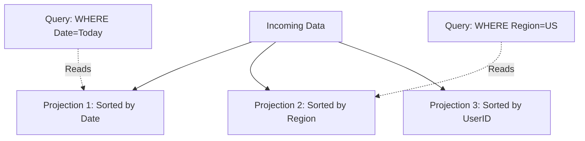

# 🦅 Vertica

## 📑 Table of Contents
1. [What is it? (Enterprise OLAP)](#what-is-it-enterprise-olap)
2. [Projections](#projections)
3. [Vertica vs. ClickHouse](#vertica-vs-clickhouse)

---

## 1. 🤔 What is it? (Enterprise OLAP)

**Vertica** is a powerful, commercial (Enterprise) column-oriented database designed specifically for analytics (OLAP).
It preceded ClickHouse and was a pioneer of the MPP (Massively Parallel Processing) architecture running on standard hardware.

*   **Clustering**: Built from the ground up to operate across clusters of hundreds of servers.
*   **SQL Standard**: Supports nearly the full ANSI SQL standard, making it easier to use than ClickHouse, which has its own specific dialect.
*   **Intelligence**: Features a highly sophisticated query optimizer.

---

## 2. 📽️ Projections

This is Vertica's "killer feature."
While traditional databases use Tables and Indexes, Vertica uses **Projections**.

> [!TIP]
> A **Projection** is a physical, on-disk copy of a table's data, stored in a specific sorted order.

For example, for a `Sales` table, you could create two distinct projections:
1.  **Date-sorted**: To power queries that rapidly calculate daily sales.
2.  **Region-sorted**: To power queries that rapidly calculate sales by city or state.

When data is inserted, it is automatically propagated to all projections. When a query is run, the Vertica Optimizer automatically selects the projection that will yield the fastest result.

---

## 3. ⚔️ Vertica vs. ClickHouse

| Feature | 🦅 Vertica | 📊 ClickHouse |
| :--- | :--- | :--- |
| **Licensing** | Commercial (Expensive) / Free Community Edition (Limited) | Open Source (Free) |
| **SQL Support** | Full ANSI SQL (JOINs are highly optimized) | SQL-like (JOINs are limited, specific syntax) |
| **Update/Delete** | Supported (though slow) | Extremely difficult (via Mutations); best avoided |
| **Performance** | Very Fast | Incredibly Fast (often faster than Vertica for simple queries) |
| **Administration** | Complex; typically requires a dedicated DBA | Easier to get started, but difficult to fine-tune |

---

## 💡 Summary

*   **Vertica**: The choice for banks or large corporations with significant budgets that require full SQL support and complex JOIN operations.
*   **ClickHouse**: The choice for startups or technology companies that prioritize raw speed and high-velocity log processing, and are willing to adapt to its SQL peculiarities.