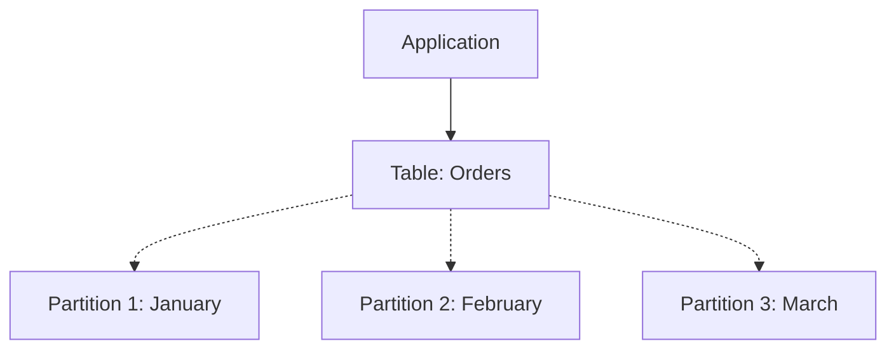

# 🍰 5. Partitioning

## 📑 Table of Contents
1. [What is Partitioning?](#what-is-partitioning)
2. [Partitioning vs. Sharding](#partitioning-vs-sharding)
3. [Types of Partitioning](#types-of-partitioning)
4. [Why is it Necessary?](#why-is-it-necessary)

---

## 1. 🤔 What is Partitioning?

**Partitioning** is the process of splitting one large "parent" table into several smaller physical pieces called **partitions**.
For the application, the structure remains a single logical table. The DBMS automatically determines which partition to store data in or read data from.

> [!NOTE]
> Unlike sharding, all partitions reside **on the same server**.



---

## 2. ⚔️ Partitioning vs. Sharding

These two concepts are frequently confused, but they serve different purposes.

| Characteristic | Partitioning | Sharding |
| :--- | :--- | :--- |
| **Data Location** | On **one** server (in different files). | On **multiple** separate physical servers. |
| **Goal** | To optimize performance and simplify administration on *one* machine. | To scale horizontally when *one* machine can no longer handle the load. |
| **Complexity** | Low (typically provided natively by the DBMS). | High (requires routers, complex logic, and rebalancing). |

---

## 3. 🗂️ Types of Partitioning

In PostgreSQL and other RDBMSs, there are three primary partitioning strategies:

### 1. By Range
The most common type, typically used for time-based data.
*   "All orders from January go into one partition, February orders into another, and so on."

```sql
CREATE TABLE orders (id int, date date) PARTITION BY RANGE (date);
CREATE TABLE orders_jan PARTITION OF orders FOR VALUES FROM ('2023-01-01') TO ('2023-02-01');
```

### 2. By List
Groups data based on specific, discrete values.
*   "Customers from New York and London go here, while others go there."
*   `PARTITION BY LIST (region)`: ('New York', 'London')

### 3. By Hash
Distributes data uniformly across a fixed number of partitions.
*   Used when there is no logical criteria (like date or region) for splitting, but you still need to break up a massive table so parts of it can fit into the system's memory.
*   `PARTITION BY HASH (id)`

---

## 4. 🚀 Why is it Necessary?

1.  **Speed (Partition Pruning)**:
    *   If you execute a query like `SELECT * FROM orders WHERE date = '2023-01-15'`, the database **knows** to search only within the "January" partition, completely ignoring the February and March files.
    *   On massive datasets, this is often faster than using a standard index.
2.  **Data Retention (Efficient Deletion)**:
    *   Deleting old data (e.g., from last year) from a standard table is a heavy operation that involves row locks and triggers the need for a VACUUM.
    *   With partitioning, you can simply run `DROP TABLE orders_2022`, which is an instantaneous file deletion.
3.  **Maintenance**:
    *   You can perform a `REINDEX` or other maintenance on only the "hot" partition (containing the most recent data) without affecting the larger archive partitions.

> [!TIP]
> Consider partitioning when your tables grow to **tens of millions of rows** or exceed **100 GB** in size. Until then, standard indexes usually provide sufficient performance.
